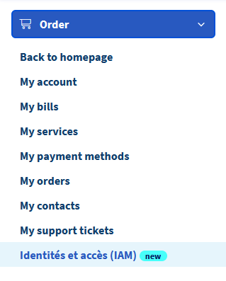
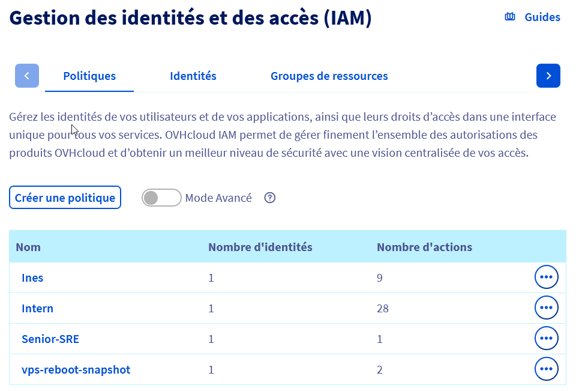
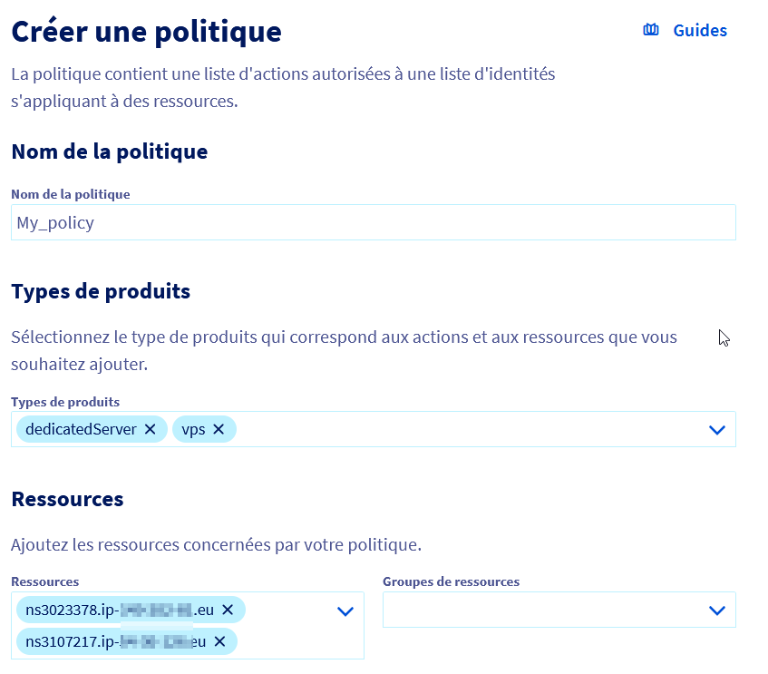
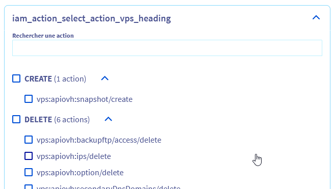

> [!primary]
> Diese Übersetzung wurde durch unseren Partner SYSTRAN automatisch erstellt. In manchen Fällen können ungenaue Formulierungen verwendet worden sein, z.B. bei der Beschriftung von Schaltflächen oder technischen Details. Bitte ziehen Sie im Zweifelsfall die englische oder französische Fassung der Anleitung zu Rate. Möchten Sie mithelfen, diese Übersetzung zu verbessern? Dann nutzen Sie dazu bitte den Button "Beitragen" auf dieser Seite.
>

> [!warning]
>
> Diese Funktion ist derzeit in der Beta-Version verfügbar. Weitere Informationen finden Sie auf <https://labs.ovhcloud.com/de/>.
>

## Ziel

In dieser Anleitung erfahren Sie, wie Sie Benutzern eines OVHcloud Accounts bestimmte Zugriffsrechte gewähren.

Die Verwaltung der Zugänge von OVHcloud basiert auf einem System zur Verwaltung der Richtlinien. Es können verschiedene Richtlinien erstellt werden, die Benutzern Zugriff auf bestimmte Funktionen der Produkte eines OVHcloud Accounts geben.

Eine Richtlinie enthält im Detail:

- Eine oder mehrere **Identitäten**, auf die sich diese Richtlinie bezieht. 
    - Es kann sich um Konto-IDs, Benutzer oder Benutzergruppen handeln (wie sie z. B. in [Federation](/pages/account/customer/ovhcloud-account-connect-saml-adfs) verwendet werden - es stehen weitere SSO-Hilfen zur Verfügung). 
- Eine oder mehrere **Ressourcen**, die von dieser Richtlinie betroffen sind. 
    - Eine Ressource ist ein OVHcloud Produkt, das von dieser Richtlinie betroffen ist (ein Domainname, ein Nutanix-Server, ein Loadbalancer etc.).
- Eine oder mehrere **Aktionen**, die von dieser Richtlinie zugelassen oder ausgenommen sind.
    - Die Aktionen sind die spezifischen Rechte, die von dieser Richtlinie betroffen sind (Neustart eines Servers, Erstellung eines E-Mail-Accounts, Kündigung eines Abonnements etc.)
 
Wir können zum Beispiel eine Richtlinie erstellen, um einem Benutzer namens John für einen VPS den Zugriff auf die Aktion „Neustart“ zu geben.

**In dieser Anleitung erfahren Sie, wie Sie diese Richtlinien über das OVHcloud Kundencenter deklarieren und welche Identitäten, Ressourcen und Aktionen für diese verfügbar sind.**

{.thumbnail}

## Voraussetzungen

- Sie haben einen [OVHcloud Account](/pages/account/customer/ovhcloud-account-creation)
- Wissen [Benutzer des Accounts verwalten](/pages/account/customer/ovhcloud-users-management)
- Ein oder mehrere OVHcloud Produkte, die mit diesem OVHcloud Account verbunden sind (Loadbalancer, Domainname, VPS etc.)

## In der praktischen Anwendung

### Zum IAM-Menü wechseln

Klicken Sie oben rechts auf den Namen Ihres Accounts und dann erneut in der Seitenleiste auf Ihren Namen.

{.thumbnail}

Sie können das IAM-Menü über den dedizierten Eintrag in Ihrem Kundencenter aufrufen.

{.thumbnail}

Das Menü enthält eine Liste aller aktuellen Richtlinien, die für Ihr Konto erstellt wurden.

{.thumbnail}

Jede Regelung wird mit ihrem Namen, der Anzahl der damit verbundenen Hauptbenutzer und der Anzahl der darin enthaltenen Aktionen angezeigt.

> [!primary]
>
> Wenn Sie auf die Schaltfläche „Erweiterter Modus“ klicken, wird eine Liste aller OVHcloud Richtlinien angezeigt. Diese Richtlinien werden automatisch von OVHcloud erstellt, um die bereits bestehende Delegation von `NIC Tech` (technischer Kontakt) und `NIC Admin` (Administrator-Kontakt) auf die neue IAM-Funktion umzuwandeln. 
>
> Kunden sind nicht berechtigt, diese Richtlinien zu ändern oder zu löschen.

### Verwaltung der Richtlinien

#### Eine Richtlinie erstellen

Klicken Sie auf den Button `Policy erstellen`{.action}.

Das folgende Formular wird angezeigt:

{.thumbnail}

- **Policy-Name** (erforderlich): Dies ist der Name, der in den Schnittstellen angezeigt wird. Der Name muss eindeutig sein und darf keine Leerzeichen enthalten.
- **Produktarten**: Wählen Sie die Produktarten aus, um den Umfang der Richtlinie festzulegen. Mindestens ein Produkttyp kann in derselben Richtlinie enthalten sein.
- **Ressourcen**: Fügen Sie Ressourcen oder Ressourcengruppen hinzu, die durch die Richtlinie abgedeckt werden sollen. Die verfügbaren Ressourcen werden nach dem zuvor ausgewählten Produkttyp gefiltert.
- **Aktien**.

Es gibt drei Möglichkeiten, Aktionen hinzuzufügen:

- Durch Aktivieren der Option `Alle Aktionen zulassen`{.action}

{.thumbnail}

Wenn Sie diese Option aktivieren, lassen Sie alle Aktionen zu, die sich auf die ausgewählten Produkte beziehen. Dies schließt alle bestehenden und in Zukunft hinzugefügten Aktionen für diese Produktkategorien ein.

- Durch manuelles Hinzufügen von Aktionen

Wenn Sie den Namen der Aktion kennen, können Sie sie manuell hinzufügen.

{.thumbnail}

Sie können eine *wildcard* am Anfang oder Ende des Aktionsnamens mit `*` verwenden.

Wenn Sie beispielsweise `vps:apiovh:ips/*` hinzufügen, erhalten Sie folgende Rechte:

vps:apiovh:ips/edit  
vps:apiovh:ips/delete  
vps:apiovh:ips/get  

- Durch Auswählen von Aktionen aus der Liste

Aktionen können in der Liste ausgewählt werden.

{.thumbnail}

Die verfügbaren Aktionen hängen vom Ressourcentyp ab und gehören zu einer der folgenden fünf Kategorien:

- **Read**: Listet die Produkte auf und zeigt die Produktinformationen an (*Beispiel: eine VPS-IP auflisten*).
- **Create**: Eine Aktion, mit der Sie etwas für ein Produkt erstellen können (*Beispiel: Support-Ticket erstellen*).
- **Delete**: Aktion, mit der etwas aus einem Produkt gelöscht wird (*Beispiel: eine Public Cloud Instanz löschen*).
- **Edit**: Aktion zum Ändern eines vorhandenen Elements für ein Produkt (*Beispiel: Ändern der TCP-Route eines Loadbalancers*).
- **Operate**: Änderungen an der produktbezogenen Infrastruktur anwenden (*Beispiel: Neustart eines Dedicated Servers*).

Ein Suchfeld ist verfügbar, mit dem Sie eine bestimmte Aktion in der Liste identifizieren können.

#### Richtlinien bearbeiten

Um eine bestehende Regelung zu bearbeiten, klicke auf `...`{.action} rechts neben der Regelung und dann auf `Regelung ändern`{.action}.

{.thumbnail}

Anschließend können Sie den Geltungsbereich der Regelung ändern.

#### Richtlinie löschen

Um eine bestehende Regelung zu löschen, klicke auf `...`{.action} rechts neben der Regelung und dann auf `Regelung löschen`{.action}.

In einem Popup-Fenster werden Sie aufgefordert, den Löschvorgang zu bestätigen.

### Eine Identität mit einer Richtlinie verknüpfen

Um eine Identität mit einer Richtlinie zu verknüpfen, klicken Sie rechts neben der Richtlinie auf `...`{.action} und dann auf `Verwalten von verwandten Identitäten`{.action}.

{.thumbnail}

Auf diese Weise können Sie die Benutzer oder Gruppen, für die die Richtlinie gelten soll, hinzufügen oder entfernen.

{.thumbnail}

### Identity Management

Die für die Richtlinien verfügbaren Identitäten werden über den Tab `Verwaltung der Nutzer`{.action} im Menü `Mein Account`{.action} verwaltet.

Die Registerkarte `Identitäten`{.action} des IAM-Menüs leitet Sie zu diesem Menü weiter.

Details zur Benutzerverwaltung finden Sie in der [dedicated documentation](/pages/account/customer/ovhcloud-users-management).

### Ressourcengruppenverwaltung

Politische Maßnahmen können auf Ressourcengruppen abzielen (anstatt direkt auf Ressourcen). Diese Ressourcengruppen können Ressourcen aus verschiedenen Produkten zusammenfassen, z. B. zum Konfigurieren einer Testumgebung.

#### Ressourcengruppe erstellen

Um eine Ressourcengruppe zu erstellen, gehen Sie im IAM-Menü auf die Registerkarte Dedicated:

{.thumbnail}

Klicken Sie auf `Ressourcengruppe erstellen`{.action}.

{.thumbnail}

- **Ressourcengruppenname**: Dies ist der Name, der in den Schnittstellen angezeigt wird. Der Name muss eindeutig sein und darf keine Leerzeichen enthalten.
- **Produkttypen**: Liste der Produkttypen, die von dieser Ressourcengruppe betroffen sind.
- **Ressourcen**: Liste der Ressourcen, die die Gruppe enthalten wird.

### Ressourcengruppe bearbeiten

Um eine Ressourcengruppe zu bearbeiten, klicken Sie in der Liste auf den entsprechenden Namen.

#### Ressourcengruppe löschen

Um eine vorhandene Ressourcengruppe zu löschen, klicken Sie rechts neben der Gruppe auf `...`{.action} und dann auf `Ressourcengruppe löschen`{.action}.

In einem Popup-Fenster werden Sie aufgefordert, den Löschvorgang zu bestätigen.

## Weiterführende Informationen

Für den Austausch mit unserer User Community gehen Sie auf <https://community.ovh.com/en/>.
