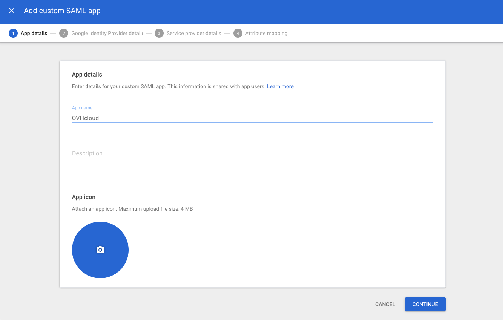
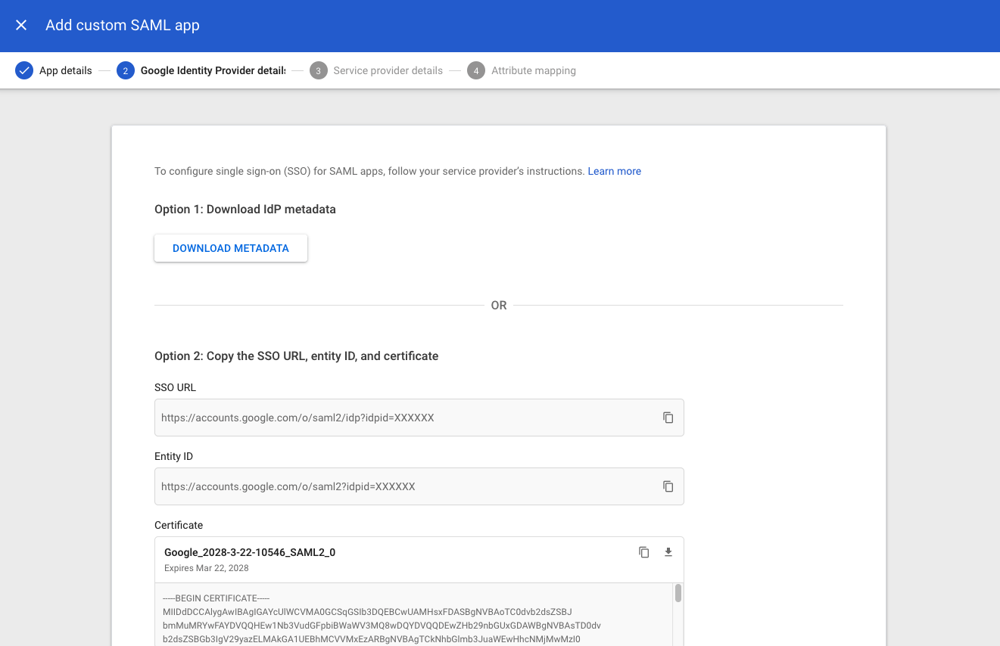
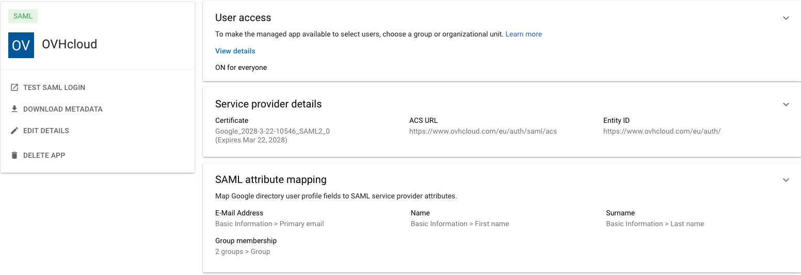
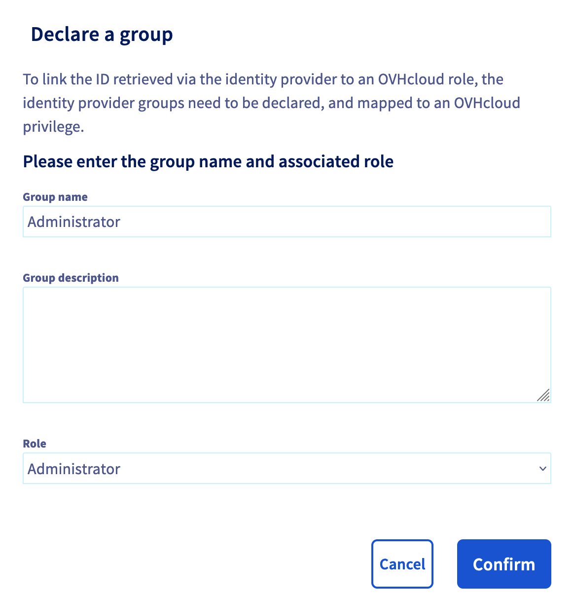
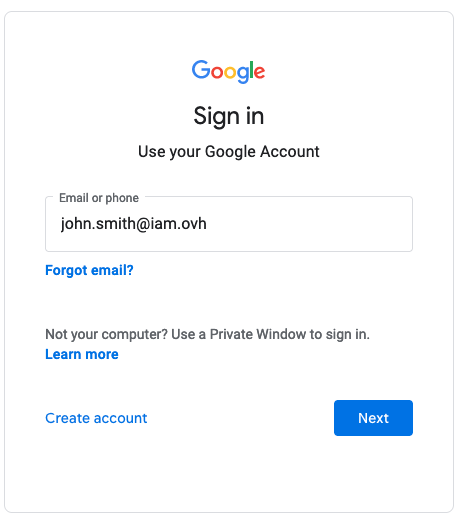

> [!primary]
> Tłumaczenie zostało wygenerowane automatycznie przez system naszego partnera SYSTRAN. W niektórych przypadkach mogą wystąpić nieprecyzyjne sformułowania, na przykład w tłumaczeniu nazw przycisków lub szczegółów technicznych. W przypadku jakichkolwiek wątpliwości zalecamy zapoznanie się z angielską/francuską wersją przewodnika. Jeśli chcesz przyczynić się do ulepszenia tłumaczenia, kliknij przycisk „Zaproponuj zmianę” na tej stronie.
> 

**Ostatnia aktualizacja z dnia 30-03-2023**

## Wprowadzenie

Możesz użyć uwierzytelnienia **SSO** (*Single Sign-On*), aby zalogować się do Twojego konta OVHcloud. Aby aktywować te połączenia, Twoje konto OVHcloud oraz konta Google Workspace muszą być skonfigurowane za pomocą uwierzytelniania SAML (*Security Assertion Markup Language*).

**Niniejszy przewodnik wyjaśnia, jak powiązać Twoje konto OVHcloud z zewnętrzną usługą Google Workspace.**

## Wymagania początkowe

- Posiadanie statusu administratora usługi Google Workspace
- Posiadanie [konta OVHcloud](https://docs.ovh.com/pl/customer/tworzenie-konta-ovhcloud/)wferee
- Dostęp do [Panelu client OVHcloud](https://www.ovh.com/auth/?action=gotomanager&from=https://www.ovh.pl/&ovhSubsidiary=pl)

## W praktyce

> [!primary]
>
> Aby usługodawca (tzn. Twoje konto OVHcloud) mógł nawiązać połączenie SSO z dostawcą tożsamości (tzn. Twoją usługą Google Workspace), przede wszystkim należy nawiązać relacje zaufania, rejestrując połączenie SSO w obu usługach.
>

### Zapisz OVHcloud w Google Workspace

Twój Google Workspace działa jako dostawca danych osobowych. Zlecenia uwierzytelnienia Twojego konta OVHcloud zostaną przyjęte tylko wtedy, gdy zostanie ono uznane za zaufaną organizację trzecią.

Oznacza to, że musi być dodany jako `Web and mobile apps`.

Zaloguj się do interfejsu administracyjnego [Google Workspace](https://admin.google.com) za pomocą konta administratora.

Przejdź do `Apps`{.action}, a następnie `Web and mobile apps`{.action}.

{.thumbnail}

Kliknij `Add app`{.action}, a następnie `Add custom SAML app`{.action}.

W etapie "App details" dodaj nazwę dla tego połączenia. Jeśli nie posiadasz inspiracji, **OVHcloud** jest odpowiednią nazwą. Kliknij `Continue`{.action}.

{.thumbnail}

W etapie "Google Identity Provider details" pobierz plik metadanych, klikając `Download metadata`{.action} i klikając przycisk `Continue`{.action}.

{.thumbnail}

W etapie "Service provider details" uzupełnij pola `ACS URL` i `Entity ID` podając wartości Twojego regionu: 

 - Region UE: **ACS URL**: `https://www.ovhcloud.com/eu/auth/saml/acs` i **Entity ID**: `https://www.ovhcloud.com/eu/auth/`
 - Region CA: **ACS URL**: `https://www.ovhcloud.com/ca/auth/saml/acs` i **Entity ID**: `https://www.ovhcloud.com/ca/auth/`

Kliknij `Continue`{.action}.

{.thumbnail}

W etapie "Atrybut mapping" dodaj następującą mapping:

- **First Name**: Name
- **Last Name**: Surname
- **Primary email**: E-mail Address

Kliknij `Finish`{.action}.

{.thumbnail}

Aktywuj dostęp do tej aplikacji, klikając `OFF for everyone`{.action} w sekcji "User Access". Kliknij przycisk `ON for everyone`{.action}, a następnie przycisk `SAVE`{.action}

{.thumbnail}

{.thumbnail}

> [!primary]
>
> Dodanie dostępu do aplikacji dla użytkowników może zająć kilka godzin, zanim stanie się ona skuteczna.
>

Twoja usługa Google Workspace stała się dla OVHcloud zaufana jako dostawca usług. Następnym krokiem jest sprawdzenie, czy konto OVHcloud zaufa Twojemu Google Workspace jako dostawcy tożsamości.

### Budowa zaufania do konta OVHcloud i konfiguracja połączenia

Dodanie Google workspace jako zaufanego dostawcy tożsamości odbywa się w [[Panelu client OVHcloud](https://www.ovh.com/auth/?action=gotomanager&from=https://www.ovh.pl/&ovhSubsidiary=pl), w którym możesz dostarczyć metadane dostawcy tożsamości.

[Zaloguj się](https://www.ovh.com/auth/?action=gotomanager&from=https://www.ovh.pl/&ovhSubsidiary=pl) i kliknij swój profil w prawym górnym rogu.

{.thumbnail}

Kliknij Twoją nazwę, aby przejść do strony zarządzania profilem.

{.thumbnail}

Otwórz zakładkę `Zarządzanie użytkownikami`{.action}.

{.thumbnail}

Kliknij przycisk `Logowanie SSO`{.action}.

{.thumbnail}

Wpisz metadane XML Twojej usługi Google Workspace. Uzupełnij pole "Nazwa atrybutu grupy" wartością `Group`. Kliknij na `Zatwierdź`{.action}.

{.thumbnail}

Musisz teraz odnaleźć Twój Google Workspace jako dostawcę tożsamości, a także grupy domyślne.

{.thumbnail}

Aby uzyskać więcej informacji, kliknij link pod "URL usługi SSO".

{.thumbnail}

Przycisk `...`{.action} pozwala na aktualizację lub usunięcie certyfikatu SSO i na zapoznanie się z jego szczegółami.

{.thumbnail}

Twój Google Workspace jest teraz uważany za zaufanego dostawcę tożsamości. Jednocześnie należy dodać grupy do konta OVHcloud.

> [!warning]
> Jeśli spróbujesz zalogować się przez SSO, prawdopodobnie wyświetli się komunikat błędu `Not in valid groups`.
>
> Twoje konto OVHcloud sprawdza, czy użytkownik loguje się do grupy istniejącej na koncie.
>

W tym celu należy zezwolić grupom, które zostaną przesłane z Google Workspace do OVHcloud. Grupy te są takie same, jak używane do kategoryzacji użytkowników.

W tym celu zaloguj się do interfejsu administracyjnego [Google Workspace](https://admin.google.com) za pomocą konta administratora

Przejdź do `Apps`{.action}, a następnie `Web and mobile apps`{.action}.

{.thumbnail}

Kliknij na linię aplikacji, którą wcześniej dodałeś.

{.thumbnail}

Kliknij na `SAML attribute mapping`{.action}, aby edytować mapping informacji udostępnianych przez Google Workspace i OVHcloud.

{.thumbnail}

W kategorii "Group membership (optional)" możesz dodać wszystkie grupy, które chcesz autoryzować logując się do OVHcloud. W polu "App attribute" podaj `Group`.

Następnie przypisz **role** tym grupom użytkowników do OVHcloud. W przeciwnym razie Twoje konto OVHcloud nie wie, co użytkownik może zrobić i domyślnie nie przyznaje mu żadnych uprawnień.

{.thumbnail}

W Panelu klienta OVHcloud dodaj grupę klikając przycisk `Zgłoś grupę`{.action} i wypełniając pola:

 - **Nazwa grupy**: nazwa grupy w Google Workspace
 - **Uprawnienia**: poziom prawa przyznany tej grupie

{.thumbnail}

{.thumbnail}

Następnie możesz sprawdzić, czy grupa została dodana do Twojego konta OVHcloud w sekcji "Grupy":

{.thumbnail}

Po zalogowaniu się z użytkownikiem grupy **wewnętrznej** konto OVHcloud zostanie uznane za użytkownika spełniającego rolę "UNPRIVILEGED" określoną przez jego grupę.

Następnie będziesz mógł wylogować się z konta i ponownie zalogować się do Google Workspace jako dostawca danych.

### Logowanie przez SSO

Na [stronie logowania OVHcloud](https://www.ovh.com/auth/?action=gotomanager&from=https://www.ovh.pl/&ovhSubsidiary=pl) wpisz [identyfikator](https://docs.ovh.com/pl/customer/tworzenie-konta-ovhcloud/#jaki-jest-moj-identyfikator-klienta), po którym następuje **/idp** bez hasła i kliknij przycisk `Login`{.action}.

{.thumbnail}

Zostaniesz przekierowany na stronę logowania Google Workspace. Wprowadź login/hasło użytkownika Twojego Google Workspace, następnie kliknij przycisk `Sign in`{.action} .

{.thumbnail}

Teraz jesteś zalogowany tym samym identyfikatorem klienta, ale za pomocą użytkownika Google Workspace.

{.thumbnail}

## Sprawdź również

[Załóż konto OVHcloud](https://docs.ovh.com/pl/customer/tworzenie-konta-ovhcloud/)

[Zabezpieczenie konta OVHcloud i zarządzanie danymi osobowymi](https://docs.ovh.com/pl/customer/identyfikator_klienta/)

[Definicja i zarządzanie hasłem do konta](https://docs.ovh.com/pl/customer/zarzadzanie-haslem/)

[Zabezpieczenie konta OVHcloud za pomocą weryfikacji dwuetapowej](https://docs.ovh.com/pl/customer/zabezpieczenie-konta-za-pomoca-2FA/)

Przyłącz się do społeczności naszych użytkowników na stronie <https://community.ovh.com/en/>.