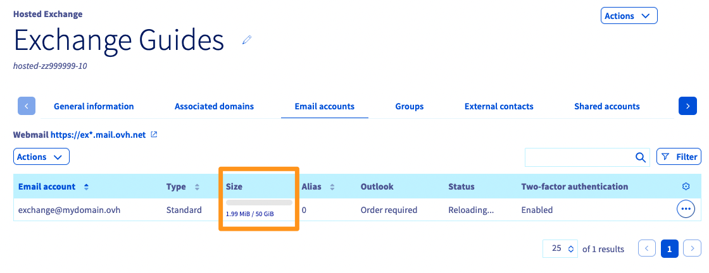
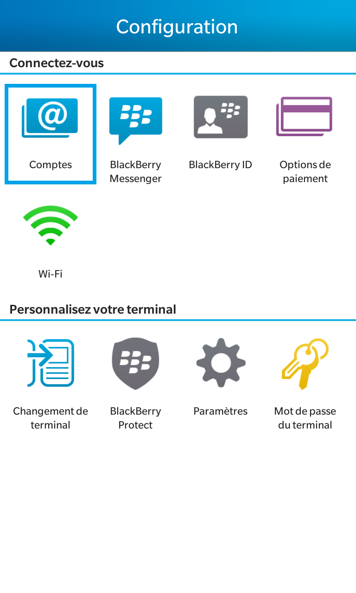
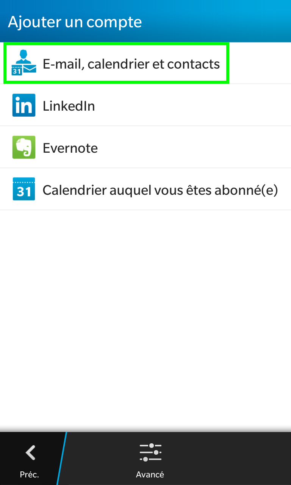
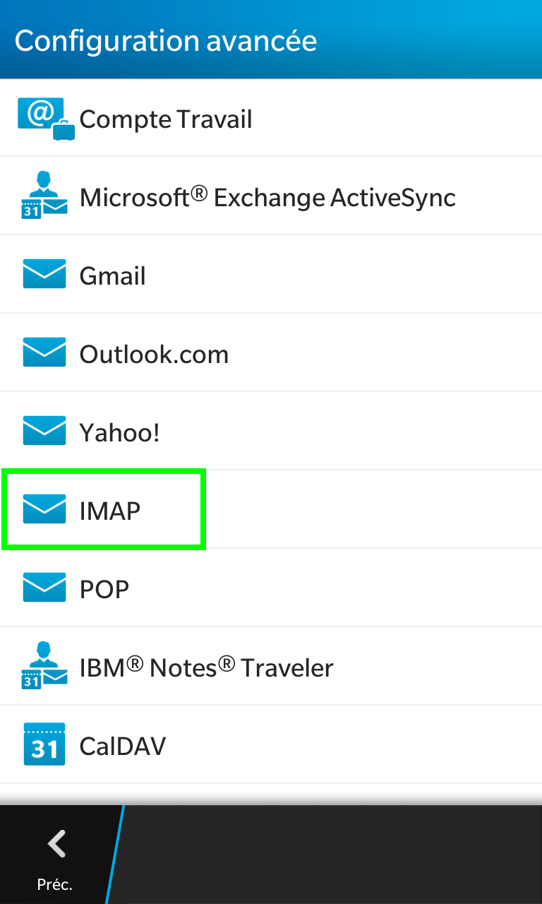
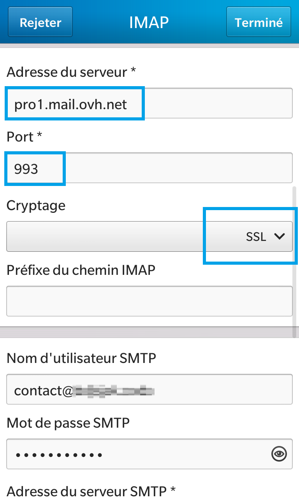
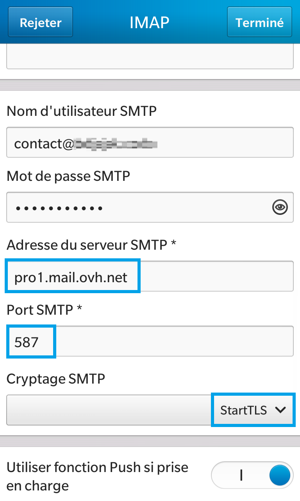
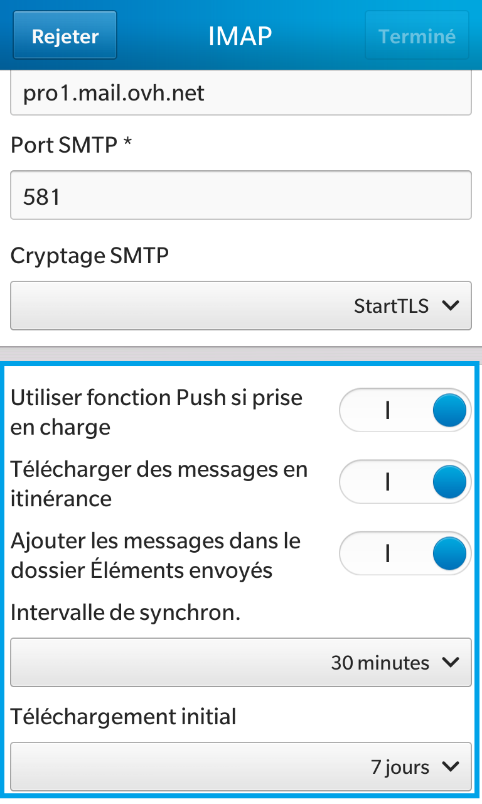

**Dernière mise à jour le 03/08/2022**

### Summary

Original format is from <https://docs.ovh.com/fr/nutanix/metro-availability/#en-pratique>

- [Anchor links](#anchorlinks)
    - [Tabs](#tabs)
    - [Tabs with code](#tabscode)
- [A gif](#gif)
    - [Etape 2.1 Contrôle du plan de reprise d'activité](#faqformats)

### Anchor links <a name="anchorlinks"></a>

[This link](#faqformats) should bring you to the bottom of this guide same guide

### Tabs <a name="tabs"></a>

Original content is from <https://docs.ovh.com/fr/emails/manage-email-quota/#1-verifier-le-quota-actuel-de-votre-compte-email>

> [!tabs]
> **Emails (MXplan)**
>>
>> Cliquez sur `Emails`{.action} puis choisissez le nom du service MX Plan concerné. Positionnez-vous sur l'onglet `Comptes e-mail`{.action}. La fenêtre qui apparaît affiche les comptes e-mail existants. Vous pouvez observer, dans la colonne `Taille`, la consommation en cours du stockage de votre adresse e-mail.<br><br>
>>{.thumbnail}<br>
>>
> **Email Pro**
>>
>> Cliquez sur `E-mail Pro`{.action}, puis choisissez le nom de la plateforme concernée. Positionnez-vous sur l'onglet `Comptes e-mail`{.action}. La fenêtre qui apparaît affiche les comptes e-mail existants. Vous pouvez observer, dans la colonne `Taille`, la consommation en cours du stockage de votre adresse e-mail .<br><br>
>>{.thumbnail}<br>
>>
> **Exchange**
>>
>> Cliquez sur `Microsoft`{.action} / `Exchange`{.action}, puis choisissez le nom de la plateforme concernée. Positionnez-vous sur l'onglet `Comptes e-mail`{.action}. La fenêtre qui apparaît affiche les comptes e-mail existants. Vous pouvez observer, dans la colonne `Taille`, la consommation en cours du stockage de votre adresse e-mail.<br><br>
>>{.thumbnail}<br>
>>

### Tabs with code <a name="tabscode"></a>

Original code is from <https://docs.ovh.com/gb/en/web-paas/languages-nodejs/#connecting-to-services_2>

The following examples show how to use Node.js to access various services.
To configure a given service, see the page dedicated to that service.

> [!tabs]      
> Elasticsearch     
>> ``` js     
>> {!> web/web-paas/static/files/fetch/examples/nodejs/elasticsearch !}  
>> ```     
> Memcached     
>> ``` js     
>> {!> web/web-paas/static/files/fetch/examples/nodejs/memcached !}  
>> ```     
> MongoDB     
>> ``` js     
>> {!> web/web-paas/static/files/fetch/examples/nodejs/mongodb !}  
>> ```     
> MySQL     
>> ``` js     
>> {!> web/web-paas/static/files/fetch/examples/nodejs/mysql !}  
>> ```     
> PostgreSQL     
>> ``` js     
>> {!> web/web-paas/static/files/fetch/examples/nodejs/postgresql !}  
>> ```     
> Redis     
>> ``` js     
>> {!> web/web-paas/static/files/fetch/examples/nodejs/redis !}  
>> ```     
> Solr     
>> ``` js     
>> {!> web/web-paas/static/files/fetch/examples/nodejs/solr !}  
>> ```     


### A gif <a name="gif"></a>

Original content is from <https://docs.ovh.com/fr/emails/manage-email-quota/#en-pratique>

{.thumbnail}

### API calls

Original content is from  <https://docs.ovh.com/fr/domains/api-order/>

> [!api]
>
> @api {GET} /order/cart/{cartId}/domain

| Paramètre | Obligatoire | Défaut | Description                |
| --------- | ----------- | ------ | -------------------------- |
| domain    | oui         | ""     | Le nom de domaine souhaité |

<!-- prettier-ignore -->
> [!tabs]
> Réponse
>> ```javascript
>> [
>>   {
>>     "action": "create", // 1
>>     "configurations": [],
>>     "deliveryTime": "",
>>     "duration": [
>>       "P1Y", // 2
>>       "P2Y",
>>       "P3Y",
>>       "P4Y",
>>       "P5Y",
>>       "P6Y",
>>       "P7Y",
>>       "P8Y",
>>       "P9Y",
>>       "P10Y"
>>     ],
>>     "offer": "gold",
>>     "offerId": "fr-create", // 3
>>     "orderable": true,
>>     "phase": "ga",
>>     "prices": [
>>       {
>>         "label": "PRICE",
>>         "price": {
>>           "currencyCode": "EUR",
>>           "text": "6.99 €",
>>           "value": 6.99
>>         }
>>       },
>>       {
>>         "label": "RENEW",
>>         "price": {
>>           "currencyCode": "EUR",
>>           "text": "6.99 €",
>>           "value": 6.99
>>         }
>>       },
>>       {
>>         "label": "DISCOUNT",
>>         "price": {
>>           "currencyCode": "EUR",
>>           "text": "2.00 €",
>>           "value": 2
>>         }
>>       },
>>       {
>>         "label": "FEE",
>>         "price": {
>>           "currencyCode": "EUR",
>>           "text": "0.00 €",
>>           "value": 0
>>         }
>>       },
>>       {
>>         "label": "TOTAL",
>>         "price": {
>>           "currencyCode": "EUR",
>>           "text": "4.99 €",
>>           "value": 4.99
>>         }
>>       }
>>     ],
>>     "pricingMode": "default", // 4
>>     "productId": "domain",
>>     "quantityMax": 1
>>   }
>> ]
>> ```

> [!api]
>
> @api {POST} /order/cart/{cartId}/assign


### Different API calls formatting

Original content is from  <https://docs.ovh.com/gb/en/load-balancer/lb-http2/>

> [!faq]
>
> Service:
>
>> > [!api]
>> >
>> > @api {POST} /ipLoadbalancing/{serviceName}/tcp/route
>> >
>>
>
> Settings:
>
>> > **serviceName**
>> >
>> >> `<Load Balancer ID>`
>> >
>> > **action**
>> >
>> >> **type**
>> >> >
>> >> > `"farm"`
>> >>
>> >> **target**
>> >> >
>> >> > `<ID of your TCP farm that must manage the HTTP/2>`
>> >
>> > **frontendId**
>> >
>> >> `<ID of your front-end TCP 443>`
>


### A video insertion

#### Youtube

Original content is from  <https://docs.ovh.com/gb/en/public-cloud/public-cloud-first-steps/#step-3-creating-an-instance>

<iframe width="560" height="315" src="https://www.youtube-nocookie.com/embed/YP92y1rAVdQ" title="YouTube video player" frameborder="0" allow="accelerometer; autoplay; clipboard-write; encrypted-media; gyroscope; picture-in-picture" allowfullscreen></iframe>

#### Vimeo

Original content is from <https://docs.ovh.com/fr/billing/gerer-factures-ovh/>

<div style="padding:56.25% 0 0 0;position:relative;"><iframe src="https://player.vimeo.com/video/696213687?h=78a6ea1e6e&title=0&byline=0&portrait=0" style="position:absolute;top:0;left:0;width:100%;height:100%;" frameborder="0" allow="autoplay; fullscreen; picture-in-picture" allowfullscreen></iframe></div><script src="https://player.vimeo.com/api/player.js"></script>
<p><a href="https://vimeo.com/696213687">Introduction &agrave; l&rsquo;espace client &ndash; Mes factures</a> from <a href="https://vimeo.com/ovhcloud">OVHcloud</a> on <a href="https://vimeo.com">Vimeo</a>.</p>


#### Code-blocks

Original content is from <https://docs.ovh.com/gb/en/storage/object-storage/pcs/acl/>

```bash
. openrc-limited-user.sh
swift stat
swift list
swift stat <container>
swift list <container>
```


```json
{
  "default_project_id": "297xxxxxxxxxxxxxxxxxxxxxxxxxx49b",
  "description": "user",
  "domain_id": "default",
  "enabled": true,
  "id": "febxxxxxxxxxxxxxxxxxxxxxxxxxxc72",
  "name": "user-rAawn9H2qxnn",
  "options": {},
  "password_expires_at": null
}
```

```
Account: AUTH_297xxxxxxxxxxxxxxxxxxxxxxxxxx49b
Container: <container_segments>
Objects: 13
Bytes: 6442450944
Read ACL: 297xxxxxxxxxxxxxxxxxxxxxxxxxx49b:febxxxxxxxxxxxxxxxxxxxxxxxxxxc72
Write ACL:
Sync To:
Sync Key:
Accept-Ranges: bytes
X-Storage-Policy: PCS
Last-Modified: Wed, 04 May 2022 18:00:00 GMT
X-Timestamp: 1629925988.34920
Content-Type: text/plain; charset=utf-8
Vary: Accept
X-Trans-Id: txaba4d18d7cdd413581ab6-0061274504
X-Openstack-Request-Id: txaba4d18d7cdd413581ab6-0061274504
X-Iplb-Request-Id: 6DBEFE1E:8C04_3626E64B:01BB_61274504_28945B6:1209B
X-Iplb-Instance: 38426
```

```bash
swift download <container> <largeobject>
```

```
<largeobject> [auth 0.739s, headers 1.408s, total 5504.436s, 1.171 MB/s]
```

### FAQ formats <a name="faqformats"></a>

Original content is from <https://docs.ovh.com/gb/en/private-cloud/vdc-migration/#faq_2>

> [!faq]
>
> Are there any constraints or impact when sharing a datastore across my vDCs ?
>> No, there is no impact on current workload or on billing, or on ZFS snapshots. However, currently you are unable to unshare a datastore. We will change this later. 
> Will the VMs (with public IPs) be accessible from the exterior if they are in the new vDC when the PFSENSE are in the old vDC?
>> Yes, VM network is on the VMware infrastructure level and so on the 2 vDC.
> Can I implement a PFSENSE in the old vDC and another one in the new vDC?
>> Yes, it’s even required to have 2 different PFSENSEs to avoid IP conflicts.
> Are vxLANs available on both vDC?
>> The vxLANs are available on Premier only, and not on Essentials (as there is no NSX deployed).
> We don't use NSX. The migration procedure indicates that the source/destination DVS must be at the same version. On the source, our only DVS is in 6.0.0 so I imagine it needs to be updated. The doc / video / and the interface indicate that we can do it ourselves without cutting if it's vRack. I thought it was vRack but we can't update (the menu is greyed out). Does that mean it's vxlan? How do you tell the difference between vRack and vxlan?
>> If it's greyed out, it's probably the public DVS (vmnetwork) /vxlan. The bulk DVS is a second DVS with the word "vrack" at the end. Do not hesitate to open a support ticket so that we can confirm this with you and do the DVS upgrade if necessary.
> How do I know if my network adapters are VLAN or VxLAN and Essential compatible? In vSphere, I see for example and without more details: vxw-dvs-74-virtualwire-20-sid-....
>> Anything %-virtualwire-% is vxlan.
> If I have several VMs that go through the same NSX Edge, will it be necessary to migrate all the VMs and the Edge at the same time, at the risk of no longer having an Internet connection on certain VMs otherwise ?
>> Yes, either the EDGE would have to be moved with a redeployment before moving the VMs. Depending on the case, with extended networks or not, the 2 actions can be separated. 
> Can a DRS pool be created for global datastores? I believe I have already tried without success between 2 vDC 2014 / 2016.
>> Indeed, there are limitations for global datastores, we advise to use them only to migrate between the two vDCs and then to have "standard" datastores on the new vDC and to make the global datastores at the end of migration.
> We have a 2016 SDDC with 6 x 6 TB Acceleraded SSD (ordered in 2021) with "convert to global" available in the OVHcloud Control Panel. Can we convert them to global and keep them as is in the new vDC (to avoid the vMotion storage phase)? Note: the 6 DS are in a storage cluster.
>> Yes, if the VMs point to these DS there will be no storage motion steps.
> What are the differences between upgrading to Essentials or Premier ? 
>> There are no major differences, only the NSX steps are mandatory when upgrading to Premier and not relevant if you have selected Essentials.
> How much time do we need to plan to upgrade (depending on the number of VMs)?
>> We have measured transfer speed from 0.5 to 1TB per hour for the Storage Motion Step. Regarding the vMotion, it depends on the size of the VMs, normally less than a minute; it can take up to 3 minutes.
> What Microsoft licenses are available in SPLA mode?
>> Windows licences (standard and datacenter) and SQL server licences (standard and web) are available on 2020 offers in SPLA mode.
> I have to upgrade 2 VMware infrastructures that are currently used for DR purposes with data replication done by Zerto. Should I first upgrade my secondary infrastructure or my primary infrastructure?
>> There is no right or wrong, we recommend upgrading the secondary infrastructure first to master the upgrade process before upgrading the primary one.
> Will the historical pricing cap on hourly resources still be deployed?
>> No, the capping system has been disabled on 2020 offers (Premier & Essentials). All previous ranges will continue to run with the capping in place. 
> Will my old offer pricing change?
>> No repricing of old offers is planned.
> In what language are OVHcloud's Professional Services available?
>> OVHcloud's Professional Services are available both in French and English.
> Can OVHcloud's Professional Services recreate my user accounts & NSX configurations for me?
>> Our Professional Services will not run any operations on the customer's infrastructure. We are here to help, guide and provide advice. In this case, we will redirect our customers to partners, who can run operations in customer infrastructures. 
> How long does the Pack of Technical Advice Services credits last?
>> This service lasts for 3 months from date of order.
> How do I know how many hours of credits have been used, and are remaining?
>> Your OVHcloud Sales contact or Technical Lead contact are able to give you this information.
> What happens if the Advice Service session takes less time than planned?
>> A session is scheduled and accounted in blocks of 1 hour. For example, a session scheduled for 2 hours but taking 1.5 hours would be billed at 2 hours. A session scheduled for 3 hours which only took 1.5 hours would be charged at 2 hours.

### Buttons integration

Original content is from <https://docs.ovh.com/fr/emails/manage-email-quota/#augmenter-la-capacite-de-votre-compte-e-mail>

Depuis l'onglet `Comptes e-mail`{.action} de votre plateforme, cliquez sur le bouton <i class="icons-ellipsis icons-border-rounded icons-masterbrand-blue"></i> à droite du compte à modifier, puis cliquez sur `Augmenter la capacité à 300 Go`{.action}. Choisissez le mode de facturation qui vous convient et cliquez sur `Valider`{.action}.

### Tables

Original content is from  <https://docs.ovh.com/gb/en/public-cloud/public-cloud-essential-information/#go-further_2>

|Documentation|Details|
|---|---|
|[FAQ](https://docs.ovh.com/gb/en/public-cloud/public-cloud-faq/)|Frequently asked questions about Public Cloud.|
|[Glossary](https://docs.ovh.com/gb/en/public-cloud/introduction-to-instances-and-other-cloud-based-terms/)|The concepts and definitions you will need to move forward.|
|[Availability of services by location](https://www.ovhcloud.com/fr/public-cloud/regions-availability/)|Service availability tables across different locations.|
|[Image Changelog](https://docs.ovh.com/gb/en/public-cloud/pci-vps-image-changelog/)|Changes to publicly available system images.|

Here are some guides to help you with the first steps:

|Documentation|Details|
|---|---|
|[Create your first instance](https://docs.ovh.com/gb/en/public-cloud/public-cloud-first-steps/)|First practical guide to starting a cloud server from the OVHcloud Control Panel.|
|[Using an SSH key](https://docs.ovh.com/gb/en/public-cloud/use-of-an-ssh-key-in-the-public-cloud-interface/)| To log in to a Linux instance, you will need to log in via an SSH connection. This guide details the procedure.|
|[Private Network Configuration](https://docs.ovh.com/gb/en/public-cloud/public-cloud-vrack/)|At OVHcloud, private networks are powered by vRack technology. This guide will help you get started.|
|[Attach an additional disk to an instance](https://docs.ovh.com/gb/en/public-cloud/create_and_configure_an_additional_disk_on_an_instance/)|This guide will help you add additional storage to your first instance.|
|[Accessing the Horizon interface](https://docs.ovh.com/gb/en/public-cloud/configure_user_access_to_horizon/)|The Horizon interface of OpenStack allows some advanced actions, here is how to connect to it.|
|[Creating a Kubernetes cluster](https://docs.ovh.com/gb/en/kubernetes/creating-a-cluster/)|This guide will help you step by step in creating your first Kubernetes cluster.|
|[Configuring an Additional IP](https://docs.ovh.com/gb/en/public-cloud/configure_a_failover_ip/)|Additional IPs can allow you to switch traffic from one instance to another. This guide will explain how to configure this.|
|[Installing the OpenStack CLI](https://docs.ovh.com/gb/en/public-cloud/prepare_the_environment_for_using_the_openstack_api/)|OpenStack can also be used in the command line. Here is how to install the tools.|

One of the big advantages of using standard and open technologies, like OpenStack or Kubernetes, is that you can use all the documentation already available.

|Documentation|Details|
|---|---|
|[OpenStack CLI](https://docs.openstack.org/python-openstackclient/stein/#using-openstackclient)|Extensive documentation for the essential openstack command-line client. Documentation for the Stein version, please refer to the [availability table](https://www.ovhcloud.com/fr/public-cloud/regions-availability/) to find out what services are available.|
|[APIs OpenStack](https://docs.openstack.org/stein/api/)|Extensive documentation of OpenStack APIs Documentation for the Stein version, please refer to the [availability table](https://www.ovhcloud.com/fr/public-cloud/regions-availability/) to find out what services are available.|
|[End user documentation](https://docs.openstack.org/stein/user/)|The full documentation for the OpenStack user, in Stein version.|
|[Developer documentation](https://developer.openstack.org/)|The documentation for developers who want to connect their application to OpenStack APIs using the available libraries/SDKs.|
|[Kubernetes CLI Overview](https://kubernetes.io/docs/reference/kubectl/overview/)| The documentation for the essential command line client 'kubectl'.|
|[Kubernetes APIs Overview](https://kubernetes.io/docs/reference/using-api/)| The documentation of the Kubernetes API, useful for an overview of the possibilities.|

### API within a primary

Original content is from  <https://docs.ovh.com/gb/en/private-cloud/vdc-migration/#step-61-reconfigure-veeam-managed-backup-if-relevant>

> [!primary]
>
> `{datacenterId}` is the **old** vDC id, you can get it with the following API call:
>
> > [!api]
> >
> > @api {GET} /dedicatedCloud/{serviceName}/datacenter
> >
>

### Carousel

> [!carousel]
>
> - 
> - 
> - 
> - 
> - 
> - 
> - 
> - 
> - 
> - 
> 