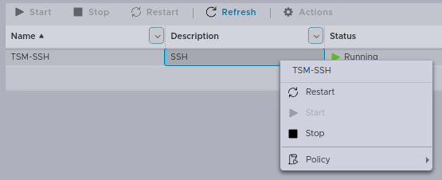
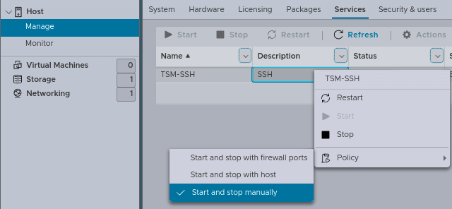

> [!primary]
> Tłumaczenie zostało wygenerowane automatycznie przez system naszego partnera SYSTRAN. W niektórych przypadkach mogą wystąpić nieprecyzyjne sformułowania, na przykład w tłumaczeniu nazw przycisków lub szczegółów technicznych. W przypadku jakichkolwiek wątpliwości zalecamy zapoznanie się z angielską/francuską wersją przewodnika. Jeśli chcesz przyczynić się do ulepszenia tłumaczenia, kliknij przycisk „Zaproponuj zmianę” na tej stronie.
>

**Ostatnia aktualizacja z dnia 22-03-2023**

## Wprowadzenie

Niniejszy przewodnik pomoże Ci w jak najlepszym opracowaniu zabezpieczeń systemu ESXi.

W szczególności niniejszy przewodnik wyjaśnia, jak:

- Ograniczenie dostępu do ESXi do określonego adresu IP lub zakresu sieci;
- Wyłącz usługi zwiększające powierzchnię ataku serwera.

W tym celu skorzystamy z pokładowych funkcji oferowanych przez VMware, ale również przez funkcje oferowane przez OVHcloud.

> [!warning]
> 
> Niedawno systemy ESXi padły ofiarą luki, którą złośliwe grupy bardzo szybko wykorzystywały w sieciach publicznych.
>
> Więcej informacji na temat tego ataku można znaleźć w [uzupełniającym FAQ (EN)](https://docs.ovh.com/gb/en/dedicated/esxi-faq/).
>

### Przypomnienie dobrych praktyk w zakresie bezpieczeństwa:

- Regularnie aktualizuj swoje systemy ESXi.
- Ogranicz dostęp tylko do zaufanych adresów IP.
- Wyłącz porty i niewykorzystane usługi.
- Upewnij się, że dostęp do Twoich serwerów lub urządzeń sieciowych jest ograniczony, kontrolowany i chroniony za pomocą mocnych haseł.
- Przechowuj krytyczne dane na zewnętrznych dyskach oraz na serwerach backup, które są chronione i odizolowane od Internetu.

**Opcjonalnie**:

- Wdrażaj rozwiązania dziennikarskie niezbędne do monitorowania wydarzeń na serwerach krytycznych oraz na sprzęcie sieciowym.
- Zbuduj pakiety bezpieczeństwa do wykrywania złośliwych operacji, włamań (IPS / NIDS) oraz do kontroli przepustowości ruchu sieciowego.

## Wymagania początkowe

- Dostęp do [panelu klienta OVHcloud](https://www.ovh.com/auth/?action=gotomanager&from=https://www.ovh.pl/&ovhSubsidiary=pl){.external}.
- Posiadanie serwera dedykowanego z zainstalowanym rozwiązaniem ESXi
- Wykupienie usługi kompatybilnej z naszą funkcjonalnością [Network Firewall](https://docs.ovh.com/pl/dedicated/network-firewall/), jeśli chcesz korzystać z niej do filtrowania.

## W praktyce

### Ochrona przed włamaniami

Przypomnienie jej definicji i zasady działania:

> [!primary]
> 
> System ESXi posiada mechanizm bezpieczeństwa powiązany z rachunkiem administratora.
> W przypadku kilku prób błędnego dostępu konto administratora jest tymczasowo zablokowane.
> Mechanizm ten pozwala na zabezpieczenie Twojego systemu i zapobiega próbom złośliwego połączenia.

> [!warning]
> 
> Jeśli system się uruchomi i chcesz natychmiast zalogować się do ESXi, należy ręcznie odblokować konto administratora.
>
> W tym celu konieczne będzie [zrestartowanie](https://docs.ovh.com/pl/dedicated/pierwsze-kroki-z-serwerem-dedykowanym/#restart-serwera-dedykowanego_1) serwera ESXi w Panelu klienta OVHcloud.
> 

Historię logów dostępu można sprawdzić w następujących plikach z powłoki SSH:

- `/var/run/log/vobd.log` zawiera logi, które mogą być używane do monitorowania i rozwiązywania problemów:

```
2023-02-13T16:22:22.897Z: [UserLevelCorrelator] 410535559us: [vob.user.account.locked] Remote access for ESXi local user account 'root' has been locked for 900 seconds after 6 failed login attempts.
2023-02-13T16:22:22.897Z: [GenericCorrelator] 410535559us: [vob.user.account.locked] Remote access for ESXi local user account 'root' has been locked for 900 seconds after 6 failed login attempts.
2023-02-13T16:22:22.897Z: [UserLevelCorrelator] 410535867us: [esx.audit.account.locked] Remote access for ESXi local user account 'root' has been locked for 900 seconds after 6 failed login attempts.
```

- `/var/run/log/hostd.log` zawiera logi hosta ESXi (zadania, dostęp do interfejsu WEB, itp.):

```
2023-02-21T08:44:19.711Z error hostd[2101004] [Originator@6876 sub=Default opID=esxui-d48c-26a4] [module:pam_lsass]pam_do_authenticate: error [login:root][error code:2]
2023-02-21T08:44:19.711Z error hostd[2101004] [Originator@6876 sub=Default opID=esxui-d48c-26a4] [module:pam_lsass]pam_sm_authenticate: failed [error code:2]
2023-02-21T08:44:19.712Z warning hostd[2101004] [Originator@6876 sub=Default opID=esxui-d48c-26a4] Rejected password for user root from xxx.xxx.xxx.xxx
2023-02-21T08:44:19.712Z info hostd[2101004] [Originator@6876 sub=Vimsvc.ha-eventmgr opID=esxui-d48c-26a4] Event 175 : Cannot login root@xxx.xxx.xxx.xxx
```

Wszystkie te informacje są również dostępne w interfejsie administracyjnym. Kliknij menu `Host`{.action} i przejdź do sekcji `Monitor`{.action}, a następnie kliknij `Logs`{.action}.

{.thumbnail}

### Rozwiązanie Network Firewall

> [!primary]
>
> Przypominamy, że Network Firewall nie jest brany pod uwagę w ramach sieci OVHcloud. W związku z tym skonfigurowane reguły nie wpływają na połączenia pochodzące z tej sieci wewnętrznej.
>

Proponujemy aktywację i korzystanie z naszego rozwiązania filtrowania [Network Firewall](https://docs.ovh.com/pl/dedicated/network-firewall/).
Dzięki temu będziesz mógł w prosty sposób zarządzać zgodnymi z prawem dostępami, oprócz tych, które wprowadzisz za pośrednictwem systemu ESXi.

Dzięki temu unikniesz niespodziewanego zablokowania konta administratora w przypadku ataku.

Zaleca się zatem filtrowanie legalnych dostępów w ten sposób:

- Reguła 1 (Priority 0) umożliwia dostęp do systemu ESXi przez zaufane sieci zewnętrzne.
- Reguła 2 (Priority 1) blokuje całą resztę.

{.thumbnail}

### Filtrowanie w ESXi

> [!primary]
>
> Możesz również filtrować dostęp do systemu ESXi za pomocą wbudowanej zapory sieciowej.
> Będziesz mógł również wyłączyć niepotrzebne usługi w zależności od ich zastosowania.
>

> [!warning]
> 
> Zaleca się wyłączenie usług **SSH** i **SLP**.
> Jeśli mimo wszystko nadal korzystasz z usługi SSH, ogranicz jej wykorzystanie i dostęp.
> Dotyczy to również dostępu do **shell**.
> Nie zalecaj, aby wszystko, co jest konieczne dla każdego z Twoich potrzeb.

#### Operacja w interfejsie graficznym

**Usługi**

Kliknij menu `Host`{.action} i przejdź do sekcji `Manage`{.action}, a następnie kliknij `Services`{.action}.

Znajdź na liście usługę `TSM-SSH` i kliknij prawym przyciskiem myszy na wybranej linii.

Zatrzymaj usługę, klikając `Stop`{.action}:

{.thumbnail}

Wybierz `Policy` i zmień ją, jak pokazano na przykładzie.

Wybierz opcję `Start and stop manually`{.action}, aby zapobiec aktywacji usługi podczas uruchamiania serwera.

{.thumbnail} 

Zastosuj te same parametry dla usługi `slpd`:

{.thumbnail}

**Reguły zapory ogniowej**

Kliknij menu `Networking`{.action}, następnie `Firewall rules`{.action} i wybierz `Edit settings`{.action} dla każdej z usług, które chcesz chronić:

{.thumbnail}

Edytuj regułę, aby dodać tylko adresy IP lub sieci, które muszą mieć dostęp do Twojego systemu ESXi.

Przykład zezwalający wyłącznie na połączenia z IP 192.168.1.10:

{.thumbnail}

#### Manipulacja przez powłokę

**Usługi**

Wyłącz niepotrzebne usługi:

- Usługa SLP

```bash
/etc/init.d/slpd stop
esxcli network firewall ruleset set -r CIMSLP -e 0
chkconfig slpd off
```

- Usługa SSH

```bash
/etc/init.d/SSH stop
esxcli network firewall ruleset set -r sshServer -e 0
chkconfig SSH off
```

Sprawdź wszystkie usługi aktywne w trakcie uruchamiania:

```bash
chkconfig --list | grep on
```
<br/>
<br/>

**Reguły zapory ogniowej**

Wyświetl istniejące reguły zapory sieciowej:

```bash
esxcli network firewall ruleset list
esxcli system account list
```

> Wyjaśnienia dotyczące zmian/dostosowania reguły dostępu: 
> 
> - Usługa `vSphereClient`: usługa ta odpowiada interfejsowi webowemu administracyjnemu na porcie 443 (HTTPS).
> - Usługa `sshServer`: usługa ta odpowiada dostępowi przez SSH na porcie 22.

Przykład usługi vSphereClient:

```bash
esxcli network firewall ruleset list --ruleset-id vSphereClient
```

Upewnij się, czy reguła zapory jest aktywna:

```bash
esxcli network firewall ruleset set --ruleset-id vSphereClient --enabled true
```

Wyświetl listę adresów IP upoważnionych dla tej reguły:

```bash
esxcli network firewall ruleset allowedip list --ruleset-id vSphereClient
```

Wynik:

```
Ruleset        Allowed IP Addresses
-------------  --------------------
vSphereClient  All
```

Zmień status tagu poprzez jego wyłączenie:

```bash
esxcli network firewall ruleset set --ruleset-id vSphereClient --allowed-all false
```

Zezwalaj wyłącznie na poprawny adres IP 192.168.1.10:

```bash
esxcli network firewall ruleset allowedip add --ruleset-id vSphereClient --ip-address 192.168.1.10
```

Sprawdź obecność adresu na liście dostępowej:

```bash
esxcli network firewall ruleset allowedip list --ruleset-id vSphereClient
```

Wynik:

```
Ruleset        Allowed IP Addresses
-------------  --------------------
vSphereClient  192.168.1.10
```
<br/>
<br/>

Jeśli nadal chcesz korzystać z usługi SSH, wyjaśnimy, jak wdrożyć dostęp za pomocą klucza SSH.

Wygeneruj klucze na maszynie, która ma być połączona z serwerem ESXi, 521-bitowy algorytm **ECDSA** to bezpieczeństwo priorytetowe:  

> [!warning]
> Uwierzytelnianie działa z parą kluczy: jedna publiczna i inna prywatna.
> W żadnym wypadku nie udostępniaj **prywatnego** klucza, który musi pozostać na maszynie, na której został wygenerowany.

Wprowadź następujące polecenie:

```bash
ssh-keygen -t ecdsa -b 521 -C "key-ecdsa-esxi-host" -f /path-to-my-key/key-ecdsa
```

```
Generating public/private ecdsa key pair.
Enter file in which to save the key (/path-to-my-key/key-ecdsa_rsa):
```

Wpisz silne hasło:

```
Enter passphrase (empty for no passphrase):
Enter same passphrase again:
```

Na maszynach, do których chcesz się zalogować, należy podać lub przesłać tylko klucz publiczny (key-ecdsa.pub).

```
Your identification has been saved in /path-to-my-key/key-ecdsa.
Your public key has been saved in /path-to-my-key/key-ecdsa.pub.
The key fingerprint is:
SHA256:******************************************* key-ecdsa-esxi-host
```

Przenieś klucz publiczny do hosta ESXi, aby mógł zostać uznany za bezpieczny:

```bash
cat /path-to-my-key/key-ecdsa.pub | ssh root@esxi-host-ip 'cat >> /etc/ssh/keys-root/authorized_keys'
```

## Sprawdź również

Więcej informacji na temat dobrych praktyk bezpieczeństwa znajdziesz w [tym przewodniku](https://core.vmware.com/security-configuration-guide) zaproponowanym przez VMware.

Dołącz do społeczności naszych użytkowników na stronie <https://community.ovh.com/en/>.