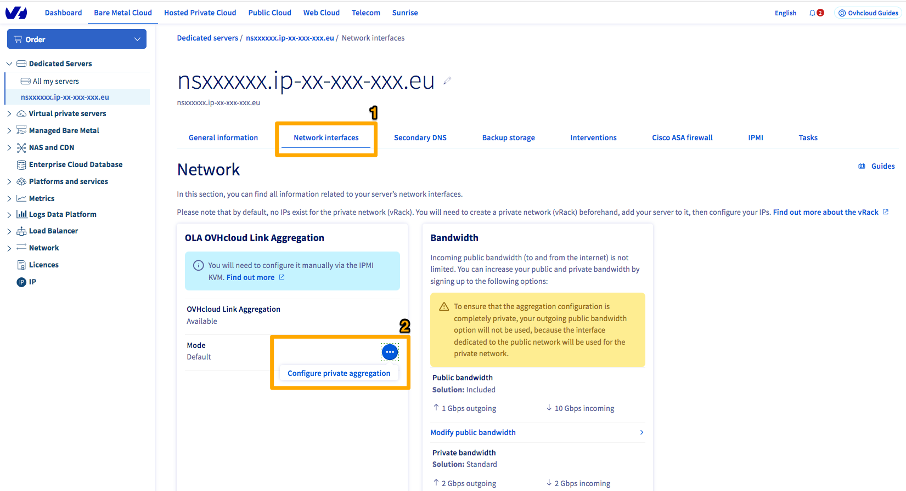

> [!primary]
> Esta traducción ha sido generada de forma automática por nuestro partner SYSTRAN. En algunos casos puede contener términos imprecisos, como en las etiquetas de los botones o los detalles técnicos. En caso de duda, le recomendamos que consulte la versión inglesa o francesa de la guía. Si quiere ayudarnos a mejorar esta traducción, por favor, utilice el botón «Contribuir» de esta página.
>

**Última actualización: 26/03/2021**

## Objetivo

La tecnología OVHcloud Link Aggregation (OLA) está diseñada para aumentar la disponibilidad de su servidor y mejorar la eficiencia de sus conexiones de red. En solo unos clics, es posible añadir sus tarjetas de red y hacer que sus enlaces de red sean redundantes. De este modo, si un enlace se cae, el tráfico se redirige automáticamente hacia otro enlace disponible.

**Esta guía explica cómo configurar el servicio OLA en el área de cliente.**

## Requisitos

- Tener un [servidor dedicado de OVHcloud.](https://www.ovhcloud.com/es/bare-metal/)
- Haber iniciado sesión en el [área de cliente de OVHcloud](https://ca.ovh.com/auth/?action=gotomanager&from=https://www.ovh.com/world/&ovhSubsidiary=ws).

## Procedimiento

### Configurar OLA en el área de cliente de OVHcloud

Para empezar a configurar OLA, conéctese al [área de cliente de OVHcloud](https://ca.ovh.com/auth/?action=gotomanager&from=https://www.ovh.com/world/&ovhSubsidiary=ws) y abra la pestaña `Bare Metal Cloud`{.action}. En el menú de la izquierda, haga clic en `Servidores dedicados`{.action} y seleccione el servidor en la lista.

{.thumbnail}

En la pestaña `Interfaces de red`{.action} (1), haga clic en el botón `...`{.action} (2) a la derecha de "Modo" en el cuadro **OLA: OVHcloud Link Aggregation**. Haga clic en `Configurar la agregación privada`{.action} (2).

{.thumbnail}

Compruebe que las dos interfaces, o grupos de interfaces, estén bien seleccionadas y asigne un nombre a la interfaz OLA. Haga clic en `Confirmar`{.action} una vez que haya finalizado la verificación.

La operación puede tardar unos minutos. Cuando haya terminado, el paso siguiente será configurar las interfaces de su sistema operativo con un vínculo NIC o un equipo NIC. Para saber cómo proceder, puede consultar las siguientes guías diseñadas para los sistemas operativos más populares:

[Configurar un NIC para el servicio OVHcloud Link Aggregation en Debian 9](../ola-debian9/).

[Configurar un NIC para el servicio OVHcloud Link Aggregation en CentOS 7](../ola-centos7/).

[Configurar un NIC para el servicio OVHcloud Link Aggregation en Windows Server 2019](../ola-w2k19/).

### Restaurar OLA a los valores predeterminados

Para restablecer OLA a los valores predeterminados, haga clic en el botón `...`{.action} a la derecha de "Modo" en el recuadro **OLA: OVHcloud Link Aggregation**. Haga clic en `Desconfigurar la agregación privada`{.action}. Haga clic en `Confirmar`{.action} en el menú contextual.

{.thumbnail}

La operación puede tardar unos minutos.

## Más información

[Configurar un NIC para el servicio OVHcloud Link Aggregation en Debian 9](../ola-debian9/).

[Configurar un NIC para el servicio OVHcloud Link Aggregation en CentOS 7](../ola-centos7/).

[Configurar un NIC para el servicio OVHcloud Link Aggregation en Windows Server 2019](../ola-w2k19/).

Interactúe con nuestra comunidad de usuarios en <https://community.ovh.com/en/>
