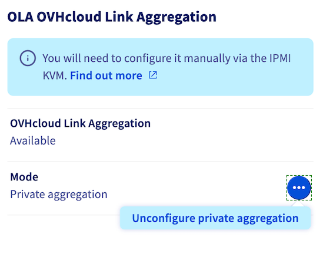

**Dernière mise à jour le 07/03/2023**

## Objectif

La technologie OVHcloud Link Aggregation (OLA) est conçue par nos équipes pour augmenter la disponibilité de votre serveur et améliorer l'efficacité de vos connexions réseau. En quelques clics, vous pouvez agréger vos cartes réseau et rendre vos liaisons réseau redondantes. Cela signifie que si une liaison tombe en panne, le trafic est automatiquement redirigé vers une autre liaison disponible. 
L'aggrégation se base sur la technologie IEEE 802.3ad, ou Link Aggregation Control Protocol (LACP).

**Découvrez comment configurer OLA dans votre espace client.**

## Prérequis

- Disposer d'un [serveur dédié OVHcloud](https://www.ovhcloud.com/fr-ca/bare-metal/)
- Être connecté à votre [espace client OVHcloud](https://ca.ovh.com/auth/?action=gotomanager&from=https://www.ovh.com/ca/fr/&ovhSubsidiary=qc)
- Un système d'exploitation / hyperviseur supportant le protocole d'aggrégation 802.3ad (LACP)

## En pratique

> [!warning]
>
> La configuration OLA se fait sur la totalité des interfaces réseaux. Elles formeront un agrégat de type « agrégation privée ».
>
> Suite à la mise en oeuvre d'OLA, l'IP publique ne sera donc plus accessible.
>

### Configurer OLA dans votre espace client OVHcloud

Pour commencer à configurer OLA, connectez-vous à [votre espace client OVHcloud](https://ca.ovh.com/auth/?action=gotomanager&from=https://www.ovh.com/ca/fr/&ovhSubsidiary=qc){.external} et sélectionnez l'onglet `Bare Metal Cloud`{.action}. Cliquez sur `Serveurs dédiés`{.action} et sélectionnez votre serveur dans la liste.

{.thumbnail}

Dans l'onglet `Interfaces réseau`{.action} (1), cliquez sur le bouton `...`{.action} (2) à droite de « Mode » dans le cadre **OLA: OVHcloud Link Aggregation**. Cliquez alors sur `Configurer l'agrégation privée`{.action} (2).

{.thumbnail}

Vérifiez que vos deux interfaces, ou groupes d'interfaces, sont bien sélectionnés et donnez un nom à l'interface OLA. Cliquez sur `Confirmer`{.action} une fois vos vérifications terminées.

L'opération peut prendre quelques minutes. Une fois celle-ci terminée, l'étape suivante consiste à configurer les interfaces dans votre système d'exploitation via une liaison NIC ou une équipe NIC. Pour connaître la méthode à appliquer, consultez les guides suivants qui la détaillent pour les systèmes d'exploitation les plus populaires :

[Comment configurer votre NIC pour l'agrégation de liens OVHcloud sous Debian 9](../ola-debian9/).

[Comment configurer votre NIC pour l'agrégation de liens OVHcloud sous CentOS 7](../ola-centos7/).

[Comment configurer votre NIC pour l'agrégation de liens OVHcloud sous Windows Server 2019](../ola-w2k19/).

[Comment configurer votre NIC pour l’agrégation de liens OVHcloud dans SLES 15](https://docs.ovh.com/ca/fr/dedicated/ola-sles15/)

### Restaurer OLA aux valeurs par défaut

Pour restaurer OLA aux valeurs par défaut, cliquez sur le bouton `...`{.action} à droite de « Mode » dans le cadre **OLA: OVHcloud Link Aggregation**. Cliquez alors sur `Déconfigurer l'agrégation privée`{.action}. Cliquez sur `Confirmer`{.action} dans le menu contextuel.

{.thumbnail}

L'opération peut prendre quelques minutes.

## Aller plus loin

[Comment configurer votre NIC pour l'agrégation de liens OVHcloud sous Debian 9](../ola-debian9/).

[Comment configurer votre NIC pour l'agrégation de liens OVHcloud sous CentOS 7](../ola-centos7/).

[Comment configurer votre NIC pour l'agrégation de liens OVHcloud sous Windows Server 2019](../ola-w2k19/).

[Comment configurer votre NIC pour l’agrégation de liens OVHcloud dans SLES 15](https://docs.ovh.com/ca/fr/dedicated/ola-sles15/).

Échangez avec notre communauté d'utilisateurs sur <https://community.ovh.com>.
