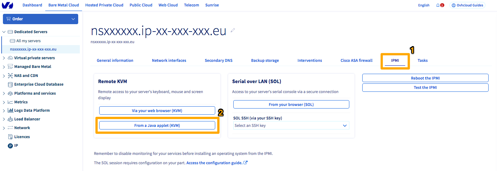

**Ostatnia aktualizacja z dnia 25-03-2021**

## Wprowadzenie

Technologia OVHcloud Link Aggregation (OLA) została przez nas zaprojektowana w celu zwiększenia dostępności serwera oraz podniesienia wydajności połączeń sieciowych. Możesz w prosty sposób przeprowadzić agregację kart sieciowych, dzięki czemu Twoje połączenia sieciowe staną się redundantne. Jeśli jedno połączenie zostanie zerwane, ruch zostanie automatycznie przekierowany do innego dostępnego łącza.

**Ten przewodnik wyjaśnia, jak powiązać karty sieciowe i wykorzystać je do OLA w Windows Server 2019.**

## Wymagania początkowe

- [Konfiguracja karty sieciowej dla OVHcloud Link Aggregation w Panelu klienta](../ola-manager)
- Dostęp do [Panelu klienta OVHcloud](https://www.ovh.com/auth/?action=gotomanager&from=https://www.ovh.pl/&ovhSubsidiary=pl).

## W praktyce

Ponieważ konfiguracja kart sieciowych w OLA jest prywatna, nie będziesz mógł połączyć się z serwerem za pomocą SSH. W związku z tym do uzyskania dostępu do serwera użyj narzędzia IPMI.
 Zaloguj się do [Panelu klienta OVHcloud](https://www.ovh.com/auth/?action=gotomanager&from=https://www.ovh.pl/&ovhSubsidiary=pl). W części `Bare Metal Cloud`{.action} kliknij `Serwery dedykowane`{.action} w menu po lewej stronie, wybierz serwer i kliknij zakładkę `IPMI`{.action} (1).

Teraz kliknij przycisk `Z apletu Java (KVM)`{.action} (2).

{.thumbnail}

Zostanie pobrany program JNLP. Następnie otwórz program, aby skorzystać z połączenia IPMI. Zaloguj się, używając aktualnych danych do logowania do serwera.

Po połączeniu z serwerem otwórz Server Manager. Jeśli nie jest on otwarty domyślnie, znajdziesz go w menu Start.

{.thumbnail}

Po otwarciu aplikacji Server Manager, kliknij zakładkę **Local Server** na pasku bocznym po lewej stronie. Następnie kliknij przycisk **Disabled** obok `NIC Teaming`.

{.thumbnail}

W oknie dialogowym NIC Teaming, w menu rozwijanym **TASKS** w sekcji "TEAMS", kliknij przycisk **New Team**.

{.thumbnail}

Nadaj nazwę zespołowi i sprawdź karty sieciowe (NIC), których chcesz używać w powiązaniu z OLA. Kliknij strzałkę obok `Additional properties` i zmień tryb `Teaming mode` na **LACP**. Po sprawdzeniu poprawności informacji, kliknij przycisk **OK**.

{.thumbnail}

Uruchomienie zespołu kart sieciowych (NIC) może potrwać do kilku minut. Po zakończeniu tego procesu kliknij ikonkę połączenia sieciowego w prawym dolnym rogu. Teraz kliknij przycisk **Network & Internet settings**. Następnie kliknij przycisk **Ethernet** na pasku bocznym po lewej stronie w oknie.

{.thumbnail}

Kliknij przycisk **Change adapter options**.

{.thumbnail}

Następnie kliknij prawym przyciskiem myszy zespół kart sieciowych (NIC) i wybierz w menu rozwijanym **Properties**.

{.thumbnail}

W następnym oknie dialogowym, które się pojawi kliknij dwukrotnie przycisk **Internet Protocol Version 4 (TCP/IPv4)**.

{.thumbnail}

Kliknij przycisk obok "Use the following IP address i dodaj wybrany przez Ciebie prywatny adres IP oraz podsieć. Po sprawdzeniu poprawności ustawień kliknij przycisk **OK**.

{.thumbnail}

Aby sprawdzić, czy zespół kart sieciowych działa, podłącz inny serwer do tego samego vRacka.  Jeśli wszystko działa poprawnie, ustawienie jest prawidłowe. W przeciwnym razie sprawdź dokładnie Twoje konfiguracje lub spróbuj zrestartować serwer.

## Podsumowanie

OVHcloud zapewnia klientom swobodę i elastyczność wykorzystania sprzętu w sposób najlepiej odpowiadający ich potrzebom. Po przeczytaniu tego przewodnika będziesz potrafił skonfigurować OVHcloud Link Aggregation (OLA) w Windows Server 2019 w celu wykorzystania obu kart sieciowych jako powiązanych interfejsów prywatnych.

## Sprawdź również

[Konfiguracja OVHcloud Link Aggregation w Panelu klienta](../ola-manager/)

[Konfiguracja karty sieciowej (NIC) dla OVHcloud Link Aggregation CentOS 7](../ola-centos7/)

[Konfiguracja karty sieciowej (NIC) dla OVHcloud Link Aggregation w Debianie 9](../ola-debian9/)

Przyłącz się do społeczności naszych użytkowników na stronie <https://community.ovh.com/en/>.
