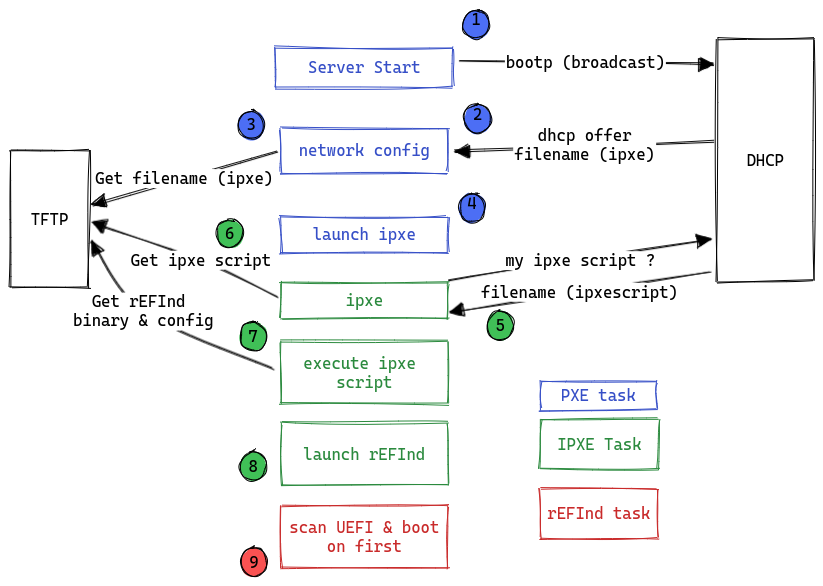
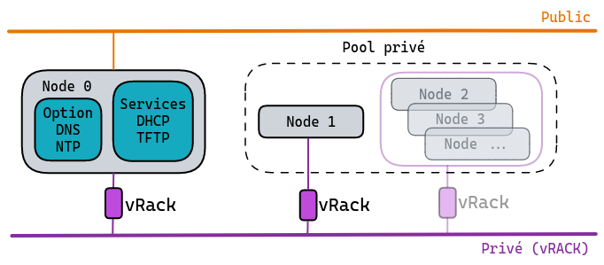
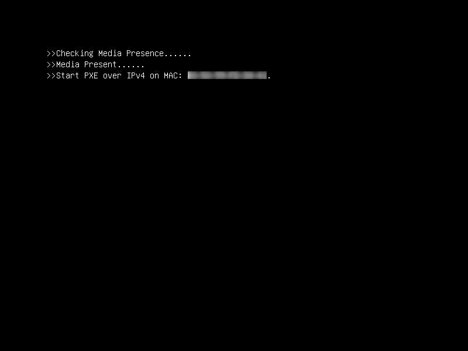
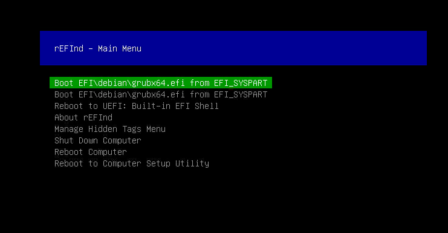

## Objectif

> [!warning]
> 
> Cet article est destiné aux utilisateurs expérimentés qui ont un minimum de connaissance concernant le monde open source, ainsi que des notions d'administration.
> 

Cette documentation à pour but de vous accompagner pour deployer tous les composants, ou bien services nécessaires, au bon redémarrage de vos solutions OVHcloud en environnement dédié et **entièrement privé**.<br>
Profiter d'une infrastructure privée sans avoir modifié la configuration par défaut de vos [serveurs dédiés](https://www.ovhcloud.com/fr/bare-metal/) OVhcloud.


> [!warning]
>
> Pour rappel, il est prohibé de modifier les configurations par défaut: configuration Bios, Boot Order, etc...
> Nous avons au préalable effectués tous nos tests, qualifications et validations de configurations, à partir de paramètres de critères de fonctionnement bien définis, pour vous proposer des environnements techniques les mieux adaptés à votre matériel.
> Nous avons pré-configurés les paramètres de démarrage en fonction de nos qualifications et avons donc intégrer tous nos outils en conséquences: netboot, monitoring, recycling, etc...
> Ainsi ces paramètres permettent à nos équipes d'intervenir de manière optimisée, en toute transparence et éfficacité.
> Si ces paramètres sont amenées à être modifiés, nos équipes ne pourront plus effectuer leur tâches qui leur sont dédiées dans les conditions que nous aurons choisies.
> 

> [!primary]
> 
> Le Netboot consiste, de par ses différentes séquences, à élaborer/choisir un type d'amorçage pour vos système d'exploitation.
> Les solutions techniques qu'on choisi les équipes d'OVhcloud permettront à vos solutions de pourvoir démarrer en toutes circonstances.
>

Les [serveurs dédiés](https://www.ovhcloud.com/fr/bare-metal/) OVHcloud vous permettent de configurer/déclarer vos propres réseaux.<br>
Chaque serveur est muni au minimum de 2 interfaces réseaux, fonctionnants en réalité en liens aggrégés et assurant la redondance en cas de panne. <br>
Vous avez donc la possiblité d'utiliser/déclarer vos réseaux dit *public* et ceux, au contraire dit *privés* en passant par notre solution [vrack](https://docs.ovh.com/fr/dedicated/configurer-plusieurs-serveurs-dedies-dans-le-vrack/).

Nous allons présenter le cas de [serveur(s) dédié(s)](https://www.ovhcloud.com/fr/bare-metal/) configuré(s) en mode **OLA**, c'est-à-dire ne possédant **uniquement** que des réseaux privés.
Ce choix propose à votre infrastructure la meilleur isolation/protection possible pour votre service hébergé.

La seule différence majeure qui est à noter, est que les réseaux [privés](https://docs.ovh.com/fr/ovhcloud-connect/presentation-concepts/#prive) n'ont donc pas accès à tout ce qui n'appartient pas à votre infrastructure.<br>
par conséquent, le mecanisme de démarrage de la solution se retrouve inopérant, à savoir que lorsque les systèmes sont démarrés via le méthode **Netboot** (Network Boot), ces derniers doivent obligatoirement récupèrer leur configurations via les services réseaux mutualisés présents sur le réseau interne d'OVHcloud.


### Présentation rapide d'un démarrage en Netboot 

> [!primary]
>
>  il existe un composant majeur existant en 2 versions :<br>
>  **PXE**: utilisant un environnement standardisé client/serveur, basé sur les protocoles BOOTP/DHCP/TFTP, afin de permettre un démarrage/deploiement via le réseau du système client.<br>
>  **iPXE**: utilisant un environnement standardisé client/serveur plus évolué, basé sur les protocoles HTTP,iSCSI, AoE, FCoE, Wi-Fi afin de permettre un démarrage/deploiement via le réseau du système client.
>


## Prérequis

* Être connecté à votre [espace client OVHcloud](https://www.ovh.com/manager/#/dedicated/configuration).
* Posséder au moins un [serveur dédié](https://www.ovhcloud.com/fr/bare-metal/) ayant un système d'exploitation **déjà installé**.
* Avoir toutes les interfaces réseau de ce serveur en mode **privé**, ce qui sous-entend que vous avez au préalable configuré notre fonctionnabilité [OLA](https://docs.ovh.com/fr/dedicated/ola-manager/).<br>
 Exemple d'une machine éligible à notre procédure, via l'onglet `Interfaces réseau`{.action} de son manager:<br>
{.thumbnail}
{.thumbnail}
* Un système dédié supplémentaire avec les interfaces réseau configurées par défaut, à savoir, un accès au réseau public et privé, qui hébergera tous les services (DHCP, TFTP et HTTP). Le système d'exploitation sera celui de votre choix.


### Présentation rapide d'un démarrage en Netboot chez OVHcloud 


liste des composants intervenants lors du démarrage :

* Un serveur **DHCP** : afin de rendre opérationelle l'interface réseau de votre machine cliente
* Un service **TFTP** : pour récuperer des ressources en réseau
* Un service **HTTP** : pour récuperer des ressources en réseau 
* La solution **rEFInd**, sous forme de BootLoader, a été retenue car parfaitement adaptée, celle-ci permettra la recherche du type d'amorçage d'un systeme pour les differentes machines clientes:<br>
disque local, volume réseau, usb, etc...


processus complet de démarrage Netboot:




|étape|description/détails|
|---|---|
|1|envoi de requête discover vers le DHCP de la machine cliente|
|2|Le DHCP affecte une adresse IP à la machine cliente (offer/request/ack)|
||requête de récupération du binaire iPXE|
|3||récupération en TFTP du binaire iPXE|
|4|chargement du binaire iPXE en tant que firmware|
|5|requête de récupération de script iPXE si nécessaire|
|6|récuparation du script iPXE associé en TFTP|
|7|éxécution du script iPXE|
||récupération des ressources nécessaire à rEFInd|
||binaire et fichier de configuration requis|
|8|éxécution et chargement du binaire rEFInd|
|9|rEFInd lance sa tâche de scan afin de repérer les secteurs d'amorçage des disques locaux|

> [!primary]
>
> La description ici restera le plus générique possible pour rester claire, et ainsi ne pas ajouter des éléments ou contraintes techniques qui sortent du cadre de notre exemple, mais donnera une vision globale du principe de fonctionnement.
>


## En pratique

### Deployer vos services DHCP, TFTP et HTTP

* installation des packages pour les services DHCP/TFTP/HTTP.
* configuration basique pour chaque service.
* mise en marche.


exemple d'infrastructure privée basique (schéma layer 2):



Exemple:

* services hébergés/mutualisés sur **Node 0**.
* une seule machine cliente **Node 1** avec OLA actif.


#### le service **DHCP**

ci-dessous, un exemple de fichier de configuration pour votre service **DHCP**.<br>
Selon votre distribution, l'arboresence peut être différente (dhcpd.conf).

En régle générale, il suffit de:<br>

* déclarer une interface réseau pour l'écoute (en attente de requêtes).
* préciser la version du protocol IP (v4 ou v6).
* renseigner un fichier de configuration principale (à titre d'exemple, cf fichier ci-dessous)

```bash
default-lease-time 7200;
max-lease-time 7200;

allow booting;
allow bootp;
allow unknown-clients;

###PXE###

option space PXE;
option PXE.mtftp-ip code 1 = ip-address;
option PXE.mtftp-cport code 2 = unsigned integer 16;
option PXE.mtftp-sport code 3 = unsigned integer 16;
option PXE.mtftp-tmout code 4 = unsigned integer 8;
option PXE.mtftp-delay code 5 = unsigned integer 8;
option arch code 93 = unsigned integer 16;

option space ipxe;
option ipxe-encap-opts code 175 = encapsulate ipxe;
option ipxe.priority code 1 = signed integer 8;
option ipxe.keep-san code 8 = unsigned integer 8;
option ipxe.skip-san-boot code 9 = unsigned integer 8;
option ipxe.syslogs code 85 = string;
option ipxe.cert code 91 = string;
option ipxe.privkey code 92 = string;
option ipxe.crosscert code 93 = string;
option ipxe.no-pxedhcp code 176 = unsigned integer 8;
option ipxe.bus-id code 177 = string;
option ipxe.san-filename code 188 = string;
option ipxe.bios-drive code 189 = unsigned integer 8;
option ipxe.username code 190 = string;
option ipxe.password code 191 = string;
option ipxe.reverse-username code 192 = string;
option ipxe.reverse-password code 193 = string;
option ipxe.version code 235 = string;
option iscsi-initiator-iqn code 203 = string;

# Feature indicators
option ipxe.pxeext code 16 = unsigned integer 8;
option ipxe.iscsi code 17 = unsigned integer 8;
option ipxe.aoe code 18 = unsigned integer 8;
option ipxe.http code 19 = unsigned integer 8;
option ipxe.https code 20 = unsigned integer 8;
option ipxe.tftp code 21 = unsigned integer 8;
option ipxe.ftp code 22 = unsigned integer 8;
option ipxe.dns code 23 = unsigned integer 8;
option ipxe.bzimage code 24 = unsigned integer 8;
option ipxe.multiboot code 25 = unsigned integer 8;
option ipxe.slam code 26 = unsigned integer 8;
option ipxe.srp code 27 = unsigned integer 8;
option ipxe.nbi code 32 = unsigned integer 8;
option ipxe.pxe code 33 = unsigned integer 8;
option ipxe.elf code 34 = unsigned integer 8;
option ipxe.comboot code 35 = unsigned integer 8;
option ipxe.efi code 36 = unsigned integer 8;
option ipxe.fcoe code 37 = unsigned integer 8;
option ipxe.vlan code 38 = unsigned integer 8;
option ipxe.menu code 39 = unsigned integer 8;
option ipxe.sdi code 40 = unsigned integer 8;
option ipxe.nfs code 41 = unsigned integer 8;

subnet 192.168.1.0 netmask 255.255.255.240 {

    range 192.168.1.2 192.168.1.5;
    option broadcast-address 192.168.1.15;
    option routers 192.168.1.1;
    ping-check = 1;
    next-server 192.168.1.1; # tftpd server's IP

    if option arch = 00:07 {                        # Détermine le type d'architecture, ici 64bits
      if exists user-class and option user-class = "iPXE" {
          filename "refind.pxe";                    # Détermine le script appelé par le binaire
      } else {
            filename "ipxe.efi";                    # Détermine le binaire iPXE
      }

    } else if option arch = 00:06 {                 # Détermine le type d'architecture, ici 32bits
      if exists  user-class and option user-class = "iPXE" {
              filename "refind.pxe";                # Détermine le script appelé par le binaire
      } else {
              filename "ipxe32.efi";                # Détermine le binaire iPXE
      }
    }
}

# Declare each host here
host node_1 {
    hardware ethernet xx:xx:xx:xx:xx:xx;
    server-name "node_1";
}
```

Détails:

* réseau privé (ex: 192.168.1.0/28)
* `subnet_mask` : 255.255.255.240
* `broadcast_address` : 192.168.1.15
* `dns_servers` : cf chapitre optionnel
* `ntp_servers` : cf chapitre optionnel
* `default_router` : 192.168.1.1
* `next-server` : 192.168.1.1
* `host` : nom machine cliente
* `hardware ethernet` : adresse matérielle (MAC) machine cliente
* `server-name` : hostname machine cliente


#### le service **TFTP**

Selon votre distribution, il existe plusieurs paquets réalisant la fonction de serveur TFTP.<br>
Par exemple: *tftp-server*, *tftpd*, *tftpd-hpa* ou encore *atftpd*.

> [!primary]
> 
> L'arborescence d'installation peut être différente selon la version du package et de votre système d'exploitation utilisé.
> 


Ce qu'il faut savoir:<br>

* Ce service utilise le port 69 (UDP)
* Il est obligatoire de déclarer un répertoire "cible", correspondant à une arboresence locale qui sera utilisée pour les réceptions et les téléchargments des fichiers.

exemple de configuration avec le logiciel `tftpd-hpa`:<br>

```bash
# /etc/default/tftpd-hpa
TFTP_USERNAME="tftp"
TFTP_DIRECTORY="/srv/tftp"
TFTP_ADDRESS="TFTP_server_address:69"
TFTP_OPTIONS="--secure"
```

Nous utiliserons comme exemple le chemin `/srv/tftp`, et y déposerons les fichiers nécessaires:<br>

```bash
root@node_0:/srv/tftp# tree
.
|-- ipxe.efi
|-- ipxe32.efi
`-- refind.pxe 
```

Contenu du fichier `refind.pxe`:<br>

```bash
#!ipxe 

echo Boot to local disk

set ressources-url http://192.168.1.1
iseq ${platform} efi && goto is_efi_x86_64 || goto end

:is_efi_x86_64
echo EFI boot mode

# Récuperer le fichier de configuration
imgfetch --name refind.conf ${ressources-url}/refind.conf

# Charger le binaire rEFIND
chain ${ressources-url}/refind_x64.efi

:end
echo Chain on hard drive failed
sleep 10
exit 1

```


#### le service **HTTP**
Il est question de rendre disponible (en HTTP) les ressources permettant le lancement du menu rEFInd que le script iPXE doit récupérer, à savoir:<br>

* le binaire éxécutable `refind_x64.efi`
* le fichier de configuration `refind.conf`


Le service HTTP qui désservira les fichiers pour rEFInd:<br>
(le chemin choisi dans notre exemple sera  celui par défaut, à savoir `/var/www/` toujours sur le *Node_0*)

```bash
root@node_0:/var/www# tree
|-- refind.conf
`-- refind_x64.efi
```

contenu du fichier `refind.conf`

Il s'agit d'intégrer les directives mimimun pour une bonne intégration au SI d'OVHcloud.
```bash

timeout 1
default_selection 1
hideui hwtest
hideui hints
banner_scale noscale
textonly
scanfor internal
uefi_deep_legacy_scan
scan_delay 0

```


## Mise en marche


Les sources qui ont servis d'exemple sont disponibles au téléchargement via ce <a href="https://raw.githubusercontent.com/ovh/docs/develop/pages/cloud/dedicated/pxe-with-full-private-dedicated/files/src.zip" download>ce lien</a>
Elles pourront eventuellement servir de template si besoin.<br>


Aperçu de ce que l'on obtiend à l'affichage lors d'un Netboot UEFI (par défaut):<br>
correspond aux étapes 1 à 4<br>
{.thumbnail}


correspond au résultat des étapes 5 à 9 <br>
{.thumbnail}<br>
Ci-dessus, nous avons le bootloader rEFInd chargé sur une machine avec un système debian installé.


#### Optionnel

> [!warning]
> 
> Il est récommandé également de deployer les services DNS et NTP.
> Ceux-ci ne sont pas nécessaires pour les phases de démarrage des systèmes, donc pas imposés dans cette procédure.
> Mais ils font partie des services importants par la suite, pour la stabilité de votre infrastructure.
> 


**Suggestions**

service DNS:<br>
Pour pouvez utiliser la table locale de chaque *Node*, à savoir le fichier `/etc/hosts`ou bien utiliser, par exemple, un service tel que [dnsmasq](https://en.wikipedia.org/wiki/Dnsmasq).

service NTP:<br>
Il est fortement conseillé d'utiliser un service DNS surtout si votre infrastructure comprends plusieurs machines.


> [!warning]
>
> Pour que ces services soient pleinement fonctionnels, penser à déclarer/ajouter les régles dans le firewall local de la machine hébergeant les services.
>

exemple avec la commande `iptables`:<br>
```bash

# pour le service NTP
iptables -I INPUT -i ethX -p udp --dport 123 -j ACCEPT

# pour le service DNS
iptables -I INPUT -i ethX -p udp --dport 53 -j ACCEPT
iptables -I INPUT -i ethX -p tcp --dport 53 -j ACCEPT
```


## Aller plus loin

Comprendre et/ou personnaliser votre service DHCP via ce [lien](https://wiki.debian.org/fr/DHCP_Server).<br>
Comprendre et/ou personnaliser votre service iPXE via ce [lien](https://ipxe.org/docs).<br>
Comprendre et/ou personnaliser votre service rEFInd via ce [lien](https://fr.wikipedia.org/wiki/REFInd).<br>
Comprendre ou découvrir NTP via ce [lien](https://fr.wikipedia.org/wiki/Network_Time_Protocol).<br>
Comprendre ou découvrir Dnsmasq via ce [lien](https://wiki.debian.org/dnsmasq).<br>


Échangez avec notre communauté d'utilisateurs sur <https://community.ovh.com/>.
