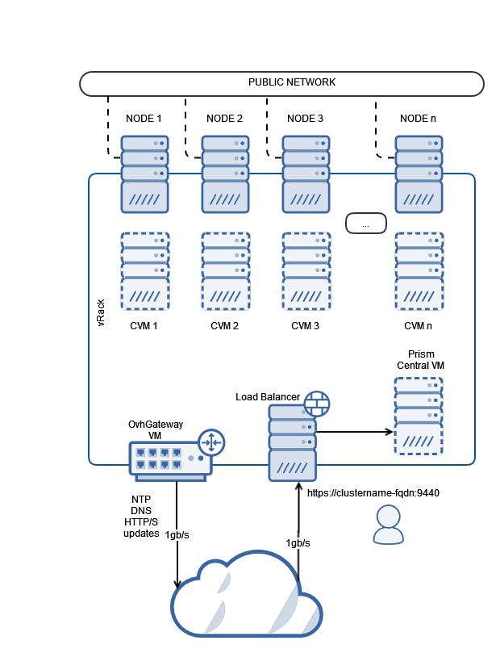

**Dernière mise à jour le 11/01/2022**

## Objectif

Cette page fournit une explication sur les éléments qui constituent un cluster Nutanix tel que fourni par OVHcloud, ainsi que sur son fonctionnement sur l'infrastructure OVHcloud.

## En pratique

### Principales caractéristiques

Un cluster Nutanix est constitué d’un ensemble de services OVHcloud :

- [Serveur dédié](https://www.ovhcloud.com/fr-ca/bare-metal/)
- [vRack](https://www.ovh.com/ca/fr/solutions/vrack/)
- [Load Balancer](https://www.ovh.com/ca/fr/solutions/load-balancer/)
- [Additional IP](https://www.ovhcloud.com/fr-ca/bare-metal/ip/)

Les serveurs dédiés (3 minimum) sont connectés au sein du vRack qui est un réseau L2, le réseau privé des hosts (noeud ou *node*).

L'adresse IP publique de chaque noeud n'est pas accessible car l'Additional IP est dédiée à l'accès Internet. Cet accès est assuré par la passerelle « OVHgateway » qui est une VM dédiée créée par OVHcloud sur votre cluster.

Le load balancer est utilisé pour exposer l'interface web utilisateur (*WebUI*) **Prism Central** sur Internet de façon publique. Pour des raisons de sécurité, vous pouvez restreindre l'interface utilisateur Web aux seules adresses IP de votre organisation.

{.thumbnail}

### Dimensionnement

Votre cluster requiert certaines fonctionnalités pour fonctionner correctement. Une fois livré, votre cluster aura 5 VM (pour un cluster à 3 noeuds). 
Chaque noeud disposera d'une « CVM ». Dans le cluster, vous retrouvez 2 VM supplémentaires : Prism Central et la OVHgateway. 

### Prism Central

Prism Central est déployé dans une configuration « *small* ».

Il peut en outre fonctionner sous deux modes : « *Alone* » (1 VM) ou « *Scale* » (3 VM). Il peut gérer jusqu'à 2500 VM.

- `Alone mode` : 6 vCPU, 26 GB de mémoire et 500 GiB de stockage.
- `Scale mode ` (pour une meilleure résilience et plus de capacité) : 18 vCPUs, 78 GB de mémoire et 1500 GiB de stockage (combiné).

En cas de doute, choisissez le mode « *Alone* ». Vous pourrez toujours passer en mode « *Scale* » par la suite.

### CVM

Toutes les CVM nécessitent au minimum 32 GB de mémoire et 12 vCPU pour chaque noeud.
Ces valeurs doivent être augmentées si vous ajoutez de nouvelles fonctionnalités à votre cluster.

### OVHgateway

**La passerelle OVHgateway permet d’accéder à Internet sur le cluster via l’adresse Additional IP.**

Cette VM a deux NIC, l’un pour le réseau privé (dans le vRack) et l’autre pour l’Internet public.

La VM utilise des règles de NAT pour acheminer le trafic du réseau privé vers Internet.
Vous pouvez donc l'utiliser pour le trafic sortant mais pas pour le trafic entrant.

La passerelle OVHgateway est de conception légère, elle utilise 1 vCPU, 1 GB de mémoire et 11 GiB de stockage.

### Prism Central Access

Une fois le cluster livré, OVHcloud vous fournit un nom de domaine complet (FQDN) pour votre cluster.

L'accès à Prism Central est disponible à l'adresse suivante : `https://<fqdn>:9440`. Cet accès est assuré par le load balancer. 

## Aller plus loin

Échangez avec notre communauté d'utilisateurs sur <https://community.ovh.com/>.
