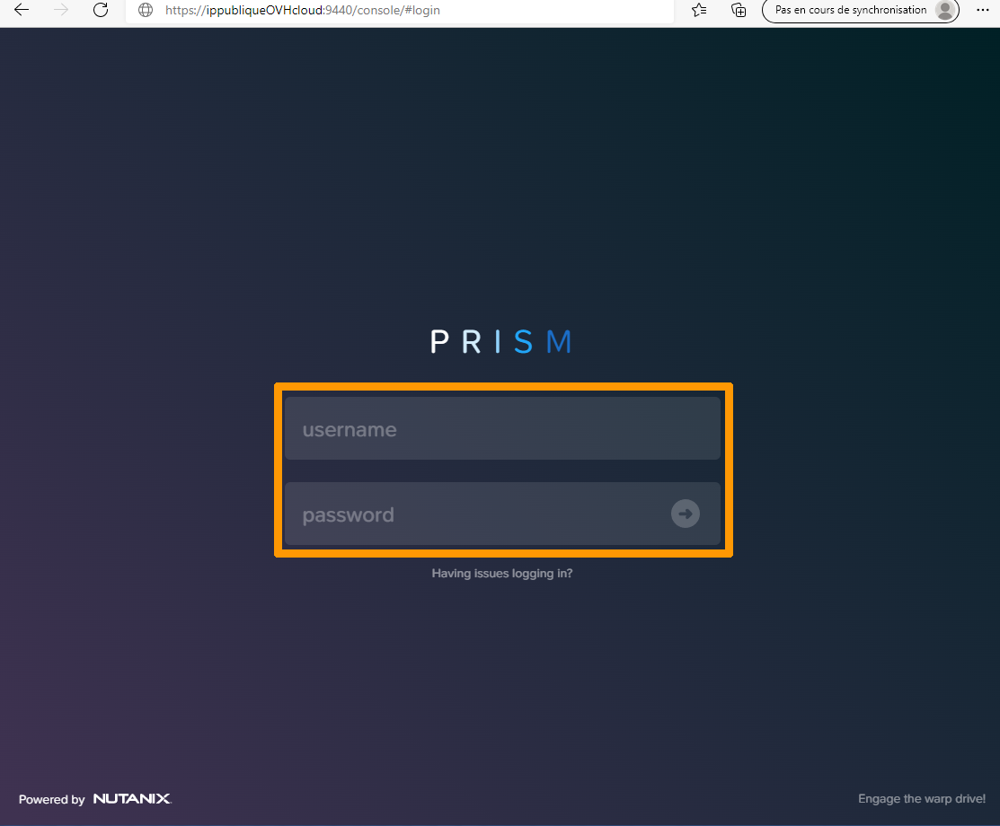
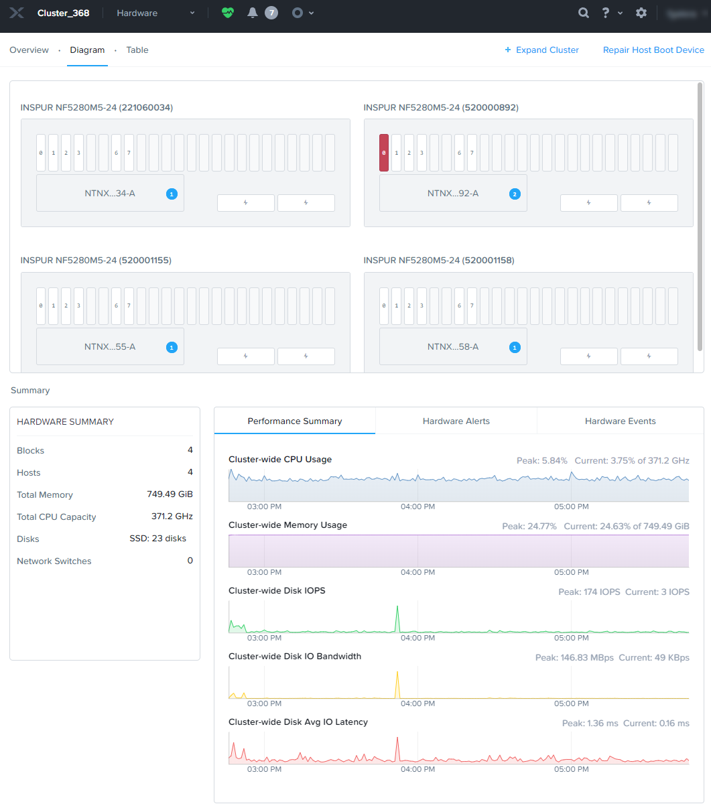

**Dernière mise à jour le 18/02/2022**

## Objectif

Cette documentation rappelle le fonctionnement d'un cluster NUTANIX et de ses capacités pour palier à une défaillance matérielle.

## Présentation des matériels

### Rappel sur la définition d'un noeud

Une solution nutanix est composée de ce que l'on appelle des noeuds, un noeud est en fait un ordinateur physique,  sur cet ordinateur se trouve
* Un disque système ou deux disques systèmes en RAID (A préciser)
* Un disque SSD ou est stocké la CVM *Machine virtuelle qui assure les connexions entre chaque noeud et qui est une composante essentielle de la solution NUTANIX* , sur ce disque si il y'a de la place il peut servir pour le stockage de données
* D'autres disques SSD ou SAS (Il faudra se faire préciser l'offre car chez NUTANIX suivant le type de disque ce n'est pas le même type de licence)
* Un ou plusieurs processeurs.
* De la mémoire.
* Parfois une carte graphique.

Dans l'idéal il faudrait que chaque noeud d'un cluster NUTANIX soit identique mais il peut arriver qu'il y'ai des différences notamment sur la présence de GPU **Graphical Processor Unit**, mais les noeuds qui contiennent des données doivent être identiques.

### Fonctionnement de la redondance

Un cluster est créé à partir des noeuds du cluster, il faut au minumum 3 noeuds pour faire fonctionner une cluster

Pour rappel la solution NUTANIX d'OVHCloud commence à 3 noeuds et peut aller jusqu'a 18 noeuds

La redondance des données ne se fait pas sur un noeud comme avec du RAID mais au travers du réseau sur plusieurs noeuds, il y'a plusieurs niveaux de redondances

* RF2: Les données sont disponibles sur 2 noeuds, ce qui permet la défaillance d'un noeud ou d'un disque de données sur un des noeuds
* RF3: Les données sont disponibles sur 3 noeuds, cette solution n'est possible qu'a partir de 5 noeuds, elle est plus securisée car elle permet la perte de deux noeuds, le revers de la médaille c'est quelle est plus 

### Connexion au cluster

La connexion au cluster peut se faire de plusieurs manières:

* Sur l'interface WEB Prism ELEMENT **C'est en fait une des CVM**
* A partir de l'interface WEB Prism Central **Machine virtuelle supplémentaire qui possèdes des fonctionnalités que n'a pas PRISM Element et qui permet de se connecter à un ou plusieurs clusters**
* En SSH sur le cluster **Dans ce cas là c'est aussi une des CVM**

Dans cette documentation nous allons nous connecter au travers de PRISM Central

L'accès au cluster se fait au travers d'une adresse publique sur une adresse du type [https://ippubliqueloadbalancer:9440](https://ippubliqueloadbalancer:9440)

Dans la partie encadrée saisir un nom d'utilateur un mot de passe et cliquer sur la flêche.

Sur le tableau de bord de prism central nous allors cliquer sur le nom du cluster dans Cluster Quick Access là ou se trouve l'encadrement.

Sur la sélection à droite apparait le nombre de Disques en totalité , le nombre de VMs ainsi que le le nombre d'hote. Un coeur de couleur verte indique indique que le cluster NUTANIX fonctionne correctement. En bas de cet encadré on peut voir le niveau de tolérance de panne **1 signifie que  nous sommes en RF2 avec la possibilité d'une perte d'un disque sur un noeud ou un noeud entièrement**.

Sur la sélection à gauche nous avons un résumé du stockage , de l'espace disque en cliquant sur view Details nous aurons plus d'information sur le stockage.

Dans cette fenêtre on peut voir l'état du stockage par noeud.

En allant dans le menu hardware et en cliquant sur **Hardware** nous aurons le détail par Noeud du stockage avec le nombre de disques allouées par noeud

## Aller plus loin

Site très interessant sur le fonctionnement de NUTANIX [<The nutanix BIBLE>](https://www.nutanixbible.com/)

Échangez avec notre communauté d'utilisateurs sur <https://community.ovh.com/>.
