**Dernière mise à jour le 26/10/2022**

## Objectif

**Ce document vous montre comment activer vos licences sur une solution Nutanix on OVHcloud en mode *Bring Your Own Licence* (BYOL)**

> [!warning]
> OVHcloud vous met à disposition des services dont la configuration, la gestion et la responsabilité vous incombent. Il vous appartient donc de ce fait d’en assurer le bon fonctionnement.
>
> Ce guide a pour but de vous accompagner au mieux sur des tâches courantes. Néanmoins, nous vous recommandons de faire appel à un prestataire spécialisé si vous éprouvez des difficultés ou des doutes concernant l’administration, l’utilisation ou la mise en place d’un service sur un serveur.
>

## Prérequis

- Être connecté à votre [espace client OVHcloud](https://www.ovh.com/auth/?action=gotomanager&from=https://www.ovh.com/fr/&ovhSubsidiary=fr).
- Être connecté sur vos clusters via **Prism Central**.
- Posséder des licences Nutanix et les avoir à disposition sur le portail Nutanix.

## Présentation

> [!warning]
>
> OVHcloud propose Nutanix en version *Bring Your Own Licence* (BYOL), ce qui signifie que vous devez, en tant que client OVHcloud, fournir les licences du cluster.
> Lorsque le cluster Nutanix est commandé en mode BYOL, le cluster est livré avec une version d'essai de 90 jours. Vous devez donc, en tant que client, installer vos licences pendant cette période.
>

Trois types de licences existent, pour :

- **Prism Element**. 
- **Prism Central**. 
- **Les add-ons**.

Vous pouvez installer toutes les licences à partir de **Prism Central**.

## En pratique

### Installation des licences

#### Récupération du résumé de votre configuration

Nous allons récupérer le résumé de la configuration du cluster pour le déposer sur le portail Nutanix et générer des licences. Ce fichier est un fichier **CSF (Cluster Summary  File)**.

Dans **Prism Central**, cliquez sur l'icône en forme d'`engrenage`{.action} pour aller dans les paramètres.

{.thumbnail}

Cliquez à gauche sur `Licensing`{.action}.

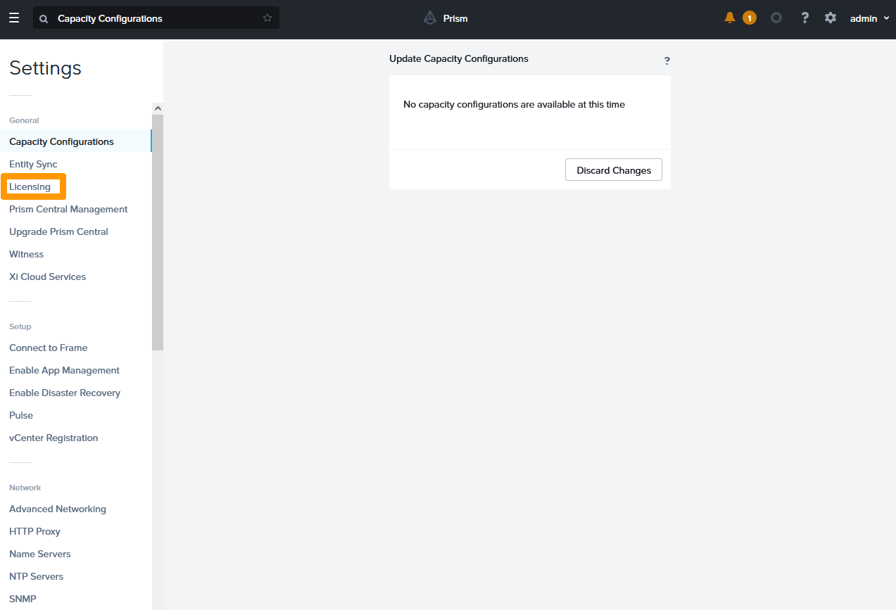{.thumbnail}

Cliquez à gauche sur `Update Licenses`{.action}.

{.thumbnail}

Cliquez sur `Download`{.action} pour récupérer le fichier contenant les informations concernant votre cluster.

{.thumbnail}

Cliquez en haut à droite sur `Show all downloads`{.action}

{.thumbnail}

Vous trouverez dans vos fichiers téléchargés un document dont le nom commence par **ntnx** et qui est le résumé de votre configuration. Il vous faudra déposer de fichier sur le portail de licences Nutanix.

{.thumbnail}

#### Connexion au portail Nutanix 

Toujours dans **Prism Central**, rendez-vous sur la page des licences et cliquez sur `Licenses page`{.action}.

{.thumbnail}

Le navigateur web se lance et vous propose de vous connecter au portail Nutanix.

Saisissez vos informations d'identification pour vous connecter.

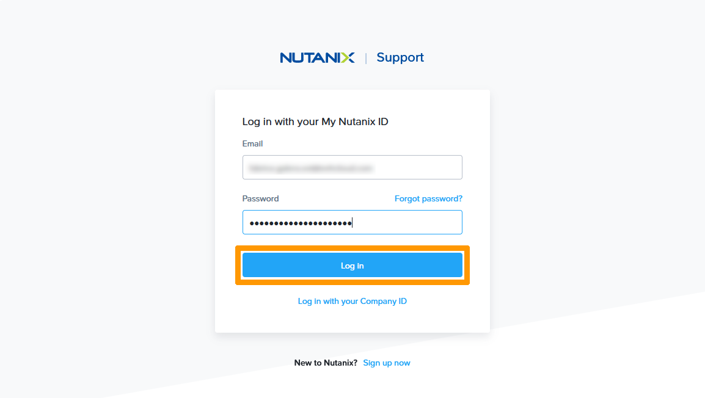{.thumbnail}

#### Création de la licence pour votre cluster

Dans votre espace client **Nutanix** cliquez sur `Manage Licenses`{.action}

{.thumbnail}

Ouvrez le fichier **CSF** généré par **Prism Central** qui commence par `ntnx_csf...`.

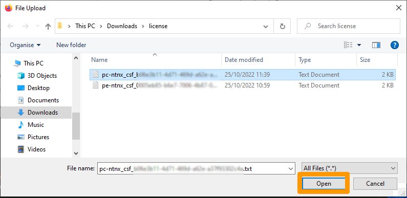{.thumbnail}

Faites défiler `la fenêtre`{.action}. pour ajouter vos licences de clusters. 

{.thumbnail}

Dans la rubrique **NCM Ultimate** cliquez sur `Select Licences`{.action}.

{.thumbnail}

Sélectionnez votre `votre cluster`{.action} et cliquez sur `Save`{.action}.

{.thumbnail}

Cliquez sur `Next`{.action}.

{.thumbnail}

Cliquez sur `Confirm`{.action}.

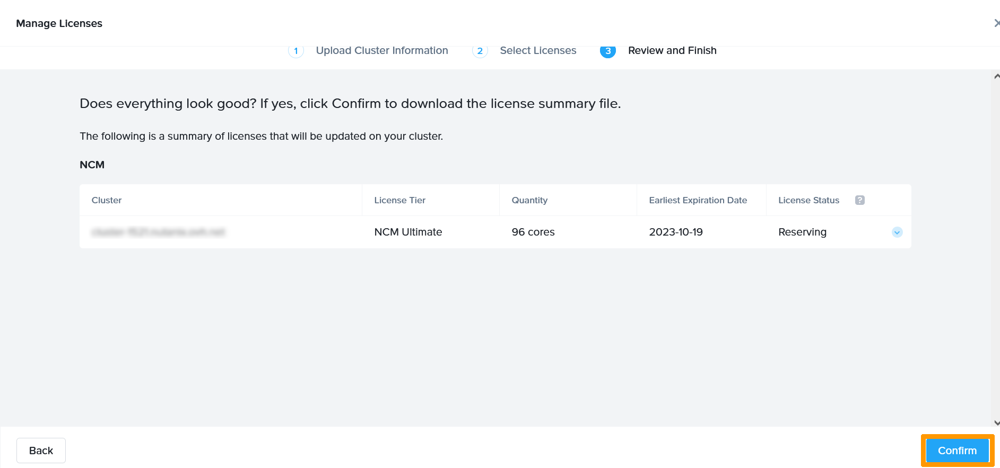{.thumbnail}

Cliquez sur `Enregistrer`{.action} pour sauver le fichier de licence sur votre ordinateur.

{.thumbnail}

Revenez sur sur **Prism Central** dans la gestion des licences et cliquez sur `Upload`{.action} pour installer le fichier de licences. Ce fichier est le fichier **LSF (License Summary File)**.

{.thumbnail}

Sélectionnez le fichier généré et cliquez sur `Ouvrir`{.action}

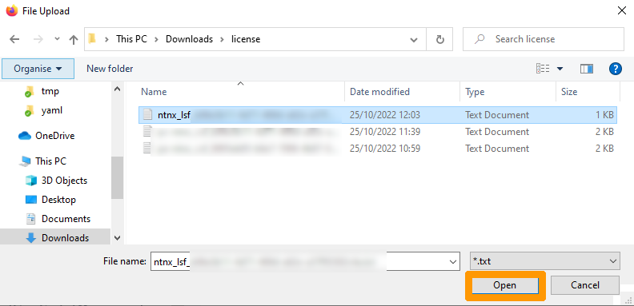{.thumbnail}

Cliquez sur `Apply License`{.action}

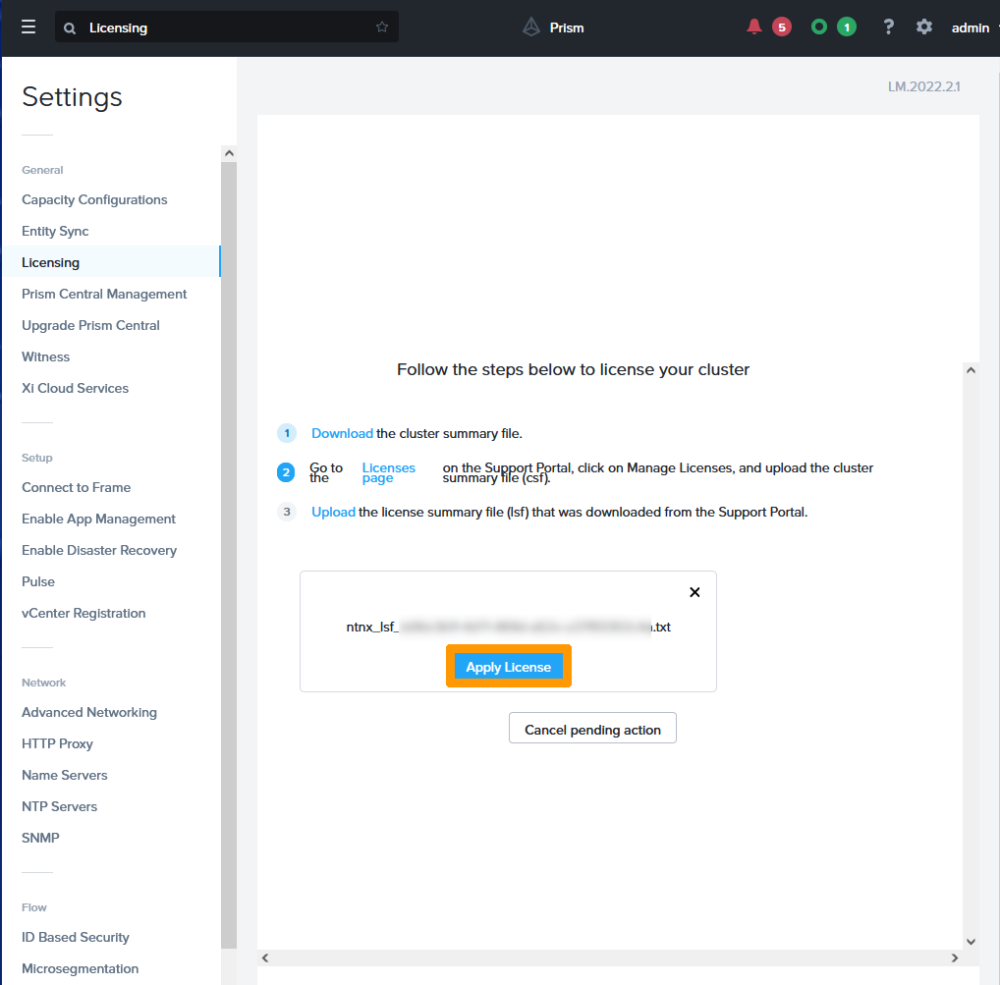{.thumbnail}

La licence est installée sur votre cluster.

### Désinstallation des licences

Il est parfois nécessaire de désinstaller des licences pour les réinstaller sur un autre cluster, si le cluster qui contient les licences est encore disponible vous devez libérer vos licences à partir de **Prism Central**.

Au travers de **Prism Central** cliquez sur `l'engrenage`{.action} en haut à droite pour aller dans les paramètres.

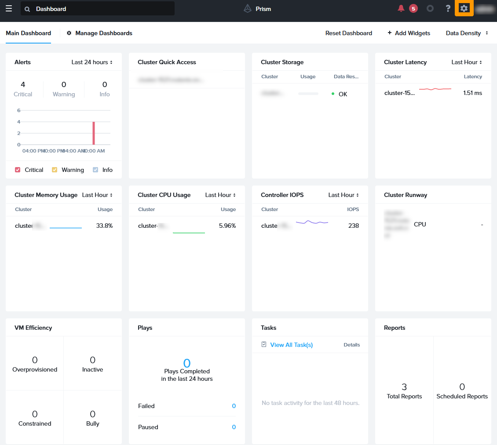{.thumbnail}

Choisissez `Licensing`{.action} à gauche et cliquez sur `Update Licences`{.action}.

{.thumbnail}

Cliquez sur `Download`{.action}.

{.thumbnail}

Cliquez sur `Enregistrer`{.action} pour sauvegarder le fichier **LSF** contenant le résumé des licences sur votre ordinateur.

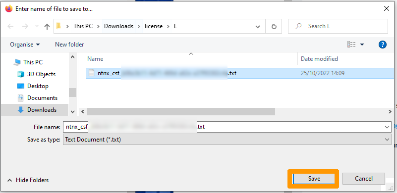{.thumbnail}

Cliquez sur `Licenses page`{.action} pour vous connecter à votre portail de licences **Nutanix**.

{.thumbnail}

Au travers du portail de licences **Nutanix** cliquez sur `Manage Licenses`{.action}.

{.thumbnail}

Cliquez sur `Upload File`{.action}.

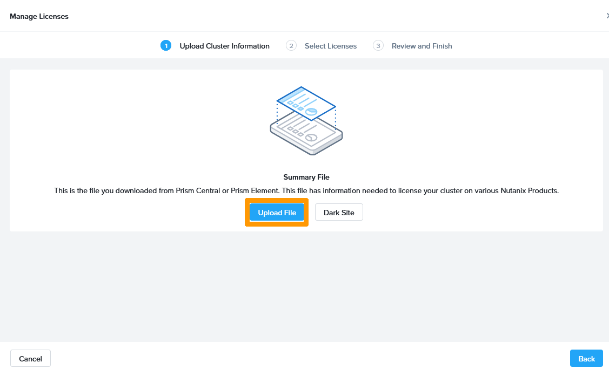{.thumbnail}

Cliquez sur `Ouvrir`{.action}.

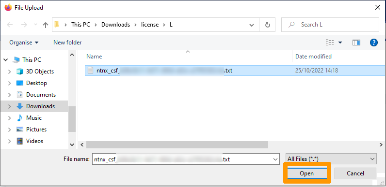{.thumbnail}

Cliquez sur la barre de `défilement`{.action} pour aller au bas de la fenêtre.

{.thumbnail}

Cliquez sur `Unselect License`{.action} dans la rubrique **NCM (Nutanix Cloud Manager)**.

{.thumbnail}

Cliquez sur `Unlicense`{.action}.

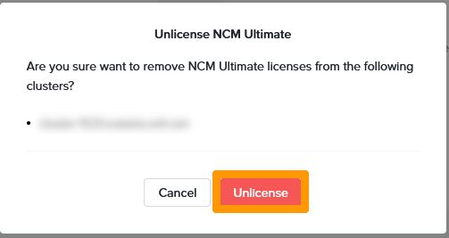{.thumbnail}

La demande de retrait de la licence est prise en charge cliquez sur `Next`{.action}.

{.thumbnail}

CLiquez sur `Confirm`{.action}.

{.thumbnail}

Cliquez sur `Enregistrer`{.action} pour sauvegarder le fichier **LSF** contenant la licence mise à jour sur votre poste.

{.thumbnail}

Revenez dans la gestion des licences sur **Prism Central**. 

Cliquez sur `Upload`{.action}.

{.thumbnail}

Cliquez sur `Ouvrir`{.action} après avoir séléctionné le fichier généré depuis le portail **Nutanix**.

{.thumbnail}

Cliquez sur `Apply License`{.action}

{.thumbnail}

La suppression de la licence est effective.

## Aller plus loin

[Guide de gestion des licences Nutanix](https://portal.nutanix.com/page/documents/details?targetId=Licensing-Guide:lic-lic-manage-manual-c.html)

Échangez avec notre communauté d'utilisateurs sur <https://community.ovh.com/>.
