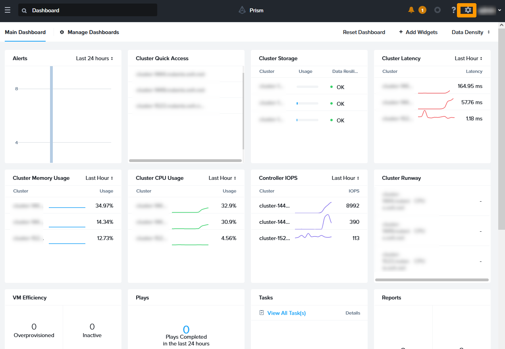
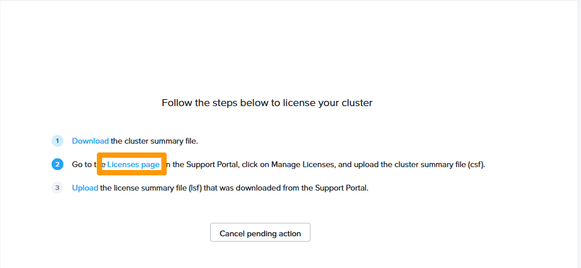

**Dernière mise à jour le 10/10/2022**

## Objectif

Ce document rappelle le fonctionnement d'une solution d'hyperconvergence Nutanix et propose une découverte de l'interface Prim Central et PRISM element.

> [!warning]
> OVHcloud vous met à disposition des services dont la configuration, la gestion et la responsabilité vous incombent. Il vous appartient donc de ce fait d’en assurer le bon fonctionnement.
>
> Ce guide a pour but de vous accompagner au mieux sur des tâches courantes. Néanmoins, nous vous recommandons de faire appel à un prestataire spécialisé si vous éprouvez des difficultés ou des doutes concernant l’administration, l’utilisation ou la mise en place d’un service sur un serveur.
>

## Prérequis

- Le client doit avoir souscrit à l'offre Nutanix BYOL d'OVHcloud.

## Présentation

> [!warning]
>
> OVHcloud propose Nutanix en version BYOL (Bring your Own License) ce qui signifie que les licences du cluster doivent être fournis par le client d'OVHcloud.
> Lorsque le cluster Nutanix est commandé par le client mode BYOL le cluster est livré avec une version d'essai de 90 jours, il faut que le client installe ses licences dans cette période.
>

Il existe trois types de licences :

* Celles pour **Prism Element** : Ces licences s'installent au travers de la console Prism Element.
* Celles pour **Prism Central** : Ces licencs s'install.ent au travers de la console Prism Central
* Celles pour **Les licences Add On** : Ces licences s'installent au travers de la console Prism Element

## En Pratique

### Installation des licences

#### Récuperation des fichiers contenant le résumé des configuration dans un fichier

Avant d'installer des licences sur un cluster Nutanix il faut générer un rapport de configuration du cluster qui contient les informations de licence de votre cluster, il est possible de récupérer toutes ces informations à partir de Prism Central.

Au travers d'interface de **Prism Central** allez dans les paramètres en cliquant sur l'icône en forme d'`engrenage`{.action}.

{.thumbnail}

Cliquez à gauche sur `Licensing`{.action}.

{.thumbnail}

Cliquez à gauche sur `Update Licenses`{.action}.

{.thumbnail}

Cliquez sur `Download`{.action} pour récupérer le fichier contenant les informations sur votre cluster.

{.thumbnail}

Cliquez en haut à droite sur  `Show all downloads`{.action}

{.thumbnail}

Vous trouverez dans vos fichiers téléchargés un document commençant par **ntnx** qui est un résumé de votre configuration, il vous servira pour générer un fichier de licence au travers du portail Nutanix.

{.thumbnail}

### Connexion au portail Nutanix 

Restez dans **Prism Central** sur la page des licences et cliquez sur `Licenses page`{.action}

{.thumbnail}

Le navigateur WEB se lance et vous propose de vous connecter au portail Nutanix.

Saisisissez vos informations d'indentification chez Nutanix et cliquez sur `Log in`{.action}

{.thumbnail}

## Aller plus loin

[Guide de licence Nutanix](https://portal.nutanix.com/page/documents/details?targetId=Licensing-Guide:lic-lic-manage-manual-c.html)

Échangez avec notre communauté d'utilisateurs sur <https://community.ovh.com/>.

