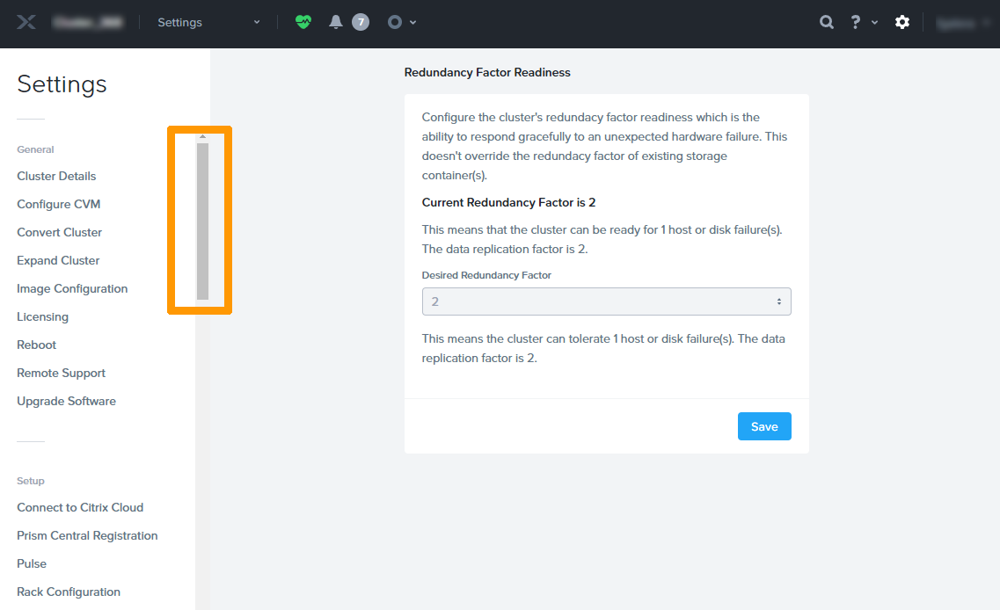

**Dernière mise à jour le 22/02/2022**

## Objectif

Présentation du fonctionnement du stockage 

Modification du facteur de replication 

Création d'un storage container avec des paramètres particuliers

Création d'un volume group.

## Prérequis

Avoir un cluster NUTANIX Opérationnel , être connecté dans Prism Element

## Présentation du fonctionnement du stockage dans un cluster NUTANIX

Lors de la création d'un CLUSTER NUTANIX le système connecte tous les disques des nœuds dans un **Storage Pools** Il est déconseillé d'avoir plusieurs **Storage Pools**

Par défaut le Facteur de réplication est sur 2 et l'on peut passer à 3 si l'on a au minimum 5 noeuds

les données ne sont pas stockées directement dans le **Storage Pools** elle le sont dans des **Storages containers** 

Il existe aussi des **Volume groups** qui donnent la possibilité d'avoir un accès  en ISCSI pour :

* Un ordinateur tier hors du cluster NUTANIX.
* de VM qui auraient besoin d'un stockage commun pour faire du clustering comme par exemple Microsoft SQL Server.

## En pratique

### Modification du **facteur de réplication** 

Cliquer sur l'engrenage dans la sélection

Faire défiler Settings à l'aide de l'ascenseur dans la sélection jusqu'au plus bas

Dans la sélection de gauche se positionner sur **Redondancy state** 

Dans la sélection de droite se positionner sur **Desired redondancy factor** remplacer 2 par 3 et faire Save *Cette opération n'est possible que si l'on a au minimum 5 nœuds

Il faut un certain temps pour que les données se trouvent sur 3 nœuds

### Création d'un  **Storage containers**

Dans la menu choisir la sélection Storage

Dans la sélection de gauche être positionné sur Storage container

Cliquer sur le signe plus à coté de Storage Container dans la sélection de droite

### Création d'un volume group

## Aller plus loin

Lien vers la documentation NUTANIX concernant le stockage [Stockage NUTANIX](https://portal.nutanix.com/page/documents/details?targetId=Web-Console-Guide-Prism-v5_20:wc-storage-management-wc-c.html)

Lien sur les licences NUTANIX [https://www.nutanix.com/products/software-options](https://www.nutanix.com/products/software-options)

Lien vers la présentation d'un cluster NUTANIX [<https://docs.ovh.com/fr/nutanix/nutanix-hci/>](<https://docs.ovh.com/fr/nutanix/nutanix-hci/>])

Échangez avec notre communauté d'utilisateurs sur <https://community.ovh.com/>.
