**Dernière mise à jour le 28/02/2022**

## Objectif

Connaitre la gestion des ordinateurs virtuels dans un cluster Nutanix et être capable de créer, et migrer un ordinateur virtuel.

> [!warning]
> OVHcloud vous met à disposition des services dont la configuration, la gestion et la responsabilité vous incombent. Il vous appartient donc de ce fait d’en assurer le bon fonctionnement.
>
> Ce guide a pour but de vous accompagner au mieux sur des tâches courantes. Néanmoins, nous vous recommandons de faire appel à un prestataire spécialisé si vous éprouvez des difficultés ou des doutes concernant l’administration, l’utilisation ou la mise en place d’un service sur un serveur.
>
> Certains logiciels nécessitent une licence comme les produits Microsoft il faudra alors s'assurer que tous les systèmes et logiciels installés possèdent ces licences.

## Prérequis

- Disposer d'un cluster Nutanix dans votre compte OVHcloud
- Être connecté à votre [espace client OVHcloud](https://www.ovh.com/auth/?action=gotomanager&from=https://www.ovh.com/fr/&ovhSubsidiary=fr)
- Être connecté à Prism Central sur le cluster

## Présentation de la gestion des ordinateurs virtuels dans Prism Central

Le système Nutanix utilise les mêmes interfaces pour gérer le stockage et la virtualisation, il peut être installé avec plusieurs hyperviseurs (*Hyperv, Vmware Esxi , Ahv*). *Ahv* est fourni avec Nutanix sans devoir acheter de licences supplémentaires pour l'hyperviseur. 

L'offre d'OVHcloud est fournie avec l'hyperviseur *Ahv*.

*Ahv* permet :

* L'utilisation d'ordinateurs virtuels sous Windows et Linux.
* La migration d'ordinateurs virtuels d'un nœud à l'autre d'un cluster.
* La micro-segmentation réseau des VM au travers de **Flow**. 

L'outil **Move** permet de migrer facilement des VM existantes d'autres environnements virtuels vers Nutanix et son hyperviseur *Ahv*.

Pour plus de détails sur *Ahv* reportez-vous à la section « [Aller plus loin](#gofurther) » de ce guide.

## En pratique

Dans les cas pratiques nous allons voir comment créer un ordinateur virtuel pour Windows, installer le système d'exploitation Windows et migrer un ordinateur virtuel d'un nœud à l'autre du cluster.

### Création d'une Ordinateur virtuel pour un système d'exploitation Windows

L'installation d'un ordinateur virtuel sous Windows nécessite un paramétrage particulier car Microsoft ne fournit pas le pilote pour le contrôleur de disques.

Lancement de l'installation de Windows Server 2022

Dans **Prism Central** dans le menu de gauche dépliez `Compute & Storage`{.action} et cliquez sur `VMs`{.action}

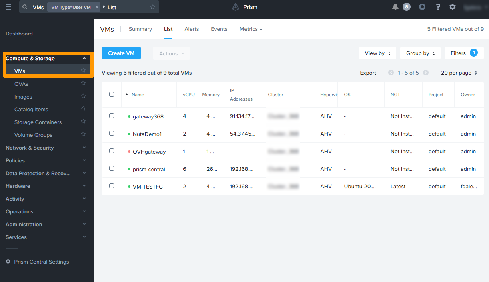{.thumbnail}

Cliquez sur `Create VM`{.action}

{.thumbnail}

Saisissez un nom dans `Name`{.action}, Choisissez les options dans dans `VM Properties`{.action} et cliquez sur `Next`{.action}

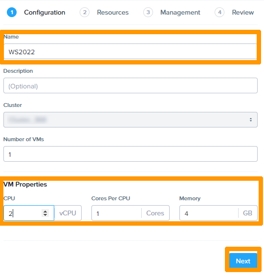{.thumbnail}

Ajout d'un disque système.

Cliquez sur `Attach Disk`{.action}

{.thumbnail}

Saisissez dancs capacity `60`{.action} et cliquez sur `Save`{.action} pour créer un disque de 60 Go.

{.thumbnail}

Ajout de 'image ISO de l'installation de Windows Server 2022.

L'image doit avoir été importée avant l'utilisation dans un nouvel ordinateurs virtuel.

Pour plus de détails sur *L'importation d'images* reportez-vous à la section « [Aller plus loin](#gofurther)

Cliquez sur `Attach Disk`{.action}.

{.thumbnail}

Changez ces paramètres `Type`{.action} en **CD-ROM** `Operation`{.action} en **Clone from Image** , `Image`{.action} en **WS2022EN.ISO**.

et cliquez sur `Save`{.action}

{.thumbnail}

Ajout de l'image ISO contenant les pilotes spécifiques à *Ahv* notamment le pilote du contrôleur de disques. Cette image aussi doit être importée au préalable.

Cliquez `Attach Disk`{.action}

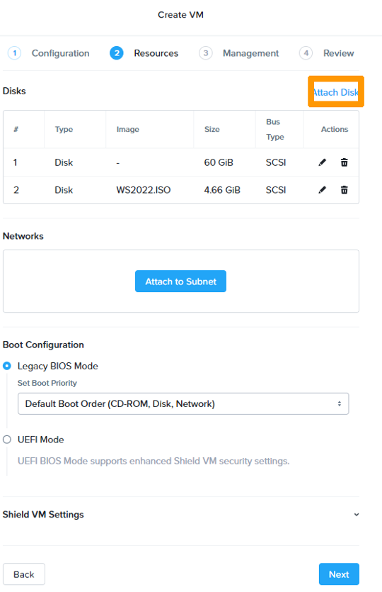{.thumbnail}

Changez ces paramètres `Type`{.action} en **CD-ROM** `Operation`{.action} en **Clone from Image** , `Image`{.action} en **virtio-win-0.1.126.iso**

Cliquez sur `Save`{.action}

{.thumbnail}

Configuration du réseau.

Cliquez sur `Attach Subnet`{.action}.

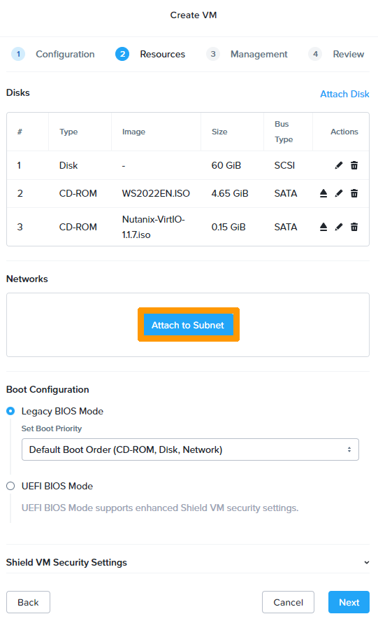{.thumbnail}

Laissez tel quel et cliquez sur `Save`{.action}.

{.thumbnail}

Cliquez sur `Next`{.action}.

{.thumbnail}

Dans timezone choisissez le fuseau horaire de votre pays. `zone`{.action} et cliquez sur `Next`{.action}.

{.thumbnail}

Cliquez sur `Create VM`{.action}

{.thumbnail}

L'ordinateur virtuel nouvellement créé apparait dans le tableau de bord.

{.thumbnail}.
 
### Installation de Windows Server 2022

Sélection de l'ordinateur virtuel sur lequel Windows Server 2022 sera installé. 

Cliquez sur la `Case à cocher à coté de l'ordinateur virtuel à gauche`{.action}.

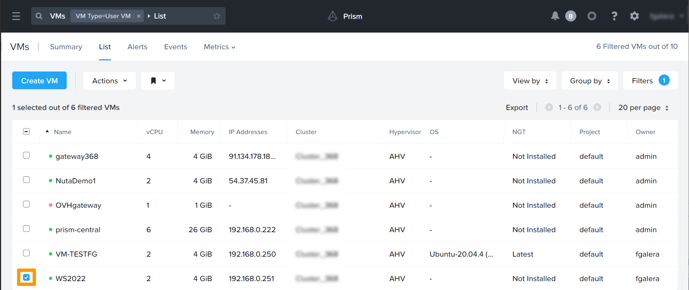{.thumbnail}

Démarrage de l'ordinateur virtuel.

Cliquez sur `Menu action`{.action} et Cliquez sur `Power ON`{.action}

{.thumbnail}

Lancement de la console.

Cliquez sur `Menu action`{.action} et Cliquez sur `Launch Console`{.action}

{.thumbnail}

Lancement de l'installation .

Choisissez vos paramètres régionaux et Cliquez sur `Next`{.action}

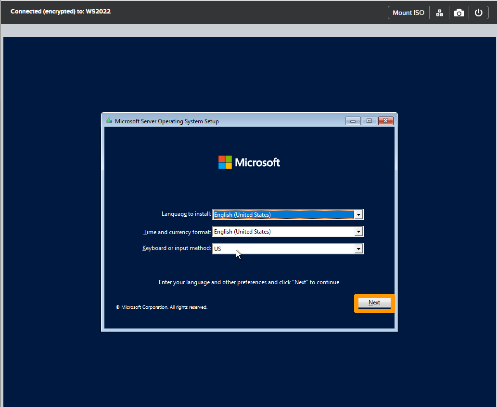{.thumbnail}

Cliquez sur `Install now`{.action}.

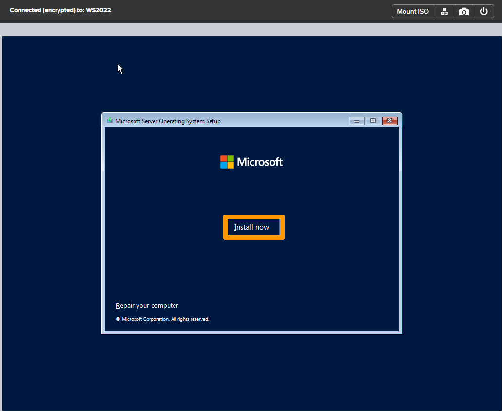{.thumbnail}

Cliquez sur `Windows Server 2022 Standard (Desktop Experience)`{.action} 

Ensuite Cliquez sur `Next`{.action}.

{.thumbnail}

Séléctionnez `I accept etc...`{.action} et cliquez sur `Next`{.action}.

{.thumbnail}

Cliquez sur `Load driver`{.action}.

{.thumbnail}

Cliquez sur `Browse`{.action}.

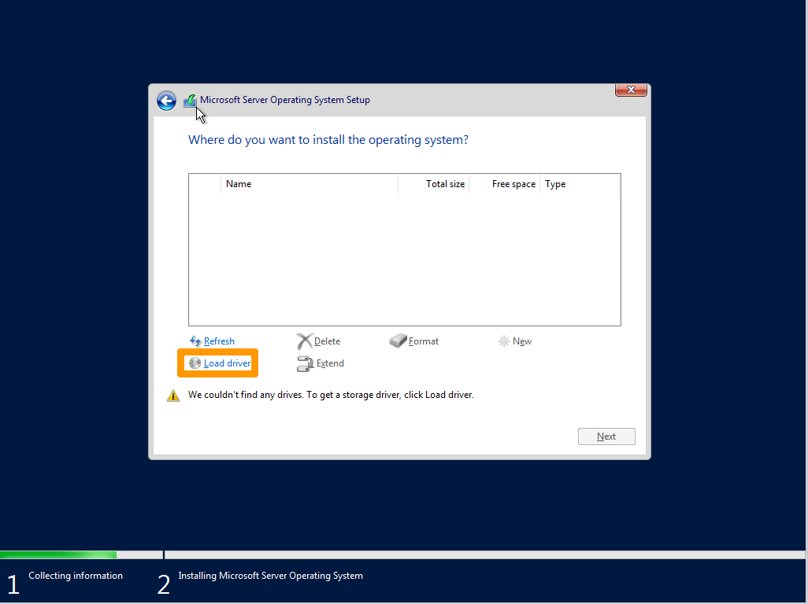{.thumbnail}

Selectionnez le bon dossier `e:\vioscsi\2k16\amd64`et cliquez sur `OK`{.action}.

{.thumbnail}

Selectionnnez `Red Hat VirtIO SCSI etc..`{.action}Cliquez sur `Next`{.action}.

{.thumbnail}

Le disque de 60 Gb apparait, cliquez sur `Next`{.action}.

{.thumbnail}

Attendre la fin de l'installation.

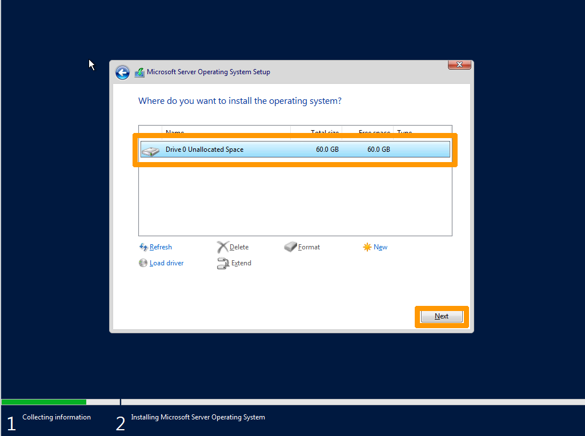{.thumbnail}

{.thumbnail}

{.thumbnail}

Saisissez le mot de passe dans `Password`{.action} et `Reenter password`{.action}.

Ensuite Cliquez sur `Finish`{.action}.

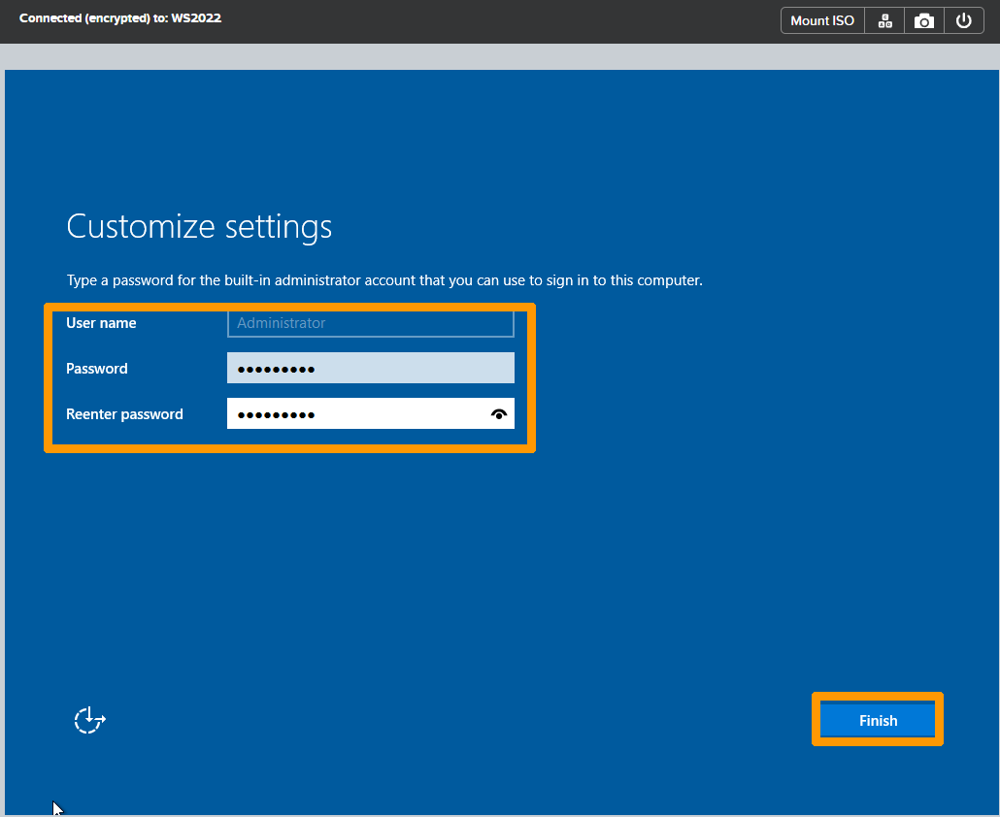{.thumbnail}

Allez dans le gestionnaire de périphérique pour installer le pilote de la carte réseau et un pilote système spécifique à **Ahv**.

Faites `Clic droit sur Ethernet Controller`{.action} et cliquez sur `Update Driver`{.action}.

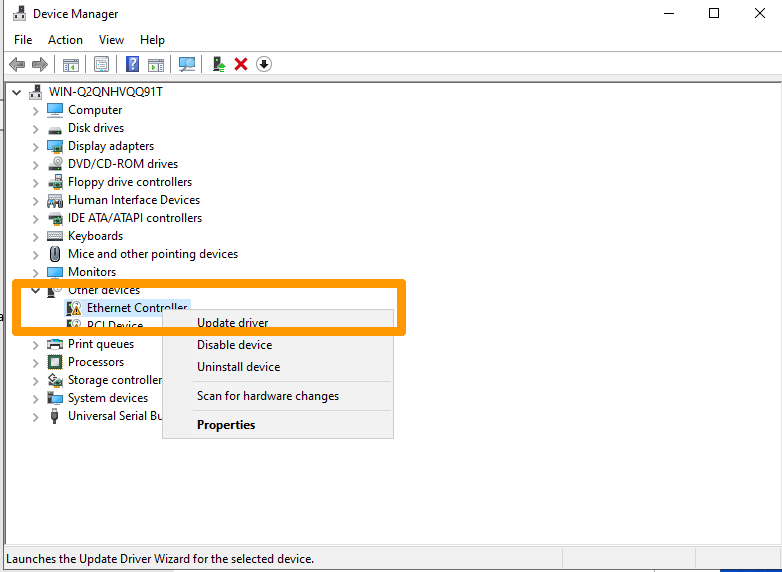{.thumbnail}

Selectionnez le dossier **E:\NetKVM\2k16\amd64** et cliquez sur `Next`{.action}.

{.thumbnail}

Cliquez sur `Install`{.action}.

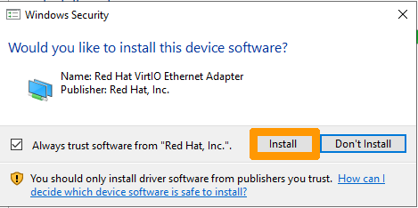{.thumbnail}

Faites `Clic droit sur PCI Device dans Other Devices`{.action} et cliquez sur `Update Driver`{.action}.

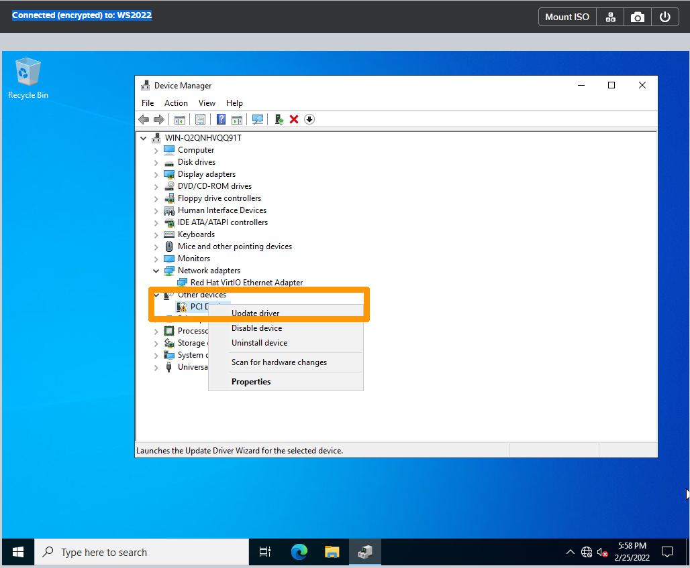{.thumbnail}

Selectionnez le dossier **E:\Balloon\2k16\amd64** et cliquez sur `Next`{.action}.

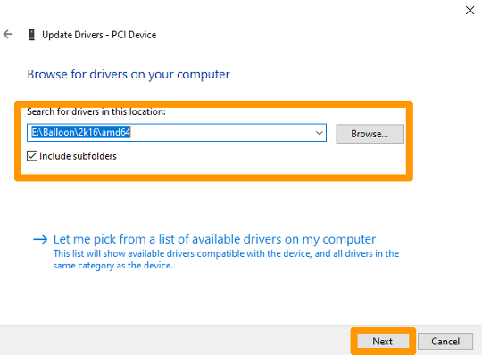{.thumbnail}

Pour finir l'installation Cliquez sur `Close`{.action}.

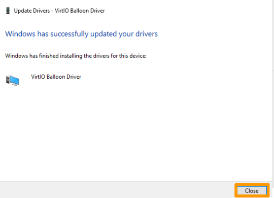{.thumbnail}

Maintenant que l'installation du système d'exploitation et des pilotes spécifiques à **Ahv** sont terminées il faut installer les **Ngt (Nutanix Guest TOOLS)** qui permettent une meilleure intéraction avec Nutanix notamment au niveau des sauvegardes et des Snapshots.

Avant de lancer l'installation des **Ngt** s'assurer que sur l'ordinateur virtuel concerné un lecteur de CDROM est déconnecté.

Lancez la console de l'ordinateur virtuel et Faites un `click droit sur un lecteur de CDROM`{.action} et Cliquez sur `Eject`{.action}.

{.thumbnail}

Revenez dans Prism Central `Selectionnez l'ordinateur virtuel`{.action}.

{.thumbnail}

Cliquez dans le menu `Actions`{.action} et cliquez `Install NGT`{.action}.

{.thumbnail}

Dans la fenêtre Install NGT cliquez sur `Confirm & Enter Password`{.action}.

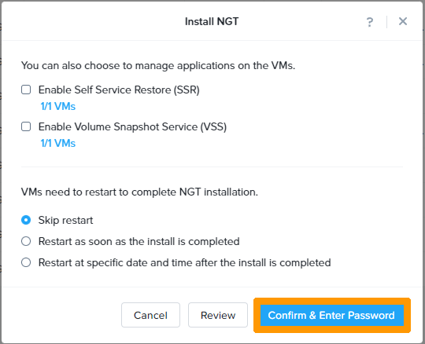{.thumbnail}

Dans la deuxième Fenêtre Install NGT cliquez sur `Skip and Mount`{.action}.

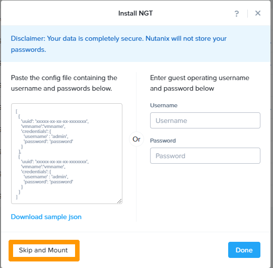{.thumbnail}

Revenez dans la console de l'ordinateur virtuel et faites `click droit le lecteur de CDROM`{.action}. contenant les **Ngt**

Choisir `Install Nutanix Guest Tools`{.action}.

{.thumbnail}

Choisir `I agree to the Etc...`{.action} et cliquez sur `Install`{.action}.

{.thumbnail}

L'installation se lance.

{.thumbnail}

A la fin de l'installation cliquez sur `Close`{.action}.

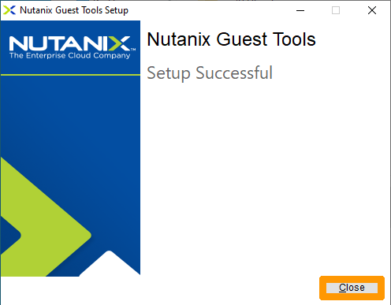{.thumbnail}

L'installation d'un ordinateur virtuel sous Windows est entierement terminée.

### Migration d'un ordinateur virtuel.

La migration d'un ordinateur virtuel consiste à déplacer une ordinateur virtuel à chaud d'un nœud à l'autre d'un cluster.

Dans la gestion des ordinateurs virtuels de Prism Central cliquez sur `WS2022N`{.action}.

{.thumbnail}

Dans la nouvelle fenêtre, à coté de Host le nom du nœud sur lequel l'ordinateur virtuel fonctionne actuellement est affiché comme ici *NTNX-221060034-A*

 {.thumbnail}

Cliquez dans le menu `More`{.action} et choisissez `Migrate`{.action}

 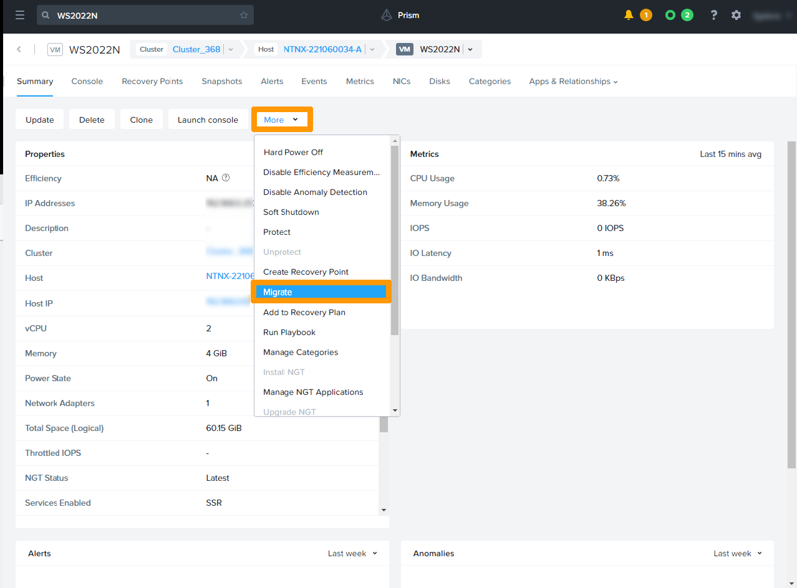{.thumbnail}

Choisissez un nœud dans `Host`{.action}

{.thumbnail}

le nom du nœud est changé dans Host quand la migration est terminée

{.thumbnail}

## Aller plus loin 

[Présentation d'un cluster Nutanix](https://docs.ovh.com/fr/nutanix/nutanix-hci/)

[Importation d'images dans Nutanix](https://docs.ovh.com/fr/nutanix/image-import)

[Documentation Nutanix sur Ahv](https://portal.nutanix.com/page/documents/details?targetId=AHV-Admin-Guide-v5_20:AHV-Admin-Guide-v5_20)

[Les licences Nutanix](https://www.nutanix.com/products/software-options)

Échangez avec notre communauté d'utilisateurs sur <https://community.ovh.com/>.