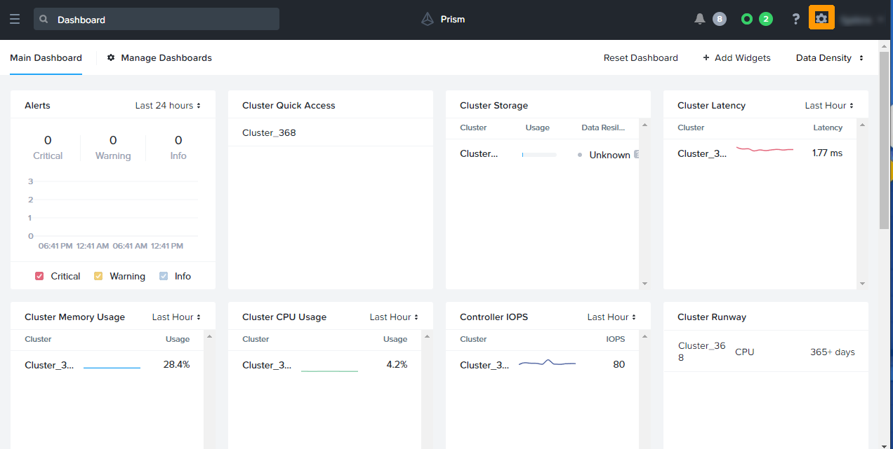
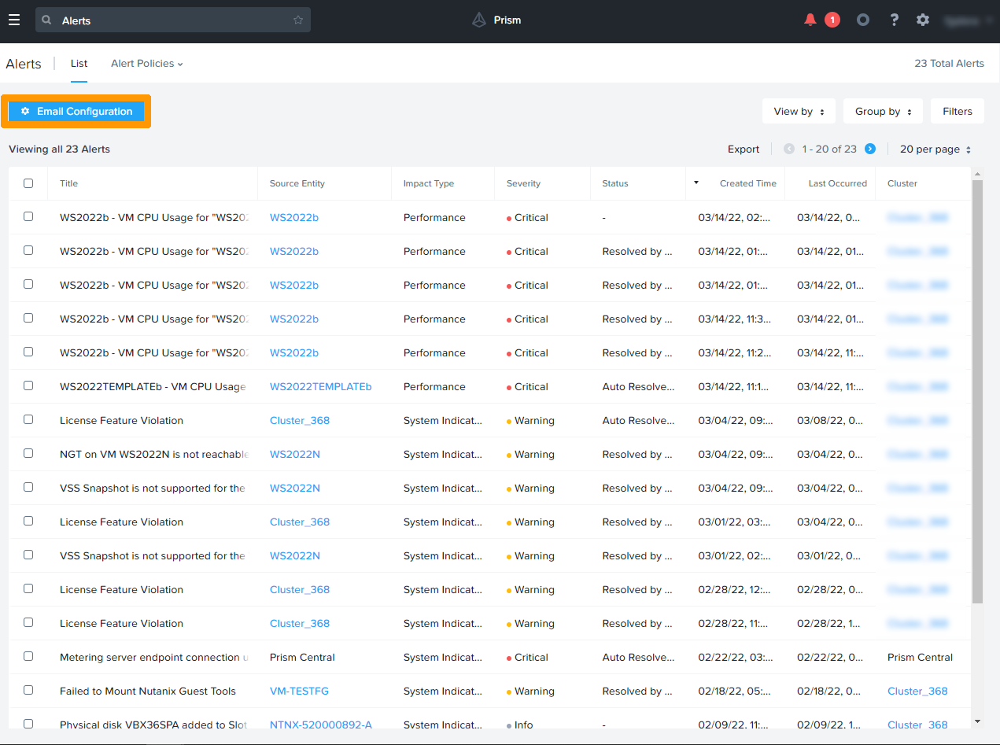
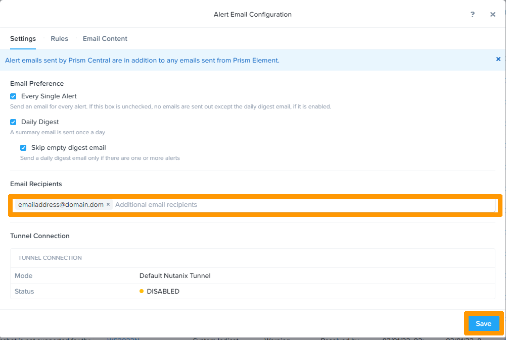

**Dernière mise à jour le 14/03/2022**

## Objectif

Ce guide montre comment consulter les alertes et les événements ainsi que de créér des alertes personnalisées.

> [!warning]
> OVHcloud vous met à disposition des services dont la configuration, la gestion et la responsabilité vous incombent. Il vous appartient donc de ce fait d’en assurer le bon fonctionnement.
>
> Ce guide a pour but de vous accompagner au mieux sur des tâches courantes. Néanmoins, nous vous recommandons de faire appel à un prestataire spécialisé si vous éprouvez des difficultés ou des doutes concernant l’administration, l’utilisation ou la mise en place d’un service sur un serveur.
>
> Certaines options comme l'utilisation de la compression ou de la déduplication nécessitent des licences particulières fournies par Nutanix au travers d'OVHcloud, nous vous invitons à vous renseigner auprès du service commercial OVHcloud pour plus d'informations.

## Prérequis

- Disposer d'un cluster Nutanix dans votre compte OVHcloud
- Être connecté à votre [espace client OVHcloud](https://www.ovh.com/auth/?action=gotomanager&from=https://www.ovh.com/fr/&ovhSubsidiary=fr)
- Être connecté sur le cluster via Prism Central

## Gestion des alertes et des événements dans Prism Central

Toutes les actions manuelles ou automatiques sont enregistrées dans les évenements

Les alertes se déclenchent toutes seules lorsque quelque chose d'anormal survient comme par exemple l'utilisation excessif de processeurs sur une machine virtuelle. 

Il est possible d'ajouter des alertes personnalisées pour augmenter la sensibilité sur un élément du cluster.

Les alertes peuvent être envoyées à des destinataires au travers de la messagerie éléctronique.

les tâches lancées sont aussi visibles dans la console Prism Central avec le résultat de la demande 

## En pratique

### Configuration du serveur SMTP dans Prism Central

Pour pouvoir envoyer les alertes venant de Prism Central Il faut configurer un serveur SMTP, attention ce ne sont pas les mêmes alertes que celles de Prism ELEMENT.

Cliquez sur `Icône Engrenage`{.action} en haut à droite de l'interface Prism Element pour afficher les alerts.

{.thumbnail}

dans le menu de droite cliquez sur `SMTP Server`{.action}.

Saisissez sur les paramètres d'envoi du serveur SMTP et cliquez sur `Save`{.action}.

{.thumbnail}

### Gestion des alertes 
Cliquez dans le menu principale en haut à gauche

Dans le menu, sélectionnez `Alerts`{.action}.

{.thumbnail}

La liste des alertes apparait et il est possible de choisir des destinataires en cliquant sur `Email Configuration`{.action}

{.thumbnail}

Saisissez les noms des destinataires dans la zone de saisie `Email Recipients`{.action} et cliquez sur `Save`{.action}

{.thumbnail}

#### Création d'une alerte personnalisée

Pour créer une alerte personnalisée

Cliquez sur `Alerts Policies`{.action} et selectionnez `User Defined`{.action}

{.thumbnail}

dans la sélection de gauche Sélectionnez ce que vous voulez surveillez comme ci dessous l'utilisation du processeur sur une seule machine virtuelle.

Ensuite en haut à droite modifier les paramètres **Behavioral Anormaly** {.action} en cochant `Every time there is an anormaly, alert`{.action}. et en Choisissant `Critical`{.action}.

Au  milieu à droite modifier les paramètres **Static threshold** {.action} en cochant `Alert Critical if`{.action}. et en Choisissant `supérieur à 60%`{.action}.

Valider la création de l'alerte en cliquant en bas à droite sur `Save`{.action}

{.thumbnail}

L'alerte créée apparait dans la liste

{.thumbnail}

#### Résoudre une alarme

Lorqu'un alarme est déclenchée un rond rouge à droite à parait à coté d'une flêche, cette alerte sera supprimée au bout de 180 minutes si elle a disparue mais il est possible de faire une résolution manuelle.

Cliquez sur le `rond rouge numéroté`{.action}.

{.thumbnail}

L'alarme déclanchée apparait.

{.thumbnail}

Sélectionnez la machine virtuelle en et cliquez sur `Resolve`{.action}

{.thumbnail}

L'alarme est résolue

{.thumbnail}

#### Affichage des alertes

#### Création d'un alerte personnalisée

## Aller plus loin 

[Présentation d'un cluster Nutanix](https://docs.ovh.com/fr/nutanix/nutanix-hci/)

Échangez avec notre communauté d'utilisateurs sur <https://community.ovh.com/>.
