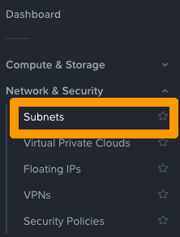
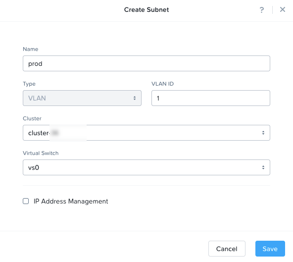

**Dernière mise à jour le 11/01/2022**

## Objectif

Une fois livré, un cluster Nutanix contient deux différents types de machines de gestion :

- VM, 1 CVM par noeud plus Prism Central
- Serveurs physiques (noeuds)

Afin d’augmenter la sécurité des machines de gestion, il est recommandé de les isoler de l’environnement de production.

**Ce guide vous explique comment isoler des machines de gestion pour améliorer la sécurité.**

> [!warning]
> OVHcloud vous met à disposition des services dont la configuration, la gestion et la responsabilité vous incombent. Il vous appartient donc de ce fait d’en assurer le bon fonctionnement.
>
> Ce guide a pour but de vous accompagner au mieux sur des tâches courantes. Néanmoins, nous vous recommandons de faire appel à un prestataire spécialisé si vous éprouvez des difficultés ou des doutes concernant l’administration, l’utilisation ou la mise en place d’un service sur un serveur.
>

## Prérequis

- Disposer d'un Cluster Nutanix dans votre compte OVHcloud

## En pratique

### Etape 1

Connectez-vous à l'interface web Prism Central.

Rendez-vous dans le menu `Network & Security`{.action} et ouvrez `Subnets`{.action}.

{.thumbnail}

### Etape 2

Dans cet exemple, le VLAN 0 est associé au sous-réseau « base » du switch virtuel « vs0 ».

Afin d'isoler le réseau de gestion, vous pouvez par exemple utiliser un nouveau sous-réseau dans le VLAN 1.

Pour ce faire, cliquez sur `Create Subnet`{.action}.

{.thumbnail}

Donnez un nom à votre réseau, puis choisissez un VLAN ID, un cluster et le switch virtuel « vs0 ».

{.thumbnail}

## Aller plus loin

Échangez avec notre communauté d'utilisateurs sur <https://community.ovh.com/>.
