**Dernière mise à jour le 07/04/2022**

## Objectif

Connaitre et utiliser Nutanix Flow pour la sécurisation du réseau au sein d'un cluster Nutanix.

> [!warning]
> OVHcloud vous met à disposition des services dont la configuration, la gestion et la responsabilité vous incombent. Il vous appartient donc de ce fait d’en assurer le bon fonctionnement.
>
> Ce guide a pour but de vous accompagner au mieux sur des tâches courantes. Néanmoins, nous vous recommandons de faire appel à un prestataire spécialisé si vous éprouvez des difficultés ou des doutes concernant l’administration, l’utilisation ou la mise en place d’un service sur un serveur.
>

## Présentation de de **Nutanix Flow**

Cette option est disponible dans toutes les offres **Hosted Private Cloud Powered by Nutanix**. Elle permet de protéger le réseau au sein d'un ou plusieurs clusters Nutanix gérés par **Prism Central**.

Il est possible :

* de mettre en quarantaine des machines virtuelles de manière stricte sans laisser la possibilité d'avoir accès au réseau ou d'une manière moins stricte en permettant l'accès à des outils de diagnostics disponibles sur d'autres machines virtuelles.
* D'isoler des machines virtuelles entre elles.
* D'autoriser l'accès partiel à certaines machines virtuelles au travers de règles d'applications.
* De bloquer l'accès à certaines machines virtuels pour du **VDI** avec des comptes ou des groupes d'un annuaire **Active directory**. 

## En pratique

Connectez-vous à **Prism Central**.

Pour plus d'informations sur la connexion au cluster reportez-vous à la section « [Aller plus loin](#gofurther) » de ce guide. 

### Activation de **Nutanix Flow**

Cliquez sur l'icône `engrenage`{.action} en haut à droite pour modifier les paramètres.

{.thumbnail}

Faites défiler la `barre de défilement`{.action} à gauche et cliquez sur `Microsegmentation`{.action}.

{.thumbnail}

Cliquez sur la `case à cocher`{.action} à gauche de **Enable Microsegmentation** et cliquez sur `Save`{.action}.

{.thumbnail}

La micro-segmentation est activée. Il est possible de la désactiver.

{.thumbnail}

### Configuration des catégories 

Une catégorie est un objet qui peut contenir une ou plusieurs valeurs, certaines catégories sont présentes lors de l'installation de **Prism Central** et il est possible de créer de nouvelles catégories.

Les catégories permettent de faciliter la gestion d'un cluster Nutanix, il est possible de les affecter à des entités comme des machines virtuelles, des sous réseaux ou des images pour ensuite les utiliser dans des outils comme **Flow** par exemple.

#### Création d'une catégorie

Nous allons créer une Catégories **Special Computers** avec une valeur nommée **Antivirus**.

Au travers du menu principal cliquez sur `Categories`{.action} dans le sous menu `Administration`.

{.thumbnail}

Cliquez sur `New Category`{.action}.

{.thumbnail}

Saisissez le nom de la catégorie dans `Name`{.action} ensuite cliquez sur `New value`{.action}.

{.thumbnail}

Saisissez un nom dans `Value`{.action} et cliquez sur le `bouton bleu`{.action} à droite. 

{.thumbnail}

Cliquez sur `Save`{.action} 

{.thumbnail}

La nouvelle catégorie apparait dans la liste des catégories

{.thumbnail}

#### Modification d'une catégorie

Sélectionnez la catégorie `Special-Computers`{.action}

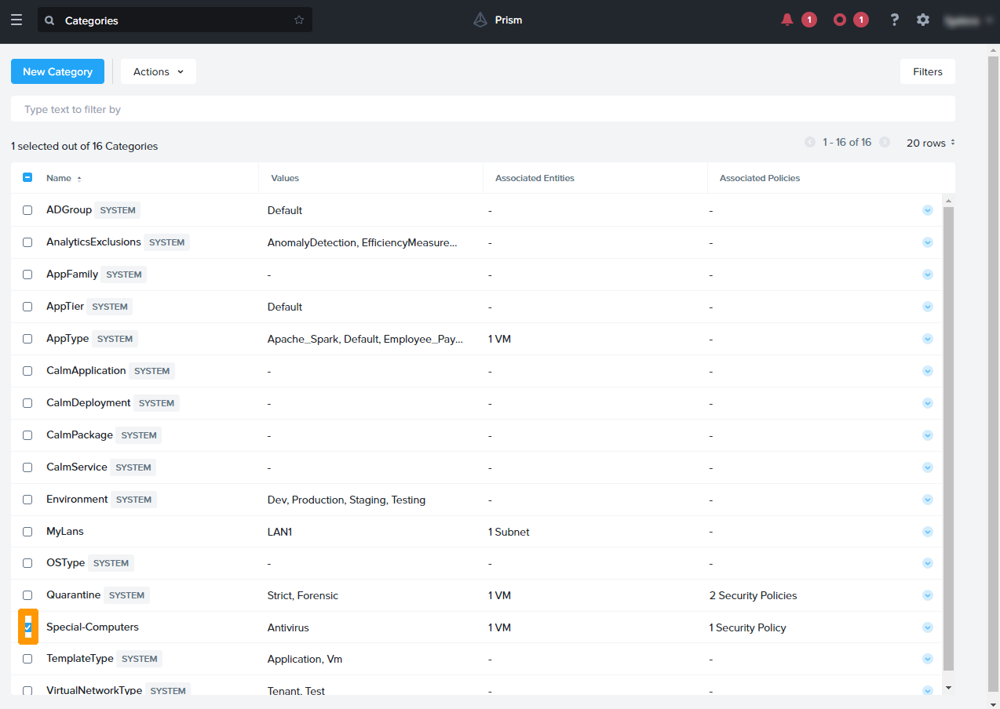{.thumbnail}

Cliquez sur `Update`{.action} dans le menu `Actions`{.action}

{.thumbnail}

Cliquez sur `New value`{.action}

{.thumbnail}

saisissez une valeur dans la `colonne Values`{.action} ensuite cliquez sur l'icône de validation.

{.thumbnail}

Cliquez sur `New value`{.action}

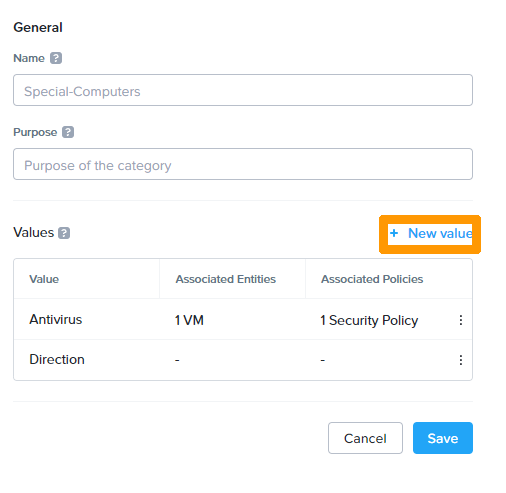{.thumbnail}

saisissez une autre valeur dans la `colonne Values`{.action} ensuite cliquez sur l'icône de validation.

{.thumbnail}

Cliquez sur `Save`{.action} pour valider la modification de la valeur.

{.thumbnail}

La catégorie est visible dans le tableau de bord des catégories avec ces deux nouvelles valeurs.

{.thumbnail}

#### Affectation d'une catégorie à une machine virtuelle

Allez dans le `Menu Principal`{.action} et cliquez sur `VMs`{.action} sous `Compute & Storage.`

{.thumbnail}

`Sélectionnez`{.action} la machine virtuelle à gauche 

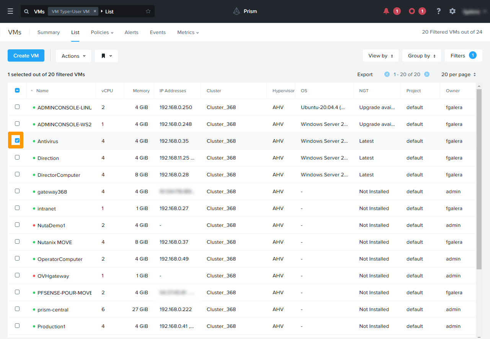{.thumbnail}

Cliquez sur `Actions`{.action} et choisissez `Manage Categories`{.action}. dans le menu

{.thumbnail}

Saisissez `le nom de la catégorie et de sa valeur` ensuite cliquez sur le bouton `+`{.action}

{.thumbnail}

Cliquez sur `Save`{.action} pour enregistrer la machine virtuelle dans une catégorie.

{.thumbnail} pour que la machine virtuelle soit membre de cette catégorie.

#### Affectation d'une catégorie à plusieurs machines virtuelles

Sélectionnez trois machines virtuelles en utilisant les `cases à cocher à leurs gauches`{.action}.

{.thumbnail}

Cliquez sur le menu `Actions`{.action} et selectionnez `Manage Categories`{.action}.

{.thumbnail}

Saisissez le nom de votre valeur dans la `zone de saisie`{.action} et cliquez sur le bouton `+`{.action}.

{.thumbnail}

Cliquez sur `Save`{.action}

{.thumbnail}

#### Affectation d'une catégorie à des sous réseaux

Nous allons voir comment affecter une sous catégorie à un réseau ou plusieurs sous réseaux

Allez dans le `Menu Principal`{.action} et cliquez sur `Subnets`{.action} sous `Network & Security`

{.thumbnail}

Sélectionnez les `sous réseaux`{.action} en cliquant sur les case à cocher à gauche 

{.thumbnail}

Cliquez sur le menu `Actions`{.action} et selectionnez `Manage Categories`{.action}.

{.thumbnail}

Saisissez `NOMCATEGORIE:VALEUR`{.action} et cliquez sur le signe `+`{.action}.

{.thumbnail}

Cliquez sur `Save`{.action}

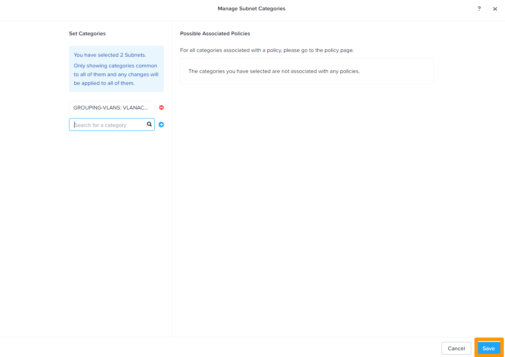{.thumbnail}

### Gestion de la quarantaine réseau.

#### Mise en quarantaine d'une VM

La quarantaine est utilisable avec les options par défaut si la micro-segmentation est active. Elle peut s'appliquer à une ou plusieurs machines virtuelles.

Allez dans le `Menu Principal`{.action} et cliquez sur `VMs`{.action} sous `Compute & Storage.`

{.thumbnail}

`Sélectionnez`{.action} la machine virtuelle à gauche ensuite 

{.thumbnail}

Cliquez sur `Actions`{.action} et choisissez `Quarantine VMs`{.action} dans le menu.

{.thumbnail}

Choisissez `Forensic`{.action} dans `quarantine Method` et cliquez sur `Quarantine`{.action}.

{.thumbnail}

La machine virtuelle est en quarantaine.

#### Personnalisation de la quarantaine réseau.

Pour l'instant la machine virtuelle mise en quarantaine n'est pas bloquée, suivez ces instructions pour configurer la quarantaine.

A partir du menu principal cliquez sur `Security Policies`{.action} dans le sous menu `Network & Security`.

{.thumbnail}

Cliquez sur le `numéro`{.action} à coté de `Quarantined` pour voir les machines virtuelles en quarantaine.

{.thumbnail}

La liste des machines virtuelles en quarantaine apparait dans `Name` cliquez sur `Close`{.action} pour revenir au menu précèdent.

{.thumbnail}

Cliquez sur `Quarantine`{.action} en dessous de Name à gauche pour modifier la règle.

{.thumbnail}

Le statut de la règle est en mode `Monitoring ` comme indiqué en haut à gauche. 

Le trafic n'est pas bloqué mais surveillé. Les connexions entre les machines virtuelles mises en quarantaines et le reste du réseau sont représentées par des traits de couleurs orange reliés à des rectangles représentant l'adresse IP de source ou de destination.

Cliquez sur `Enforce`{.action} en haut à droite pour passer du mode **Monitoring** au mode **Enforcing** avec blocage du trafic.

{.thumbnail}

Saisissez `ENFORCE`{.action} et cliquez sur `Confirm`{.action}.

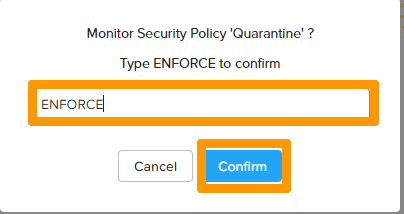{.thumbnail}

Le statut de la règle est maintenant sur `Enforced` 

Le trafic est bloqué et il est possible de voir les tentatives d'accès aux machines virtuelles en quarantaines avec des fenêtres et des liens de couleur rouge.

Il est possible de modifier la règle de quarantaine pour autoriser certains flux.

Cliquez sur Cliquez sur `Update`{.action} en haut à droite pour modifier la règle.

{.thumbnail}

Cliquez sur `Next`{.action}

{.thumbnail}

Positionnez la souris sur une règle de blocage entrante et cliquez sur `Allow Traffic`{.action}

{.thumbnail}

Cliquez sur la `case à cocher`{.action} à gauche de la règle pour Sélectionner le trafic découvert entrant. Ensuite cliquez sur `Allow 1 Discovered Traffic`{.action}.
Cette action n'autorise que le trafic spécifique découvert dans cet exemple c'est le protocole ICMP sur le ping, le reste du trafic venant de cette machine virtuelle sera bloqué.

{.thumbnail}

Positionez la souris sur une règle de blocage sortante et cliquez sur `Allow Traffic`{.action}

{.thumbnail}

Cliquez sur la `case à cocher`{.action} à gauche de la règle pour Sélectionner le trafic découvert sortant. Ensuite cliquez sur `Allow 1 Discovered Traffic`{.action}.
Cette action n'autorise que le trafic spécifique découvert dans cet exemple c'est le protocole ICMP sur le ping, le reste du trafic sortant vers cette machine virtuelle sera bloqué.

{.thumbnail}

Le trafic autorisé est maintenant visible avec des traits de couleurs grises alors que le trafic bloqué est en rouge.

Ces autorisations sont fastidieuses à gérer car il faut attendre la découverte du trafic réseau et ensuite l'autoriser, il est possible de rajouter une règle manuellement sans passer par cette découverte.

Cliquez à gauche sur `Add Source`{.action} à gauche pour autoriser une règle entrante vers la quarantaine

{.thumbnail}

Saisissez le nom de la catégorie ainsi que sa valeur dans `Add source by: category` pour faire une règle avec les machines virtuelles membres  de la catégorie choisie, ensuite cliquez sur `Add`{.action}.

{.thumbnail}

La source apparait dans `Configured`

Cliquez sur le signe `+`{.action} à coté de **Quarantine: Forensics**

{.thumbnail}

Cliquez sur `Save`{.action}

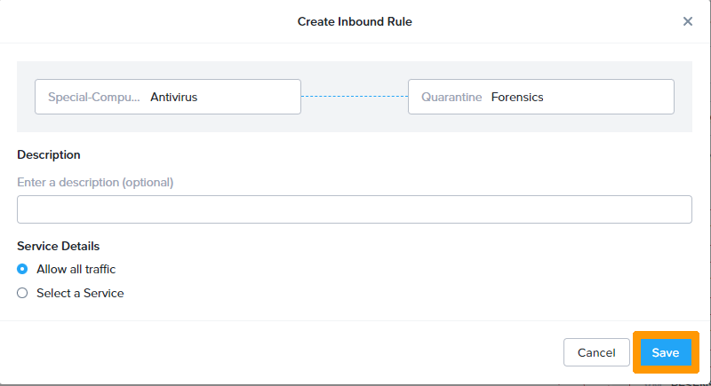{.thumbnail}

Cliquez à gauche sur `Add Destination`{.action} à droite pour autoriser une règle sortante depuis la quarantaine

{.thumbnail}

Saisissez le nom de la catégorie ainsi que sa valeur dans `Add source by: category` pour faire une règle avec les machines virtuelles membres de la catégorie choisie, ensuite cliquez sur `Add`{.action}.

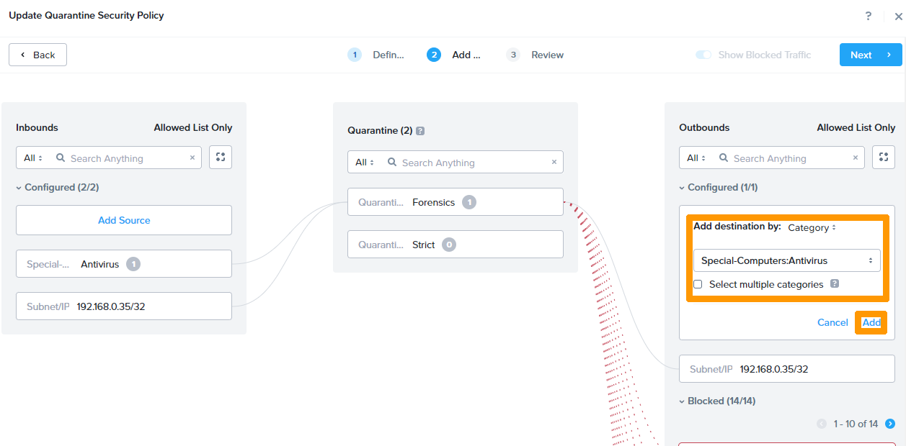{.thumbnail}

Cliquez sur `Next`{.action}

{.thumbnail}

Cliquez sur `Save and Enforce`{.action} pour appliquez les changements sur la règle de quarantaine.

{.thumbnail}

Cliquez sur `Quarantine`{.action} pour voir le détail de de la règle de quarantaine.

{.thumbnail}

Le statut de de la règle est  sur `Enforced` , le mode **forensic** a été personnalisé.

Si l'on met une machine virtuelle en quarantaine **strict** rien ne sera autorisée, par contre en mode **forensics** les règles ajoutés s'appliquerons.

{.thumbnail}

### Création d'une règle d'isolation du réseau.

Au travers du menu principal cliquez sur `Categories`{.action} dans le sous menu `Administration`.

{.thumbnail}

Assurez vous d'avoir correctement configuré les valeurs **Direction** et **Production** de la catégorie Special-computers comme affiché ci dessous. 

Pour plus d'informations sur la gestion des catégories reportez-vous à la section « [Configuration des catégories](#gocategoriesemanage) » de ce guide. 

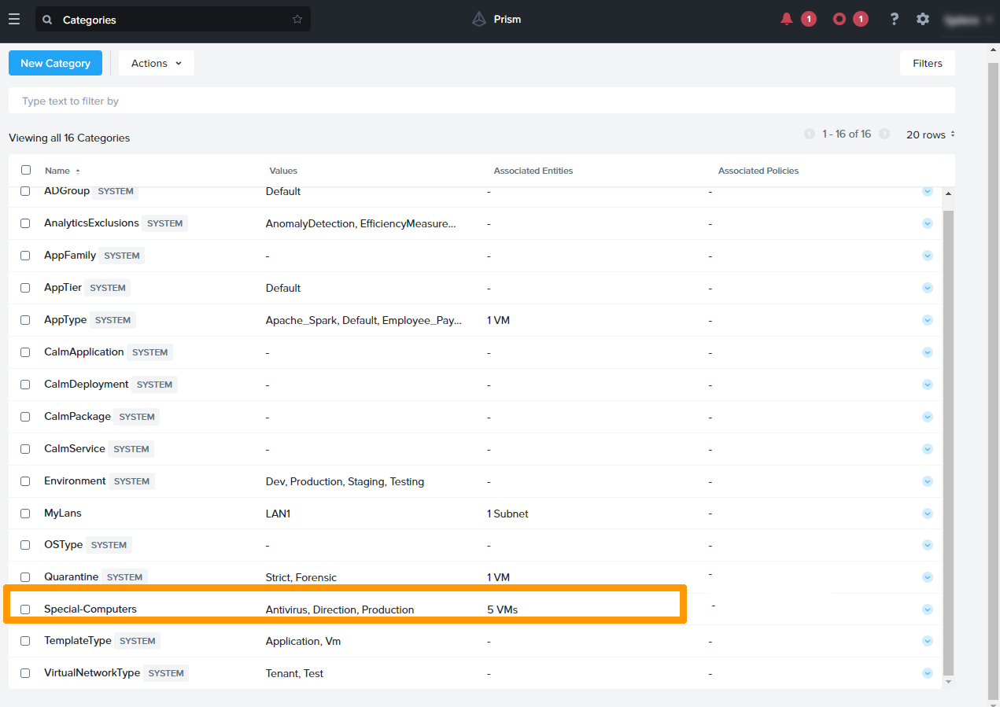{.thumbnail}

Cliquez sur `Securities Policies`{.action} se trouvant dans la catégorie `Network & Security` du menu principal.

{.thumbnail}

Cliquez sur `Create Security Policy`{.action}.

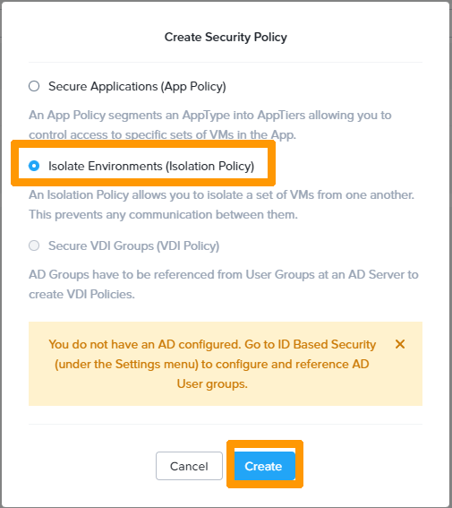{.thumbnail}

Sélectionnez `Isolate Environments (Isolation Policy)`{.action} ensuite cliquez sur `Create`{.action}.

{.thumbnail}

Saisissez le nom de la règle dans `Name`{.action} ensuite mettez un commentaire dans `Purpose`{.action}, Choisissez une catégorie dans `Isolate this category`{.action} suivi d'une autre catégorie dans `From this category`{.action}.

Sélectionnez Enforce dans `Select a Policy mode`{.action} et cliquez sur `Save and Enforce`{.action}. 

{.thumbnail}

La règle est active dans la liste des règles de sécurité.

Cliquez sur `Le nom de la règle`{.action} en dessous de `Name` pour voir le détail.

{.thumbnail}

Le statut de la règle est `Enforced` et l'on peut voir qu'aucune tentative de connexion entre les deux zones est détéctée comme indiquée sur ce message. **No Traffic between them has been discovered**

{.thumbnail}

Si une connexion tentative de connexion réseau est detectée entre ces deux zones le message a changé en **Traffic between them has been discovered**

### Mise en place d'une règle d'application.

Nous allons mettre en place une règle d'application qui n'autorisera que le port HTTP sur une catégorie d'application à une VM depuis une catégories appliquée à deux sous réseaux. 

Pour plus d'informations sur la gestion des catégories reportez-vous à la section « [Configuration des catégories](#gocategoriesemanage) » de ce guide.

A partir du menu principal cliquez sur `Security Policies`{.action} dans le sous menu `Network & Security`.

{.thumbnail}

Cliquez sur `Create Security Policy`{.action} 

{.thumbnail}

Sélectionnez `Secure Application (App Policy)`{.action} et cliquez sur `Create`{.action}

{.thumbnail}

Saisissez ces champs `Name` par un nom de règle , `Purpose` avec un commentaire , `Secure this App` en choisissant une catégorie existante d'applications et cliquez sur `Next`{.action}.

{.thumbnail}

Cliquez sur `Add Source`{.action} à gauche

{.thumbnail}

Choisissez la `catégorie` concernant le VLAN et cliquez sur `Add`{.action}

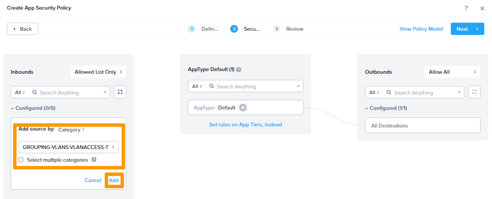{.thumbnail}

Cliquez sur le signe `+`{.action} pour relier à l'application à la source.

{.thumbnail}

Sélectionnez `Select a Service`{.action} , choisir la catégorie dans `Protocol/Service`{.action}, recherchez le nom du service dans `Port/Service Details`{.action} et cliquez sur `Save`{.action}.

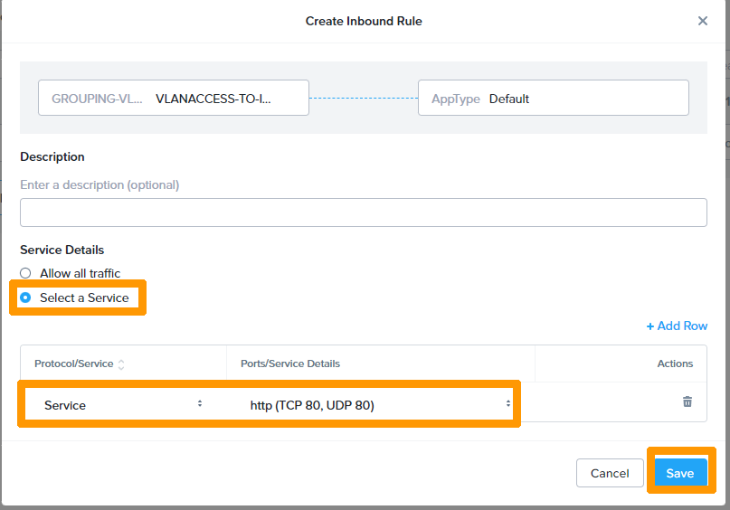{.thumbnail}

Cliquez sur `Next`{.action} pour finaliser la création de la règle.

{.thumbnail}

## Aller plus loin 

[Hyper-convergence Nutanix](https://docs.ovh.com/fr/nutanix/nutanix-hci/)

[Présentation de Nutanix FLOW](https://portal.nutanix.com/page/documents/solutions/details?targetId=TN-2094-Flow:TN-2094-Flow)

[Régles de sécurité de Nutanix FLOW](https://portal.nutanix.com/page/documents/details?)

[Catégories dans Nutanix](https://portal.nutanix.com/page/documents/details?targetId=Prism-Central-Guide-Prism-vpc_2022_1:ssp-ssp-categories-manage-pc-c.html)

Échangez avec notre communauté d'utilisateurs sur <https://community.ovh.com/>.
