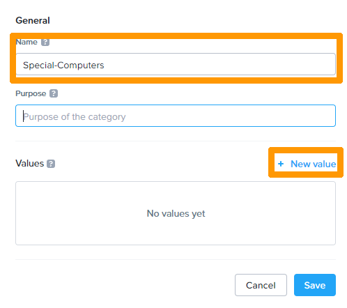
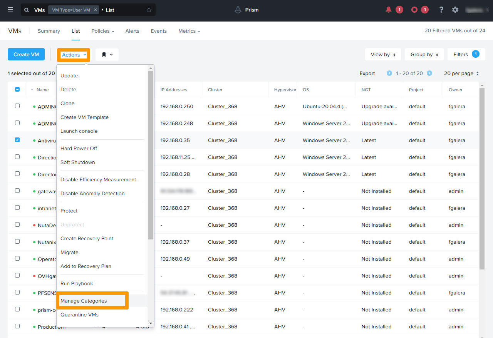
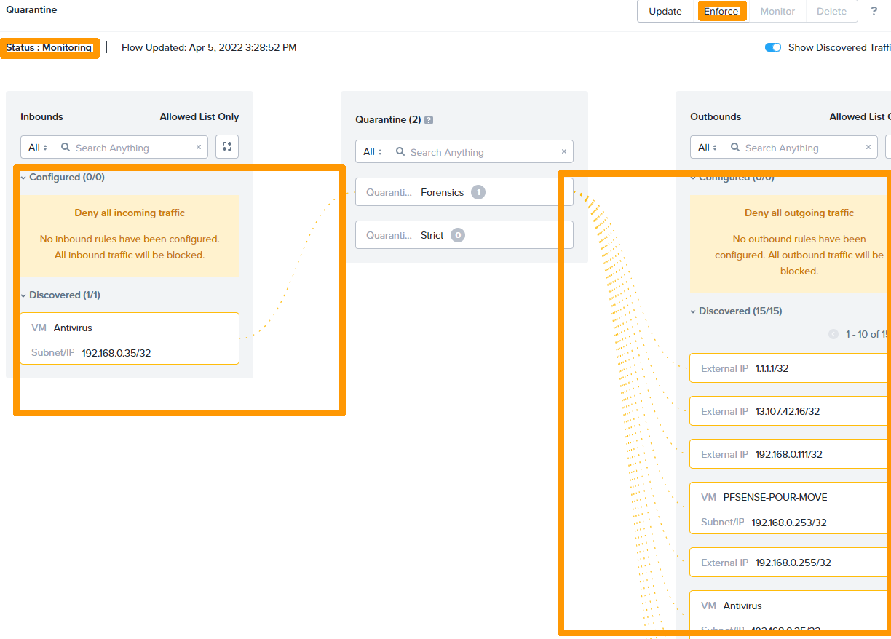
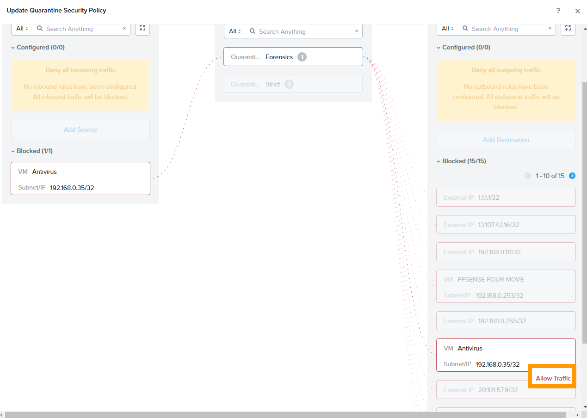
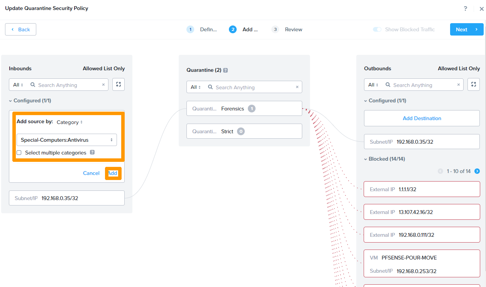
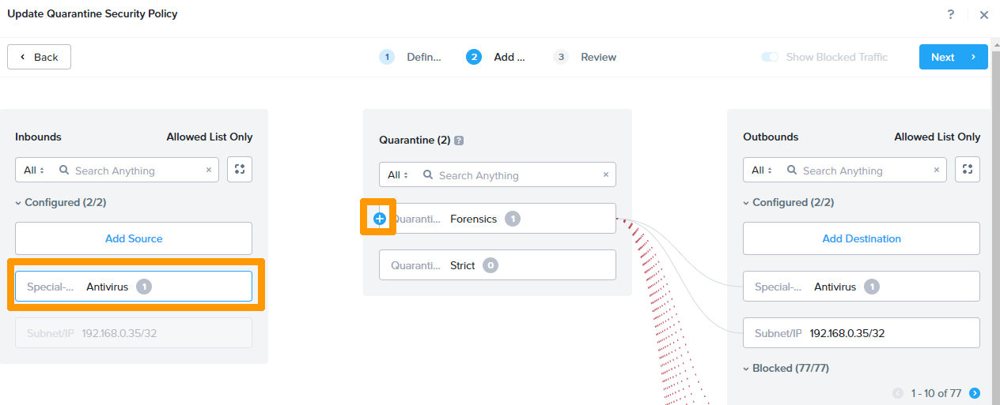

**Dernière mise à jour le 05/04/2022**

## Objectif

Connaitre et utiliser Nutanix Flow pour la sécurisation du réseau au sein d'un cluster Nutanix.

> [!warning]
> OVHcloud vous met à disposition des services dont la configuration, la gestion et la responsabilité vous incombent. Il vous appartient donc de ce fait d’en assurer le bon fonctionnement.
>
> Ce guide a pour but de vous accompagner au mieux sur des tâches courantes. Néanmoins, nous vous recommandons de faire appel à un prestataire spécialisé si vous éprouvez des difficultés ou des doutes concernant l’administration, l’utilisation ou la mise en place d’un service sur un serveur.
>

## Présentaion de de **Nutanix Flow**

Cette option est disponible dans toutes les offres **Hosted Private Cloud Powered by Nutanix**. Elle permet de protéger le réseau sein d'un ou plusieurs clusters Nutanix gérés par **Prism Central**.

Il est possible :

* de mettre en quarantaine des machines virtuelles de manière stricte sans laisser la possibilité d'avoir accès au réseau ou d'une manière moins stricte en permettant l'accès à des outils de diagnostics disponibles sur d'autres machines virtuelles.
* D'isoler des machines virtuelles entre elles.
* D'autoriser l'accès partiel à certaines machines virtuelles au travers de règles d'applications.
* De bloquer l'accès à certaines machines virtuels pour du **VDI** avec des comptes ou des groupes d'un annuaire **Active directory**. 

## En pratique

Connectez-vous à **Prism Central**.

Pour plus d'informations sur la connexion au cluster reportez-vous à la section « [Aller plus loin](#gofurther) » de ce guide. 

### Activation de **Nutanix Flow**

Cliquez sur l'icône `engrenage`{.action} en haut à droite pour modifier les paramètres.

{.thumbnail}

Faites défiler la `barre de défilement`{.action} à gauche et cliquez sur `Microsegementation`{.action}.

{.thumbnail}

Cliquez sur la `case à cocher`{.action} à gauche de **Enable Microsegmentation** et cliquez sur `Save`{.action}.

{.thumbnail}

La microsegmentation est activée. Il est possible de la désactiver.

{.thumbnail}

### Configuration des catégories

Une catégorie est un objet qui peut contenir une ou plusieurs valeurs, certaines catégories sont présentes lors de l'installation de **Prism Central** et il est possible de créer des nouvelles catégories.

Les catégories permettent de faciliter la gestion d'un cluster Nutanix, il est possible de les affecter à des entités comme des VM, des sous réseaux ou des images pour ensuite les utiliser dans des outils comme **Flow** par exemple.

# Création d'une catégorie

Nous allons créer une Catégories **Special Computers** avec une valeur nommée **Antivirus**.

Au travers du menu principal cliquez sur `Categories`{.action} dans le sous menu `Administration`.

{.thumbnail}

Cliquez sur `New Category`{.action}.

{.thumbnail}

Saisissez le nom de la catégorie dans `Name`{.action} ensuite cliquez sur `New value`{.action}.

{.thumbnail}

Saisissez un nom dans `Value`{.action} et cliquez sur le `bouton bleu`{.action} à droite. 

{.thumbnail}

Cliquez sur `Save`{.action} 

{.thumbnail}

La nouvelle catégorie apparait dans la liste des catégories

{.thumbnail}

#### Affectation d'une catégorie à une machine virtuelle

Allez dans le `Menu Principal`{.action} et cliquez sur `VMs`{.action} sous `Compute & Storage.`

{.thumbnail}

`Sélectionnez`{.action} la machine virtuelle à gauche ensuite cliquez sur `Actions`{.action} et choisissez `Manage Categories`{.action}. dans le menu

{.thumbnail}

Saisissez `le nom de la catégorie et de sa valeur` ensuite cliquez sur le bouton `+`{.action}

{.thumbnail}

Cliquez sur `Save`{.action} pour enregistrer la machine virtuelle dans une catégorie.

{.thumbnail} pour que la machine virtuelle fasse partie de la catégorie choisie.

### Gestion de la quarantaine réseau.

#### Mise en quarantaine d'une VM

La quarantaine est utilisable avec les options par défaut si la micro-segmentation ast active. Elle peut s'appliquer à une ou plusieurs machines virtuelles.

Allez dans le `Menu Principal`{.action} et cliquez sur `VMs`{.action} sous `Compute & Storage.`

{.thumbnail}

`Sélectionnez`{.action} la machine virtuelle à gauche ensuite cliquez sur `Actions`{.action} et choisissez `Quarantine VMs`{.action} dans le menu.

{.thumbnail}

Choisissez `Forensic`{.action} dans `quarantine Method` et cliquez sur `Quarantine`{.action}.

{.thumbnail}

La machine virtuelle est en quarantaine.

#### Personnalisation de la quarantaine réseau.

Pour l'instant la machine virtuelle mise en quarantaine n'est pas bloquée, suivez ces instructions pour configurer la quarantaine.

A partir du menu principal cliquez sur `Security Policies`{.action} dans le sous menu `Network & Security`.

{.thumbnail}

Cliquez sur le `numéro`{.action} à coté de `Quarantined` pour voir les machines virtuelles en quarantaine.

{.thumbnail}

La liste des machines virtuelles en quarantaine apparait dans `Name` cliquez sur `Close`{.action} pour revenir au menu précedent.

{.thumbnail}

CLiquez sur `Quarantine`{.action} en dessous de Name à gauche pour modifier la règle.

{.thumbnail}

Le status de la règle est en mode `Monitoring ` comme indiqué en haut à gauche. 

Le trafic n'est pas bloqué mais surveillé comme on peut le voir en bas à droite et à gauche entre les machines virtuelles en quarantaines et l'ensemble du réseau interne et externe au travers de traits orange.

!Cliquez sur `Enforce`{.action} en haut à droite pour passer du mode **Monitoring** au mode **Enforcing** avec blocage du trafic.

Saisissez `ENFORCE`{.action} et cliquez sur `Confirm`{.action}.

{.thumbnail}

Le statuts de la règle est maintenant sur `Enforced` 

Le trafic est bloqué et il est possible de voir les tentatives d'accès aux machines virtuelles en quarantaines avec des fenêtres et des liens de couleur rouge.

IL est possible de modifier la règle de quarantaine pour autoriser certains flux.

{.thumbnail}

Cliquez sur Cliquez sur `Enforce`{.action} en haut à droite pour modifier la règle.

{.thumbnail}

Cliquez sur `Next`{.action}

{.thumbnail}

Positionnez la souris sur une règle de blocage et cliquez sur `Allow Traffic`{.action}

{.thumbnail}

Sélectionnez le trafic découvert entrant en cliquant sur la `case à cocher`{.action} à gauche de la règle. et cliquez sur `Allow 1 Discovered Traffic`{.action}. Cette action n'autorise que le trafic spécifique découvert dans cet exemple c'est le protocole ICMP sur le ping, le reste du trafic venant de cette machine virtuelle sera bloqué.

{.thumbnail}

Positionez la souris sur une règle de blocage sortante et cliquez sur `Allow Traffic`{.action}

{.thumbnail}

Sélectionnez le trafic découvert sortant en cliquant sur la `case à cocher`{.action} à gauche de la règle et cliquez sur `Allow 1 Discovered Traffic`{.action}. Cette action n'autorise que le trafic spécifique découvert dans cet exemple c'est le protocole ICMP sur le ping, le reste du trafic allant vers cette machine virtuelle est bloqué.

{.thumbnail}

Le trafic autorisé est maintenant visible avec des traits de couleurs bleus et le trafic bloqué reste en rouge.

Ces autorisations sont fastidieuses à gérer car il faut attendre la découverte du trafic réseau et ensuite l'autoriser, il est possible de rajouter une règle manuellement sans passer par cette découverte.

Cliquez à gauche sur `Add Source`{.action} à gauche pour autoriser une règle entrante vers la quarantaine

{.thumbnail}

Saisissez le nom de la catégorie ainsi que sa valeur dans `Add source by: category` pour faire une règle avec les machines virtuelles membres  de la catégorie choisie, ensuite cliquez sur `Add`{.action}.

{.thumbnail}

La source apparait dans `Configured`

Cliquez sur le signe `+`{.action} à coté de **Quarantine: Forensics**

{.thumbnail}

Cliquez sur `Save`{.action}

{.thumbnail}

Cliquez à gauche sur `Add Destination`{.action} à droite pour autoriser une règle sortante depuis la quarantaine

{.thumbnail}

Saisissez le nom de la catégorie ainsi que sa valeur dans `Add source by: category` pour faire une règle avec les machines virtuelles membres de la catégorie choisie, ensuite cliquez sur `Add`{.action}.

{.thumbnail}

Cliquez sur `Next`{.action}

{.thumbnail}

Cliquez sur `Save and Enforce`{.action} pour appliquez les changements sur la règle de quarantaine.

### Création d'une règle d'isolation du réseau.

### Création d'und règle d'application.

## Aller plus loin

[Hyper-convergence Nutanix](https://docs.ovh.com/fr/nutanix/nutanix-hci/)

[Présentation de Nutanix FLOW](https://portal.nutanix.com/page/documents/solutions/details?targetId=TN-2094-Flow:TN-2094-Flow)

[Régles de sécurité de Nutanix FLOW](https://portal.nutanix.com/page/documents/details?)

[Catégories dans Nutanix](https://portal.nutanix.com/page/documents/details?targetId=Prism-Central-Guide-Prism-vpc_2022_1:ssp-ssp-categories-manage-pc-c.html)

Échangez avec notre communauté d'utilisateurs sur <https://community.ovh.com/>.
