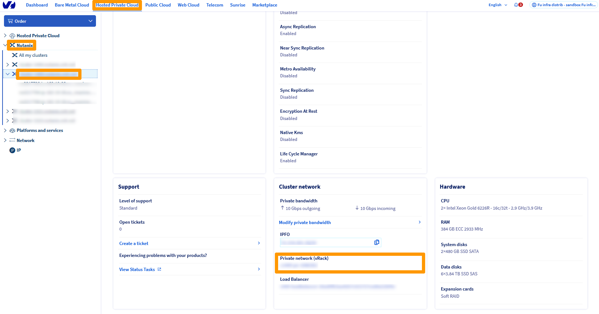
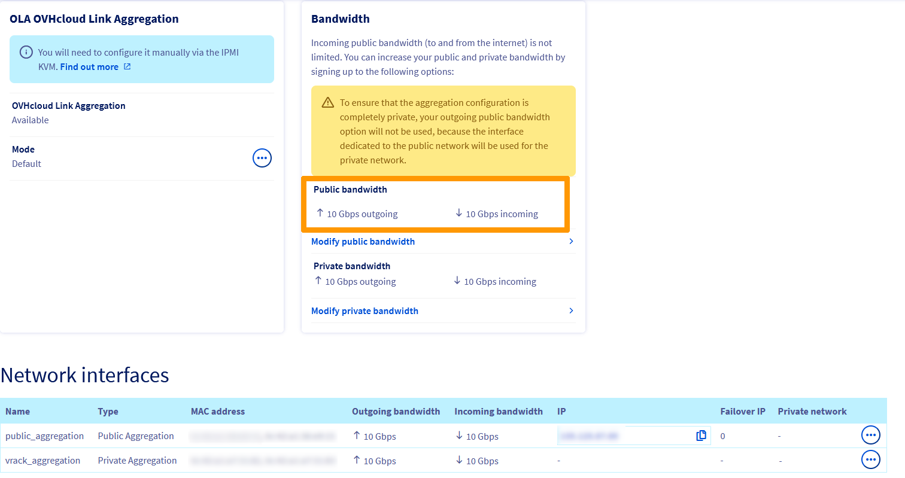
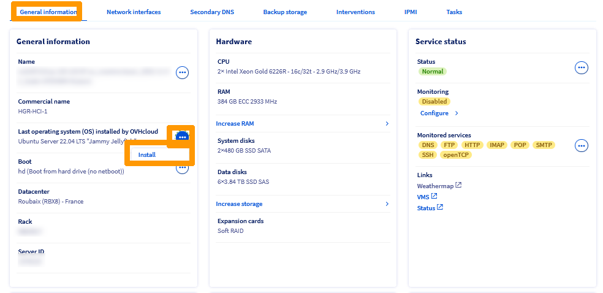
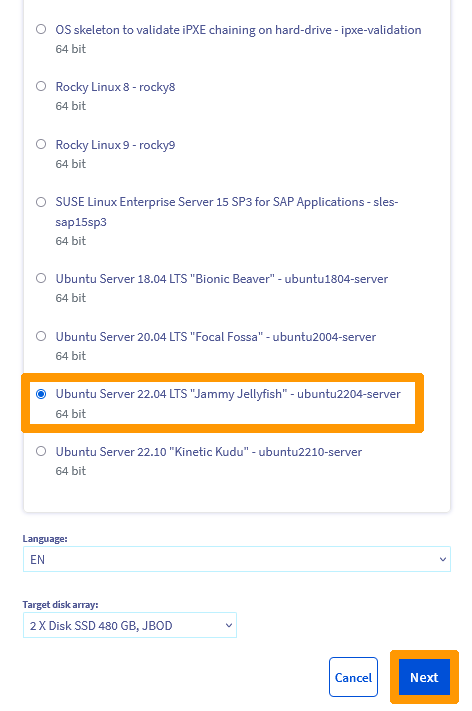

**Dernière mise à jour le 18/11/2022**

## Présentation

Une machine virtuelle **OVHgateway** est installée lors d'une déploiement d'une solution Nutanix, cette machine virtuelle sert de passerelle Internet Sortante pour le cluster elle a une limite de 1 gb/s sur le réseau public.

Si vous avez besoin d'avoir une bande passante plus importante il faut remplacer cette passerelle par un serveur dédié et choisir une offre qui vous permettra d'aller entre 1 gb/s à 10 gb/s sur le réseau public comme indiqué sur ce lien [Serveurs dédiés OVHcloud](https://www.ovhcloud.com/fr/bare-metal/).

**Nous allons voir comment remplacer la passerelle par défaut par un serveur dédié OVHcloud pour augmenter la bande passante**


> [!warning]
> OVHcloud vous met à disposition des services dont la configuration, la gestion et la responsabilité vous incombent. Il vous appartient donc de ce fait d’en assurer le bon fonctionnement.
>
> Ce guide a pour but de vous accompagner au mieux sur des tâches courantes. Néanmoins, nous vous recommandons de faire appel à un prestataire spécialisé si vous éprouvez des difficultés ou des doutes concernant l’administration, l’utilisation ou la mise en place d’un service sur un serveur.
>

## Prérequis

- Disposer d'un cluster Nutanix dans votre compte OVHcloud.
- Être connecté à votre [espace client OVHcloud](https://www.ovh.com/auth/?action=gotomanager&from=https://www.ovh.com/fr/&ovhSubsidiary=fr).
- Être connecté sur le cluster via Prism Central. 
- Disposer d'un serveur dédié qui utilise deux cartes réseaux une sur le réseau privé (vRACK) l'autre sur le réseau public.

## En pratique

Nous allons déployer un serveur dédié sous Linux qui utilise 4 cartes réseaux (2 sur le réseau public, 2 sur le réseau privé) pour remplacer la machine virtuelle OVHgateway.

Le réseau public utilisera une seule carte réseau et le réseau privé utilisera deux cartes réseau en équipe.

Pour remplacer l'OVHgateway nous allons prendre utilisez ces paramètres :

- Lan public en DHCP qui fournit une adresse publique.
- Lan privé sur une équipe de deux cartes et des adresses privés manuelle sur plusieurs VLAN
    - VLAN 1 : adresse IP privée et masque de l'OVHgateway (Dans notre exemple 172.16.3.254/22)

### Récupération des informations nécessaires au déploiement de votre serveur

Allez dans votre espace client OVHcloud cliquez sur `Hosted Private Cloud`{.action} dans la barre d'onglet sélectionnez votre cluster Nutanix à gauche et notez le nom du vRack associé à votre cluster Nutanix dans `Private network (vRack)`.

{.thumbnail}

Toujours dans dans votre espace client OVHcloud allez sur l'onglet `Bare Metal Cloud`{.action}. Sélectionnez dans la barre de menu à gauche votre serveur dédié. Ensuite cliquez sur `Network interfaces`{.action}.

{.thumbnail}

Allez en bas à droite et notez dans **Network Interfaces** les adresses MAC associées au réseau public et au réseau privé (deux adresses MAC par réseau).

{.thumbnail}

Au travers de l'encadrement **Bandwith** cliquez sur `Modify public bandwidth`{.action} pour changer le débit de votre réseau public.

> [!warning]
> En fonction du débit que vous souhaitez le prix de l'abonnement à votre serveur augmentera et il faudra le valider par une commande dans votre espace client OVHcloud.
>

{.thumbnail}

Sélectionnez la vitessse désirée et cliquez sur `Next`{.action}.

{.thumbnail}

Cliquez sur `Pay`{.action}.

{.thumbnail}

Cliquez sur `View purshase order`{.action} pour voir le bon de commande.

{.thumbnail}

Dès que la commande sera validé votre débit sur la bande passante publique sera changée.

{.thumbnail}

### Connexion au vRack du serveur dédié

Restez sur la configuration, cliquez en bas de la page sur `Le bouton de configuration`{.action} des cartes du réseau privé.

{.thumbnail}

Séléctionnez le vRack dans **Select private network** qui correspond à votre serveur Nutanix noté précedemment. 

{.thumbnail}

Le vRack est affiché dans la colonne **Private Network**.

{.thumbnail}

### Installation du système d'exploitation

Nous allons maintenant installer un système d'exploitation Linux Ubuntu 22 à partir de l'espace client.

Au travers des onglets du serveur dédié allez sur `General information`{.action}. Cliquez sur le bouton de `Last operating system (OS) installed by OVHcloud`{.action} de la rubrique **General information**.

{.thumbnail}

Cliquez sur `LINUX (18)`{.action}.

{.thumbnail}

Sélectionnez `Ubuntu Server 22.04 LTS`{.action} et cliquez sur `Next`{.action}.

{.thumbnail}

Cliquez sur `Confirm`{.action}.

{.thumbnail}

L'installation du système d'exploitation se lance un fenêtre de l'état d'avancement apparait et disparaitra quand l'installation sera terminée.

Un message vous sera envoyé dans votre boite au lettre et contiendra le compte utilisateur administrateur et de son mot de passe.  

{.thumbnail}

### Arrêt de la machine virtuelle OVHgateway sur Prism Central

Nous allons arrêter la machine virtuelle **OVHgateway** avant de configurer le serveur dédié.

Allez dans **Prism Central** dans la gestion des machines virtuelles séléctionnez la machine virtuelle `OVHgateway` allez dans le menu `Actions`{.action} et choisissez `Guest Shutdown`{.action}.

{.thumbnail}

La machine virtuelle est éteinte 

{.thumbnail}

### Configuration réseau en tant que passerelle Linux

Lorsque l'on déploie un serveur Linux à partir de l'interface client OVHcloud une seule carte réseau est configurée c'est l'adresse IP publique elle servira pour vous connecer en SSH et effectuer votre coniguration.

Connectez vous en SSH au serveur dédié avec cette commande

```bash
ssh ubuntu@dedicated-server-public-ip-address
```

Créer un fichier nommé `configurenetwork.sh` qui active le routage, le NAT et installe des outils nécessaires. 

```bash
#!/bin/bash
set -eux

apt update && apt upgrade -y
apt install vlan net-tools -y
echo "8021q" >> /etc/modules
echo 'bonding' | tee -a /etc/modules

# Disable cloud-init networking
touch /etc/cloud/cloud.cfg.d/99-disable-network-config.cfg
echo "network: {config: disabled}">> /etc/cloud/cloud.cfg.d/99-disable-network-config.cfg

# Enable forwarding
sed -i s/#net.ipv4.ip_forward/net.ipv4.ip_forward/g /etc/sysctl.conf
sysctl net.ipv4.ip_forward

# get public interface
NIC=$(ip link | grep UP | awk -F: '$0 !~ "lo|vir|wl|^[^0-9]"{print $2;getline}')

# routing traffic to public interface
iptables -t nat -A POSTROUTING -o ${NIC} -j MASQUERADE

# Saving Rules
echo iptables-persistent iptables-persistent/autosave_v4 boolean true | debconf-set-selections
echo iptables-persistent iptables-persistent/autosave_v6 boolean true | debconf-set-selections
apt -y install iptables-persistent --no-install-recommends
```

Lancez ces commandes pour executer le script et redémarrer votre serveur:

```bash
chmod u+x configurenetwork.sh
sudo ./configurenetwork.sh
sudo reboot
```

Saisissez cette commande pour faire apparaitre les cartes qui ne sont pas connectés et repérez avec les adresses MAC le nom des deux cartes réseaux du réseau privé :

```bash
ip a | grep -C1 DOWN
```

Vous verrez apparaitre 3 cartes réseau avec l'état **DOWN**, reprenez la liste des adresses MAC et récupérer le nom des deux cartes privées comme dans l'exemple ci-dessous :

> [!warning]
> Ne vous basez pas sur l'ordre des cartes pour trouver le nom de carte du réseau privé mais plutôt sur les adresse MAC noté précedemment.
>

```bash
3: "publiccardname2": <BROADCAST,MULTICAST> mtu 1500 qdisc noop state DOWN group default qlen 1000
    link/ether "mac-address-public-card2" brd gg:gg:gg:gg:gg:gg
4: "privatecardname1": <BROADCAST,MULTICAST> mtu 1500 qdisc noop state DOWN group default qlen 1000
    link/ether "mac-address-private-card1" brd ff:ff:ff:ff:ff:ff
5: "privatecardname2": <BROADCAST,MULTICAST> mtu 1500 qdisc noop state DOWN group default qlen 1000
    link/ether "mac-address-private-card1" brd ff:ff:ff:ff:ff:ff
```

lancer cette commande 

```bash
ip a | grep -C1 UP
```

Vous verrez apparaitre 2 cartes avec l'état **UP**, la carte loopback et une carte physique dont l'adresse MAC doit correspondre à une des adresses publiques notés dans l'espace client OVHcloud. récuperer le nom de cette carte privé 


```bash
1: "lo": <LOOPBACK,UP,LOWER_UP> mtu 65536 qdisc noqueue state UNKNOWN group default qlen 1000
    link/loopback 00:00:00:00:00:00 brd 00:00:00:00:00:00
--
       valid_lft forever preferred_lft forever
2: "publiccardname1": <BROADCAST,MULTICAST,UP,LOWER_UP> mtu 1500 qdisc mq state UP group default qlen 1000
    link/ether "mac-address-public-card1" brd ff:ff:ff:ff:ff:ff
```

En s'appuyant sur les informations recueillies, nous allons editer le fichier `/etc/netplan/50-cloud-init.yaml` et remplacer les noms des cartes et des adresses MAC comme ceci :


* "publiccardname1" : Le nom de la première carte publique. 
* "mac-address-public-card1" : L'addresse MAC de la première carte réseau publique.

* "privatecardname1" : le nom de la première carte réseau privée.
* "mac-address-private-card1" : L'addresse MAC de la première carte réseau privée.

* "privatecardname2" : le nom de la deuxième carte réseau privée.
* "mac-address-private-card2" : L'addresse MAC de la deuxième carte réseau privée


Exécuter cette commande pour éditer le fichier

```bash
sudo nano /etc/netplan/50-cloud-init.yaml
```

```yaml
# This file is generated from information provided by the datasource.  Changes
# to it will not persist across an instance reboot.  To disable cloud-init's
# network configuration capabilities, write a file
# /etc/cloud/cloud.cfg.d/99-disable-network-config.cfg with the following:
# network: {config: disabled}
network:
    version: 2
    ethernets:
        enp26s0f0np0:
            accept-ra: false
            addresses:
            - 2001:41d0:20b:4500::/56:
            dhcp4: true
            gateway6: fe80::1
            match:
                macaddress: 0c:42:a1:65:d4:16
            nameservers:
                addresses:
                - 2001:41d0:3:163::1:
            set-name: enp26s0f0np0
        #vRack interface
        enp96s0f0np0:
            match:
                macaddress: 04:3f:72:bf:13:9e
            optional: true
        enp96s0f1np1:
            match:
                macaddress: 04:3f:72:bf:13:9f
            optional: true
    bonds:
        bond0:
            dhcp4: no
            addresses: [192.168.254.2/24]
            interfaces: [enp96s0f0np0, enp96s0f1np1]
            parameters:
                mode: 802.3ad
                transmit-hash-policy: layer3+4
                mii-monitor-interval: 100
    vlans:
        bond0.1:
            dhcp4: no
            dhcp6: no
            id: 1
            addresses: [172.16.3.254/22]
            link: bond0
        bond0.2:
            dhcp4: no
            dhcp6: no
            id: 2
            addresses: [10.2.3.254/22]
            link: bond0
```

Exécutez ces commandes pour appliquer la configuration :

```bash
# Apply network configuration
sudo netplan apply
# Reboot server
sudo reboot
```

La passerelle est disponible pour le Cluster Nutanix pour le VLAN1 et le VLAN2.


## Aller plus loin <a name="gofurther"></a>

Échangez avec notre communauté d'utilisateurs sur <https://community.ovh.com/>.
