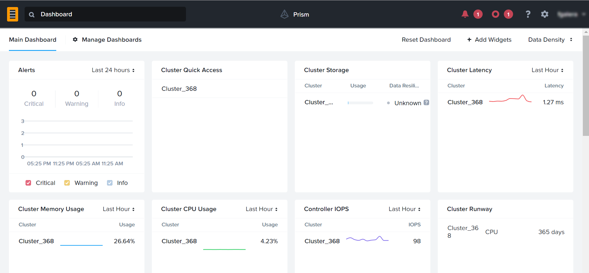
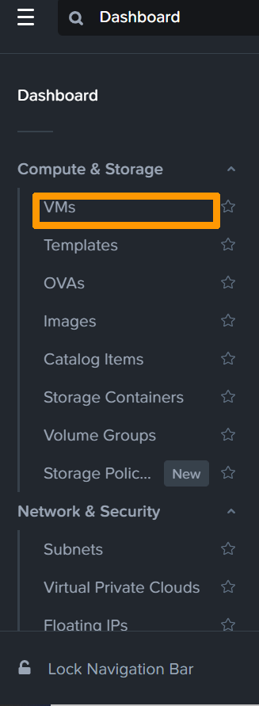
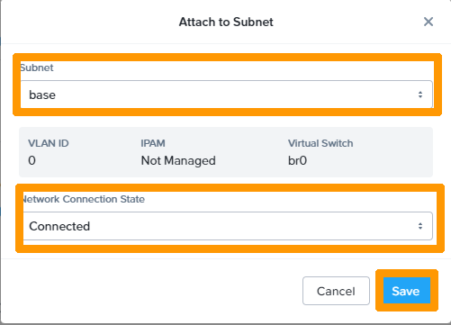
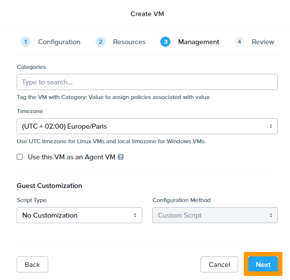
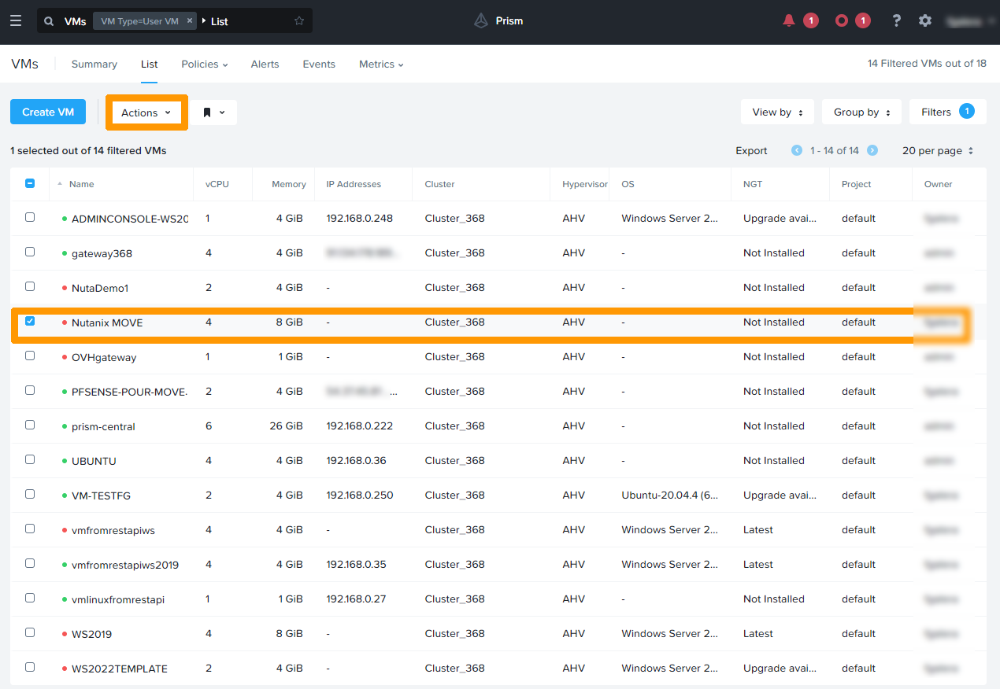
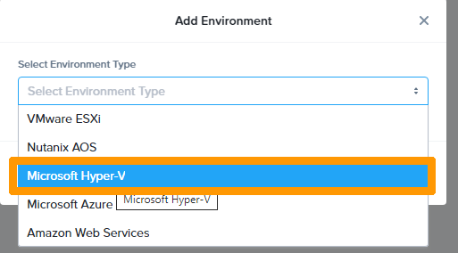
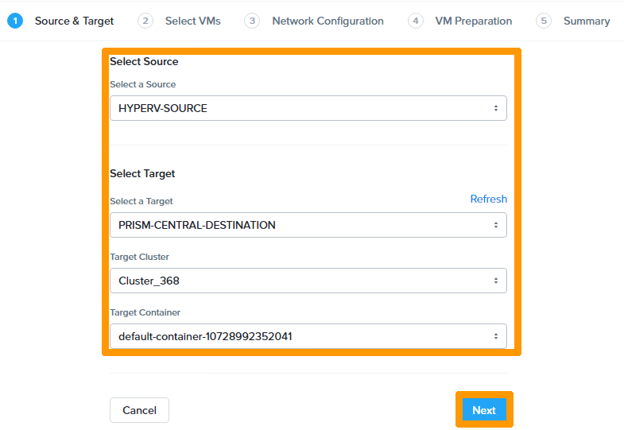

**Dernière mise à jour le 28/03/2022**

## Objectif

Ce guide a pour but de présenter et d'utiliser **Nutanix MOVE** dans le cadre d'une migration vers un cluster Nutanix sous **AHV**.

> [!warning]
> OVHcloud vous met à disposition des services dont la configuration, la gestion et la responsabilité vous incombent. Il vous appartient donc de ce fait d’en assurer le bon fonctionnement.
>
> Ce guide a pour but de vous accompagner au mieux sur des tâches courantes. Néanmoins, nous vous recommandons de faire appel à un prestataire spécialisé si vous éprouvez des difficultés ou des doutes concernant l’administration, l’utilisation ou la mise en place d’un service sur un serveur.
>
> Certaines options comme l'utilisation de la compression ou de la déduplication nécessitent des licences particulières fournies par Nutanix au travers d'OVHcloud, nous vous invitons à vous renseigner auprès du service commercial OVHcloud pour plus d'informations.

## Prérequis

- Disposer d'un cluster Nutanix dans votre compte OVHcloud
- Être connecté à votre [espace client OVHcloud](https://www.ovh.com/auth/?action=gotomanager&from=https://www.ovh.com/fr/&ovhSubsidiary=fr)
- Être connecté sur le cluster via Prism Central
- Avoir une connexion à un environnement autre que Nutanix 

## Présentation de **Nutanix MOVE**

**Nutanix Move** est un outil qui permet d'effectuer des migrations de machines virtuelles depuis **VMware ESXI**, **Hyper**, **Azure** et **AWS** vers **AHV** il peut aussi être utilisé pour faire des migrations de Nutanix **AHV** vers **AWS**.

Ce logiciel se présente comme une machine virtuelle dont les sources sont disponibles sur le site de Nutanix avec un compte client.

Pour une meilleure utilisation il est conseillé d'installer **Nutanix Move** au plus près de la destination.

le logiciel **Nutanix Move** est le seul à communiquer entre la source et la destination.

## En pratique

Nous allons voir comment effectuer une migration entre un environnement distant sur HYPERV et un environnement NUTANIX OVHCloud.

La source et la destination sont sur deux réseaux privés interconnectés au travers d'un VPN **IPSEC**.

Les deux environnements sont sur deux réseaux séparés distants connectés au travers d'un **VPN IPSEC** 

### Installation de MOVE sur le Cluster NUTANIX

#### Téléchargement et importation des sources 

Récupérez le fichier au format **qcow2** sur ce site [Téléchargement MOVE](https://portal.nutanix.com/page/downloads?product=move)

Connectez-vous avec un compte enregistré chez Nutanix

cliquez sur `Downloads`{.action} à droite de Move QCOW2 file for AHV

Importez l'image téléchargée de Move dans Nutanix. Pour plus d'information sur l'importation d'images cliquez sur ce lien [Importation d'images](https://docs.ovh.com/fr/nutanix/image-import/).

#### Installation de la machine virtuelle **Move**

Créez une machine virtuelle à partir de de l'image Move

Depuis Prism Central, ouvrez le menu principal via le bouton en haut à gauche.

Cliquez dans le menu sur `VMs`{.action}

Cliquez sur `Create VM`{.action}

Saisissez **Nutanix MOVE** dans `Name`{.action}  

Choisissez ces options **2 vCPU**, **2 Cores** et **8 GB** dans `VM Properties`{.action} et Cliquez sur `Next`{.action}

Cliquez sur `Attach Disk`{.action}

Cliquez sur `Attach Disk`{.action}

Choississez ces options **Disk**, **Clone from Image** et **move-4.3.0.qcow2**  ensuite cliquez sur `Save`{.action}

Cliquez sur `Attach to Subnet`{.action}

Choisissez le réseau dans `Subnet`, vérifiez qu'il soit bien connecté dans `Network Connection State` et cliquez sur `Save`{.action}

Cliquez sur `Next`{.action} 

Laissez les options de timezone par défaut et cliquez sur `Next`{.action}

Cliquez sur sur `Create VM`{.action} pour finaliser l'installation de la machine virtuelle **Nutanix Move**

Sélectionnez la machine virtuelle **Nutanix Move** et cliquez sur le menu `Actions`{.action}

Cliquez sur `Power On`{.action} dans le menu action pour démarrer la machine virtuelle.

La machine virtuelle est démarrée et l'on obtient une adresse IP si un serveur **DHCP** est opérationnel sur ce réseau.

Cette installation de Nutanix Move se fait sur un réseau ou il y'a un serveur DHCP mais il est possible de configurer la machine virtuelle sur un réseau sans serveur **DHCP** 

Pour plus de détails sur **Nutanix MOVE**, reportez-vous à la section « [Aller plus loin](#gofurther) » de ce guide.

### Configuration de **Nutanix Move** 

#### Connexion à l'interface WEB et création d'environnements pour la migration

Connectez-vous à l'adresse IP de la machine virtuelle **Nutanix Move** au travers d'un navigateur WEB en HTTPS comme ceci **https://addresseipnutanixmove/**

Cliquez sur `I have read and agree to terms and conditions`{.action} suivi de  `Continue`{.action} pour accepter la licence

Cliquez sur `OK`{.action} pour poursuivre

Choisissez un mot de passe dans `Enter new Password`{.action} , confirmez le dans `Re-Enter new Password`{.action} et cliquez sur `Set Password`{.action} pour valider la création du mot de passe de Nutanix Move.

Saisissez le mot de passe dans `Password`{.action} et cliquez sur `Log In`{.action} pour se connecter à l'interface WEB de **Nutanix MOVE**.

Cliquez sur `Add Environment`{.action}

Choisissez `Nutanix AOS`{.action} 

Saisissez ces informations **PRISM-CENTRAL-DESTINATION** dans `Environment Name`{.action}, l'adresse IP privée de **Prism Central** dans `Nutanix Environment`{.action}, Un compte d'administration de **Prism Central** dans `Username `{.action}, le mot de passe de compte dans `Password`{.action} et cliquez sur `ADD`{.action} pour ajouter **Prism Central** comme environnement. 

Choisissez `Microsoft Hyper-V`{.action} 

Cliquez sur `Add Environment`{.action}

Saisissez ces informations **HYPERV-SOURCE** dans `Environment Name`{.action}, l'adresse IP privée du serveur **HYPER-V** dans `Hyper-V Server/Cluster`{.action}, un compte d'administration **HYPER-V** dans `Username `{.action} , le mot de passe de ce compte dans `Password`{.action} et cliquez sur `ADD`{.action} pour ajouter **Prism Central** comme environnement. 

Les deux environements de migrations apparaissents en haut à gauche.

#### Création d'un plan de migration d'un serveur HYPER-V vers un environnement NUTANIX.

Nous allons créer un plan de migration à partir des deux environements crées précedemment.

Cliquez sur `Create a Migration Plan`{.action}

Choisissez un nom dans `Plan Name`{.action} et cliquez sur `Proceed`{.action}

Saisissez ces informations **HYPERV-SOURCE** dans `Select a Source`{.action},  **PRISM-CENTRAL-DESTINATION** dans `Hyper-V Server/Cluster`{.action}, le nom du CLUSTER dans `Target Cluster`{.action}, le nom du container de destination dans `Target Container`{.action} ensuite cliquez sur `NEXT`{.action} pour passer à l'étape suivante.

Sélectionnez les machines virtuelles que vous voulez migrer de l'environnement **HYPER-V** vers **AOS** en cliquant à gauche de la VM sur l'icone `Clic ICONE`{.action}, selectionnez les machines virtuelles et cliquez sur `Next`{.action} pour continuer la création du plan de migration.

Choisissez le réseau dans `Target Network`{.action} et cliquez sur `Next`{.action}.

Cliquez sur `Next`{.action} pour valider la migration.

Cliquez sur `Save`{.action} pour Enregistrer le plan de migration sans l'éxecuter.

#### Lancement de la migration

Le plan de migration est créé il est possible de le lancer manuellement.

Sélectionnez la `Case à cocher près du Plan de migration`{.action}.

Dans le menu `Action` cliquez sur `Start`{.action}.

La migration est en cours et apparait en progrès `in progress`dans la colonne `Status` à droite de l'écran.

!!!! Reste à rajouter le cut Over

## Aller plus loin 

[Installation et configuration de Move](https://portal.nutanix.com/page/documents/details?targetId=Nutanix-Move-v4_3:Nutanix-Move-v4_3)

Échangez avec notre communauté d'utilisateurs sur <https://community.ovh.com/>.
