**Dernière mise à jour le 13/04/2022**

## Objectif


HYCU backup est un logiciel de sauvegarde disponible pour Nutanix. 

**Apprenez à installer , configurer HYCU sur un cluster Nutanix avec un stockage de type S3 chez OVHCloud**

> [!warning]
> OVHcloud vous met à disposition des services dont la configuration, la gestion et la responsabilité vous incombent. Il vous appartient donc de ce fait d’en assurer le bon fonctionnement.
>
> Ce guide a pour but de vous accompagner au mieux sur des tâches courantes. Néanmoins, nous vous recommandons de faire appel à un prestataire spécialisé si vous éprouvez des difficultés ou des doutes concernant l’administration, l’utilisation ou la mise en place d’un service sur un serveur.
>
> La licence HYCU n'est pas fournie par OVHcloud il faudra contacter le service commercial d'HYCU ou D'OVHcloud 


## Prérequis

- Disposer d'un cluster Nutanix dans votre compte OVHcloud
- Être connecté à votre [espace client OVHcloud](https://www.ovh.com/auth/?action=gotomanager&from=https://www.ovh.com/fr/&ovhSubsidiary=fr)
- Être connecté sur le cluster via Prism Central. 
- Avoir un abonnement de stockage chez OVHcloud comme **High Performance Object Storage** ou **Standard Object Storage (SWIFT)**


## En pratique

Connectez-vous à **Prism Central**.

Pour plus d'informations sur la connexion au cluster reportez-vous à la section « [Aller plus loin](#gofurther) » de ce guide. 

### Installation et configuration du logiciel HYCU

#### Ajout de l'image d'installation d'HYCU

Au travers du menu principal cliquez sur `Images`{.action} depuis le menu `Compute & Storage`{.action}

{.thumbnail}

Cliquez sur `Add Image`{.action}`.

{.thumbnail}

Sélectionnez `URL`{.action}` saisissez l'URL de l'image qcow2 de la dernière version d'HYCU comme par exemple 
`https://download.hycu.com/ec/v4.3.0/hycu-4.3.0-4122.qcow2` et cliquez sur `Upload file`{.action}.

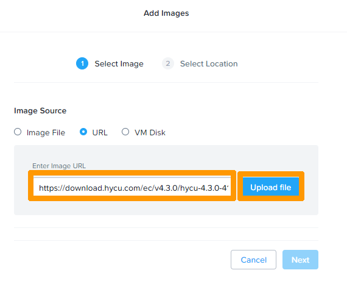{.thumbnail}

Enlevez l'extension .qcow2 derrière le nom `hycu-'4.3.0-4122`{.action} saissisez une `Description`{.action} et cliquez sur `Next`{.action}.

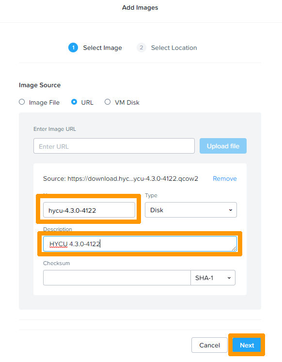{.thumbnail}

Cliquez sur `Save`{.action} pour importer l'image et attendez que l'image soit importée.

{.thumbnail}

Cliquez sur `nom du cluster`{.action} sur le nom du cluster pour aller dans **Prism Element**.

#### Configuration adresse IP pour ISCSI

{.thumbnail}

Allez dans les paramètres en cliquant sur l'icone représentant un `Engrenage`{.action}.

{.thumbnail}

Cliquez sur `Cluster Details`{.action}.

{.thumbnail}

Saisissez `une adresse IP non utilisée`{.action} sur le réseau local et cliquez sur `Save`{.action}.

{.thumbnail}

Vérifiez votre choix et cliquez sur `Yes`{.action}.

{.thumbnail}

L'adresse IP apparaire dans virtual IP

{.thumbnail}

#### Ajout compte utilisateur sur **Prism Element** pour HYCU

Dans **Prism Element** cliquez sur l'engrenage pour aller dans la configuration de **Prism Element**

{.thumbnail}

Faites défiler le menu et cliquez sur `Local User Management`{.action}.

{.thumbnail}

Cliquez sur `New User`{.action}.

{.thumbnail}

Saisissez le `svc_hycu`{.action} dans **Username**, `HYCU`{.action} pour **First Name** encore `HYCU`{.action} pour **Last Name**, `hycu@example.com`{.action} dans **Email**, `mot de passe`{.action} dans **Password**

Cochez la case `Cluster Admin`{.action} et cliquez sur `Save`{.action}

{.thumbnail}

L'utilisateur est créé.

{.thumbnail}

#### Création de la VM HYCU

Allez dans **Prism Central**

Au travers du menu principal cliquez sur `VMs`{.action} depuis le menu `Compute & Storage`{.action}.

{.thumbnail}

Cliquez sur `Create VM`{.action}.

{.thumbnail}

Nommez la machine virtuelle dans `Name`{.action} , Modifiez les propriétés de la machine virtuelle avec  `4 vCPU, 2 coeurs et 8 Gb`{.action} ensuite cliquez sur `Next`{.action}.

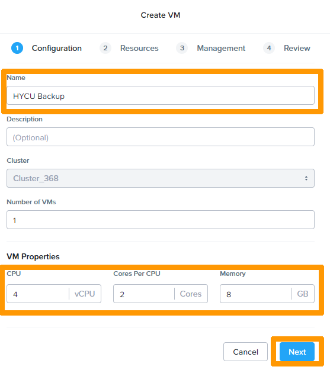{.thumbnail}

Cliquez sur `Attach Disk`{.action}.

{.thumbnail}

Choisissez `Disk`{.action} dans **Type**,  `Clone from Image`{.action} pour **Operation** et `hycu-4.3.0-4122`{.action} sur **Image** . Ensuite cliquez sur `Save`{.action}

{.thumbnail}

Cliquez sur `Attach Disk`{.action}

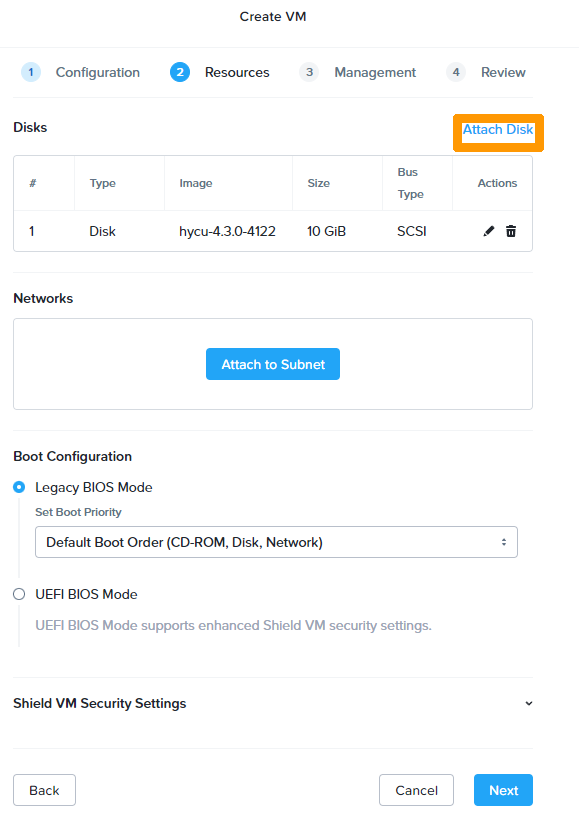{.thumbnail}

Choisissez `Disk`{.action} dans **Type**, `Allocate on Storage Container`{.action} pour **Operation** et `default-container`{.action} sur **Storage Container** . Changez la taille à dans capacity à `32Gib`{.action} et cliquez sur `Save`{.action}.

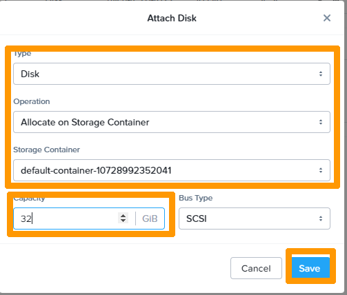{.thumbnail}

Cliquez sur `Attach to Subnet`{.action}

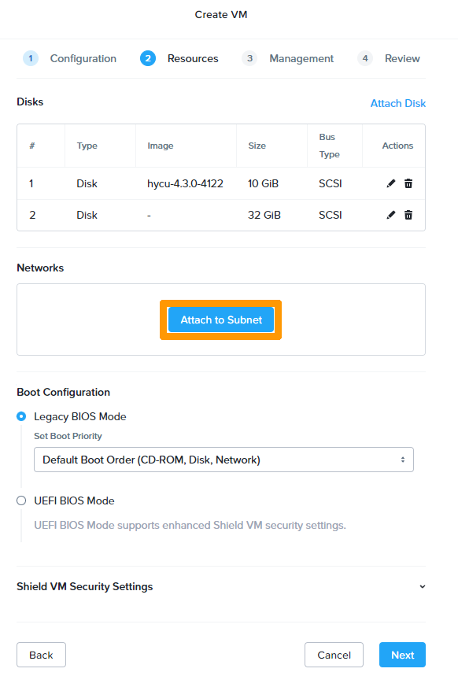{.thumbnail}

Sélectionnez le réseau `base`{.action} dans **Subnet** et `Connected`{.action} pour **Network Connection State** ensuite cliquez sur `Save`{.action}.

{.thumbnail}

Cliquez sur `Next`{.action}

{.thumbnail}

Modifiez les options de **Guest Customization** avec `Cloud-init (Linux)`{.action} dans **Script Type** et `Custom Script`{.action} pour **Configuration Method**.

Modifiez ce script avec ces valeurs

- < Adresse IP > par l'adresse IP locale du cluster.
- < GATEWAY > par la passerelle locale du cluster pour aller sur Internet.
- < DNS > par le DNS utilisé sur Internet.

```yaml
#cloud-config
bootcmd:
- /opt/grizzly/bin/cloud_init_setup.sh hycubc < Adresse IP > < GATEWAY >  < DNS > "hycu.local,ntnx.local"
```

Copiez `le script`{.action} et collez-le à l'emplacement réservé pour le script au dessous de **Clear Script**, ensuite cliquez sur `Next`{.action}.

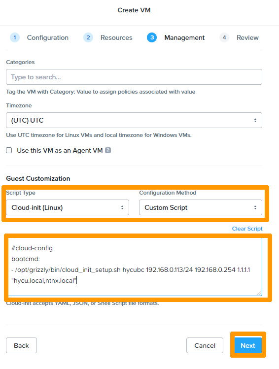{.thumbnail}

Cliquez sur `Create VM`{.action}.

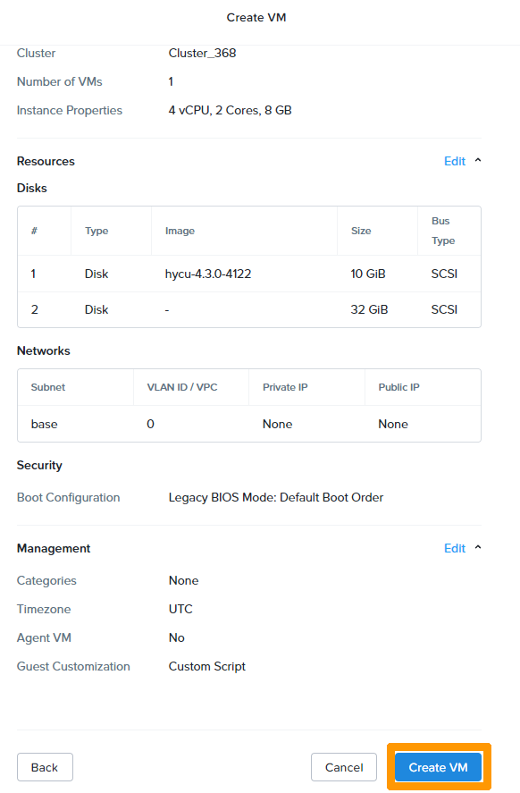{.thumbnail}

Sélectionnez la machine virtuelle créée en utilisant la `case à cocher`{.action} à droite de la machine virtuelle.

{.thumbnail}

Cliquez sur `Power On`{.action} dans le menu  `Actions`.

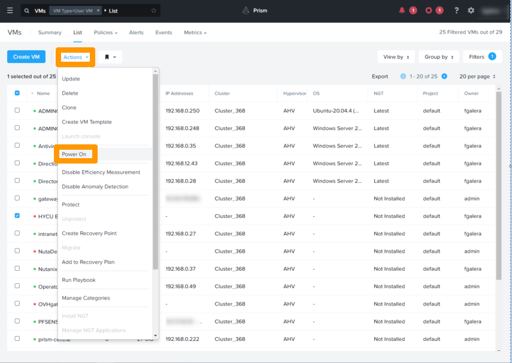{.thumbnail}.

La machine virtuelle est démarrée et possède l'adresse IP définie dans le fichier de script.

{.thumbnail}

#### Connexion et configuration d'HYCU

Connectez vous avec un navigateur à l'adresse IP interne ou externe si un redirection a été faite à l'interface d'administration d'HYCU qui doit avoir cette forme **https://adresseiplocale:8443** ou **https://adressepublique:8443**

Saisissez  `le mot de passe par défaut`{.action} et cliquez sur `Sign In`{.action}.

{.thumbnail}

En premier lieu il est nécessaire de changer le mot de passe de connexion.

Cliquez sur `Change Password`{.action} dans le menu `admin`{.action} en haut à droite de l'interface.

{.thumbnail}

Saisissez `le mot de passe par défaut`{.action} dans **OLD PASSWORD** , `le nouveau mot de passe`{.action} dans **PASSWORD** et **CONFIRM PASSWORD** ensuite cliquez sur `Save`{.action}.

{.thumbnail}

Nous allons connecter HYCU au cluster NUTANIX

Cliquez sur l'icône en forme `d'engrenage`{.action} en haut à gauche et choisir `Sources`{.action}

{.thumbnail}

Saisissez ces informations:

- URL: `https://url_prism_element_local:9440`{.action}
- USERNAME: utilisateur créé dans **Prism Element** pour HYCU
- PASSWORD: mot de passe de l'utilisateur **Prism Element** pour HYCU

Cliquez sur `Next`{.action}

{.thumbnail}

Saisissez ces informations:

- URL: `https://url_prism_central_local:9440`{.action}
- USERNAME: `utilisateur de Prism Central`{.action}
- PASSWORD: `mot de passe de Prism Central`{.action}

Cliquez sur `Next`{.action}.

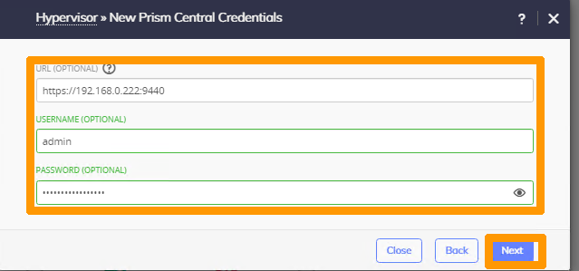{.thumbnail}

L'information `VALIDATION SUCCESSFUL` apparait pour signifier que les informations saisies sont correctes , cliquez sur `Save`{.action}.

{.thumbnail}

Cliquez sur `Close`{.action}.

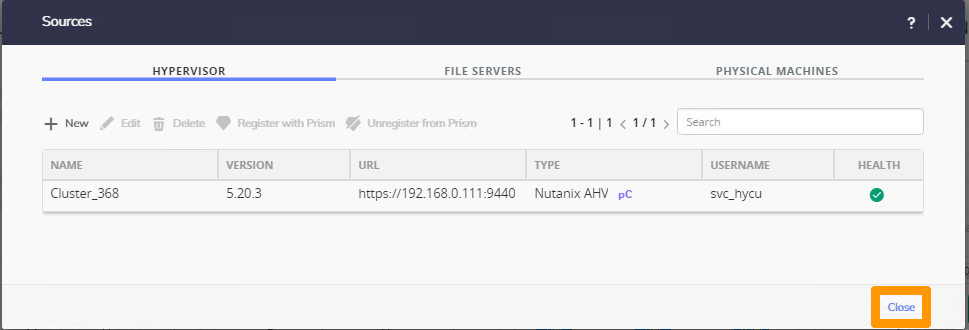{.thumbnail}

Sélectionnez `Targets`{.action} dans le menu à gauche et cliquez sur `+ Add`{.action} en haut à droite de l'interface.

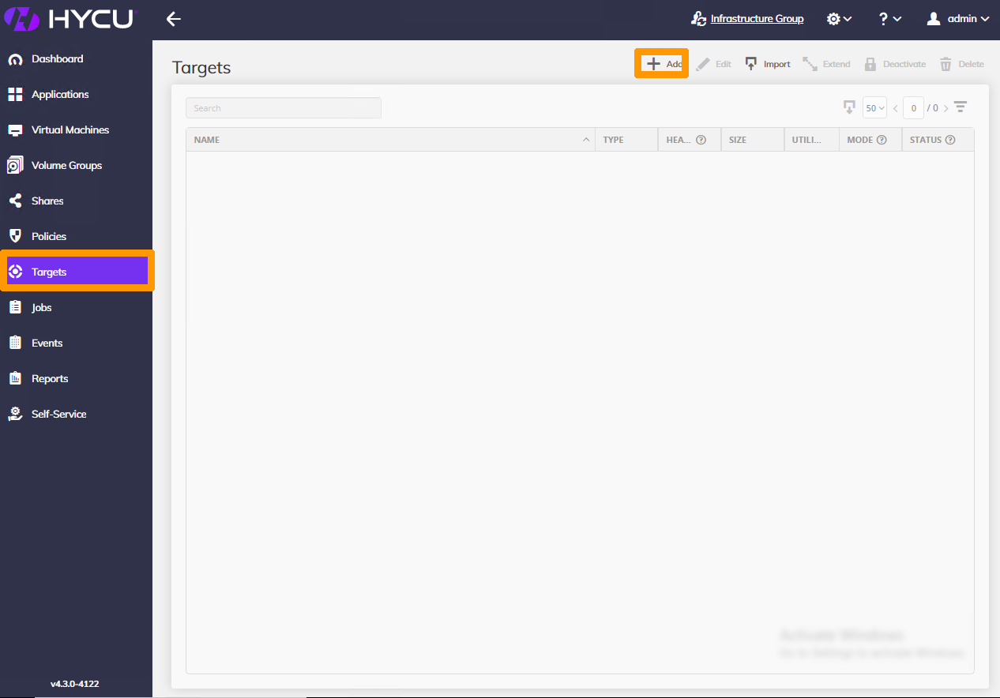{.thumbnail}

Saisissez ces informations fournies par OVHcloud lors d'un abonnement à **High Performance Object Storage** ou **Standard Object Storage (SWIFT)** d'OVHcloud.

- Name: `Nom`{.action}
- Size: `Taille du stockage`{.action}
- Type: `AWS S3/Compatible`{.action}

faites défilez la `barre de défilement`{.action}. 

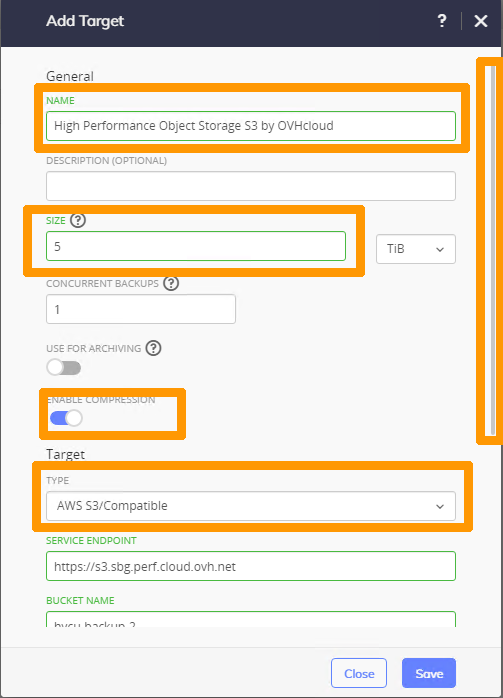{.thumbnail}.

Finalisez la saisie des informations:

- Service ENDPOINT: `URL Stockage S3`{.action}
- BUCKET NAME: `Nom du bucket`{.action}
- ACCESS KEY ID: `Clés d'accès au bucket`{.action}
- SECRET ACCESS KEY `clesecrete`{.action}

Activez la `TARGET ENCRYPTION`{.action} et cliquez sur `Save`{.action}.

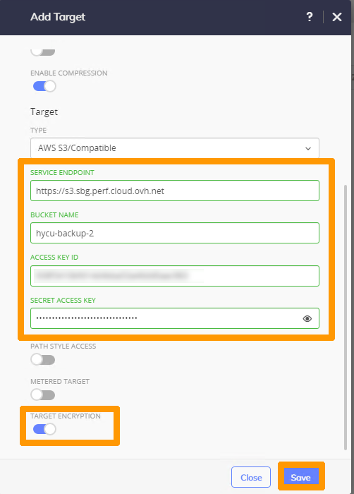{.thumbnail}.

La cible est activée elle servira pour les sauvegardes des machine virtuelle du cluster NUTANIX.

{.thumbnail}.

### Mise à jour d'HYCU

HYCU fournie régulierement des mises à jours voici le processus de mise à jours

#### Ajout des sources d'HYCU

Au travers du menu principal de ** Prism Central cliquez sur `Images`{.action} depuis le menu `Compute & Storage`{.action}

{.thumbnail}

Cliquez sur `Add Image`{.action}`.

{.thumbnail}

Sélectionnez `URL`{.action}` saisissez l'URL de l'image qcow2 de la dernière version d'HYCU comme par exemple 
`https://download.hycu.com/ec/v4.3.1/hotfixes/4.3.1-616/hycu-4.3.1-616.qcow2` et cliquez sur `Upload file`{.action}.

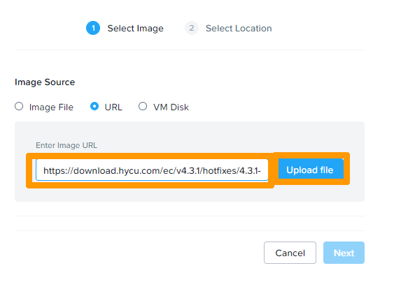{.thumbnail}

Enlevez l'extension .qcow2 derrière le nom `hycu-'4.3.1-616`{.action} saissisez une `Description`{.action} et cliquez sur `Next`{.action}.

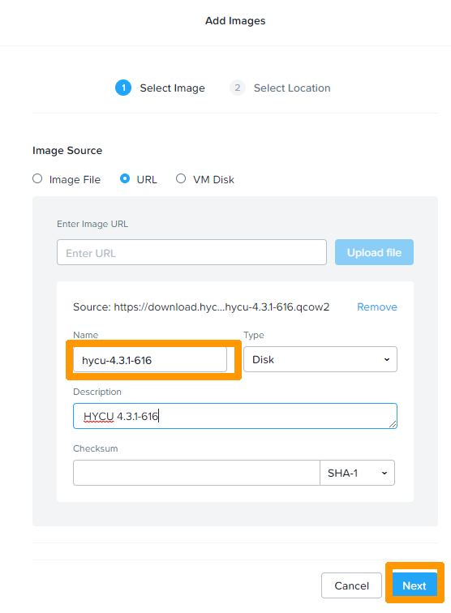{.thumbnail}

Cliquez sur `Save`{.action} pour importer l'image et attendez que l'image soit importée.

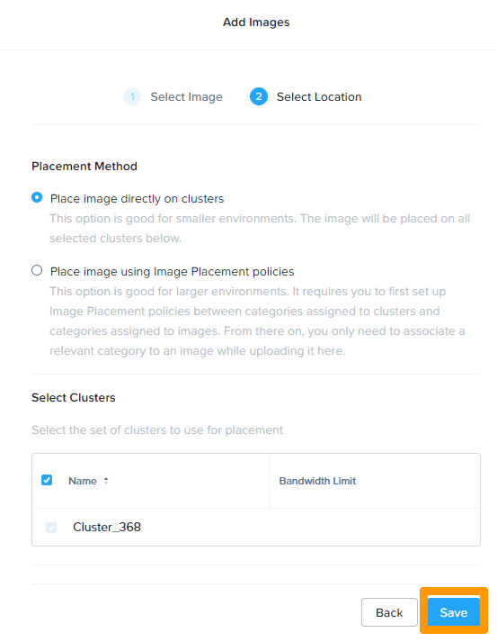{.thumbnail}

#### Lancement de la mise à jour à partir d'HYCU

Connectez-vous avec un navigateur à l'adresse IP interne ou externe si un redirection a été faite à l'interface d'administration d'HYCU qui doit avoir cette forme **https://adresseiplocale:8443** ou **https://adressepublique:8443**

Allez dans la configuration d'HYCU en cliquant sur l'icône en forme `d'engrenage`{.action} et choisir `Power Options`{.action}.

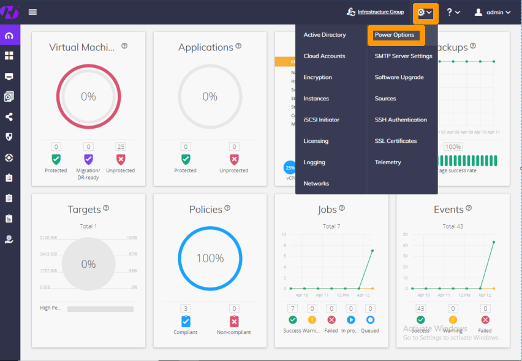{.thumbnail}
 
Séléctionnez sur `Suspend All`{.action}, cochez sur `AUTO RESUME AFTER`{.action} , laissez `1`{.action}  à Hours et cliquez sur `Save`{.action}.

{.thumbnail}

Revenez dans le menu de configuration en cliquant sur l'icône en forme `d'engrenage`{.action} et cliquez sur `Software Upgrade`{.action}.

{.thumbnail}

Choisissez la `Dernière version`{.action} dans **AVAILABLE VERSIONS** et cliquez sur `Software Upgrade`{.action}.

{.thumbnail}

Cliquez sur `Yes`{.action} pour lancer le processus de mise à jour.

{.thumbnail}

Lors du processus de mise à jour une sauvegarde d'une machine virtuelle est créée, et il est possible de revenir en arrière en cas d'échec de la mise à jour.

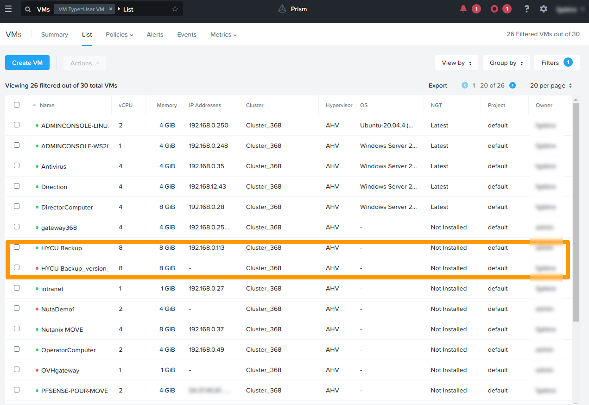{.thumbnail}

Reconnectez-vous à HYCU. 

Allez dans les paramètres en cliquant sur l'icône en forme `d'engrenage`{.action} et cliquez sur `Power Options`{.action}.

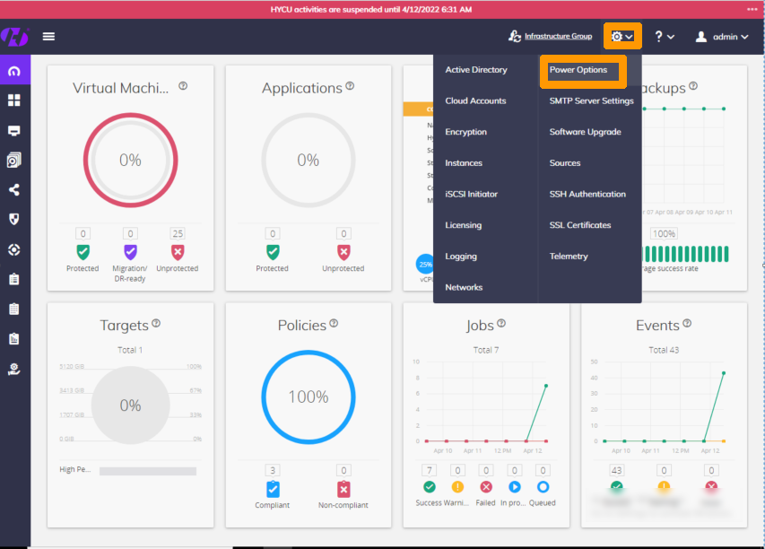{.thumbnail}

Décochez `Suspend All`{.action} et cliquez sur `Save`{.action}.

### Configuration de la sauvegarde

Restez dans l'interface HYCU.

#### Paramétrage des mots de passe de connexions au machines virtuelles

Connectez-vous sur les machines virtuelles en cliquant à gauche sur l'îcone `machines virtuelles`{.action} et cliquez sur l'îcone en forme de `Clé`{.action}

{.thumbnail}

Cliquez sur le signe `+`{.action}.

{.thumbnail}

Saisissez ces valeurs:

- NAME: `Nom du stockage de mot de passe`{.action}
- PROTOCOL: `AUTOMATIC`{.action}
- USERNAME: `compte utilisateur de la machine virtuelle`{.action}
- PASSWORD `mot de passe`{.action}

Cliquez sur `Save`{.action}

{.thumbnail}

Cliquez sur le signe `+`{.action} pour rajouter un autre compte.

{.thumbnail}

Saisissez ces valeurs:

- NAME: `Nom du stockage de mot de passe`{.action}
- PROTOCOL: `AUTOMATIC`{.action}
- USERNAME: `compte utilisateur de la machine virtuelle`{.action}
- PASSWORD `mot de passe`{.action}

Cliquez sur `Save`{.action}

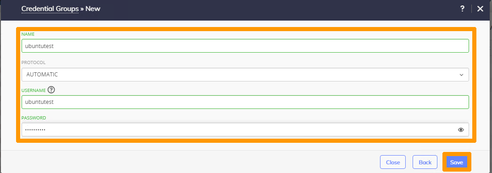{.thumbnail}

Cliquez sur `Close`{.action}

Sélectionnez les machines virtuelles qui vont utiliser un mot de passe en cochant `la case à cocher`{.action} à droite de la machine virtuelle et cliquez sur l'icône en forme de `Clé`{.action}.

{.thumbnail}

Sélectionnez dans NAME le `mot de passe`{.action} et cliquez sur `Assign`{.action}.

{.thumbnail}

Sélectionnez une autre machine virtuelle qui va utiliser un mot de passe en cochant `la case à cocher`{.action} à droite de la machine virtuelle et cliquez sur l'icône en forme de `Clé`{.action}.

{.thumbnail}

Sélectionnez dans NAME le `mot de passe`{.action} et cliquez sur `Assign`{.action}.

{.thumbnail}

#### Création des stratégies de sauvegardes

Cliquez sur l'îcone 


### test de restauration


## Aller plus loin

[Hyper-convergence Nutanix](https://docs.ovh.com/fr/nutanix/nutanix-hci/)


Échangez avec notre communauté d'utilisateurs sur <https://community.ovh.com/>.
