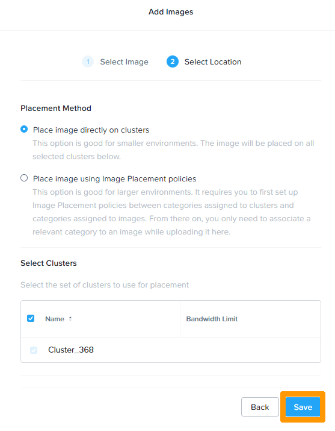
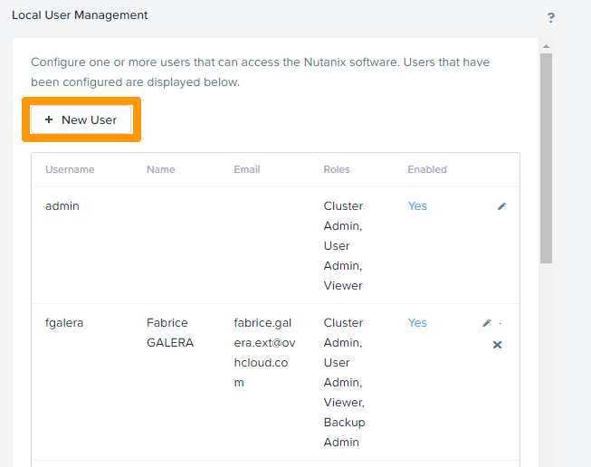

**Dernière mise à jour le 13/04/2022**

## Objectif

HYCU backup est un logiciel de sauvegarde disponible pour Nutanix. 

**Apprenez à installer , configurer HYCU sur un cluster Nutanix avec un stockage de type S3 chez OVHCloud**

> [!warning]
> OVHcloud vous met à disposition des services dont la configuration, la gestion et la responsabilité vous incombent. Il vous appartient donc de ce fait d’en assurer le bon fonctionnement.
>
> Ce guide a pour but de vous accompagner au mieux sur des tâches courantes. Néanmoins, nous vous recommandons de faire appel à un prestataire spécialisé si vous éprouvez des difficultés ou des doutes concernant l’administration, l’utilisation ou la mise en place d’un service sur un serveur.
>
> La licence HYCU n'est pas fournie par OVHcloud il faudra contacter le service commercial d'HYCU ou D'OVHcloud 

## Prérequis

- Disposer d'un cluster Nutanix dans votre compte OVHcloud
- Être connecté à votre [espace client OVHcloud](https://www.ovh.com/auth/?action=gotomanager&from=https://www.ovh.com/fr/&ovhSubsidiary=fr)
- Être connecté sur le cluster via Prism Central. 
- Avoir un abonnement de stockage chez OVHcloud comme **High Performance Object Storage** ou **Standard Object Storage (SWIFT)**

## En pratique

Connectez-vous à **Prism Central**.

Pour plus d'informations sur la connexion au cluster reportez-vous à la section « [Aller plus loin](#gofurther) » de ce guide. 

### Installation et configuration du logiciel HYCU

#### Ajout de l'image d'installation d'HYCU

Au travers du menu principal cliquez sur `Images`{.action} depuis le menu `Compute & Storage`{.action}

{.thumbnail}

Cliquez sur `Add Image`{.action}`.

{.thumbnail}

Sélectionnez `URL`{.action}` saisissez l'URL de l'image qcow2 de la dernière version d'HYCU comme par exemple 
`https://download.hycu.com/ec/v4.3.0/hycu-4.3.0-4122.qcow2` et cliquez sur `Upload file`{.action}.

{.thumbnail}

Enlevez l'extension .qcow2 derrière le nom `hycu-'4.3.0-4122`{.action} saissisez une `Description`{.action} et cliquez sur `Next`{.action}.

{.thumbnail}

Cliquez sur `Save`{.action} pour importer l'image et attendez que l'image soit importée.

{.thumbnail}

Cliquez sur `nom du cluster`{.action} sur le nom du cluster pour aller dans **Prism Element**.

#### Configuration adresse IP pour ISCSI

{.thumbnail}

Allez dans les paramètres en cliquant sur l'icone représentant un `Engrenage`{.action}.

{.thumbnail}

Cliquez sur `Cluster Details`{.action}.

{.thumbnail}

Saisissez `une adresse IP non utilisée`{.action} sur le réseau local et cliquez sur `Save`{.action}.

{.thumbnail}

Vérifiez votre choix et cliquez sur `Yes`{.action}.

{.thumbnail}

L'adresse IP apparaire dans virtual IP

{.thumbnail}

#### Ajout compte utilisateur sur **Prism Element** pour HYCU

Dans **Prism Element** cliquez sur l'engrenage pour aller dans la configuration de **Prism Element**

{.thumbnail}

Faites défiler le menu et cliquez sur `Local User Management`{.action}.

{.thumbnail}

Cliquez sur `New User`{.action}.

{.thumbnail}

Saisissez le `svc_hycu`{.action} dans **Username**, `HYCU`{.action} pour **First Name** encore `HYCU`{.action} pour **Last Name**, `hycu@example.com`{.action} dans **Email**, `mot de passe`{.action} dans **Password**

Cochez la case `Cluster Admin`{.action} et cliquez sur `Save`{.action}

{.thumbnail}

L'utilisateur est créé.

{.thumbnail}

#### Création de la VM HYCU

Allez dans **Prism Central**

Au travers du menu principal cliquez sur `VMs`{.action} depuis le menu `Compute & Storage`{.action}.

{.thumbnail}

Cliquez sur `Create VM`{.action}.

{.thumbnail}

Nommez la machine virtuelle dans `Name`{.action} , Modifiez les propriétés de la machine virtuelle avec  `4 vCPU, 2 coeurs et 8 Gb`{.action} ensuite cliquez sur `Next`{.action}.

{.thumbnail}

### Mise à jour d'HYCU

Installer l'image

Lancer la mise à jour à partir d'HYCU

### Configuration de la sauvegarde

### test de restauration

## Aller plus loin

[Hyper-convergence Nutanix](https://docs.ovh.com/fr/nutanix/nutanix-hci/)

Échangez avec notre communauté d'utilisateurs sur <https://community.ovh.com/>.
