**Dernière mise à jour le 03/01/2023**

## Objectif

**Ce guide vous montre comment redéployer Prism Central en mode X-LARGE sur trois machines virtuelles.**

> [!warning]
> OVHcloud vous met à disposition des services dont la configuration, la gestion et la responsabilité vous incombent. Il vous appartient donc de ce fait d’en assurer le bon fonctionnement.
>
> Ce guide a pour but de vous accompagner au mieux sur des tâches courantes. Néanmoins, nous vous recommandons de faire appel à un prestataire spécialisé si vous éprouvez des difficultés ou des doutes concernant l’administration, l’utilisation ou la mise en place d’un service sur un serveur.

## Prérequis

- Disposer d'un cluster Nutanix dans votre compte OVHcloud
- Être connecté à votre [espace client OVHcloud](https://www.ovh.com/auth/?action=gotomanager&from=https://www.ovh.com/fr/&ovhSubsidiary=fr)
- Être connecté sur le cluster via Prism Central
- Connaître le mot de passe admin de Prism Element (lors du déploiement d'un cluster Nutanix by OVHcloud; ce mot de passe est créé à l'identique de celui de Prism Central mais il peut être changé par la suite).

## Présentation

Il est possible de déployer Prism Central dans un dimensionnement personnalisé avec ces options :

- Small avec 6 vCPU, 26 Gb de mémoire et 500 Gb de stockage par machine virtuelle.
- Large avec 10 vCPU, 44 Gb de mémoire et 2500 Gb de stockage par machine virtuelle.
- X-Large avec 14 vCPU, 60 Gb de mémoire et 2500 Gb de stockage par machine virtuelle.

Le déploiement par défaut de Prism Central sur Nutanix by OVHcloud se fait sur une seule machine virtuelle en mode *Small*.

Lors d'un redéploiement d'un cluster à partir de l'espace client OVHcloud, il est possible de configurer Prism Central avec une ou trois machines virtuelles uniqument en mode *small*.

## En pratique

Nous allons voir comment remplacer Prism Central en Mode *Small* sur une seule machine virtuelle par un Prism Central en mode X-Large et ensuite étendre Prism Central sur 3 machines virtuelles pour plus de résilience.<br>
Le cluster Nutanix reste opérationnel pendant cette opération mais les fonctionnalités qui ont besoin de **Prism Central** seront supprimées.

### Configuration de l'accès à Prism Element en SSH avec le Load Balancer OVHcloud

Connectez-vous à votre espace client OVHcloud et choisissez l'onglet `Hosted Private Cloud`{.action}. Cliquez ensuite sur votre `Cluster`{.action} à gauche dans la catégorie **Nutanix**, faites défiler la fenêtre et cliquez sur le `Load Balancer`{.action} associé à votre cluster.

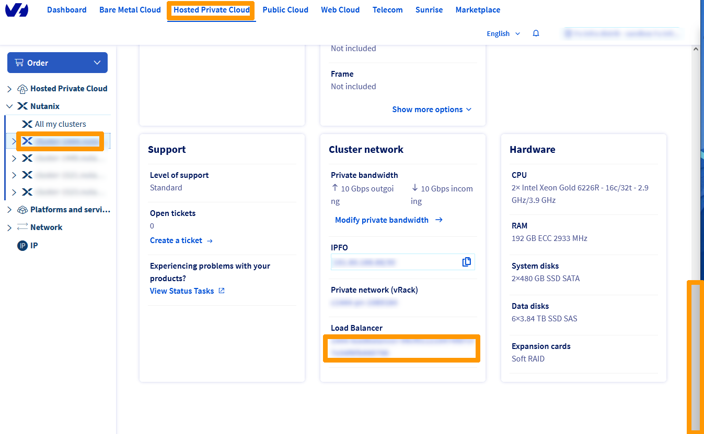{.thumbnail}

Dans les pages de configuration de votre Load Balancer, allez dans l'onglet `Ferme de serveurs`{.action} et cliquez sur `Ajouter une ferme de serveurs`{.action}.

{.thumbnail}

Saisissez ces informations :

- **Nom (facultatif)** : `PE SSH`.
- **Protocole** : `TCP`.
- **Port** : `22`.
- **Datacenter** : `Tous(ALL)`.
- **Réseau privé** : `nutanix`.

Cliquez ensuite sur `Ajouter`{.action}.

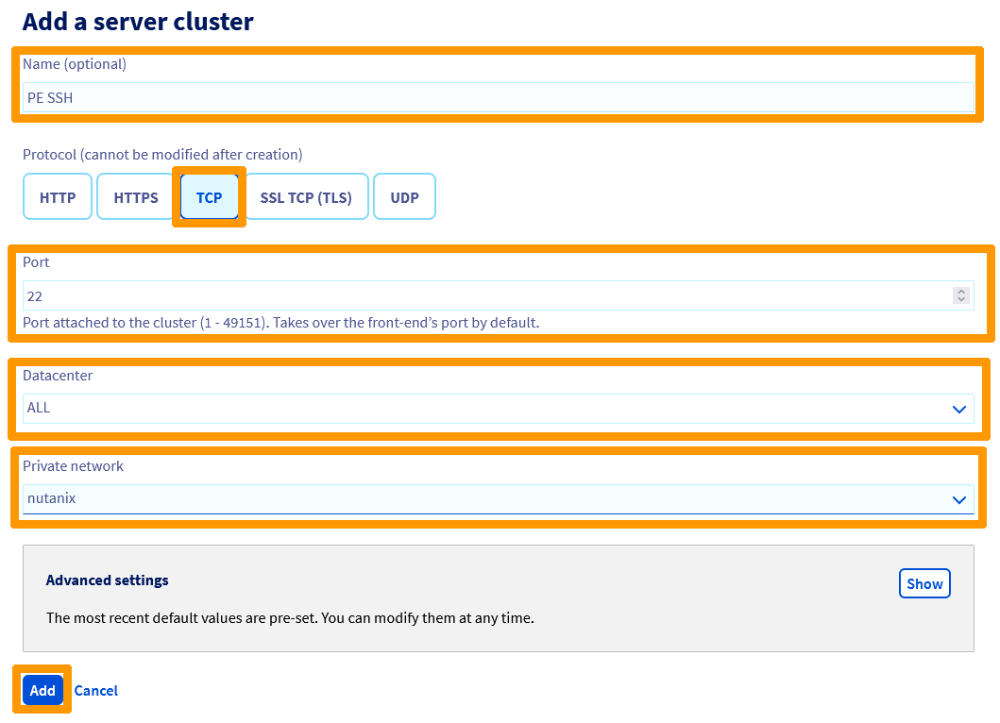{.thumbnail}

A l'intérieur de la ferme de serveurs, cliquez sur `Ajouter un serveur`{.action}.

{.thumbnail}

Complétez ces valeurs : 

- **Nom (facultatif)** : `PE SSH`.
- **adresse IPv4** : `Adresse IP de Prism Element`.
- **Port** : `22`.

Puis cliquez sur `Ajouter`{.action}.

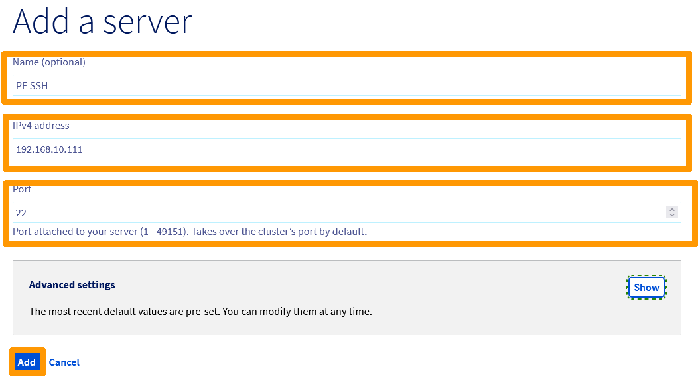{.thumbnail}

Cliquez sur `Appliquer la configuration`{.action} à droite du message d'avertissement « La configuration de votre load balancer n'est pas appliquée dans tous les datacenters ». 

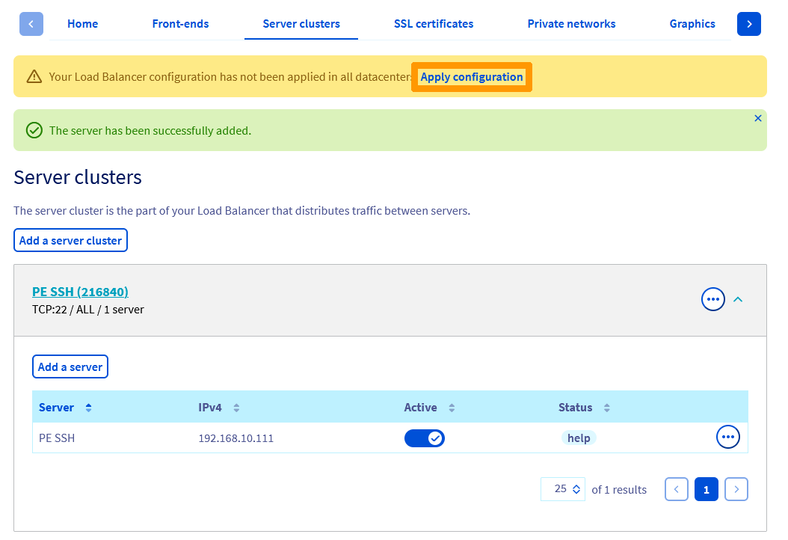{.thumbnail}

Sélectionnez votre site et cliquez sur `Appliquer la configuration`{.action}.

{.thumbnail}

Sélectionnez à nouveau votre site et cliquez sur `Appliquer la configuration`{.action}.

{.thumbnail}

Allez dans l'onglet `Tâches`{.action} pour voir l'avancement de la modification de la configuration.

{.thumbnail}

Lorsque la tâche sera terminée, allez dans l'onglet `Frontends`{.action} et cliquez sur `Ajouter un frontend`{.action}.

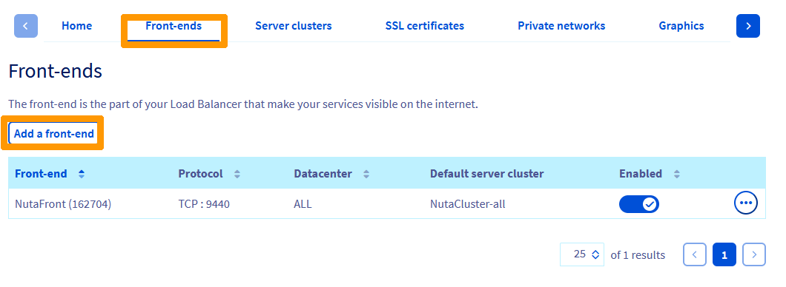{.thumbnail}

Saisissez ces informations :

- **Nom (facultatif)** : `PE-FRONTEND`.
- **Port** : `22`.
- **Datacenter** : `Tous(ALL)`.

Cliquez ensuite sur `Afficher`{.action}.

{.thumbnail}

Dans l'option **Restreindre l'accès à des IPs**, saisissez le réseau ou l'adresse IP qui aura l'autorisation d'accès sur Prism Element en SSH avec ce format XX.XX.XX.XX ou XX.XX.XX.XX/XX.

Cliquez ensuite sur `Ajouter`{.action}.

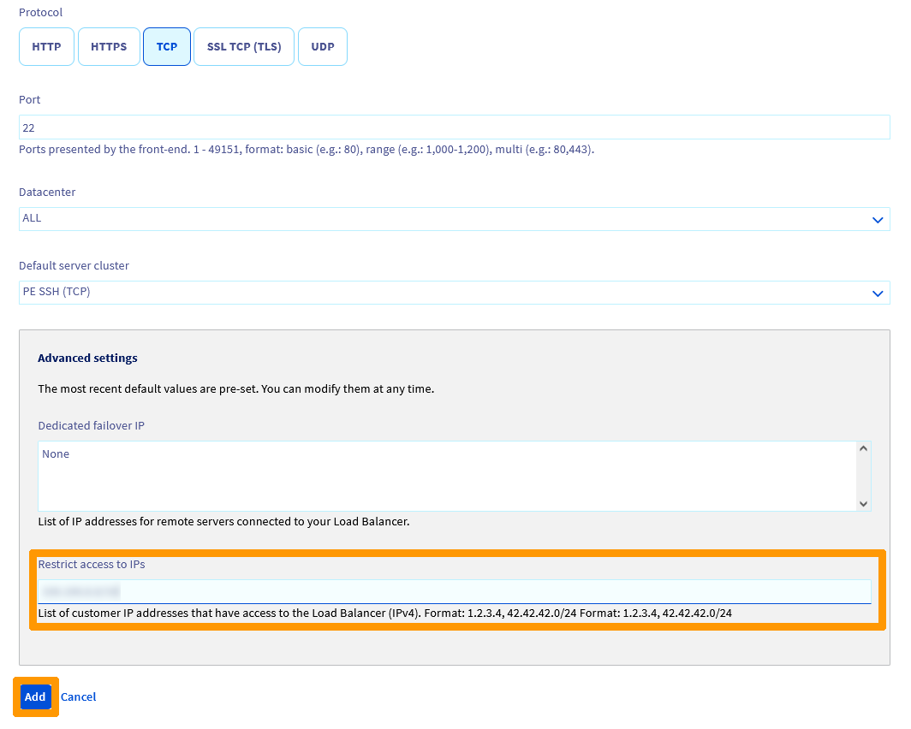{.thumbnail}

Cliquez sur `Appliquer la configuration`{.action} à droite du message d'avertissement « La configuration de votre load balancer n'est pas appliquée dans tous les datacenters ». 

{.thumbnail}

Sélectionnez votre site et cliquez sur `Appliquer la configuration`{.action}.

{.thumbnail}

Sélectionnez à nouveau votre site et cliquez sur `Appliquer la configuration`{.action}.

{.thumbnail}

Allez dans l'onglet `Tâches`{.action} pour voir l'avancement de la modification de la configuration.

{.thumbnail}

La configuration du Load Balancer est terminée, vous pouvez maintenant vous connecter en SSH sur la console Prism Element avec ces informations :

```bash
ssh admin@nutanix-cluster-ovhcloud-fqdn
```

ou :

```bash
ssh nutanix@nutanix-cluster-ovhcloud-fqdn
```

### Remplacement de la machine virtuelle Prism Central par une machine en mode X-Large

Exécutez ces commandes en ayant au préalable modifié ces informations :

- **\<Prism-Central-Private-IP-address\>** : Adresse IP privée de Prism Central
- **\<Prism-Element-Admin-Password\>** : Mot de passe du compte admin de Prism Element
- **\<Prism-Central-VM-Name\>** : Nom de la machine virtuelle Prism Central

```bash
# Disconnect Prism Element in Prism Central
ncli multicluster remove-from-multicluster external-ip-address-or-svm-ips=<Prism-Central-Private-IP-address> username=admin password=<Prism-Element-Admin-Password> force=true
# Delete VM
acli vm.delete <Prism-Central-VM-Name>
```

Connectez-vous ensuite à un hôte AHV du cluster avec cette commande :

```bash
ssh root@private-ip-address-of-one-ahv-servers
```

Exécutez cette commande pour récupérer le UUID de votre stockage par défaut, en ayant au préalable modifié ces paramètres :

- **\<Prism-Element-Password\>** : Mot de passe du compte admin de **Prism Element**.
- **\<Prism-Element-IP\>** : Adresse IP privée de Prism Element.

```bash
curl -k -H Accept:application/json -H Content-Type:application/json -u "admin:<Prism-Element-Password>" -X GET "https://<Prism-Element-Ip>:9440/PrismGateway/services/rest/v2.0/storage_containers/" | jq -r '[.entities[] | select( .name | contains("default-container")) | .storage_container_uuid][0]'
```

Exécutez ensuite cette autre commande pour récupérer l'UUID du réseau d'administration de votre cluster, avec les mêmes éléments à modifier que la commande précédente :

```bash
curl -s -k -H Accept:application/json -H Content-Type:application/json -u "admin:<Prism-Element-Password>" -X POST https://<prism6element-IP>:9440/api/nutanix/v3/subnets/list -d {} | jq -r "[.entities[] | select( .spec.name | contains(\"<subnet name>\")) | .metadata.uuid][0]"
```

Créez un fichier nommé **PrismCentralXlarge.json** avec les informations ci-dessous : 

```json
{
    "resources": {
        "version": "pc.2022.6.0.1",
        "should_auto_register": false,
        "initial_password": "<Prism-Central-Password>",
        "pc_vm_list": [
            {
                "vm_name": "prism-central",
                "container_uuid": "<Default-Container-UUID>",
                "num_sockets": 14,
                "data_disk_size_bytes": 2684354560000,
                "memory_size_bytes": 64424509440,
                "nic_list": [
                    {
                        "ip_list": [
                            "<Prism-Central-Private-IP-Address>"
                        ],
                        "network_configuration": {
                            "network_uuid": "<Nutanix-Network-Admin-UUID>",
                            "subnet_mask": "<Nutanix-Network-Admin-mask>",
                            "default_gateway": "<Nutanix-Network-Admin-Gateway>"
                        }
                    }
                ]
            }
        ]
    }
}
```

Remplacez ces éléments dans le fichier :

- **\<Prism-Central-Password\>** : Mot de passe de la future machine virtuelle Prism Central.
- **\<Default-Container-UUID\>** : UUID du stockage par défaut récupéré précédemment.
- **\<Prism-Central-Private-IP-Address\>** : Adresse IP privée de Prism Central.
- **\<Nutanix-Network-Admin-UUID\>** : UUID du réseau d'administration du cluster Nutanix.
- **\<Nutanix-Network-Admin-mask\>** : Masque de sous-réseau du réseau d'administration du cluster Nutanix.
- **\<Nutanix-Network-Admin-Gateway\>** : Passerelle par défaut du réseau d'administration du cluster Nutanix.


Exécutez cette commande pour déployer votre machine virtuelle Prism Central en mode X-Large, en modifiant au préalable ces paramètres :

- **\<Prism-Element-Password\>** : Mot de passe du compte admin de Prism Element.
- **\<Prism-Element-Private-IP-Address\>** : Adresse IP privée de Prism Element.

```bash
curl -k -H Accept:application/json -H Content-Type:application/json -u "admin:<Prism-Element-Password>" -X POST "https://<Prism-Element-Private-IP-Address>:9440/api/nutanix/v3/prism_central" -d @PrismCentralXlarge.json
```

> [!warning]
> Patientez pendant trente minutes pendant le déploiement de cette machine virtuelle.
>

Saisissez cette commande en modifiant ces options pour créer un fichier **pcregister.json** :

- **\<Prism-Central-Password\>** : Mot de Passe de Prism Central.
- **\<Prism-Central-Private-IP-Address\>** : Adresse IP privée de Prism Central.

```bash
echo "{\"username\":\"admin\",\"password\":\"<Prism-Central-Password>\",\"port\":9440,\"ipAddresses\":[\"<Prism-Central-Private-IP-Address>\"]}" > pcregister.json
```

Exécutez cette commande pour enregistrer Prism Element dans votre nouvelle machine virtuelle Prism Central en modifiant ces paramètres :

- **\<Prism-Element-Password\>** : Mot de passe du compte admin de Prism Element.
- **\<Prism-Element-Private-IP-Address\>** : Adresse IP privée de Prism Element.

```bash
curl -k -H Accept:application/json -H Content-Type:application/json -u "admin:<Prism-Element-Password>" -X POST "https://<Prism-Element-Private-IP-Address>:9440/PrismGateway/services/rest/v1/multicluster/prism_central/register" -d @pcregister.json
```

Prism Element est maintenant enregistré dans le nouveau Prism Central.

### Migration de Prism Central vers 3 machines virtuelles

Maintenant que Prism Element est rattaché à votre machine virtuelle Prism Central, vous allez vous connecter sur Prism Central et étendre Prism Central sur trois machines virtuelles.

Connectez-vous à Prism Central avec l'URL fournie lors du déploiement.

Saisissez vos informations personnelles, cochez la case `I have read and agree to the terms and conditions`{.action} et cliquez sur `Accept`{.action}.

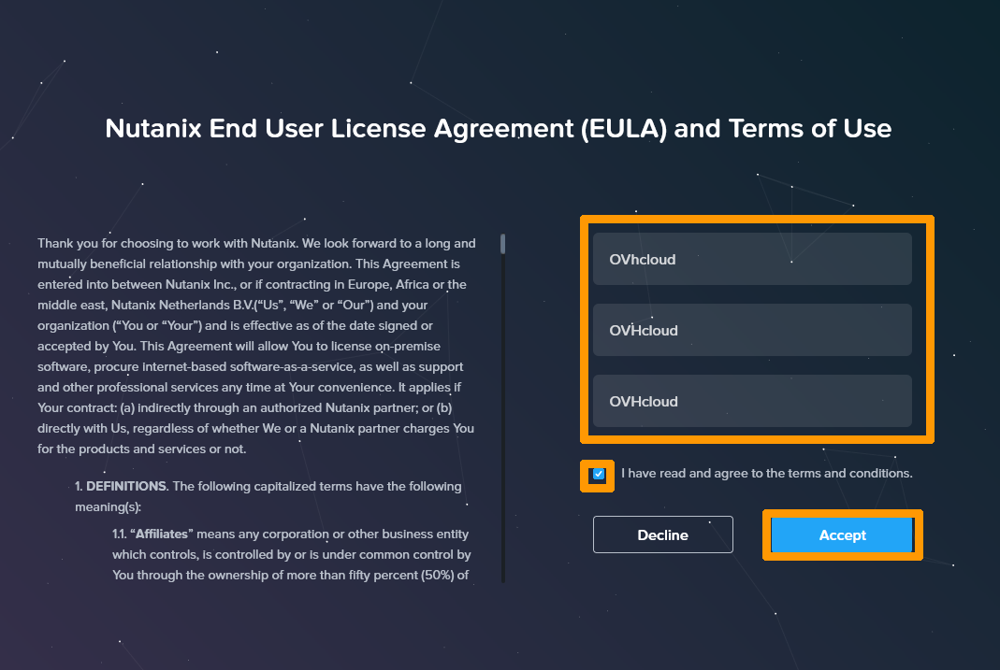{.thumbnail}

Cliquez sur `Continue`{.action} lors de la demande d'activation de Pulse.

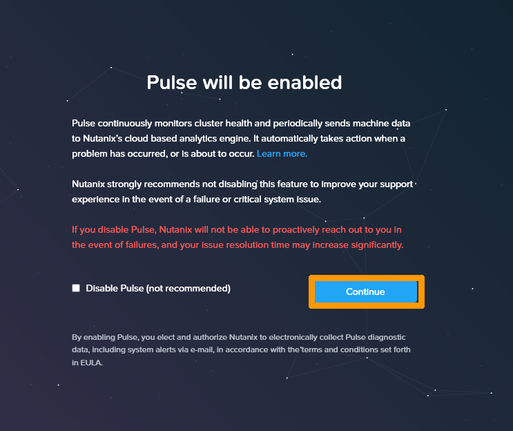{.thumbnail}

Cliquez sur l'icône de configuration de Prism Central en forme `d'engrenage`{.action}.

{.thumbnail}

Cliquez à gauche sur `Prism Central Management`{.action} et cliquez sur `Scale Out PC`{.action}.

{.thumbnail}

Cliquez sur `Confirm`{.action}.

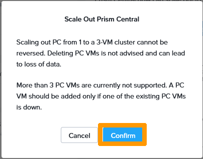{.thumbnail}

L'expansion de Prism Central nécessite trois adresses IP privées supplémentaires, une pour l'adresse IP virtuelle et deux pour les nouvelles machines virtuelles.

Faites défiler la fenêtre et saisissez ces informations :

- **Virtual IP** : Adresse IP privée virtuelle de Prism Central.
- **VM Name** : Nom de la deuxième machine virtuelle Prism Central.
- **IP** : Adresse IP privée de la deuxième machine virtuelle.
- **VM Name** : Nom de la troisième machine virtuelle Prism Central.
- **IP** : Adresse IP privée de la troisième machine virtuelle.

Cliquez sur `Expand`{.action}.

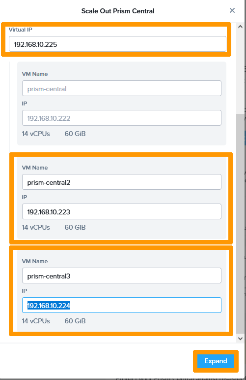{.thumbnail}

> [!warning]
> L'expansion est en cours et peut durer une trentaine de minutes, veuillez patienter pendant cette période.

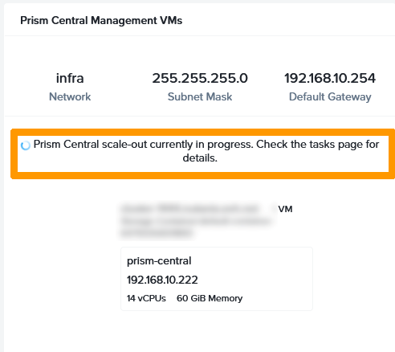{.thumbnail}

Une fois l'expansion terminée, la configuration apparaît dans Prism Central avec une adresse IP virtuelle et 3 adresses IP pour chaque machine virtuelle.

{.thumbnail}

### Modification du Load Balancer pour pointer sur l'adresse IP virtuelle de Prism Central

Nous allons remplacer l'adresse IP de l'URL de Prism Central par la nouvelle adresse IP virtuelle au travers de la configuration du Load Balancer OVHcloud.

Allez dans l'onglet `Ferme de serveurs`{.action}, positionnez-vous sur NutaClusterAll et cliquez sur l'icône de « flèche vers le bas » pour afficher les serveurs.

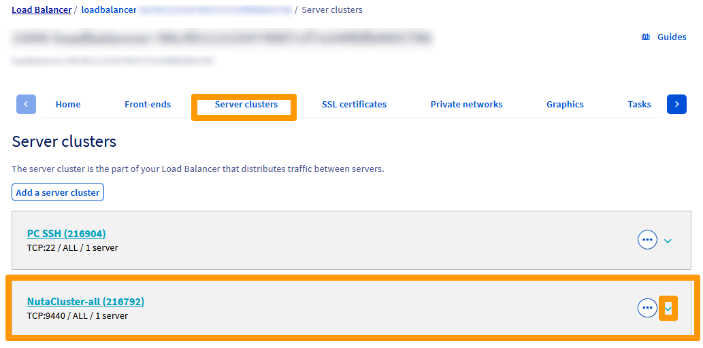{.thumbnail}

Cliquez sur `Ajouter un serveur`{.action}.

{.thumbnail}

Saisissez ces informations :

- **Nom (Facultatif)** : PC VIP comme Prism Central Virtual IP address.
- **Adresse IPv4** : Adresse IP privée virtuelle.
- **Port** : 9440.

Cliquez sur `Ajouter`{.action}.

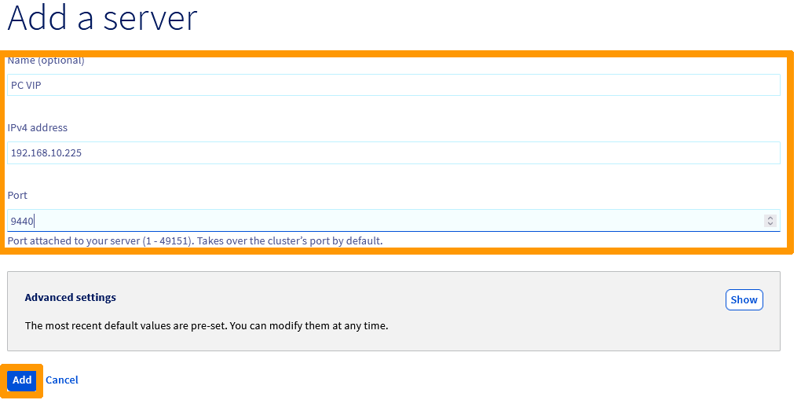{.thumbnail}

Cliquez sur l'icône de `Configuration`{.action} représentée par trois petits points à droite du serveur **prismCentral** et choisissez `Retirer`{.action} dans le menu.

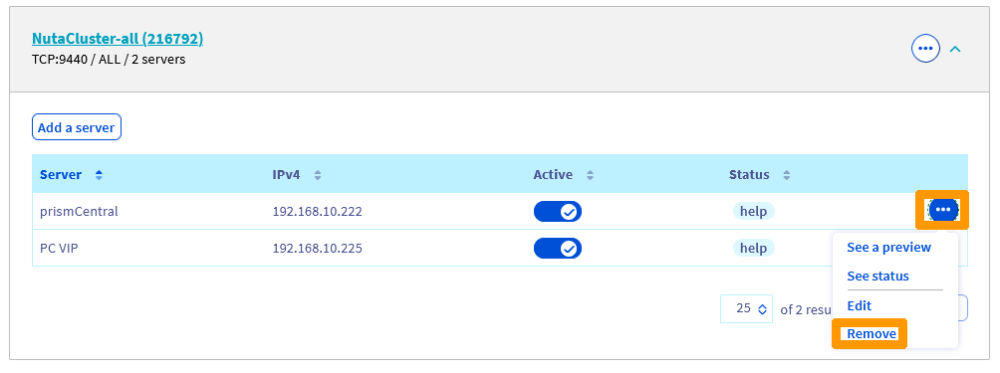{.thumbnail}

Cliquez sur `delete`{.action}.

{.thumbnail}

Cliquez sur `Appliquer la configuration`{.action}.

{.thumbnail}

Sélectionnez le `site`{.action} et cliquez sur `Appliquer la configuration`{.action}.

{.thumbnail}

Sélectionnez à nouveau le `site`{.action} et cliquez sur `Appliquer la configuration`{.action}.

{.thumbnail}

Allez dans l'onglet `Tâches`{.action} pour voir l'avancement des modifications. La tâche sera terminée quand le statut sera sur **done**.

{.thumbnail}

Vous disposez maintenant de Prism Central en mode X-LARGE avec trois machines virtuelles.

## Aller plus loin <a name="gofurther"></a>

Échangez avec notre communauté d'utilisateurs sur <https://community.ovh.com/>.

