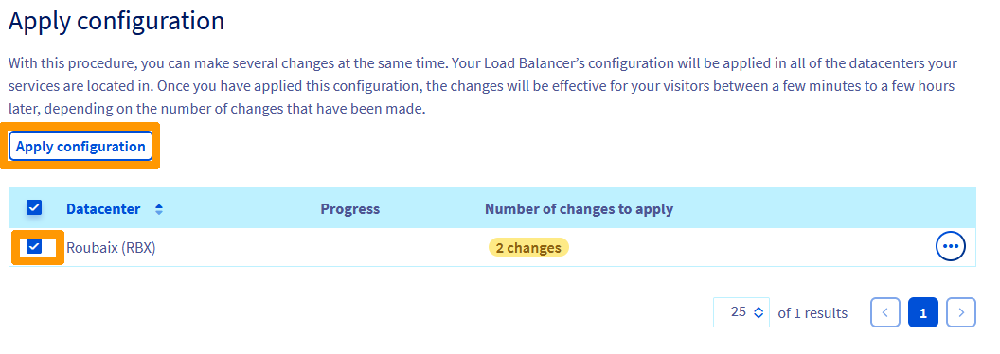
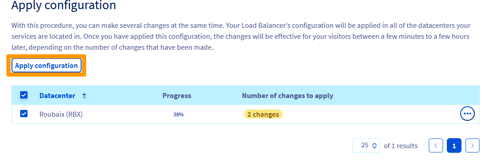
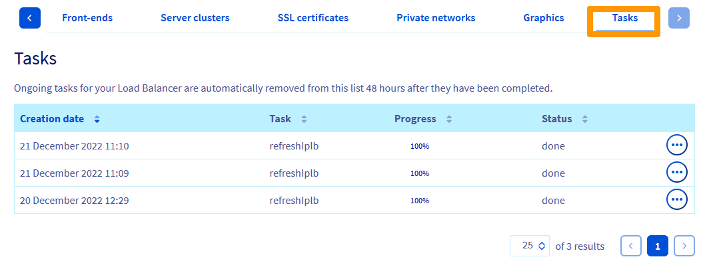
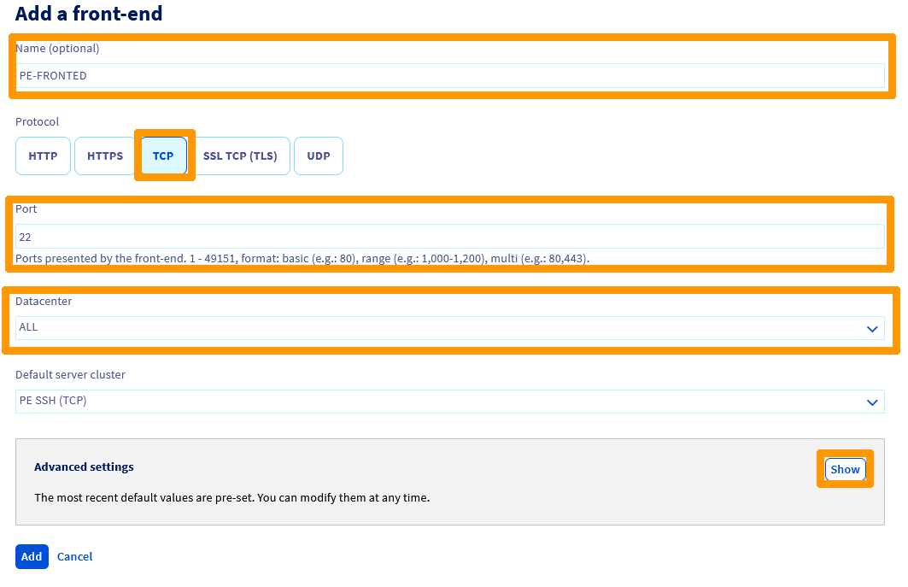
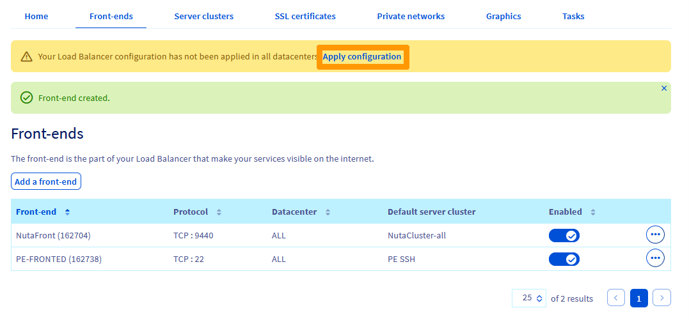

**Dernière mise à jour le 19/12/2022**

## Objectif

**Ce guide vous explique comment remplacer votre déploiement Prism Central initial sur une seule machine virtuelle a trois machine virtuelles**.


&gt [!warning]
&gt OVHcloud vous met à disposition des services dont la configuration, la gestion et la responsabilité vous incombent. Il vous appartient donc de ce fait d’en assurer le bon fonctionnement.
&gt
&gt Ce guide a pour but de vous accompagner au mieux sur des tâches courantes. Néanmoins, nous vous recommandons de faire appel à un prestataire spécialisé si vous éprouvez des difficultés ou des doutes concernant l’administration, l’utilisation ou la mise en place d’un service sur un serveur.

## Prérequis

- Disposer d'un cluster Nutanix dans votre compte OVHcloud
- Être connecté à votre [espace client OVHcloud](https://www.ovh.com/auth/?action=gotomanager&from=https://www.ovh.com/fr/&ovhSubsidiary=fr)
- Être connecté sur le cluster via Prism Central.
- Connaitre le mot de passe admin de Prism Element (Lors d'un déploiment de cluster ce mot de passe est le même que sur Prism Central mais il peut être changé par la suite).

## Présentation

Lorsque vous déployez votre cluster vous avez la possibilité de choisir le dimensionnement de Prism Central sur une ou trois machines virtuelles. Cette option est modifiable lorsque vous redéployer votre cluster mais toutes les données du cluster Nutanix sont effacées.&ltbr&gt

**Prism Central** peux être dimensionné avec une ou trois machines virtuelles pour une meilleure résilience, il est aussi possible d'avoir un dimensionnement de chaque machine virtuelles plus importante.

- Small avec 6 vCPU 26 Gb de mémoire et 500 Gb de stockage par machine virtuelle.
- Large avec 10 vCPU, 44 Gb de mémoire et 2500 Go de stockage par machine virtuelle.
- X-Large avec 14 vCPU, 60 Gb de mémoire et 2500 Gb de mémoire.

Le mode de déploiement de Prism Central sur les cluster Nutanix by OVHcloud est en mode *Small* avec une machine virtuelle ou trois machines virtuelles.

## En pratique

Nous allons voir comment remplacer Prism Central en Mode Small sur une seule machine virtuelle par un Prism Central en mode X-Large et ensuite étendre Prism Central sur 3 machines virtuelles pour plus de résiliance

&gt [!warning]
&gt Le remplacement du mode de fonctionnement de Prism Central implique la suppression de Prism Central et de toutes les options gérées par Prism Central (Microsegmentation, Disaster recovery, etc...)
&gt

### Paramètrage de l'accès à Prism Element via l'espace client OVHcloud

Nous allons créer un accès à Prism Element en SSH avec le Load Balancer.

Allez dans votre espace client OVHcloud choisissez l'onglet `Hosted Private Cloud`{.action} en haut, ensuite dans la rubrique Nutanix à gauche cliquez sur votre `Cluster`{.action} et faite défiler la fenêtre et cliquez sur le  `Load Balancer`{.action} associé à votre cluster.

{.thumbnail}

Dans les pages de de configuration de votre Load Balancer allez dans l'onglet `Ferme de serveurs`{.action} et cliquez sur 

`Ajouter une ferme de serveurs`{.action}.

{.thumbnail}

Saisissez ces informations :

* **** : ``

* **Nom (facultatif)** : `PE SSH`
* **Protocole** : `TCP`
* **Port** : `22`
* **Datacenter** : `Tous(ALL)`
* **Réseau privé** : `nutanix`

Ensuite cliquez sur `Ajouter`{.action}

{.thumbnail}

A l'intérieur de la ferme de serveurs cliquez sur `Ajouter un serveur`{.action}.

{.thumbnail}

Completez ces valeurs : 

* **Nom (facultatif)** : `PE SSH`
* **adresse IPv4** : `Prism Element IP Address`
* **Port** : `22`

Et cliquez sur `Ajouter`{.action}

{.thumbnail}

Cliquez sur `Appliquer la configuration`{.action} à l'intérieur de l'encadré jaune.

{.thumbnail}

Sélectionnez votre site et cliquez sur `Appliquer la configuration`{.action}.

{.thumbnail}

Sélectionnez à nouveau votre site et cliquez sur `Appliquer la configuration`{.action}.

{.thumbnail}

Allez dans l'onglet `Tâches`{.action} pour voir l'avancement de la modification de la configuration.

{.thumbnail}

Quand la tâche sera finie allez dans l'onglet `Frontends`{.action} et cliquez sur `Ajouter un frontend`{.action}.

{.thumbnail}

Saisissez ces informations :

* **Nom (facultatif)** : `PE-FRONTEND`
* **Port** : `22`
* **Datacenter** : `Tous(ALL)`

Ensuite cliquez sur `Afficher`{.action}.

{.thumbnail}

Dans l'option **Restreindre l'accès à des IPs** saisissez le réseau ou l'adresse ip qui aura l'autorisation d'accès sur Prism Element en SSH au ormation XX.XX.XX.XX ou XX.XX.XX.XX/XX.

Et cliquez sur `Ajouter`{.action}.

{.thumbnail}

Cliquez sur `Appliquer la configuration`{.action} à l'intérieur de l'encadré jaune.

{.thumbnail}

Sélectionnez votre site et cliquez sur `Appliquer la configuration`{.action}.

{.thumbnail}

Sélectionnez votre site et cliquez sur `Appliquer la configuration`{.action}.

{.thumbnail}

Allez dans l'onglet `Tâches`{.action} pour voir l'avancement de la modification de la configuration.

{.thumbnail}

La configuration du Load Balancer est terminée, vous pouvez maintenant vous connecter en ssh sur la console Prism Element avec ces informations :

```bash
ssh admin@cluster-nutanix-fqdn
``` 
ou 

```bash
ssh nutanix@cluster-nutanix-fqdn
```

### Remplacement de la machine virtuelle Prism Central par une machine en mod X-LARGE

Exécutez ces commandes en ayant au préalable modifié ces informations :

* **&ltPrism-Central-Private-IP-address&gt** : Adresse IP privé de Prism Central
* **&ltPrism-Element-Admin-Password&gt** : Mot de passe du compte admin de Prism Element
* **&ltPrism-Central-VM-Name&gt** : nom de la machine virtuelle Prism Central

```bash
# Disconnect Prism Element in Prism Central
ncli multicluster remove-from-multicluster external-ip-address-or-svm-ips=&ltPrism-Central-Private-IP-address&gt username=admin password=&ltPrism-Element-Admin-Password&gt force=true
# Delete VM
acli vm.delete &ltPrism-Central-VM-Name&gt
```

Ensuite connectez vous à un hôte AHV du cluster avec cette commande

```bash
ssh root@private-ip-address-of-one-ahv-servers
```

Exécutez cette commande pour récupérer le UUID de votre stockage par défaut en ayant modifié ces paramètres :

* **&ltPrism-Element-Password&gt** : Mot de passe du compte admin de **Prism Element**.
* **&ltPrism-Element-IP&gt** : Adresse IP privée de Prism Element.

```bash
curl -k -H Accept:application/json -H Content-Type:application/json -u "admin:&ltPrism-Element-Password&gt" -X GET "https://&ltPrism-Element-Ip&gt:9440/PrismGateway/services/rest/v2.0/storage_containers/" | jq -r '[.entities[] | select( .name | contains("default-container")) | .storage_container_uuid][0]'
```

Et cette commande pour récuperer l'UUID du réseau d'administration de votre cluster avec les mêmes éléments à modifier que la commande précedente :

```bash
curl -s -k -H Accept:application/json -H Content-Type:application/json -u "admin:&ltPrism-Element-Password&gt" -X POST https://&ltprism element ip&gt:9440/api/nutanix/v3/subnets/list -d {} | jq -r "[.entities[] | select( .spec.name | contains(\"&ltsubnet name&gt\")) | .metadata.uuid][0]"
```

Créez un fichier nommé **PrismCentralXlarge.json** et rajouter ce texte en remplaçant ces élements :

* **&ltPrism-Central-Password&gt** : Mot de passe de la future machine virtuelle Prism Central.
* **&ltDefault-Container-UUID&gt** : UUID du stockage par défaut récupéré précedemment.
* **&ltPrism-Central-Private-IP-Address&gt** : Adresse IP privé de Prism Central.
* **&ltNutanix-Network-Admin-UUID&gt** : UUID du réseau d'administration du cluster Nutanix.
* **&ltNutanix-Network-Admin-mask&gt** : Masque de sous réseaux du réseau d'administration du cluster Nutanix.
* **&ltNutanix-Network-Admin-Gateway&gt** : Passerelle par défaut du réseau d'administration du cluster Nutanix.

```json
{
    "resources": {
        "version": "pc.2022.6.0.1",
        "should_auto_register": false,
        "initial_password": "&ltPrism-Central-Password&gt",
        "pc_vm_list": [
            {
                "vm_name": "prism-central",
                "container_uuid": "&ltDefault-Container-UUID&gt",
                "num_sockets": 14,
                "data_disk_size_bytes": 2684354560000,
                "memory_size_bytes": 64424509440,
                "nic_list": [
                    {
                        "ip_list": [
                            "&ltPrism-Central-Private-IP-Address&gt"
                        ],
                        "network_configuration": {
                            "network_uuid": "&ltNutanix-Network-Admin-UUID&gt",
                            "subnet_mask": "&ltNutanix-Network-Admin-mask&gt",
                            "default_gateway": "&ltNutanix-Network-Admin-Gateway&gt"
                        }
                    }
                ]
            }
        ]
    }
}
```

Executer cette commande pour déployer votre machine virtuelle Prism Central en mode X-Large en modifiant ces paramètres

* **&ltPrism-Element-Password&gt** : Mot de passe du compte admin de Prism Element
* **&ltPrism-Element-Private-IP-Address&gt** : Adresse IP privée de Prism Element


...bash
curl -k -H Accept:application/json -H Content-Type:application/json -u "admin:&ltPrism-Element-Password&gt" -X POST "https://&ltPrism-Element-Private-IP-Address&gt:9440/api/nutanix/v3/prism_central" -d @PrismCentralXlarge.json
...

&gt [!warning]
&gt Patientez pendant trente minutes pendant le déploiement de cette machine virtuelles
&gt

Saisissez cette commande en modifiant ces options pour créer un fichier **pcregister.json**

* **&ltPrism-Central-Password&gt** : 
* **&ltPrism-Central-Private-IP-Address&gt** :

...bash
echo "{\"username\":\"admin\",\"password\":\"&ltPrism-Central-Password&gt\",\"port\":9440,\"ipAddresses\":[\"&ltPrism-Central-Private-IP-address&gt\"]}" &gtpcregister.json
...

Executez cette commande pour enregistrer Prism Element dans votre nouvelle machine virtuelle Prism Central en modifiant ces paramètres :

* **&ltPrism-Element-Password&gt** : Mot de passe du compte admin de Prism Element
* **&ltPrism-Element-Private-IP-Address&gt** : 

...bash
curl -k -H Accept:application/json -H Content-Type:application/json -u "admin:&ltPrism-Element-Password&gt" -X POST "https://&ltPrism-Element-Private-IP-Address&gt:9440/PrismGateway/services/rest/v1/multicluster/prism_central/register" -d @pcregister.json
...

Prism Element est maintenant enregistré dans le nouveau Prism Central.

### Migration sur mode de Prism Central vers 3 machines virtuelles


## Aller plus loin &lta name="gofurther"&gt&lt/a&gt


[Hyper-convergence Nutanix](https://docs.ovh.com/fr/nutanix/nutanix-hci/)

Échangez avec notre communauté d'utilisateurs sur &lthttps://community.ovh.com/&gt.

