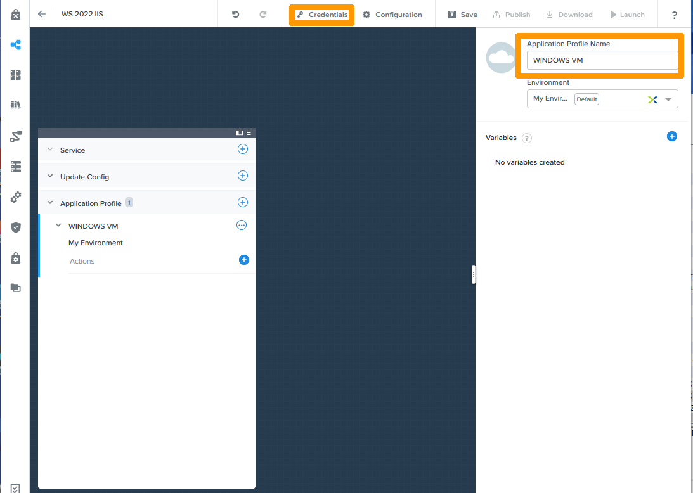
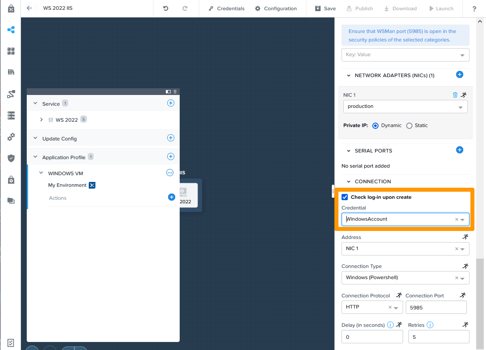

**Dernière mise à jour le 11/01/2023**

## Objectif

**Ce guide vous montre comment mettre en place NCM Self-Service (Calm) sur votre cluster Nutanix**

> [!warning]
> OVHcloud vous met à disposition des services dont la configuration, la gestion et la responsabilité vous incombent. Il vous appartient donc de ce fait d’en assurer le bon fonctionnement.
>
> Ce guide a pour but de vous accompagner au mieux sur des tâches courantes. Néanmoins, nous vous recommandons de faire appel à un prestataire spécialisé si vous éprouvez des difficultés ou des doutes concernant l’administration, l’utilisation ou la mise en place d’un service sur un serveur.

## Prérequis

- Disposer d'un cluster Nutanix dans votre compte OVHcloud
- Être connecté à votre [espace client OVHcloud](https://www.ovh.com/auth/?action=gotomanager&from=https://www.ovh.com/fr/&ovhSubsidiary=fr)
- Être connecté sur le cluster via Prism Central
- D'avoir des licences en BYOL pour ce service (Ces licences ne sont pas disponibles avec le Pack advanced).
- Posséder un VLAN supplémentaire dans votre cluster qui fait propose du DCHP en IPAM et qui a accès à Internet 

## Présentation

NCM Self Service est une solution d'orchestration hétorogène qui permet l'administration de votre infrastucture à la fois sur la gestion des machines virtuelles et sur des serveurs distants. Il est possible de déployer et de maintenir des applications et des services.

## En pratique

Nous allons activer CALM, créer deux applications et les publier sur le portail d'applications.

Le deux applications que nous allons publier seront :

- Un serveur WEB Nginx sous Linux Ubuntu.
- Un serveur WEB IIS sous Windows server.

### Activation de CALM

Avant d'activer CALM il ajouter une interface 

Au travers du menu de Prism Central cliquez sur `Calm`{.action} dans la rubrique Services.


### Création d'un projet

Cliquez sur l'icône `Project`{.action} dans la rubrique Services.


### Création d'applications

Nous allons crééer deux applications, tester le bon fonctionnement et les publier dans le marketplace du cluster.

#### Création de l'application WEB IIS sous Windows

Dans la barre verticale choisissez `Blueprints`{.action}, faite défiler le menu `Create Blueprint`{.action} et cliquez sur sur `Multi VM/Pod Blueprint`{.action}.


Choisissez le `nom`{.action} de votre plan dans **Name** et cliquez sur `Proceed`{.action}.


Saisissez le `nom`{.action} dans **Application Profile Name** et cliquez sur  `Credentials`{.action} en haut.



Nous allons créer le compte Windows il sera utilisé à l'interieur de sysprep en tant que variable et dans la configuration des tâches d'installation du plan et le test de connexion distant.

Cliquez sur bouton `+`{.action} à coté de Credentials.


Saisissez ces informations :

- **Name** : `WindowsAccount`
- **Username** : `administrator`
- **Password** : `Mot de passe du compte administrator`

et cliquez sur `Done`{.action}.


CLiquez sur `Back`{.action}.


Cliquez sur le bouton `+`{.action} à gauche à coté de **Service**.


Saisissez ces informations :

- **Name** : `VM IIS`
- **Operation System** : `Windows`

et cliquez sur `Clone from environment`{.action}.


Faites défilez la fenêtre de droite, cochez `Guest Customization`{.action}, cliquez sur `Sysprep`{.action}, ensuite copiez le contenu du fichier sysprep ci-dessous dans **Script** :

> [!primary]
> Le fichier a été généré à partir des outils Windows ADK téléchargeables sur ce  [lien](https://learn.microsoft.com/en-us/windows-hardware/get-started/adk-install#download-the-adk-for-windows-11) et a été ensuite adapté en rajoutant des variables venant de Nutanix CALM comme `@@{WindowsAccount.secret}@@` qui représente le mot de passe du compte WindowsAccount.
> 

```xml
<?xml version="1.0" encoding="utf-8"?>
<unattend xmlns="urn:schemas-microsoft-com:unattend">
    <settings pass="windowsPE">
        <component name="Microsoft-Windows-International-Core-WinPE" processorArchitecture="amd64" publicKeyToken="31bf3856ad364e35" language="neutral" versionScope="nonSxS" xmlns:wcm="http://schemas.microsoft.com/WMIConfig/2002/State" xmlns:xsi="http://www.w3.org/2001/XMLSchema-instance">
            <SetupUILanguage>
                <UILanguage>en-US</UILanguage>
                <WillShowUI>Never</WillShowUI>
            </SetupUILanguage>
            <InputLocale>0409:00000409</InputLocale>
            <SystemLocale>en-US</SystemLocale>
            <UILanguage>en-US</UILanguage>
            <UserLocale>en-US</UserLocale>
        </component>
        <component name="Microsoft-Windows-Setup" processorArchitecture="amd64" publicKeyToken="31bf3856ad364e35" language="neutral" versionScope="nonSxS" xmlns:wcm="http://schemas.microsoft.com/WMIConfig/2002/State" xmlns:xsi="http://www.w3.org/2001/XMLSchema-instance">
            <UserData>
                <AcceptEula>true</AcceptEula>
                <FullName>Nutanix Doc</FullName>
                <Organization>Nutanix Doc</Organization>
            </UserData>
            <EnableFirewall>true</EnableFirewall>
            <EnableNetwork>true</EnableNetwork>
        </component>
    </settings>
    <settings pass="specialize">
        <component name="Microsoft-Windows-Shell-Setup" processorArchitecture="amd64" publicKeyToken="31bf3856ad364e35" language="neutral" versionScope="nonSxS" xmlns:wcm="http://schemas.microsoft.com/WMIConfig/2002/State" xmlns:xsi="http://www.w3.org/2001/XMLSchema-instance">
            <TimeZone>Central Standard Time</TimeZone>
            <AutoLogon>
                <Password>
                    <Value>@@{WindowsAccount.secret}@@</Value>
                    <PlainText>true</PlainText>
                </Password>
                <Enabled>true</Enabled>
                <Username>administrator</Username>
                <LogonCount>1</LogonCount>
            </AutoLogon>
        </component>
    </settings>
    <settings pass="oobeSystem">
        <component name="Microsoft-Windows-Shell-Setup" processorArchitecture="amd64" publicKeyToken="31bf3856ad364e35" language="neutral" versionScope="nonSxS" xmlns:wcm="http://schemas.microsoft.com/WMIConfig/2002/State" xmlns:xsi="http://www.w3.org/2001/XMLSchema-instance">
            <UserAccounts>
                <AdministratorPassword>
                    <Value>@@{WindowsAccount.secret}@@</Value>
                    <PlainText>true</PlainText>
                </AdministratorPassword>
            </UserAccounts>
            <OOBE>
                <HideEULAPage>true</HideEULAPage>
                <HideOEMRegistrationScreen>true</HideOEMRegistrationScreen>
                <HideOnlineAccountScreens>true</HideOnlineAccountScreens>
                <HideWirelessSetupInOOBE>true</HideWirelessSetupInOOBE>
                <ProtectYourPC>1</ProtectYourPC>
                <HideLocalAccountScreen>true</HideLocalAccountScreen>
            </OOBE>
            <FirstLogonCommands>
                <SynchronousCommand wcm:action="add">
                    <CommandLine>powershell Set-NetConnectionProfile -NetworkCategory Private</CommandLine>
                    <Order>1</Order>
                </SynchronousCommand>
                <SynchronousCommand wcm:action="add">
                    <CommandLine>powershell Set-WSManQuickConfig -Force</CommandLine>
                    <Order>2</Order>
                </SynchronousCommand>
            </FirstLogonCommands>
        </component>
        <component name="Microsoft-Windows-International-Core" processorArchitecture="wow64" publicKeyToken="31bf3856ad364e35" language="neutral" versionScope="nonSxS" xmlns:wcm="http://schemas.microsoft.com/WMIConfig/2002/State" xmlns:xsi="http://www.w3.org/2001/XMLSchema-instance">
            <UILanguage>en-US</UILanguage>
            <UserLocale>en-US</UserLocale>
            <SystemLocale>en-US</SystemLocale>
            <InputLocale>0409:00000409</InputLocale>
        </component>
    </settings>
    <cpi:offlineImage cpi:source="wim:c:/w2022/sources/install.wim#Windows Server 2022 SERVERSTANDARD" xmlns:cpi="urn:schemas-microsoft-com:cpi" />
</unattend>
```


Continuez à aire défiler la fenêtre et vérifiez que **Check log-in upon create** soit coché et choisissez `WindowsAccount`{.action} dans **Credential**.



Dans la fenêtre de gauche faites défilez, positionnez vous sur `Install`{.action} dans **Package** et cliquez sur `+ Task`{.action}.


Renseignez ces informations :

**Task Name** : `IIS Installation`
**Type** : `Execute`
**Script Type** : `Powershell`
**Credential** : `WindowsAccount`

Copiez ce contenu dans **Script** :

```powershell
Install-WindowsFeature -name Web-Server -IncludeManagementTools

if ($?) {
exit 0
}

```

Et cliquez sur `+ Task`{.action}.


Completez ces informations :

**Task Name** : `Customize IIS`
**Type** : `Execute`
**Script Type** : `Powershell`
**Credential** : `WindowsAccount`

Copiez ce contenu dans **Script** :

```powershell
echo "<!DOCTYPE html>" | out-file "C:\inetpub\wwwroot\default.htm"
Add-Content -Path C:\inetpub\wwwroot\default.htm -Value "<html>"
Add-Content -Path C:\inetpub\wwwroot\default.htm -Value "<head>"
Add-Content -Path C:\inetpub\wwwroot\default.htm -Value "<title>IIS on Windows AHV VM</title>"
Add-Content -Path C:\inetpub\wwwroot\default.htm -Value "</head>"
Add-Content -Path C:\inetpub\wwwroot\default.htm -Value "<body>"
Add-Content -Path C:\inetpub\wwwroot\default.htm -Value ""
Add-Content -Path C:\inetpub\wwwroot\default.htm -Value "<h1>IIS on Windows AHV VM</h1>"
Add-Content -Path C:\inetpub\wwwroot\default.htm -Value "<p>Deployed with CALM</p>"
Add-Content -Path C:\inetpub\wwwroot\default.htm -Value ""
Add-Content -Path C:\inetpub\wwwroot\default.htm -Value "</body>"
Add-Content -Path C:\inetpub\wwwroot\default.htm -Value "</html>"
```

Et cliquez sur `+ Task`{.action}.


Saisissez ces informations :

**Task Name** : `reboot VM`
**Type** : `Execute`
**Script Type** : `Powershell`
**Credential** : `WindowsAccount`

Copiez ce contenu dans **Script** :

```powershell
restart-computer -force
```

Et cliquez sur `Save`{.action} en haut de la fenêtre.


L'application est créé cliquez sur `Launch`{.action} pour effectuer un test


#### Création de l'application WEB Nginx sous Linux Ubuntu


### Publication des applications dans le portails des applications de votre cluster


## Aller plus loin <a name="gofurther"></a>

Échangez avec notre communauté d'utilisateurs sur <https://community.ovh.com/>.

[Nutanix NCM Self Service (CALM)](https://portal.nutanix.com/page/documents/details?targetId=Nutanix-Calm-Admin-Operations-Guide-v3_6_0:Nutanix-Calm-Admin-Operations-Guide-v3_6_0).
