**Dernière mise à jour le 16/01/2023**

## Objectif

**Ce guide vous montre comment mettre en place NCM Self-Service (Calm) sur votre cluster Nutanix**

> [!warning]
> OVHcloud vous met à disposition des services dont la configuration, la gestion et la responsabilité vous incombent. Il vous appartient donc de ce fait d’en assurer le bon fonctionnement.
>
> Ce guide a pour but de vous accompagner au mieux sur des tâches courantes. Néanmoins, nous vous recommandons de faire appel à un prestataire spécialisé si vous éprouvez des difficultés ou des doutes concernant l’administration, l’utilisation ou la mise en place d’un service sur un serveur.

## Prérequis

- Disposer d'un cluster Nutanix dans votre compte OVHcloud
- Être connecté à votre [espace client OVHcloud](https://www.ovh.com/auth/?action=gotomanager&from=https://www.ovh.com/fr/&ovhSubsidiary=fr)
- Être connecté sur le cluster via Prism Central
- D'avoir des licences en BYOL pour Self Service (CALM) (Ces licences ne sont pas disponibles avec le Pack standard et advanced proposé par OVHcloud).
- Posséder un VLAN supplémentaire dans votre cluster qui distribue des adresses IP en IPAM et possède un accès à Internet 

## Présentation

NCM Self Service (CALM) est une solution d'orchestration hétorogène qui permet l'automatisation et la gestion de déploiements, il fonctionne sur Prism Central il est utilisable à partir de Prism Central et permet l'administration de divers environnements (Cluster Nutanix, Serveur baremetal, etc...).

## En pratique

Nous allons activer CALM, créer deux applications pour notre cluster Nutanix et les publier sur le portail d'applications.

Le deux applications que nous allons publier seront :

- Un serveur WEB Nginx sous Linux Ubuntu.
- Un serveur WEB IIS sous Windows server.


### Activation de CALM

Avant de déployer CALM il faut configurer une adresse IP pour le **ISCSI Data Services IP**.

A partir du tableau de bord Prism Central cliquez sur votre `Cluster`{.action} dans la rubrique **Cluster Quick Access**.

{.thumbnail}

Dans Prism Element cliquez en haut à gauche sur les `paramètres de votre cluster`{.action}.

{.thumbnail}

Saisissez une `adresse IP`{.action} dans **ISCSI Data Services IP** non utilisée de l'étendue du réseau d'administration et cliquez sur `Save`{.action}.

{.thumbnail}

Revenez dans l'interface de Prism Central allez dans le menu principal à gauche et cliquez sur `Calm`{.action} dans la rubrique **Services**

{.thumbnail}

Cliquez sur `Enable App. Orchestration(Calm)`{.action}.

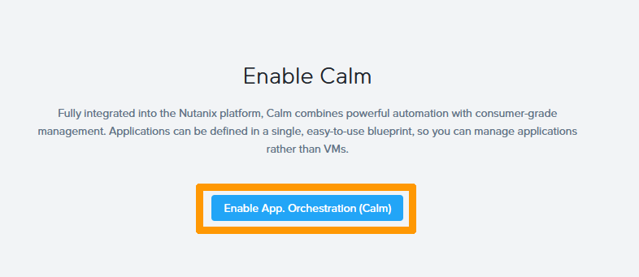{.thumbnail}

Cochez la case `Enable App Management`{.action} et cliquez sur `Save`{.action}.

{.thumbnail}

L'activation de CALM est en cours.

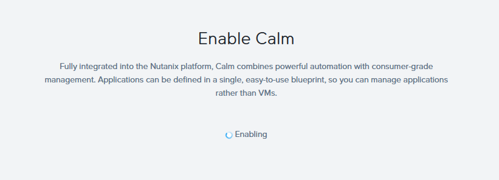{.thumbnail}

> [!primary]
> Un message d'erreur apparait pendant le déploiement de CALM quittez la fênetre et attendez que le déploiement soit terminée.


### Création d'un projet

Avant de déployer des application il faut tout d'abord créer une projet.

Au travers du menu de Prism Central cliquez sur `Calm`{.action} dans la rubrique Services.

{.thumbnail}

Cliquez sur l'icône `Projects`{.action} dans la barre de menu verticales.

{.thumbnail}

CLiquez sur le bouton `+ Create Project`{.action}.

{.thumbnail}

Saisissez le `nom du projet`{.action} dans **Project Name** et cliquez sur `Create`{.action}

{.thumbnail}

Dans le tableau de bord cliquez sur `+ Add infrastructure`{.action}.

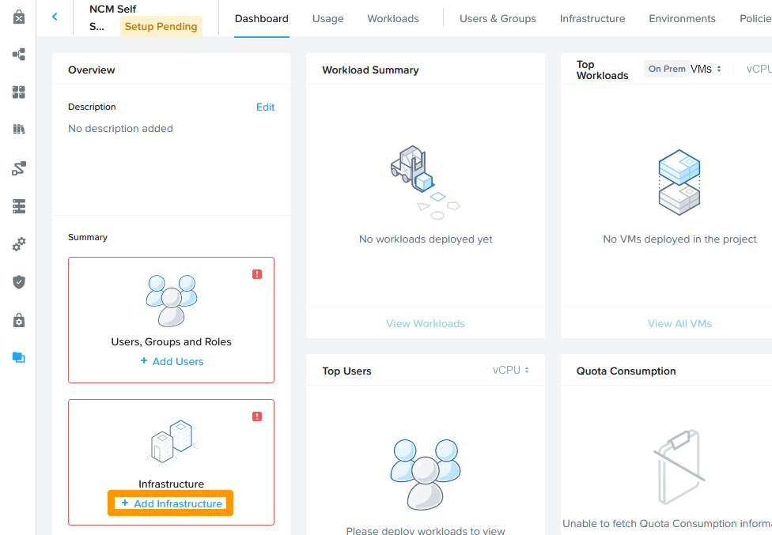{.thumbnail}

Cliquez sur `Add infrastructure`{.action}.

{.thumbnail}

Sélectionnez `NTNX_LOCAL_AZ`{.action} dans accounts.

{.thumbnail}

Cliquez sur `Configure Resources`{.action}.

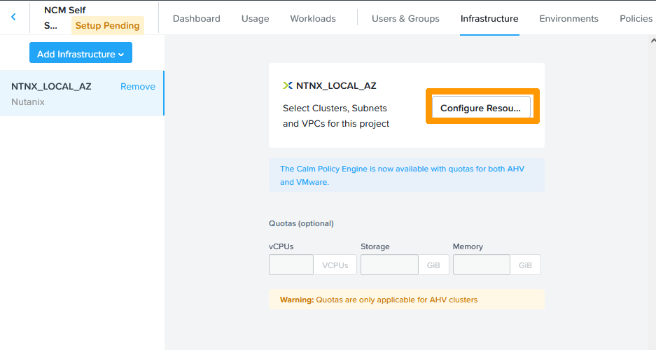{.thumbnail}

Sélectionnez votre `Cluster`{.action} dans **Select clusters to be added to this project** et cliquez sur `+ Select VLANs`{.action}.

{.thumbnail}

Cochez le VLAN `production`{.action} et cliquez sur `+ Confirm and Select Default`{.action}.

{.thumbnail}

Cliquez sur `Confirm`{.action}.

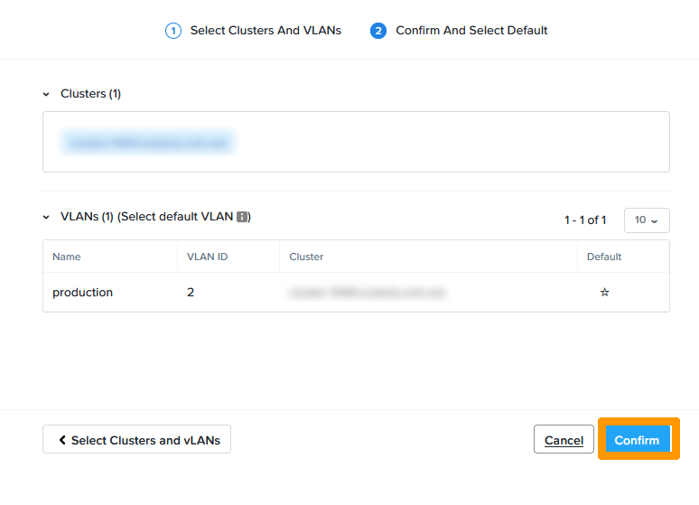{.thumbnail}

Cliquez sur `Save`{.action}.

{.thumbnail}

Dans la barre d'onglets rendez-vous sur `Environments`{.action} et cliquez sur `Create Environment`{.action}.

{.thumbnail}

Saisissez un `Nom`{.action} dans **Name** et cliquez sur `Next`{.action}.

{.thumbnail}

Cliquez sur `Select Infrastucture`{.action}.

{.thumbnail}

Cliquez sur `NTNX_LOCAL_AZ`{.action}.

{.thumbnail}

Cliquez sur `Required for lauching blueprints from marketplace`{.action}. à droite de **VM Configuration**

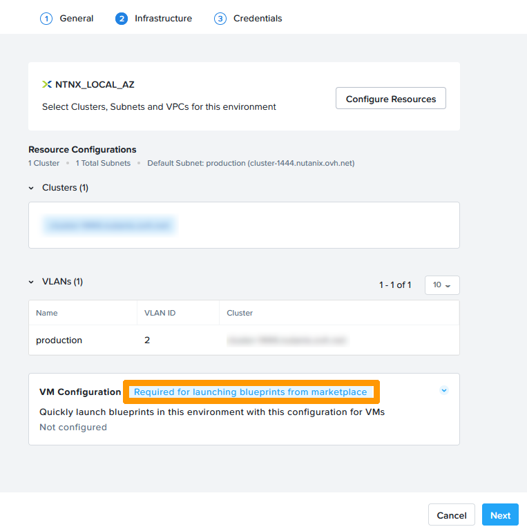{.thumbnail}

Renseignez ces informations :

* **Cluster** : `sélection de votre cluster`
* **vCPUs** : `4`
* **Core per vCPU** : `1`
* **Memory (GiB)** : ``
* **Image** : `WS2022EN-SYSPREPED`

> [!primary]
> l'image a été générée à partir d'un WINDOWS Serveur 2022 dont on a appliqué un sysprep pour remettre tous les paramètres par défauts il est possible d'automatiser le déploiement de Windows à partir de ce type de VM à l'aide d'un ficher de configuration paramétré dans CALM.

Ensuite faite défiler la `fenêtre`{.action} vers le bas.

{.thumbnail}

Cliquez sur le bouton `+`{.action} à droite de **NETWORK ADAPTERS (NICs).

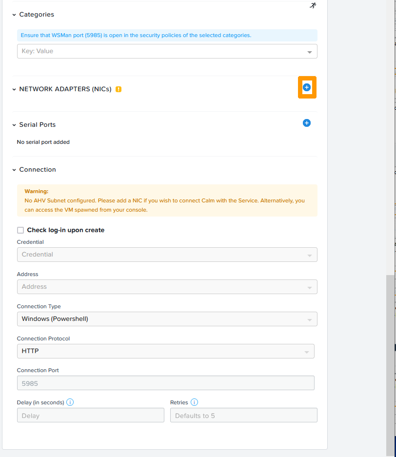{.thumbnail}

Choisissez la carte réseau dans le VLAN `production`{.action}, cochez la case `Check log-in upon create`{.action} et faites défiler la `fenêtre`{.action} vers le haut.

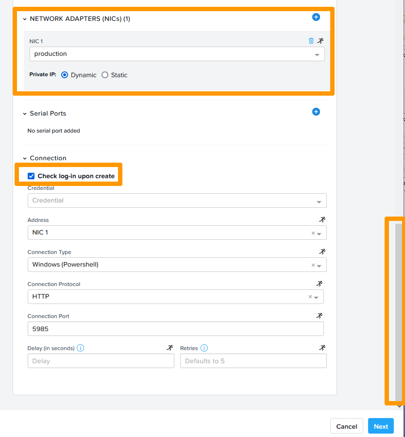{.thumbnail}

Allez sur l'onglet `Linux`{.action}, saississez ces informations :

* **Cluster** : `sélection de votre cluster`
* **vCPUs** : `4`
* **Core per vCPU** : `1`
* **Memory (GiB)** : ``
* **Image** : `jammy-server-cloudimg-amd64.img`

> [!primary]
> L'image permet une installation avec cloud-init d'UBUNTU utilisable au travers de CALM, elle est téléchargeable sur Internet à cette adresse [Ubuntu CLoud Images](https://cloud-images.ubuntu.com/).
>

Ensuite faites défiler la `fenêtre vers le bas`{.action}.

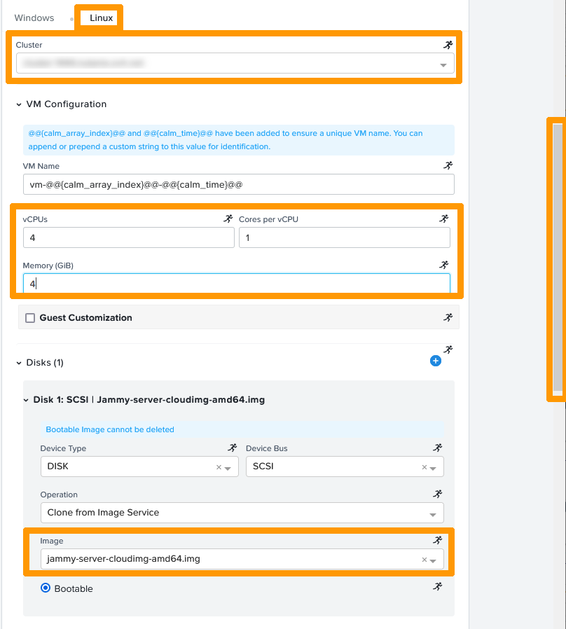{.thumbnail}

Cliquez sur le bouton `+`{.action} à droite de **NETWORK ADAPTERS (NICs).

{.thumbnail}

Choisissez la carte réseau dans le VLAN `production`{.action}, cochez la case `Check log-in upon create`{.action} et cliquez sur `Next`{.action}.

{.thumbnail}

Cliquez sur `+ Add Credential`{.action}.

{.thumbnail}

Cliquez sur `+ Add Credential`{.action}.

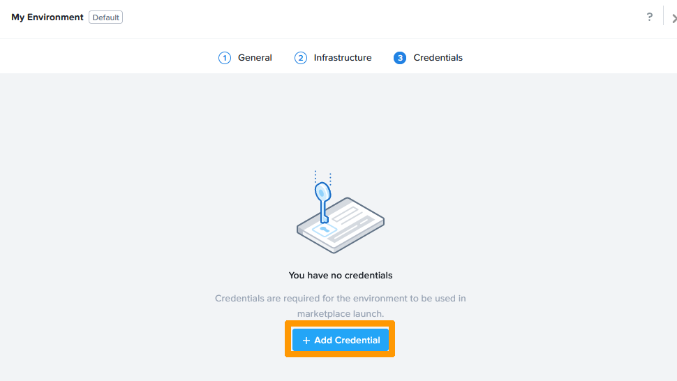{.thumbnail}

Saisissez ces informations :

* **Name** : `WindowsAccount`
* **Username** : `administrator`
* **Password** : `mot de passe du compte administrator`

Ensuite cliquez sur `+ Add Credential`{.action}.

{.thumbnail}

Saisissez ces informations :

* **Name** : `LinuxAccount`
* **Username** : `administrator`
* **Password** : `mot de passe du compte administrator`

Ensuite cliquez sur `Save Environment`{.action}.

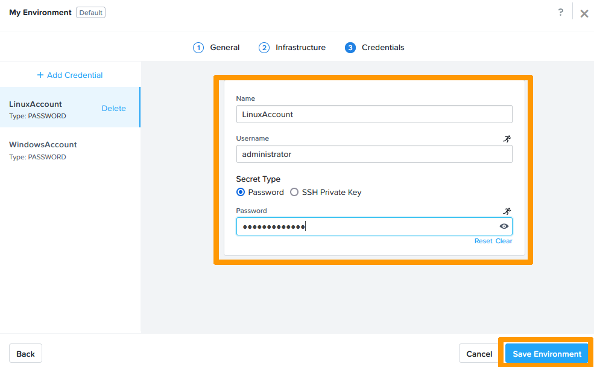{.thumbnail}

Cliquez sur `Marketplace Usage`{.action}.

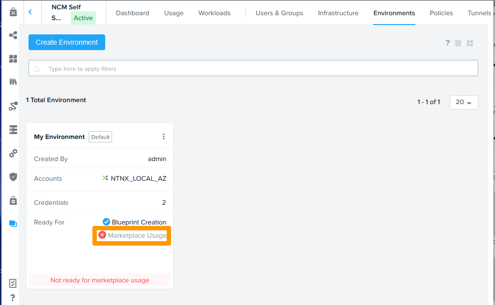{.thumbnail}

Cliquez sur `Update`{.action}.

{.thumbnail}

Cliquez sur `Next`{.action}.

{.thumbnail}

Cliquez sur `Not ready for marketplace usage`{.action} à droite de VM Configuration.

{.thumbnail}

Faites défiler la `fenêtre`{.action} vers le bas.

{.thumbnail}

Choisissez `WindowsAccount`{.action} dans **Credential** et faites défiler la `fenêtre`{.action} vers le haut.

{.thumbnail}

Cliquez sur l'onglet `Linux`{.action} dans **Credential** et faites défiler la `fenêtre`{.action} vers le bas.

{.thumbnail}

Choisissez `LinuxAccount`{.action} dans **Credential** et cliquez sur `Next`{.action}

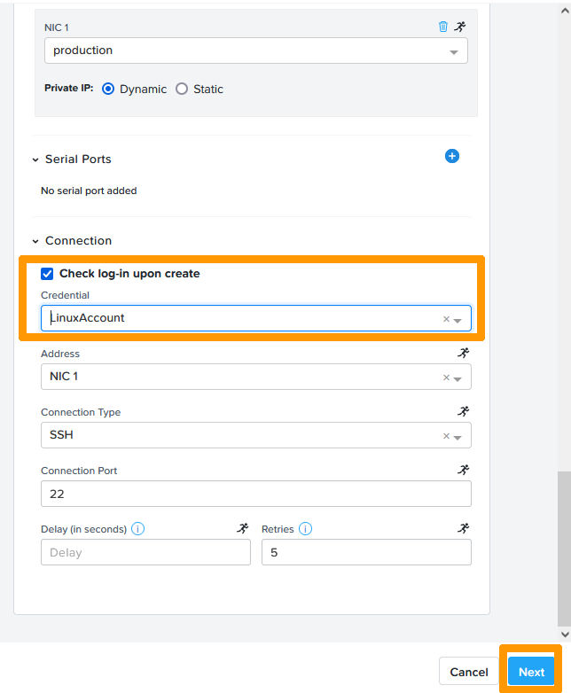{.thumbnail}

Cliquez sur `Save Environment`{.action}

{.thumbnail}

Votre environement est prêt pour la création et la diffusion d'applications.

{.thumbnail}

### Création d'applications

Nous allons crééer deux applications, tester leurs bon fonctionnements et les publier dans le marketplace du cluster.

#### Création de l'application WEB IIS sous Windows

Dans la barre verticale choisissez `Blueprints`{.action}, faite défiler le menu `Create Blueprint`{.action} et cliquez sur sur `Multi VM/Pod Blueprint`{.action}.

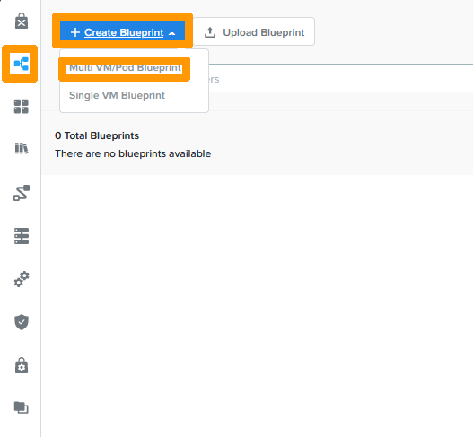{.thumbnail}

Choisissez le `nom`{.action} de votre plan dans **Name** et cliquez sur `Proceed`{.action}.

{.thumbnail}

Saisissez le `nom`{.action} dans **Application Profile Name** et cliquez sur  `Credentials`{.action} en haut.

{.thumbnail}

Nous allons créer le compte Windows il sera utilisé à l'interieur de sysprep en tant que variable et dans la configuration des tâches d'installation du plan et le test de connexion distant.

Cliquez sur bouton `+`{.action} à coté de Credentials.

{.thumbnail}

Saisissez ces informations :

- **Name** : `WindowsAccount`
- **Username** : `administrator`
- **Password** : `Mot de passe du compte administrator`

et cliquez sur `Done`{.action}.

{.thumbnail}

CLiquez sur `Back`{.action}.

{.thumbnail}

Cliquez sur le bouton `+`{.action} à gauche à coté de **Service**.

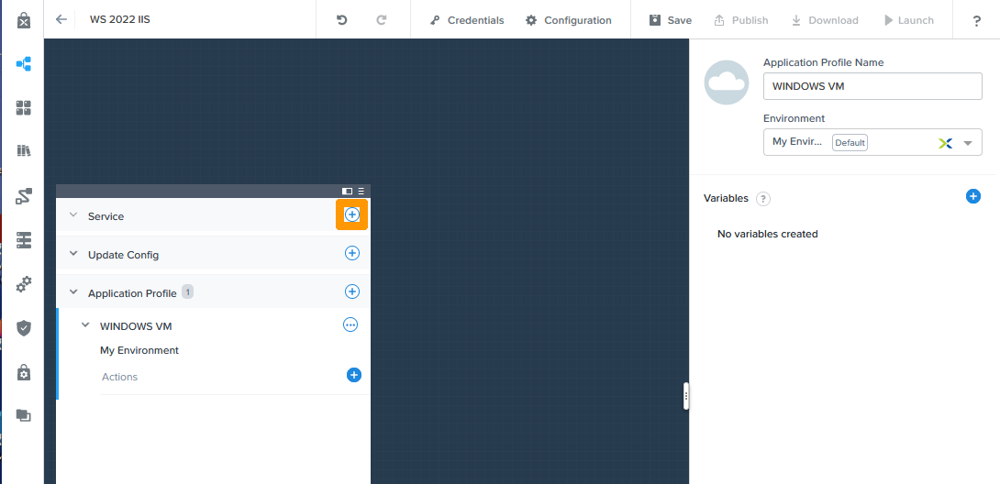{.thumbnail}

Saisissez ces informations :

- **Name** : `VM IIS`
- **Operation System** : `Windows`

et cliquez sur `Clone from environment`{.action}.

{.thumbnail}

Faites défilez la fenêtre de droite, cochez `Guest Customization`{.action}, cliquez sur `Sysprep`{.action}, ensuite copiez le contenu du fichier sysprep ci-dessous dans **Script** :

> [!primary]
> Le fichier a été généré à partir des outils Windows ADK téléchargeables sur ce  [lien](https://learn.microsoft.com/en-us/windows-hardware/get-started/adk-install#download-the-adk-for-windows-11) et a été ensuite adapté en rajoutant des variables venant de Nutanix CALM comme `@@{WindowsAccount.secret}@@` qui représente le mot de passe du compte WindowsAccount.
> 

```xml
<?xml version="1.0" encoding="utf-8"?>
<unattend xmlns="urn:schemas-microsoft-com:unattend">
    <settings pass="windowsPE">
        <component name="Microsoft-Windows-International-Core-WinPE" processorArchitecture="amd64" publicKeyToken="31bf3856ad364e35" language="neutral" versionScope="nonSxS" xmlns:wcm="http://schemas.microsoft.com/WMIConfig/2002/State" xmlns:xsi="http://www.w3.org/2001/XMLSchema-instance">
            <SetupUILanguage>
                <UILanguage>en-US</UILanguage>
                <WillShowUI>Never</WillShowUI>
            </SetupUILanguage>
            <InputLocale>0409:00000409</InputLocale>
            <SystemLocale>en-US</SystemLocale>
            <UILanguage>en-US</UILanguage>
            <UserLocale>en-US</UserLocale>
        </component>
        <component name="Microsoft-Windows-Setup" processorArchitecture="amd64" publicKeyToken="31bf3856ad364e35" language="neutral" versionScope="nonSxS" xmlns:wcm="http://schemas.microsoft.com/WMIConfig/2002/State" xmlns:xsi="http://www.w3.org/2001/XMLSchema-instance">
            <UserData>
                <AcceptEula>true</AcceptEula>
                <FullName>Nutanix Doc</FullName>
                <Organization>Nutanix Doc</Organization>
            </UserData>
            <EnableFirewall>true</EnableFirewall>
            <EnableNetwork>true</EnableNetwork>
        </component>
    </settings>
    <settings pass="specialize">
        <component name="Microsoft-Windows-Shell-Setup" processorArchitecture="amd64" publicKeyToken="31bf3856ad364e35" language="neutral" versionScope="nonSxS" xmlns:wcm="http://schemas.microsoft.com/WMIConfig/2002/State" xmlns:xsi="http://www.w3.org/2001/XMLSchema-instance">
            <TimeZone>Central Standard Time</TimeZone>
            <AutoLogon>
                <Password>
                    <Value>@@{WindowsAccount.secret}@@</Value>
                    <PlainText>true</PlainText>
                </Password>
                <Enabled>true</Enabled>
                <Username>administrator</Username>
                <LogonCount>1</LogonCount>
            </AutoLogon>
        </component>
    </settings>
    <settings pass="oobeSystem">
        <component name="Microsoft-Windows-Shell-Setup" processorArchitecture="amd64" publicKeyToken="31bf3856ad364e35" language="neutral" versionScope="nonSxS" xmlns:wcm="http://schemas.microsoft.com/WMIConfig/2002/State" xmlns:xsi="http://www.w3.org/2001/XMLSchema-instance">
            <UserAccounts>
                <AdministratorPassword>
                    <Value>@@{WindowsAccount.secret}@@</Value>
                    <PlainText>true</PlainText>
                </AdministratorPassword>
            </UserAccounts>
            <OOBE>
                <HideEULAPage>true</HideEULAPage>
                <HideOEMRegistrationScreen>true</HideOEMRegistrationScreen>
                <HideOnlineAccountScreens>true</HideOnlineAccountScreens>
                <HideWirelessSetupInOOBE>true</HideWirelessSetupInOOBE>
                <ProtectYourPC>1</ProtectYourPC>
                <HideLocalAccountScreen>true</HideLocalAccountScreen>
            </OOBE>
            <FirstLogonCommands>
                <SynchronousCommand wcm:action="add">
                    <CommandLine>powershell Set-NetConnectionProfile -NetworkCategory Private</CommandLine>
                    <Order>1</Order>
                </SynchronousCommand>
                <SynchronousCommand wcm:action="add">
                    <CommandLine>powershell Set-WSManQuickConfig -Force</CommandLine>
                    <Order>2</Order>
                </SynchronousCommand>
            </FirstLogonCommands>
        </component>
        <component name="Microsoft-Windows-International-Core" processorArchitecture="wow64" publicKeyToken="31bf3856ad364e35" language="neutral" versionScope="nonSxS" xmlns:wcm="http://schemas.microsoft.com/WMIConfig/2002/State" xmlns:xsi="http://www.w3.org/2001/XMLSchema-instance">
            <UILanguage>en-US</UILanguage>
            <UserLocale>en-US</UserLocale>
            <SystemLocale>en-US</SystemLocale>
            <InputLocale>0409:00000409</InputLocale>
        </component>
    </settings>
    <cpi:offlineImage cpi:source="wim:c:/w2022/sources/install.wim#Windows Server 2022 SERVERSTANDARD" xmlns:cpi="urn:schemas-microsoft-com:cpi" />
</unattend>
```

{.thumbnail}

Continuez à aire défiler la fenêtre et vérifiez que **Check log-in upon create** soit coché et choisissez `WindowsAccount`{.action} dans **Credential**.

{.thumbnail}

Nous allons maintenant créer des tâches en Powershell qui s'executerons après l'installation et la personalisation de Windows. Chaque tâche s'éxécutent l'unes après l'autre.

Dans la fenêtre de gauche faites défilez, positionnez vous sur `Install`{.action} dans **Package** et cliquez sur `+ Task`{.action}.

{.thumbnail}

Renseignez ces informations :

**Task Name** : `IIS Installation`
**Type** : `Execute`
**Script Type** : `Powershell`
**Credential** : `WindowsAccount`

Copiez ce contenu dans **Script** :

```powershell
Install-WindowsFeature -name Web-Server -IncludeManagementTools

if ($?) {
exit 0
}

```

Et cliquez sur `+ Task`{.action}.

{.thumbnail}

Completez ces informations :

**Task Name** : `Customize IIS`
**Type** : `Execute`
**Script Type** : `Powershell`
**Credential** : `WindowsAccount`

Copiez ce contenu dans **Script** :

```powershell
echo "<!DOCTYPE html>" | out-file "C:\inetpub\wwwroot\default.htm"
Add-Content -Path C:\inetpub\wwwroot\default.htm -Value "<html>"
Add-Content -Path C:\inetpub\wwwroot\default.htm -Value "<head>"
Add-Content -Path C:\inetpub\wwwroot\default.htm -Value "<title>IIS on Windows AHV VM</title>"
Add-Content -Path C:\inetpub\wwwroot\default.htm -Value "</head>"
Add-Content -Path C:\inetpub\wwwroot\default.htm -Value "<body>"
Add-Content -Path C:\inetpub\wwwroot\default.htm -Value ""
Add-Content -Path C:\inetpub\wwwroot\default.htm -Value "<h1>IIS on Windows AHV VM</h1>"
Add-Content -Path C:\inetpub\wwwroot\default.htm -Value "<p>Deployed with CALM</p>"
Add-Content -Path C:\inetpub\wwwroot\default.htm -Value ""
Add-Content -Path C:\inetpub\wwwroot\default.htm -Value "</body>"
Add-Content -Path C:\inetpub\wwwroot\default.htm -Value "</html>"
```

Ensuite cliquez sur `+ Task`{.action}.

{.thumbnail}
Saisissez ces informations :

**Task Name** : `reboot VM`
**Type** : `Execute`
**Script Type** : `Powershell`
**Credential** : `WindowsAccount`

Copiez ce contenu dans **Script** :

```powershell
restart-computer -force
```

Et cliquez sur `Save`{.action} en haut de la fenêtre.

{.thumbnail}

L'appliation est créée cliquez sur `Launch`{.action} pour tester votre application.

{.thumbnail}

Saisissez un `Nom`{.action} dans **Application Name** et cliquez sur `Deploy`{.action}.

{.thumbnail}

Une nouvelle fenêtre apparait cliquez sur `Audit`{.action} pour voir les étapes du déploiement de votre application. Lorsque le déploiement est terminé vous pouvez voir en haut de la fenêtre l'indication **RUNNING** pour vous indiquer que l'application est déployée et active.

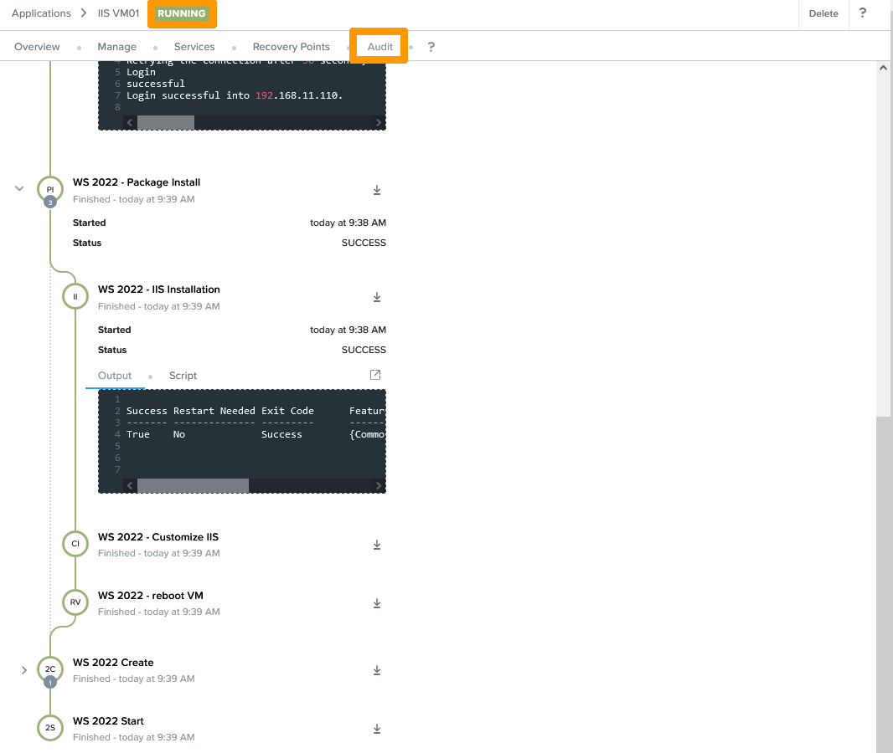{.thumbnail}

Dans notre cas le serveur IIS est actif et affiche un messsage sur l'adresse IP de la machine virtuelle en HTTP.

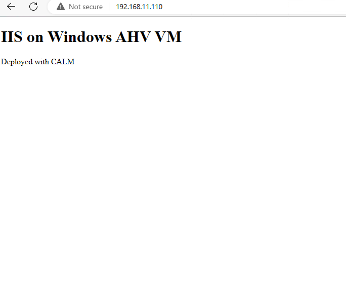{.thumbnail}

#### Création de l'application WEB Nginx sous Linux Ubuntu

Nous allons créer une autre application qui sera sous LINUX UBUNTU avec NGINX installé en tant que serveur WEB.

rendez-vous sur l'icône `Blueprints`{.action} dans la barre de menu vertical de CALM, cliquez sur `Multi VM/Pod Blueprint`{.action} depuis le menu **Create Blueprint**.

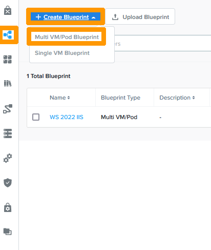{.thumbnail}

Saisissez le `Nom`{.action} dans **Name** et cliquez sur `Proceed`{.action}.

{.thumbnail}

Cliquez sur `Credentials`{.action}.

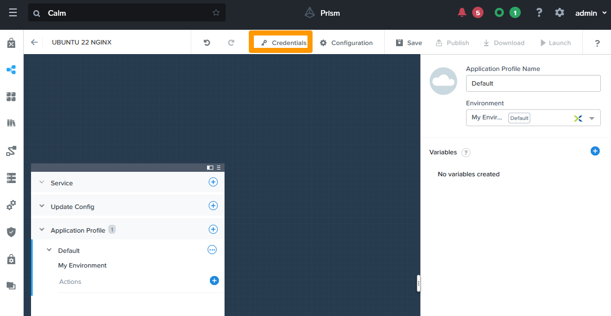{.thumbnail}

Cliquez sur `Credentials +`{.action}.

{.thumbnail}

Saisissez ces informations concernant le compte d'administration Linux :

- **Name** : `LinuxAccount`
- **Username** : `administrator`
- **Password** : `Mot de passe du compte administrator`

Ensuite cliquez sur `Done`{.action}.

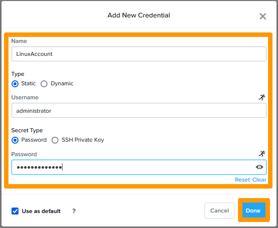{.thumbnail}

Cliquez sur `Credentials +`{.action}.

{.thumbnail}

Saisissez ces informations concernant le compte d'administration de Prism Central :

- **Name** : `PC_ADMIN`
- **Username** : `admin`
- **Password** : `Mot de passe de Prism Central`

> [!primary]
> Au travers de CALM il est possible d'agir sur les cluster Nutanix au travers des ESCRIPT qui sont des scripts en python qui peuvent faire des appels à l'API de Prism Central et ont besoins du compte utilisateur Prism Central. Ce plan augmente la taille du stockage de la machine virtuelle dans Nutanix.
>

Ensuite cliquez sur `Done`{.action}.

{.thumbnail}

Cliquez sur `Back`{.action}.

{.thumbnail}

Saisissez `Linux Application`{.action} dans **Application Proile Name** et cliquez sur `+`{.action} dans la fenêtre de gauche à droite de **Service**.

{.thumbnail}

Saisissez ces informations :

* **Service Name** : `Ubuntu`
* **VM Name** : `Ubuntu NGINX`

Cliquez sur `Clone from environment`{.action} et faites défiler la `fenêtre`{.action} de droite vers le bas.

{.thumbnail}

Cochez `Guest Customization`{.action} copiez le contenu ci-dessous dans **script**

```config
#cloud-config
users:
- name: @@{LinuxAccount.username}@@
  groups: sudo
  sudo: ALL=(ALL) NOPASSWD:ALL
  shell: /bin/bash
  lock-passwd: false
chpasswd:
 list: |
   @@{LinuxAccount.username}@@:@@{LinuxAccount.secret}@@
 expire: False
ssh_pwauth: true
```

> [!primary]
> Ce fichier est le fichier d'initialisation de Linux avec des images cloud-init, il utilise les mots de passes qui vient de CALM au travers de variables qui ont cette forme @@{LinuxAccount.username}@@ pour le compte utilisateur ou @@{LinuxAccount.secret}@@ pour le mot de passe.
>

faites défiler la `fenêtre`{.action} de droite vers le bas.

{.thumbnail}

Choisissez `LinuxAccount`{.action} dans **Check log-in upon create**.

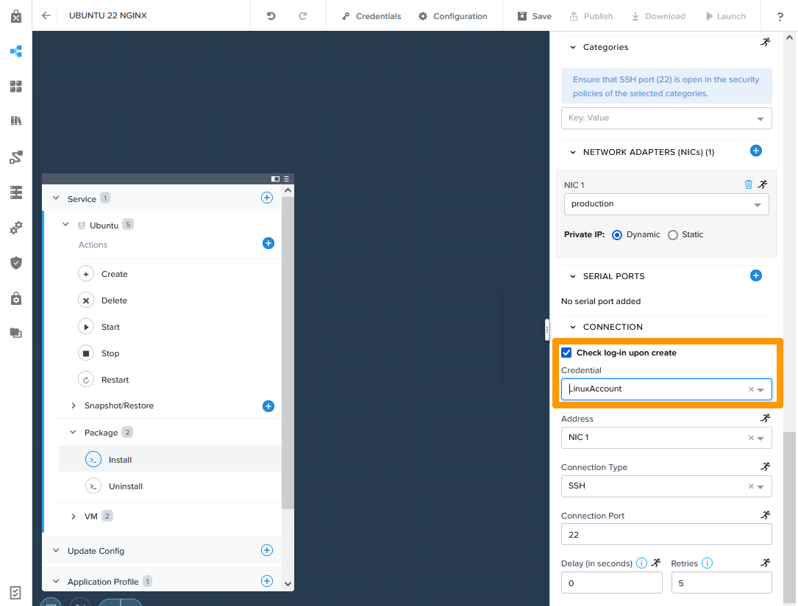{.thumbnail}

Dans la fenêtre de gauche faites rendez-vous sur `Install`{.action} en dessous de **Package** et cliquez sur `+ Task`{.action}.

{.thumbnail}

Saisissez ces informations concenrnant la tâche de redimentionnement du disque de votre machine virtuelle.

* **Task Name** : `Disk resize`
* **Type** : `Execute`
* **Script Type** : `EScript`

Ensuite copiez le contenu de script

```python
vmUuid = '@@{id}@@'
diskSize = 50 # GB
pcAddress = '127.0.0.1'
pcUsername = '@@{PC_ADMIN.username}@@'
pcPassword = '@@{PC_ADMIN.secret}@@'

# ============== DO NO CHANGE AFTER THIS ===============

usrPass = '{}:{}'.format(pcUsername,pcPassword)
b64Pass = base64.b64encode(usrPass)

# Get VM
api_url = 'https://{}:9440/api/nutanix/v3/vms/{}'.format(pcAddress,vmUuid)
headers = {'Content-Type': 'application/json', 'Accept': 'application/json', 'Authorization': 'Basic {}'.format(b64Pass)}

r = urlreq(api_url, verb='GET', headers=headers, verify=False)
if r.ok:
    resp = json.loads(r.content)

else:
    print("Post request failed", r.content)
    exit(1)

# Power off VM and extend disk
del resp['status']

disk_size_mib = diskSize * 1024
disk_size_bytes = disk_size_mib * 1024**2

resp['spec']['resources']['disk_list'][0]['disk_size_mib'] = disk_size_mib
resp['spec']['resources']['disk_list'][0]['disk_size_bytes'] = disk_size_bytes
resp['spec']['resources']['power_state'] = 'OFF'

payload = resp

r = urlreq(api_url, verb='PUT', params=json.dumps(payload), headers=headers, verify=False)
if r.ok:
    resp = json.loads(r.content)
    taskUuid = resp['status']['execution_context']['task_uuid']

else:
    print("Post request failed", r.content)
    exit(1)


# Monitor task
state = ""
while state != "SUCCEEDED":
    api_url = 'https://{}:9440/api/nutanix/v3/tasks/{}'.format(pcAddress,taskUuid)

    sleep(2)
    r = urlreq(api_url, verb='GET', headers=headers, verify=False)
    if r.ok:
        resp = json.loads(r.content)
        state = resp['status']
        if state == "FAILED":
            print("Task failed", resp['progress_message'])
            exit(1)

    else:
        print("Post request failed", r.content)
        exit(1)

# Wait for VM to power off
api_url = 'https://{}:9440/api/nutanix/v3/vms/{}'.format(pcAddress,vmUuid)
r = urlreq(api_url, verb='GET', headers=headers, verify=False)
if r.ok:
    resp = json.loads(r.content)
    power_state = resp['status']['resources']['power_state']

else:
    print("Post request failed", r.content)
    exit(1)

state = ""
while state != "OFF":
    api_url = 'https://{}:9440/api/nutanix/v3/vms/{}'.format(pcAddress,vmUuid)

    sleep(2)
    r = urlreq(api_url, verb='GET', headers=headers, verify=False)
    if r.ok:
        resp = json.loads(r.content)
        state = resp['status']['resources']['power_state']
        if state == "FAILED":
            print("Task failed", resp['progress_message'])
            exit(1)

    else:
        print("Post request failed", r.content)
        exit(1)

# Power on VM
del resp['status']

resp['spec']['resources']['power_state'] = 'ON'

api_url = 'https://{}:9440/api/nutanix/v3/vms/{}'.format(pcAddress,vmUuid)
payload = resp

r = urlreq(api_url, verb='PUT', params=json.dumps(payload), headers=headers, verify=False)
if r.ok:
    resp = json.loads(r.content)
    taskUuid = resp['status']['execution_context']['task_uuid']

else:
    print("Post request failed", r.content)
    exit(1)

# Monitor task
state = ""
while state != "SUCCEEDED":
    api_url = 'https://{}:9440/api/nutanix/v3/tasks/{}'.format(pcAddress,taskUuid)

    sleep(2)
    r = urlreq(api_url, verb='GET', headers=headers, verify=False)
    if r.ok:
        resp = json.loads(r.content)
        state = resp['status']
        if state == "FAILED":
            print("Task failed", resp['progress_message'])
            exit(1)

    else:
        print("Post request failed", r.content)
        exit(1)

print("OS disk extended to {} GB".format(diskSize))

# Wait until VM boots
sleep(60) 
```

Et cliquez sur + `Task`{.action}.

{.thumbnail}

Renseignez ces informations sur la tâche de vérification des services sur Linux:

* **Task Name** : `Service restart`
* **Type** : `Execute`
* **Script Type** : `Shell`
* **Credential** : `Service restart`

Ensuite copiez le contenu ci-dessous dans **Script** :

```bash
sudo sed 's/#$nrconf{restart} = '"'"'i'"'"';/$nrconf{restart} = '"'"'a'"'"';/g' /etc/needrestart/needrestart.conf
```

Et cliquez sur + `Task`{.action} pour ajouter une nouvelle tâche à la suite.

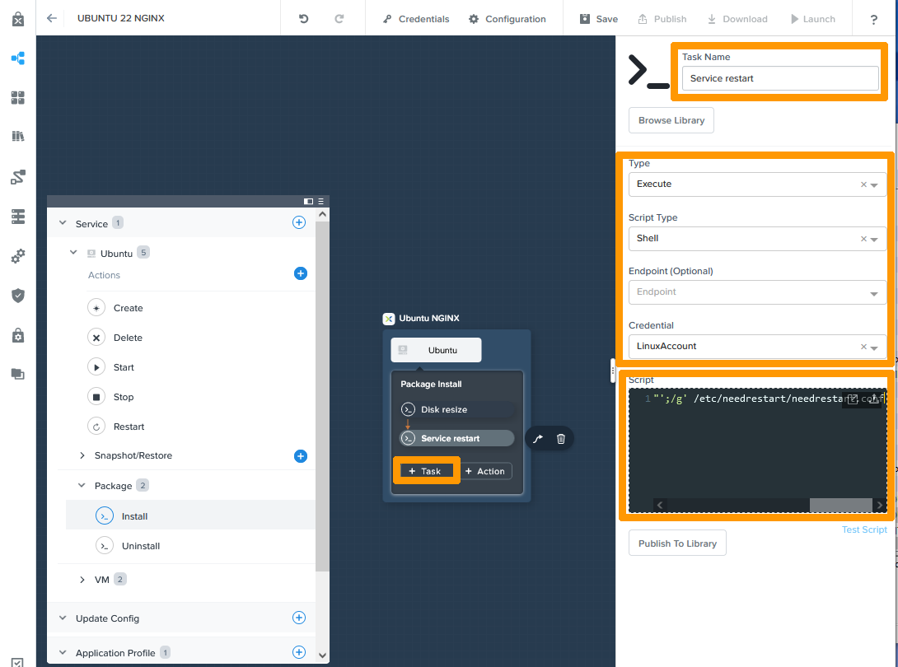{.thumbnail}

Renseignez ces informations sur la tâche de mise à jour UBUNTU:

* **Task Name** : `Service restart`
* **Type** : `Execute`
* **Script Type** : `Shell`
* **Credential** : `Service restart`

Ensuite copiez le contenu ci-dessous dans **Script** :

```bash
sudo apt update
sudo DEBIAN_FRONTEND=noninteractive apt upgrade -y
```

Et cliquez sur + `Task`{.action} pour ajouter une nouvelle tâche à la suite.

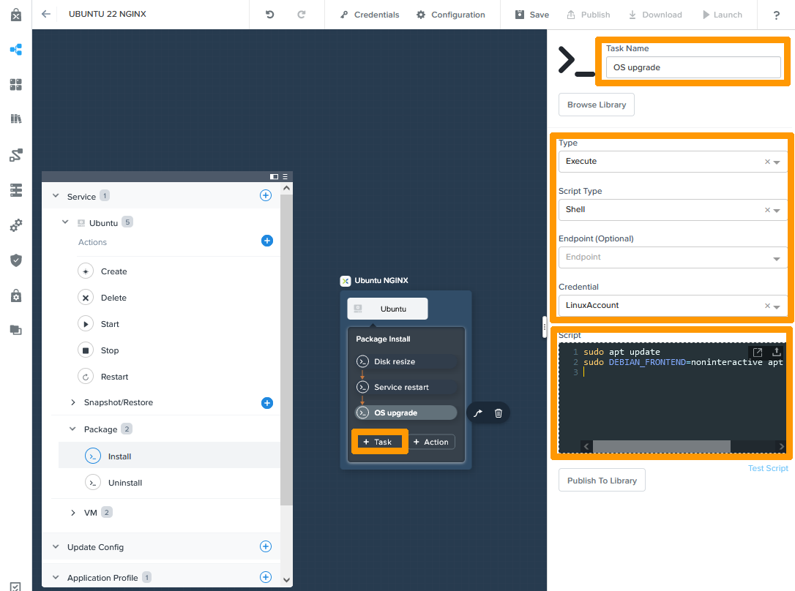{.thumbnail}

Renseignez ces informations sur la tâche d'installation de NGINX et CURL':

* **Task Name** : `Service restart`
* **Type** : `Execute`
* **Script Type** : `Shell`
* **Credential** : `Service restart`

Ensuite copiez le contenu ci-dessous dans **Script** :

```bash
sudo DEBIAN_FRONTEND=noninteractive apt install nginx curl -y
```

Et cliquez sur + `Task`{.action} pour ajouter une nouvelle tâche à la suite.

{.thumbnail}

Saisissez ces informations concernant la dernière tâche de personalisation de NGINX':

* **Task Name** : `Service restart`
* **Type** : `Execute`
* **Script Type** : `Shell`
* **Credential** : `Service restart`

Ensuite copiez le contenu ci-dessous dans **Script** :

```bash
sudo ls -l /var/www/html/
sudo rm -rf /var/www/html/index.nginx-debian.html
sudo touch /var/www/html/index.nginx-debian.html
sudo chown $USER:$USER /var/www/html/index.nginx-debian.html
sudo ls -l /var/www/html/
sudo echo '<!DOCTYPE html>' > /var/www/html/index.nginx-debian.html
sudo echo '<html>' >> /var/www/html/index.nginx-debian.html
sudo echo '<head>' >> /var/www/html/index.nginx-debian.html
sudo echo '<title>NGINX on Linux AHV VM</title>' >> /var/www/html/index.nginx-debian.html
sudo echo '</head>' >> /var/www/html/index.nginx-debian.html
sudo echo '<body>' >> /var/www/html/index.nginx-debian.html
sudo echo '' >> /var/www/html/index.nginx-debian.html
sudo echo '<h1>Nginx on Linux AHV VM</h1>' >> /var/www/html/index.nginx-debian.html
sudo echo '<p>Deployed with CALM</p>' >> /var/www/html/index.nginx-debian.html
sudo echo '' >> /var/www/html/index.nginx-debian.html
sudo echo '</body>' >> /var/www/html/index.nginx-debian.html
sudo echo '</html>' >> /var/www/html/index.nginx-debian.html
sudo cat /var/www/html/index.nginx-debian.html
```

Et cliquez sur + `Save`{.action} pour finaliser la création de votre plan.

{.thumbnail}

Cliquez sur `Launch`{.action} pour tester votre blueprint.

{.thumbnail}

Saisissez le `nom`{.action} de votre déploiement de test dans **Application Name** et cliquez sur `Deploy`{.action}.

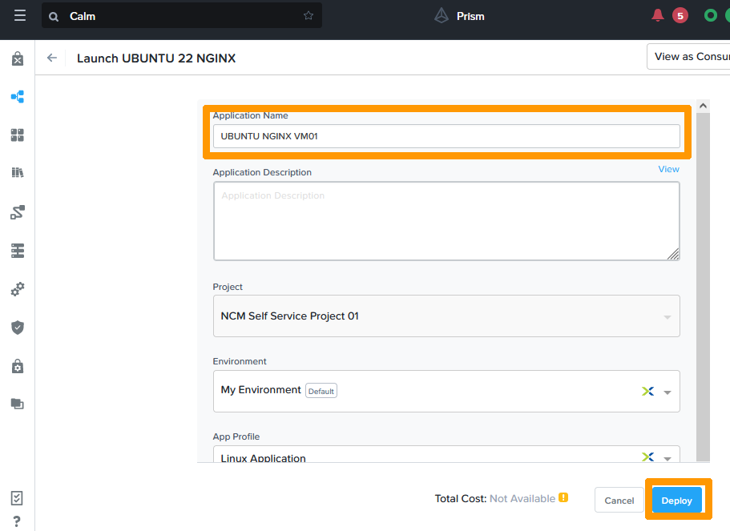{.thumbnail}

Le déploiement se lance.

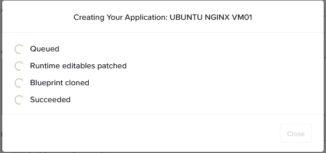{.thumbnail}

Cliquez sur `Audit`{.action} pour voir l'avancement du déploiement.

{.thumbnail}

Le déploiement terminé vous pouvez aller en HTTP sur l'adresse IP de votre VM NGINX pour voir le message de bienvenu.

{.thumbnail}

#### Publication des applications 

Allez sur l'icône `Blueprints`{.action} dans la barre verticale de CALM à gauche et cliquez sur le plan `WS 2022 IIS`{.action}.

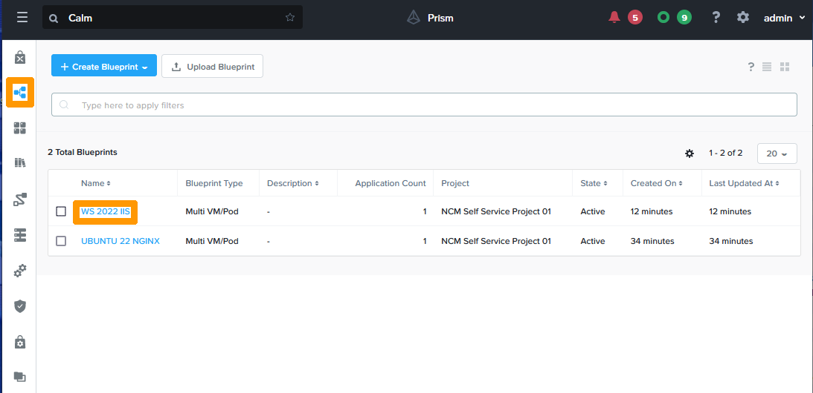{.thumbnail}

Cliquez sur `Publish`{.action}.

{.thumbnail}

Appliquez ces valeurs :

* **Name** : `WS 2022 IIS`
* **Publish with secrets** : `activé`
* **Initial Version** : `1.0.0`

Ensuite cliquez à gauche sur `Change`{.action}.

{.thumbnail}

Cliquez sur `Upload from computer`{.action}.

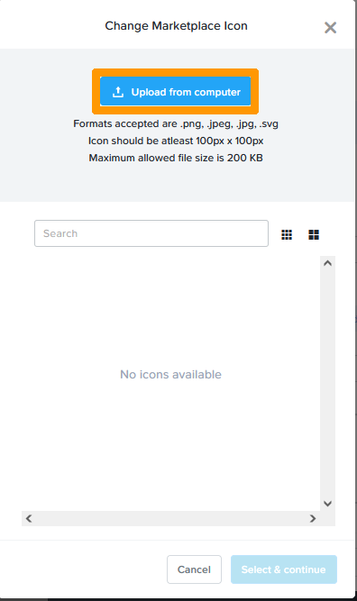{.thumbnail}

Choisissez l'`image`{.action} sur votre ordinateur et cliquez sur `Ouvrir`{.action}.

{.thumbnail}

Nommez votre Icône `IIS`{.action} et cliquez sur le bouton de `validation bleu`{.action}.

{.thumbnail}

Cliquez sur `Select & continue`{.action}.

{.thumbnail}

Cliquez sur `Submit for approval`{.action}.

{.thumbnail}

L'application Windows est dans le marketplace en attente d'approbation.

cliquez sur le plan `UBUNTU 22 NGINX`{.action}.

{.thumbnail}

Cliquez sur `Publish`{.action}.

{.thumbnail}

Appliquez ces valeurs :

* **Name** : `UBUNTU 22 NGINX`
* **Publish with secrets** : `activé`
* **Initial Version** : `1.0.0`

Ensuite cliquez à gauche sur `Change`{.action}.

{.thumbnail}

Cliquez sur `Upload from computer`{.action}.

{.thumbnail}

Choisissez l'`image`{.action} sur votre ordinateur et cliquez sur `Ouvrir`{.action}.

{.thumbnail}

Nommez votre Icône `NGINX`{.action} et cliquez sur le bouton de `validation bleu`{.action}.

{.thumbnail}

Selectionnez votre icône et cliquez sur `Select & continue`{.action}.

{.thumbnail}

Cliquez sur `Submit for approval`{.action}.

{.thumbnail}

L'application Linux est dans le marketplace en attente d'approbation.

#### Ajout des applications publiées sur le portail de CALM

Allez sur l'icône du `Marketplace Manager`{.action}, allez sur l'onglet `Approval Pending`{.action}, cochez l'application `UBUNTU 22 NGINX`{.action} et Cochez l'icône de validation à droite.

{.thumbnail}

Cochez l'application `WS 2022 IIS`{.action} et Cochez l'icône de validation à droite.

{.thumbnail}

Allez sur l'onglet `Approved`{.action}, cliquez sur la colonne `Source`{.action} pour afficher les applications locales en premier, cochez `WS 2022 IIS`{.action}, Sélectionnez à droite `NCM Self Service Project 01`{.action} et cliquez sur `Apply`{.action}.

{.thumbnail}

Cliquez sur `Publish`{.action}.

{.thumbnail}

L'application Windows est publiée.

{.thumbnail}

Cochez `Ubuntu 22 NGINX`{.action}, Sélectionnez à droite `NCM Self Service Project 01`{.action} et cliquez sur `Apply`{.action}.

{.thumbnail}

Cliquez sur `Publish`{.action}.

{.thumbnail}

L'application Ubuntu est publiée.

{.thumbnail}

Cliquez sur l'icône `Marketplace`{.action} en haut de la barre de menu verticale à gauche. et cliquez sur `Get`{.action} en dessous de l'application UBUNTU 22 NGINX.

{.thumbnail}

Cliquez sur `Launch`{.action}.

{.thumbnail}

Saisissez un `Nom`{.action} dans **Application Name** et cliquez sur `Deploy`{.action}. pour déployer une application.

{.thumbnail}

#### Suppression d'une application déployée

Il est possible de supprimer une application déployée aussi simplement que de la déployer

Cliquez sur l'icônes des `Blueprints`{.action} à gauche. et cochez une application déployée.

{.thumbnail}

Au travers du menu **Action** cliquez sur `Delete`{.action}.

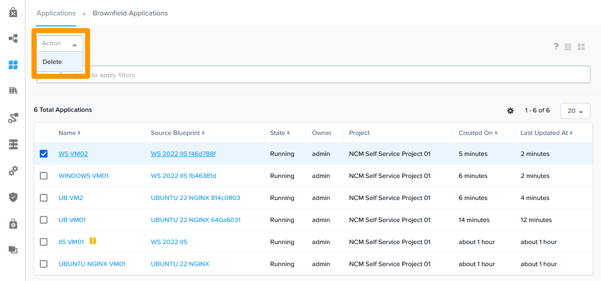{.thumbnail}

Cliquez sur `Confirm`{.action}.

{.thumbnail}

Tout comme un tâche de déploiement il est possible de voir l'état d'avancement d'une suppression.

{.thumbnail}

L'application est entierement supprimée.

{.thumbnail}


## Aller plus loin <a name="gofurther"></a>

Échangez avec notre communauté d'utilisateurs sur <https://community.ovh.com/>.

[Nutanix NCM Self Service (CALM)](https://portal.nutanix.com/page/documents/details?targetId=Nutanix-Calm-Admin-Operations-Guide-v3_6_0:Nutanix-Calm-Admin-Operations-Guide-v3_6_0).
