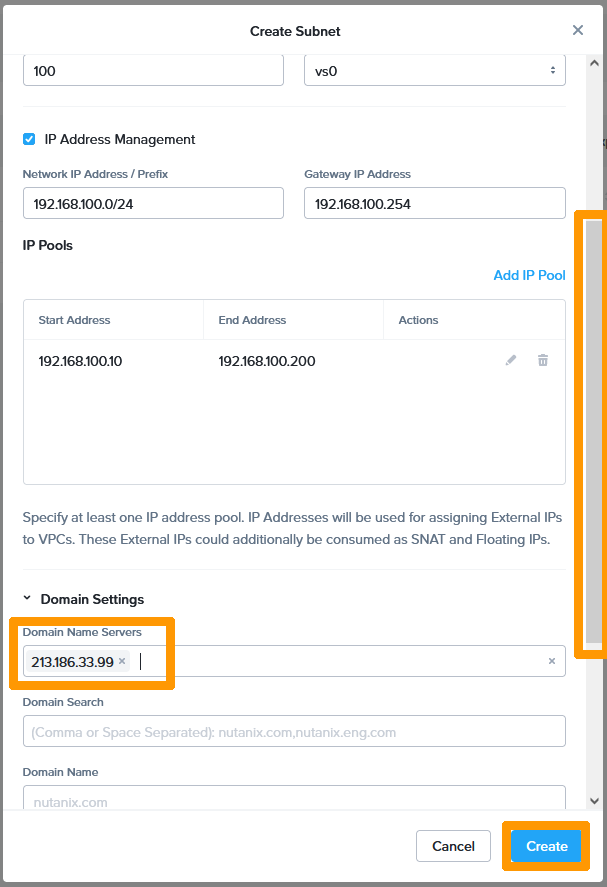
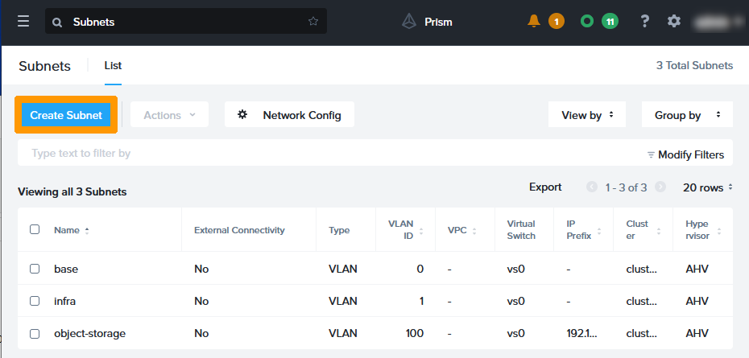
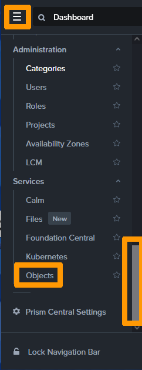
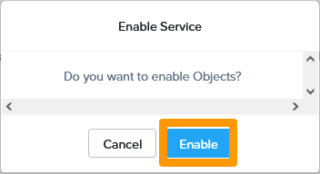
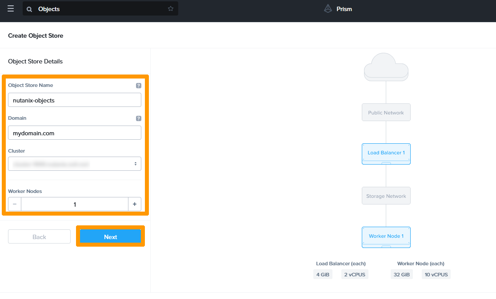
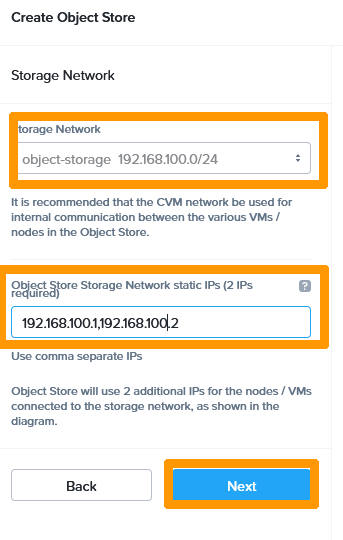
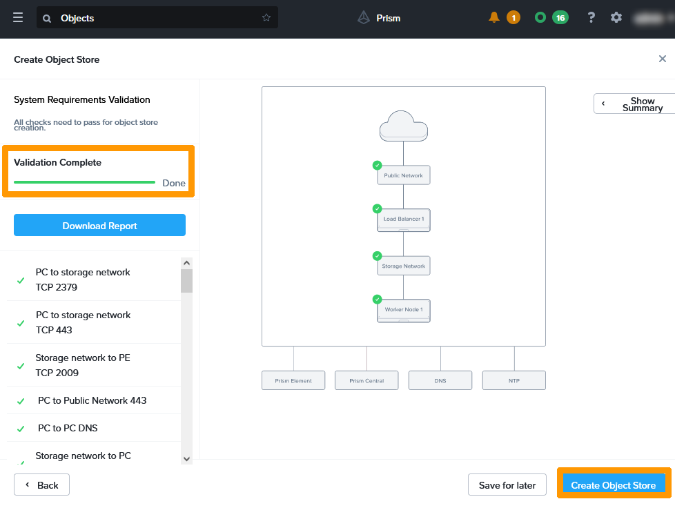
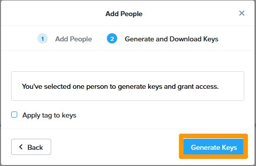
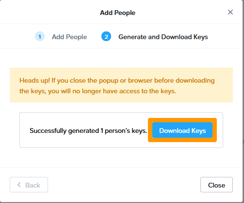
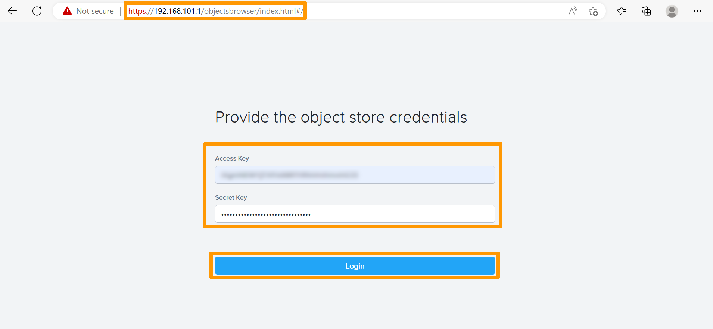

**Last updated 21th February 2023**

## Objective

**This guide will show you how to set up Nutanix Objects on your cluster.**

> [!warning]
> This tutorial will show you how to use one or more OVHcloud solutions with external tools, and will describe the actions to be carried out in a specific context. You may need to adapt the instructions according to your situation.
>
> If you encounter any difficulties performing these actions, please contact a [specialist service provider](https://partner.ovhcloud.com/en-gb/directory/) and/or discuss the issue with our community. You can find more information in the [Go further](#gofurther) section of this tutorial.
>

## Requirements

- A Nutanix cluster in your OVHcloud account
- Access to the [OVHcloud Control Panel](https://www.ovh.com/auth/?action=gotomanager&from=https://www.ovh.co.uk/&ovhSubsidiary=GB)
- You must be connected to the cluster via Prism Central


## Overview

Nutanix Objects implements an **Object Storage** S3-compatible solution on your Nutanix cluster, using Prism Central. You can read the description on this [link](https://www.nutanix.com/content/dam/nutanix/resources/datasheets/ds-objects.pdf).

## Instructions

From Prism Central, click your `cluster`{.action} in the **Cluster Quick Access** Widget to connect to Prism Element.

{.thumbnail}

Click on the name of your `cluster`{.action} in the top left-hand corner next to the **X**.

{.thumbnail}

Scroll down the window, enter an unused `private IP address`{.action} from your management network in the **ISCSI Data Services IP** section, then click `Save`{.action}.

{.thumbnail}

### Configuring VLANs in Prism Central

You need to create two additional VLANs in your cluster configuration and have these VLANs access Prism Central and Prism Element to configure **Nutanix Objects**. These two VLANs must be able to distribute IP addresses. IPAM will be enabled on both VLANs.

From Prism Central go to the main menu and click on `Subnets`{.action} in the category **Network & Security**.

{.thumbnail}

Click `Create Subnet`{.action}.

{.thumbnail}

Check the `IP Address Management`{.action} box and fill in this informations :

* **Name** : Type `object-storage`{.action}.
* **Type** : Select `VLAN`{.action}.
* **VLAN ID** : Type your VLAN number as `100`{.action}.
* **Virtual Switch** : Keep `vs0`{.action}.
* **Network IP Address / Prefix** : Write your subnet `192.168.100.0/24`{.action}.
* **Gateway IP Address** : Enter the address of your gateway `192.168.100.254`{.action}.

Then click `Add IP Pool`{.action}.

{.thumbnail}

Enter this information :

* **Start Address** : Start address of your scope as `192.168.100.10`{.action}.
* **End Address** : End address of your scope as `192.168.100.200`{.action}.

Then click the `blue validation button`{.action} on the right.

{.thumbnail}

Scroll down and enter the OVHcloud DNS address `213.186.33.99`{.action} in **Domain Name Servers** and click `Create`{.action}.

{.thumbnail}

Your first VLAN is created, we will create the second VLAN, click on `Create Subnet`{.action}.

{.thumbnail}

Check the `IP Address Management`{.action} box and fill in this information :

* **Name** : Type `public-storage`{.action}.
* **Type** : Select `VLAN`{.action}.
* **VLAN ID** : Type your VLAN number as `101`{.action}.
* **Virtual Switch** : Gardez `vs0`{.action}.
* **Network IP Address / Prefix** : Write your subnet `192.168.101.0/24`{.action}.
* **Gateway IP Address** : Enter your gateway address `192.168.101.254`{.action}.

Then click `Add IP Pool`{.action}.

{.thumbnail}

Enter this information :

* **Start Address** : Start address of your scope as `192.168.101.10`{.action}.
* **End Address** : End address of your scope as `192.168.101.200`{.action}.

Next, click the `blue validation button`{.action} on the right.

{.thumbnail}

Scroll down and enter the OVHcloud DNS address `213.186.33.99`{.action} in **Domain Name Servers** and click `Create`{.action}.

{.thumbnail}

Your two VLANs are created, make sure they can connect to Prism Element and Prism Central through your gateway. You can use this guide to replace the default gateway and use your VLANs. [OVHgateway replacement](https://docs.ovh.com/gb/en/nutanix/software-gateway-replacement/).

{.thumbnail}

### Enabling Nutanix objects in Prism Central

Go to the main menu, scroll to the **Services** section and click `Objects`{.action}.

{.thumbnail}

Click `Enable`{.action}.

{.thumbnail}

Click `Enable`{.action} to validate the activation of **Nutanix Objects**.

{.thumbnail}

The service checks your system compatibility.

{.thumbnail}

Click `Next`{.action}.

{.thumbnail}

Click `Create Object Store`{.action}.

{.thumbnail}

Fill in this information :

* **Object Store Name** : the name of your object storage `nutanix-objects`{.action}.
* **Domain** : The domain name that will be used to access your storage `mydomain.com`{.action}.
* **Cluster** : The `Cluster`{.action} that must have Nutanix Objects enabled.
* **Worker Nodes** : The number of nodes that your Object storage will use, take the number `1`{.action}.

Then click `Next`{.action}.

{.thumbnail}

Select the VLAN `object-storage`{.action} in **Storage Network** and enter these two addresses `192.168.100.1,192.168.100.2`{.action} in **Object Store Storage Network static IPs (2 IPs required)**, these addresses must not be within the scope of the VLAN DHCP.

Then click `Next`{.action}.

{.thumbnail}

Select the `public-storage`{.action} VLAN in **Storage Network** and enter this range of four addresses `192.168.101.1-192.168.100.4`{.action} in **Public Network static IPs**, these addresses should not be within the scope of the VLAN DHCP.
Ensuite cliquez sur `Save & Continue`{.action}.

{.thumbnail}

A connection check is performed between the VLANs, Prism Element and Prism Central.

{.thumbnail}

When validation is complete, click `Create Object Store`{.action}.

{.thumbnail}

Wait twenty minutes for your Object Storage to be active and accessible through the address **192.168.101.1** that is located in your **public-storage** VLAN.

{.thumbnail}

### Creating an Access Keys to your storage.

To be able to use an Objects storage it is necessary to create associated **Access Keys**.

Go to the `Access Keys`{.action} tab.

{.thumbnail}

Click `+ Add People`{.action}.

{.thumbnail}

Check `Add people not in a directory service`{.action}, type `user@mydomain.com`{.action} in **Email Address and click `Next`{.action}.

{.thumbnail}

Click `Generate Keys`{.action}.

{.thumbnail}

Click `Download Keys`{.action}.

{.thumbnail}

> [!warning]
>our access credentials are displayed in your web browser. Please note down this information (Access Key and secret Key) before closing this window.
>

{.thumbnail}

Your user is created with their login details. You can regenerate Keys access and create a new login.

{.thumbnail}

### Validation and functional testing

To confirm that our Object storage is working properly, we will use the AWS awscli command-line tools and create a bucket. You can use this [guide](https://docs.aws.amazon.com/cli/latest/userguide/cli-configure-options.html). This tool is available on Windows, Linux and MacOS.

After installing awscli we will create two configuration files on a computer that has access to the public-storage VLAN and use the aws command to create a bucket.

Create a `.aws` subfolder {.action} in your %USERPROFILE% folder on Windows or $HOME on Linux and MacOS.

Add the file `credentials`{.action} and fill it in with this data:

```config
[default]
aws_access_key_id=your-access-key
aws_secret_access_key=secret-access key
```

Then add a second file named `config`{.action} with this information :

```config
[default]
region=region = us-east-1
```

Then use this command to create a bucket.

```config
aws --endpoint-url https://192.168.101.1 s3 mb s3://my-bucket --region=us-east-1 --no-verify-ssl
```

The bucket is created with a warning message about the SSL certificate, in a production environment it is necessary to use an SSL certificate.

Now that the bucket is created we will use a browser to connect to the web interface provided by Nutanix in order to check the existence of our bucket.

Using a web browser, connect to this URL `https://192.168.101.1`{.action} which corresponds to your access point **Nutanix Objects** and enter your `credentials`{.action} (access_key and secret_key). Then click on `Login`{.action}.

{.thumbnail}

You can see the bucket you created in the command line. You can create and delete buckets or objects in your web interface.

{.thumbnail}

## Go further <a name="gofurther"></a>

Join our community of users on <https://community.ovh.com/en/>.

[Nutanix Objects documentation](https://portal.nutanix.com/page/documents/details?targetId=Objects-v3_6:top-intro-c.html).