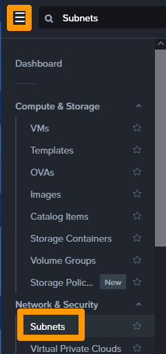
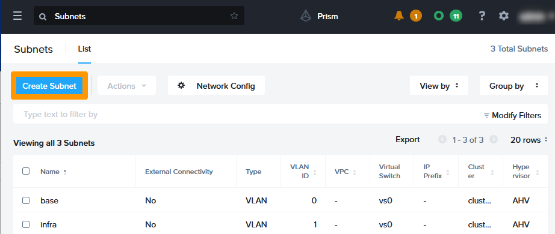
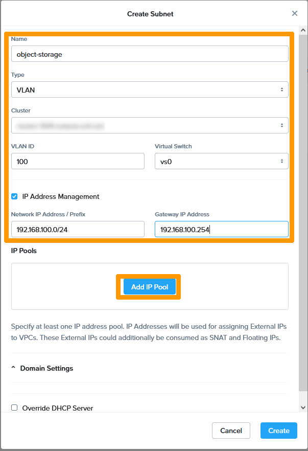
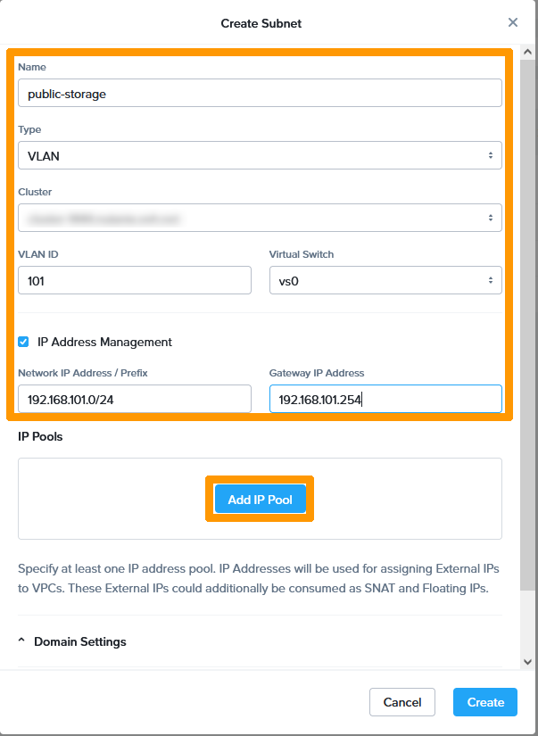
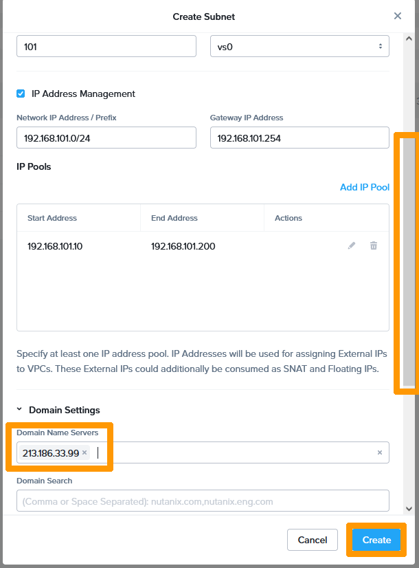
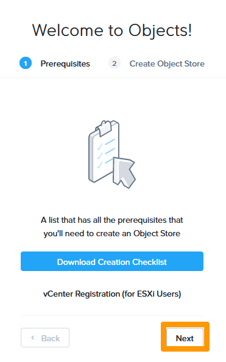
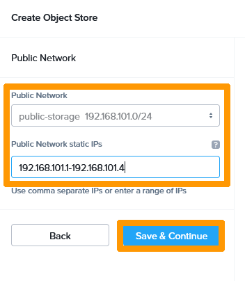
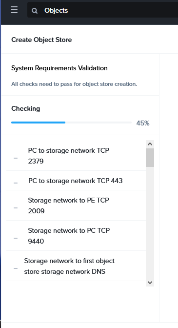
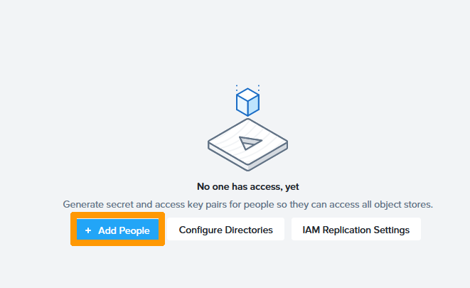
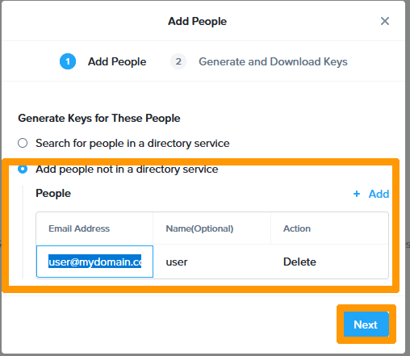

**Dernière mise à jour le 21/02/2023**

## Objectif

**Ce guide vous montre comment mettre en place Nutanix Objects sur votre cluster.**

> [!warning]
> OVHcloud vous met à disposition des services dont la configuration, la gestion et la responsabilité vous incombent. Il vous appartient donc de ce fait d’en assurer le bon fonctionnement.
>
> Ce guide a pour but de vous accompagner au mieux sur des tâches courantes. Néanmoins, nous vous recommandons de faire appel à un prestataire spécialisé si vous éprouvez des difficultés ou des doutes concernant l’administration, l’utilisation ou la mise en place d’un service sur un serveur.

## Prérequis

- Disposer d'un cluster Nutanix dans votre compte OVHcloud.
- Être connecté à votre [espace client OVHcloud](https://www.ovh.com/auth/?action=gotomanager&from=https://www.ovh.com/fr/&ovhSubsidiary=fr).
- Être connecté sur le cluster via Prism Central.


## Présentation

Nutanix Objects implémente une solution **Object Storage** Compatible S3 sur votre cluster Nutanix en s'appuyant sur Prism Central. Vous pouvez consulter le descriptif sur ce [lien](https://www.nutanix.com/fr/viewer?type=pdf&path=/content/dam/nutanix/fr/resources/datasheets/ds-objects-fr.pdf).

## En pratique

Nous allons voir comment activer Nutanix Objects dans votre solution Nutanix by OVHcloud et valider son bon fonctionnement.

### Activation du service iSCSI dans Prism Element

A partir de Prism Central, cliquez sur votre `cluster`{.action} dans le Widget **Cluster Quick Access** pour vous connecter à Prism Element.

{.thumbnail}

Cliquez sur le nom de votre `cluster`{.action} en haut à gauche à côté du **X**.

{.thumbnail}

Faites défiler la fenêtre, saisissez une `adresse IP privée`{.action} non utilisée de votre réseau d'administration dans la rubrique **ISCSI Data Services IP**, ensuite cliquez sur `Save`{.action}.

{.thumbnail}

### Configuration des VLANs dans Prism Central

Vous devez créer deux VLANs supplémentaires dans la configuration de votre cluster et que ces VLANs accèdent à Prism Central et Prism Element pour pouvoir configurer **Nutanix Objects**. Ces deux VLANs doivent pouvoir distribuer des adresses IP, IPAM sera activé sur les deux VLANs.

A partir de Prism Central allez dans le menu principal et cliquez sur `Subnets`{.action} dans la catégorie **Network & Security**.

{.thumbnail}

Cliquez sur `Create Subnet`{.action}.

{.thumbnail}

Cochez la case `IP Address Management`{.action} et remplissez ces informations :

* **Name** : Saisissez `object-storage`{.action}.
* **Type** : Sélectionnez `VLAN`{.action}.
* **VLAN ID** : Saisissez votre numéro de VLAN comme `100`{.action}.
* **Virtual Switch** : Gardez `vs0`{.action}.
* **Network IP Address / Prefix** : Ecrivez votre sous-réseau `192.168.100.0/24`{.action}.
* **Gateway IP Address** : Entrez l'adresse votre passerelle `192.168.100.254`{.action}.

Ensuite cliquez sur `Add IP Pool`{.action}.

{.thumbnail}

Saisissez ces informations :

* **Start Address** : Adresse de début de votre étendue comme `192.168.100.10`{.action}.
* **End Address** : Adresse de fin de votre étendue comme `192.168.100.200`{.action}.

Ensuite cliquez sur le `bouton de validation bleu`{.action} à droite.

{.thumbnail}

Faites défiler la fenêtre et saisissez l'adresse du DNS OVHcloud `213.186.33.99`{.action} dans **Domain Name Servers** et cliquez sur `Create`{.action}.

{.thumbnail}

Votre premier VLAN est créé nous allons créer le deuxième VLAN, cliquez sur `Create Subnet`{.action}.

{.thumbnail}

Cochez la case `IP Address Management`{.action} et remplissez ces informations :

* **Name** : Saisissez `public-storage`{.action}.
* **Type** : Sélectionnez `VLAN`{.action}.
* **VLAN ID** : Saisissez votre numéro de VLAN comme `101`{.action}.
* **Virtual Switch** : Gardez `vs0`{.action}.
* **Network IP Address / Prefix** : Ecrivez votre sous-réseau `192.168.101.0/24`{.action}.
* **Gateway IP Address** : Entrez l'adresse de votre passerelle `192.168.101.254`{.action}.

Ensuite cliquez sur `Add IP Pool`{.action}.

{.thumbnail}

Saisissez ces informations :

* **Start Address** : Adresse de début de votre étendue comme `192.168.101.10`{.action}.
* **End Address** : Adresse de fin de votre étendue comme `192.168.101.200`{.action}.

Ensuite cliquez sur le `bouton de validation bleu`{.action} à droite.

{.thumbnail}

Faites défiler la fenêtre et saisissez l'adresse du DNS OVHcloud `213.186.33.99`{.action} dans **Domain Name Servers** et cliquez sur `Create`{.action}.

{.thumbnail}

Vos deux VLANs sont créés, vérifiez qu'ils puisent se connecter à Prism Element et Prism Central au travers de votre passerelle. Vous pouvez vous aider de ce guide pour remplacer la passerelle par défaut et utiliser vos VLANs. [Remplacement de la passerelle OVHgateway](https://docs.ovh.com/fr/nutanix/software-gateway-replacement/).

{.thumbnail}

### Activation de Nutanix objects dans Prism Central

Allez dans le menu principal, faites le défiler jusqu'a la rubrique **Services** et cliquez sur `Objects`{.action}.

{.thumbnail}

Cliquez sur `Enable`{.action}.

{.thumbnail}

Cliquez sur `Enable`{.action} pour valider l'activation de **Nutanix Objects**.

{.thumbnail}

Le service vérifie la compatibilité de votre système.

{.thumbnail}

Cliquez sur `Next`{.action}.

{.thumbnail}

Cliquez sur `Create Object Store`{.action}.

{.thumbnail}

Remplissez ces informations : 

* **Object Store Name** : le nom de votre stockage object `nutanix-objects`{.action}.
* **Domain** : Le nom de domaine qui sera utilisé pour accéder à votre stockage  `mydomain.com`{.action}.
* **Cluster** : Le `Cluster`{.action} qui doit avoir Nutanix Objects activé.
* **Worker Nodes** : Le nombre de nœuds qu'utilisera votre stockage Object, prenez le nombre `1`{.action}.

Ensuite cliquez sur `Next`{.action}.

{.thumbnail}

Sélectionnez le VLAN `object-storage`{.action} dans **Storage Network** et saisissez ces deux adresses `192.168.100.1,192.168.100.2`{.action} dans **Object Store Storage Network static IPs (2 IPs required)**, ces adresses ne doivent pas être dans l'étendue du DHCP du VLAN.

Ensuite cliquez sur `Next`{.action}.

{.thumbnail}

Sélectionnez le VLAN `public-storage`{.action} dans **Storage Network** et saisissez cette plage de quatre adresses `192.168.101.1-192.168.100.4`{.action} dans **Public Network static IPs**, ces adresses ne doivent pas être dans l'étendue du DHCP du VLAN.

Ensuite cliquez sur `Save & Continue`{.action}.

{.thumbnail}

Un contrôle de connexion entre les VLANs, Prism Element et Prism Central est effectué.

{.thumbnail}

Lorque la validation est finie cliquez sur `Create Object Store`{.action}.

{.thumbnail}

Patientez une vingtaine de minutes pour que votre Stockage Object soit actif et accessible au travers de l'adresse **192.168.101.1** qui se trouve dans votre VLAN **public-storage**.

{.thumbnail}

### Création d'une Access Keys à votre stockage.

Pour pouvoir utiliser un stockage Objects il est nécessaire de créer des **Access Keys** associés.

Allez sur l'onglet `Access Keys`{.action}.

{.thumbnail}

Cliquez sur `+ Add People`{.action}.

{.thumbnail}

Cochez `Add people not in a directory service`{.action} , saisissez `user@mydomain.com`{.action} dans **Email Address et cliquez sur `Next`{.action}.

{.thumbnail}

Cliquez sur `Generate Keys`{.action}.

{.thumbnail}

Cliquez sur `Download Keys`{.action}.

{.thumbnail}

> [!warning]
> Vos identifiants d'accès sont affichés dans votre navigateur WEB, prenez soin de noter ces informations (Access Key et secret Key) avant de fermer cette fenêtre.
>

{.thumbnail}

Votre utilisateur est créé avec ses identifiants, il est possible de regénérer les accès Keys et de créer un nouvel identifiant.

{.thumbnail}

### Validation et test de bon fonctionnement

Pour valider le bon fonctionnement de notre stockage Object nous allons utiliser l'outils en ligne de commande awscli d'AWS et créer un bucket. Vous pouvez vous aider de ce [guide](https://docs.aws.amazon.com/fr_fr/cli/latest/userguide/getting-started-install.html). Cet outil est disponible sous Windows, Linux et MacOS.

Après avoir installé awscli nous allons créer deux fichiers de configurations sur un ordinateur qui a accès au VLAN public-storage et utiliser la commande aws pour créer un bucket.

Créez une dossier `.aws`{.action} dans votre dossier %USERPROFILE% sous Windows ou $HOME sous Linux et MacOS.

Ajoutez le fichier `credentials`{.action} et remplissez le avec ces données :

```config
[default]
aws_access_key_id=votre-acces-key
aws_secret_access_key=votre-secret-access key
```

Ensuite ajouter un deuxième fichier nommé `config`{.action} avec ces informations : 

```config
[default]
region=region = us-east-1
```

Ensuite utilisez cette commande pour créer un bucket.

```config
aws --endpoint-url https://192.168.101.1 s3 mb s3://my-bucket --region=us-east-1 --no-verify-ssl
```

Le bucket est créé avec un message d'avertissement concernant le certificat SSL, dans un environnement de production il faut utiliser un certificat SSL.

Maintenant que le bucket est créé nous allons utiliser un navigateur pour se connecter à l'interface WEB fournie par Nutanix afin de vérifier l'existence de notre bucket.

Au travers d'un navigateur WEB connectez vous à cette URL `https://192.168.101.1`{.action} qui correspond à votre point d'accès **Nutanix Objects** et saisissez vos `identifiants`{.action} (access_key et secret_key). Ensuite cliquez sur `Login`{.action}.

{.thumbnail}

Vous voyez le bucket que vous avez créé en ligne de commande. Vous pouvez créer et supprimer des buckets ou des objets dans votre interface WEB.

{.thumbnail}

## Aller plus loin <a name="gofurther"></a>

Échangez avec notre communauté d'utilisateurs sur <https://community.ovh.com/>.

[Documentation Nutanix Objects](https://portal.nutanix.com/page/documents/details?targetId=Objects-v3_6:top-intro-c.html).
