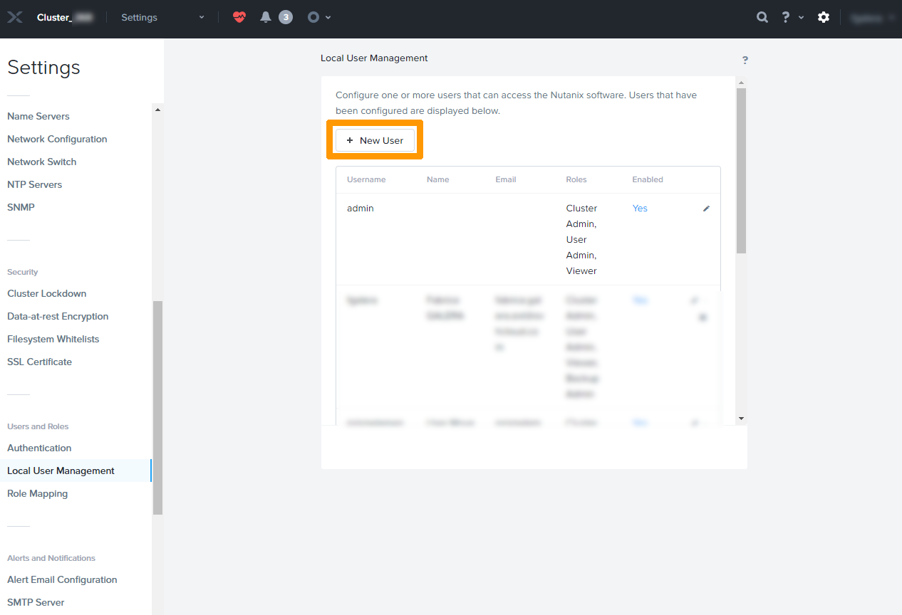
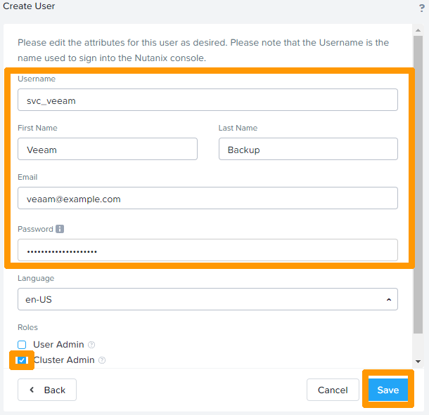
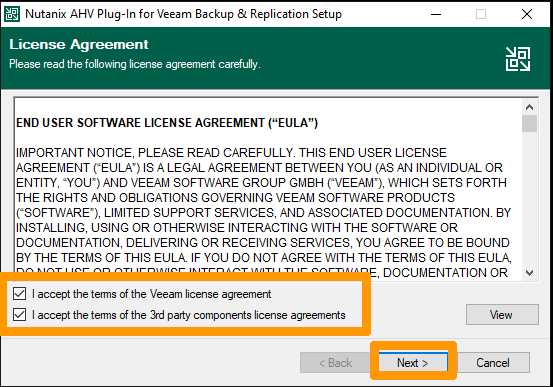
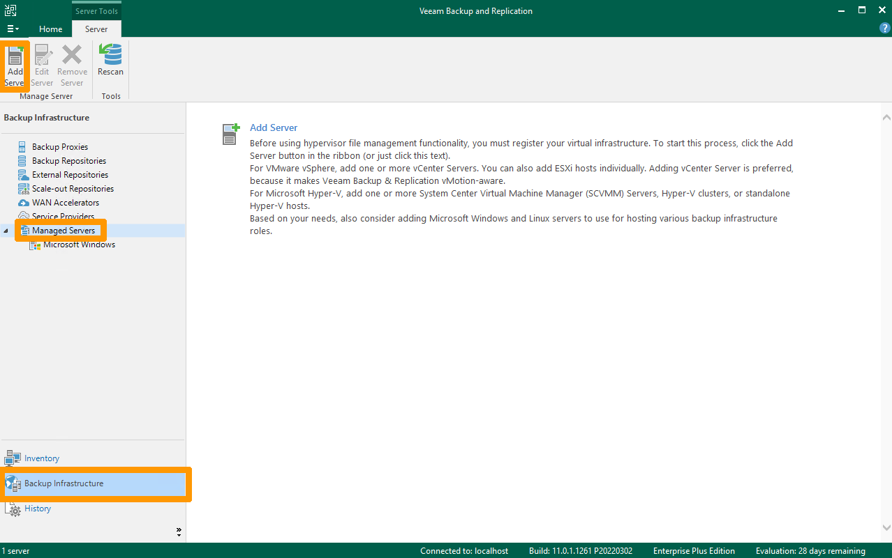
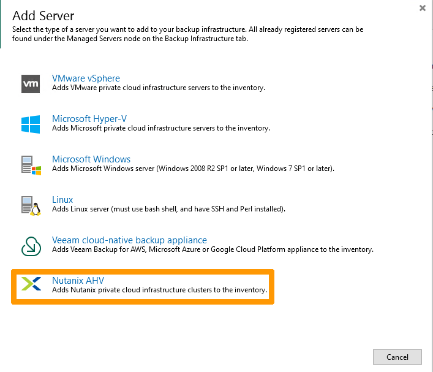
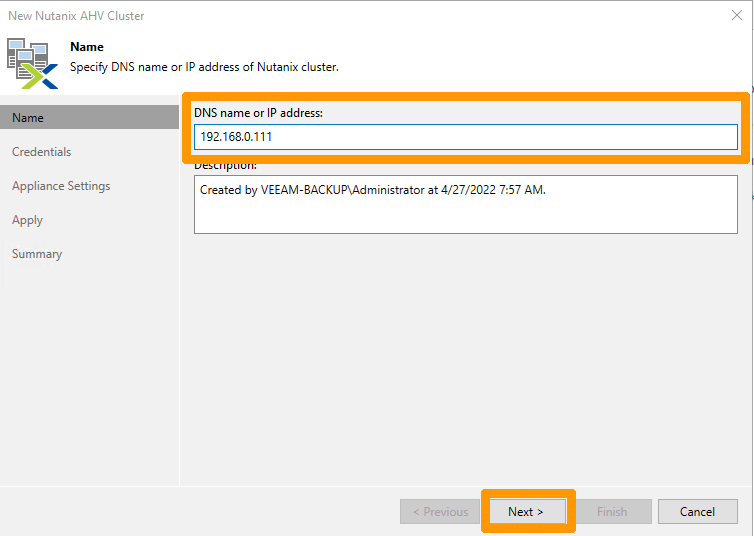
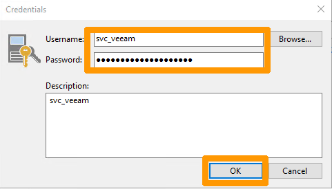
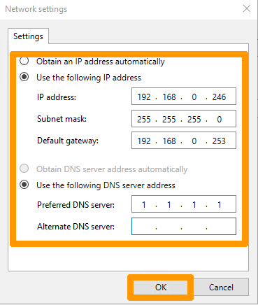
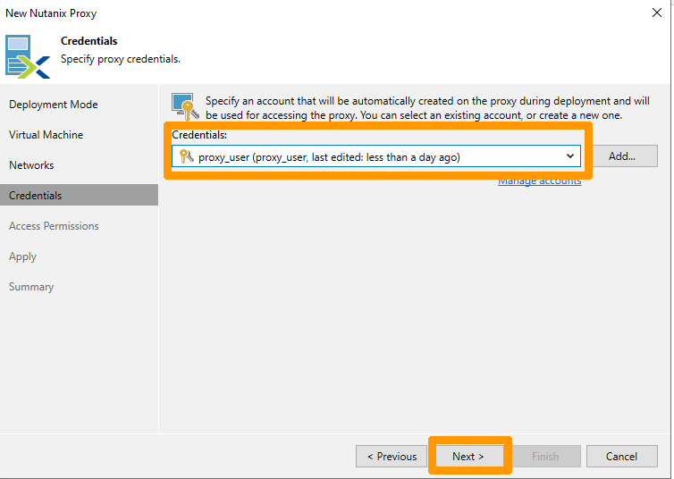

**Dernière mise à jour le 03/05/2022**

## Objectif

Veeam backup for Nutanix est un logiciel de sauvegarde disponible pour Nutanix. 

**Apprenez à installer, configurer et utiliser VEEAM sur un cluster Nutanix avec un stockage de type Object Storage fourni par OVHCloud**

> [!warning]
> OVHcloud vous met à disposition des services dont la configuration, la gestion et la responsabilité vous incombent. Il vous appartient donc de ce fait d’en assurer le bon fonctionnement.
>
> Ce guide a pour but de vous accompagner au mieux sur des tâches courantes. Néanmoins, nous vous recommandons de faire appel à un prestataire spécialisé si vous éprouvez des difficultés ou des doutes concernant l’administration, l’utilisation ou la mise en place d’un service sur un serveur.
>

## Prérequis

- Disposer d'un cluster Nutanix dans votre compte OVHcloud
- Être connecté à votre [espace client OVHcloud](https://www.ovh.com/auth/?action=gotomanager&from=https://www.ovh.com/fr/&ovhSubsidiary=fr).
- Être connecté sur le cluster via Prism Central. 
- Avoir un projet Public Cloud avec un bucket de stockage de type High Performance Object Storage ainsi qu'un utilisateur ayant les droits en lecture et écriture sur ce bucket. Vous trouverez plus d'informations sur la création d'un projet Public Cloud et sur l’utilisation du service High Performance Object Storage sur les pages suivantes :
    - [Création d'un projet Public Cloud](https://docs.ovh.com/fr/public-cloud/creer-un-projet-public-cloud/)
    - [Débuter avec S3 High Performance](https://docs.ovh.com/fr/storage/s3/debuter-avec-s3/).
- D'avoir installé VEEAM Backup et Replication sur une machine virtuelle de votre cluster Nutanix avec cette procédure [Installer Veeam Backup & Replication](https://docs.ovh.com/fr/storage/veeam-backup-replication/)

## En pratique

Nous allons personnaliser VEEAM Backup & Replication pour l'utilisation sur un cluster Nutanix avec une sauvegarde sur un pro 

### Ajouter un utilisateur dans **Prism Element pour Veeam Backup**

Nous allons créer un utilisateur spécifique dans Prism Element pour l'utilisation de Veeam Backup

Au travers de **Prism central** connectez-vous sur Prism Element en cliquant dans **Cluster Quick Access** sur le cluster.

{.thumbnail}

ALlez dans les paramètres en cliquant sur l'icone represantant un `engrenage`{.action} en haut à droite.

{.thumbnail}

Déroulez le menu à gauche à l'aide de la `barre de défilement`{.action}.

{.thumbnail}

Cliquez sur `Local User Management`{.action}.

{.thumbnail}

Cliquez sur le bouton `New User`{.action}.

Saisissez ces informations :

- **Username** : `svc_veeam`
- **First Name** : `Veeam`
- **Last Name** : `Backup`
- **Email** : `veeam@example.com`
- **Password** : `mot de passe`

> [!primary]
> Ces informations sont fournies à titre d'exemple, l'adresse de messagerie est obligatoire mais n'est pas utilisée.

Cochez la case `Cluster Admin`{.action} et cliquez sur `Save`{.action}

{.thumbnail}

Le commpte apparait dans la liste des utilisateurs de **Prism Element**.

{.thumbnail}

### Télécharger et installer l'extension pour Nutanix dans VEEAM**

Connectez vous sur la machine virtuelle où se trouve VEEAM Backup.

A partir d'un navigateur Web Télécharger la dernière version de l'extension sur ce lien [Extension AHV pour VEEAM](https://www.veeam.com/availability-nutanix-ahv-download.html), Si vous n'avez pas de compte utilisateurs sur le site de Veeam il faudra le créer ce compte est gratuit.

Lancez l'installation

> [!warning]
> Avant de lancer d'exécuter l'installation bien s'assurer que la console VEEAM BACKUP ne soit pas lancée.
>

{.thumbnail}

Double-cliquez sur l'installateur `NutanixAHPlugin_...`{.action}

Acceptez les conditions générales d'utilisation du logiciel en sélectionnant `I accept the terms of the Veeam license agreement`{.action} et `I accept the terms of the 3rd party components license agreements`{.action} ensuite cliquez sur `Next`{.action}.

{.thumbnail}

Cliquez sur `Next`{.action}.

{.thumbnail}

Cliquez sur `Install`{.action}.

{.thumbnail}

Patientez pendant l'installation.

{.thumbnail}

Cliquez sur `Finish`{.action}.

{.thumbnail}

### Ajouter le cluster Nutanix dans la configuration de Veeam

La configuration du cluster Nutanix dans Veeam ajoute une machine virtuelle dans le cluster Nutanix qui sert d'interface entre le logiciel de sauvegarde Veeam Backup et 

Lancez la console **Veeam Backup** et cliquez sur `Connect`{.action}.

{.thumbnail}

Positionnez-vous dans `Backup Infrastucture`{.action}. choisissez `Managed Servers`{.action} et cliquez sur `Add Server`{.action}.

{.thumbnail}

Cliquez sur `Nutanix AHV`{.action}.

{.thumbnail}

Saisissez `l'adresse IP privée`{.action} de **Prism Element** dans DNS name or IP address et cliquez sur `Next`{.action}.

{.thumbnail}

Cliquez sur `Add`{.action} pour ajouter le compte utilisateur de **Prism element**

{.thumbnail}

Saisissez ces informations avec le compte crée précedemment dans Prism Element :

- **Username** : `svc_veeam`{.action}
- **Password** ! `Mot de passe`{.action}

Cliquez sur `OK`{.action}.

{.thumbnail}

Vérifiez dans **Credentials** que le compte créé apparaisse et cliquez sur `Next`{.action}.

{.thumbnail}

Cliquez sur `Continue`{.action} pour passez outre le message d'avertissement concernant le certificat.

{.thumbnail}

Cochez `Use the following IP address`{.action} et choisissez une adresse IP non utilisée , cette adresse sert au moment des sauvegardes et des restaurations de fichiers. Ensuite cliquez sur `Next`{.action}.

{.thumbnail}

Cliquez sur `Next`{.action}.

{.thumbnail}

Cliquez sur `Finish`{.action}.

{.thumbnail}

Cliquez sur `Yes`{.action}.

{.thumbnail}

Seléctionnez `Deploy a new proxy`{.action} et cliquez sur `Next`{.action} 

{.thumbnail}

Choisissez une nom dans `Name`{.action} et cliquez sur `Next`{.action} 

{.thumbnail}

Cliquez sur `Configure`{.action} 

{.thumbnail}

Choisissez une adresse IP non utilisée sur le réseau local pour la machine virtuelle et cliquez sur `Ok`{.action} 

{.thumbnail}

Cliquez sur `Next`{.action} 

{.thumbnail}

Cliquez sur `Add`{.action} pour ajouter et créer le compte de connexion à la machine virtuelle spécifique à Veeam

> [!warning]
> Notez bien le compte utilisateur créé ainsi que le mot de passe il pourra servir pour se connecter en autonome sur la VM au travers
> du navigateur WEB

{.thumbnail}

Saisissez ces informations avec le compte crée précedemment dans Prism Element :

- **Username** : `proxy_user`{.action}
- **Password** ! `Mot de passe`{.action}

Cliquez sur `OK`{.action}.

{.thumbnail}

Vérifiez le compte utilisateurs dans **Credentials** et cliquez sur `Next`{.action}.

{.thumbnail}

Séléctionnez la case à cocher `Allow access to all backup repositories`{.action} et cliquez sur `Next`{.action}.

{.thumbnail}

Patientez quelques minutes.

{.thumbnail}

L'installation est terminée avec un Warning, n'en tenez pas compte c'est à cause du DNS qui n'arrive pas à résoudre le nom du serveur Veeam. Cliquez sur `Next`{.action}.

{.thumbnail}

## Aller plus loin 

[Documentation VEEAM concernant l'installation de VEEAM Backup](https://helpcenter.veeam.com/docs/van/userguide/installing.html?ver=30)

Échangez avec notre communauté d'utilisateurs sur <https://community.ovh.com/>.

