**Dernière mise à jour le 04/05/2022**

## Objectif


Veeam backup est un logiciel de sauvegarde disponible pour Nutanix et qui fonctionne à l'aide d'un ajout. 

**Apprenez à installer, configurer et utiliser VEEAM sur un cluster Nutanix sur un dossier partagé**

> [!warning]
> OVHcloud vous met à disposition des services dont la configuration, la gestion et la responsabilité vous incombent. Il vous appartient donc de ce fait d’en assurer le bon fonctionnement.
>
> Ce guide a pour but de vous accompagner au mieux sur des tâches courantes. Néanmoins, nous vous recommandons de faire appel à un prestataire spécialisé si vous éprouvez des difficultés ou des doutes concernant l’administration, l’utilisation ou la mise en place d’un service sur un serveur.
>

## Prérequis

- Disposer d'un cluster Nutanix dans votre compte OVHcloud
- Être connecté à votre [espace client OVHcloud](https://www.ovh.com/auth/?action=gotomanager&from=https://www.ovh.com/fr/&ovhSubsidiary=fr).
- Être connecté sur le cluster via **Prism Central**. 
- D'avoir installé **Veeam Backup & Replication** sur une machine virtuelle de votre cluster Nutanix avec cette procédure [Installer Veeam Backup & Replication](https://docs.ovh.com/fr/storage/veeam-backup-replication/)
- Disposer de 4 Go de mémoires vive, 60 Go de stockage et 4 vCPU pour l'ajout d'une machine virtuelle supplémentaire lors de la configuration des extensions pour **Veeam Backup & Replication**.


## En pratique

Nous allons personnaliser **Veam Backup & Replication** pour l'utilisation sur un cluster Nutanix avec une sauvegarde distante de type **NAS** en **SMB**. 

### Ajouter un utilisateur dans **Prism Element pour Veeam Backup**

IL faut tout d'abord créer un utilisateur spécifique dans Prism Element pour l'utilisation de Veeam Backup.

Au travers de **Prism central** connectez-vous sur **Prism Element** en cliquant sous **Cluster Quick Access** sur le cluster.

{.thumbnail}

A partir de **Prism Element** allez dans les paramètres en cliquant sur l'icône représentant un `engrenage`{.action} en haut à droite.

{.thumbnail}

Déroulez le menu à gauche à l'aide de la `barre de défilement`{.action}.

{.thumbnail}

Cliquez sur `Local User Management`{.action}.

{.thumbnail}

Cliquez sur le bouton `New User`{.action}.

{.thumbnail}


Saisissez ces informations :

- **Username** : `svc_veeam`
- **First Name** : `Veeam`
- **Last Name** : `Backup`
- **Email** : `veeam@example.com`
- **Password** : `mot de passe`

> [!primary]
> Ces données sont fournies à titre d'exemple, l'adresse de messagerie est obligatoire mais n'est pas utilisée.

Cochez la case `Cluster Admin`{.action} et cliquez sur `Save`{.action}

{.thumbnail}

Ce compte utilisateur est créé et il est  dans la liste des utilisateurs de **Prism Element**.

{.thumbnail}

### Télécharger et installer l'extension pour un cluster **Nutanix**

Connectez-vous sur la machine virtuelle où se trouve VEEAM Backup.

A partir d'un navigateur Web Télécharger la dernière version de l'extension sur ce lien [Extension AHV pour VEEAM](https://www.veeam.com/availability-nutanix-ahv-download.html), Si vous n'avez pas un compte utilisateur sur le site de **Veeam** il faudra le créer, ce compte est gratuit.

Lancez l'installation de l'extension.

> [!warning]
> Avant de lancer d'exécuter l'installation bien s'assurer que la console VEEAM BACKUP ne soit pas lancée.
>
>


Double-cliquez sur l'installateur `NutanixAHPlugin_...`{.action}

{.thumbnail}

Acceptez les conditions générales d'utilisation du logiciel en sélectionnant `I accept the terms of the Veeam license agreement`{.action} et `I accept the terms of the 3rd party components license agreements`{.action} ensuite cliquez sur `Next`{.action}.

{.thumbnail}

Cliquez sur `Next`{.action}.

{.thumbnail}

Cliquez sur `Install`{.action}.

{.thumbnail}

Patientez pendant l'installation.

{.thumbnail}

Cliquez sur `Finish`{.action}.

{.thumbnail}

### Intégrer le cluster Nutanix dans la configuration de **Veeam Backup**

Lors de La configuration de Veeam Backup pour Nutanix, une nouvelle machine virtuelle est ajoutée dans le cluster, elle sert d'interface entre le logiciel de sauvegarde **Veeam Backup** et le cluster.

Lancez la console **Veeam Backup** et cliquez sur `Connect`{.action}.

{.thumbnail}

Positionnez-vous dans `Backup Infrastucture`{.action} dans le menu en bas à droite, choisissez `Managed Servers`{.action} et cliquez sur `Add Server`{.action}.

{.thumbnail}

Cliquez sur `Nutanix AHV`{.action}.

{.thumbnail}

Saisissez `l'adresse IP privée`{.action} de **Prism Element** dans **DNS name or IP address** et cliquez sur `Next`{.action}.

{.thumbnail}

Cliquez sur `Add`{.action} pour ajouter le compte utilisateur de **Prism Element**

{.thumbnail}

Saisissez ces informations avec le compte créé précédemment dans **Prism Element** :

- **Username** : `svc_veeam`{.action}
- **Password** ! `Mot de passe`{.action}

Cliquez sur `OK`{.action}.

{.thumbnail}

Vérifiez dans **Credentials** que le compte créé soit sélectionné et cliquez sur `Next`{.action}.

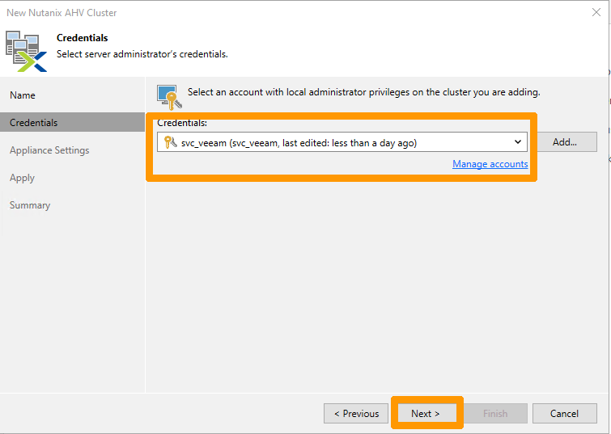{.thumbnail}

Cliquez sur `Continue`{.action} pour valider le message d'avertissement concernant le certificat.

{.thumbnail}

Cochez `Use the following IP address`{.action} et choisissez une adresse IP privé non utilisée (cette adresse sert au moment des sauvegardes et des restaurations de fichiers) , ensuite cliquez sur `Next`{.action}.

{.thumbnail}

Cliquez sur `Next`{.action}.

{.thumbnail}

Cliquez sur `Finish`{.action}.

{.thumbnail}

Cliquez sur `Yes`{.action}.

{.thumbnail}

Sélectionnez `Deploy a new proxy`{.action} et cliquez sur `Next`{.action} 

{.thumbnail}

Choisissez un `Nom`{.action} dans **Name** et cliquez sur `Next`{.action} 

{.thumbnail}

Cliquez sur `Configure`{.action} 

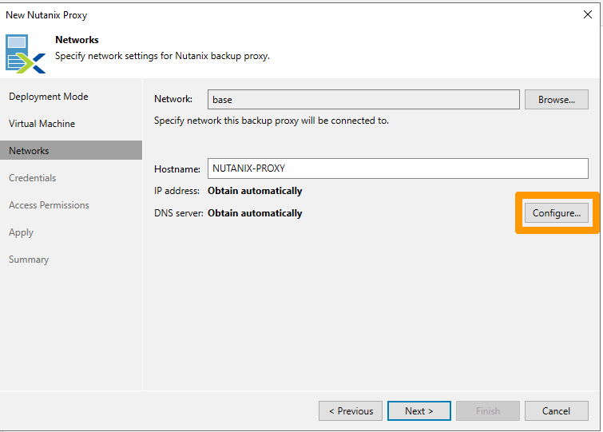{.thumbnail}

Choisissez `une adresse IP`{.action} non utilisée sur le réseau local pour la machine virtuelle et cliquez sur `Ok`{.action} 

{.thumbnail}

Cliquez sur `Next`{.action} 

{.thumbnail}

Cliquez sur `Add`{.action} pour ajouter et créer le compte de connexion à la machine virtuelle spécifique à Veeam.

> [!warning]
> Notez bien le compte utilisateur créé ainsi que le mot de passe il pourra servir pour se connecter sur la nouvelle machine virtuelle
> au travers du navigateur WEB.

{.thumbnail}

Saisissez ces informations avec le compte créé précédemment dans Prism Element :

- **Username** : `proxy_user`{.action}
- **Password** : `Mot de passe`{.action}

Cliquez sur `OK`{.action}.

{.thumbnail}

Vérifiez le compte utilisateurs dans **Credentials** et cliquez sur `Next`{.action}.

{.thumbnail}

Sélectionnez la case à cocher `Allow access to all backup repositories`{.action} et cliquez sur `Next`{.action}.

{.thumbnail}

Patientez quelques minutes.

{.thumbnail}

L'installation est terminée avec un Warning, n'en tenez pas compte c'est à cause du DNS qui n'arrive pas à résoudre le nom du serveur Veeam. Cliquez sur `Next`{.action}.

{.thumbnail}

#### Modification du fichier host de la machine virtuelle d'interface.

> [!primary]
> 
> Cette opération est nécessaire si vous n'utilisez pas de serveur DNS en interne qui fait la résolution des noms d'ordinateurs
> Notamment celui qui sert pour le logiciel Veeam Backup. 

Au travers de **Prism Central** connectez-vous à la machine virtuelle NUTANIX-PROXY. 

Cliquez en haut à gauche sur `icône`{.action} du menu principal et choisissez `VMs`{.action}.

{.thumbnail}

Cliquez sur la machine virtuelle NUTANIX-PROXY. 

{.thumbnail}

Cliquez sur `Launch console`{.action}.

{.thumbnail}

Connectez-vous avec le compte utilisateur créé précédemment et le mot de passe de ce compte.

{.thumbnail}

A partir de la console modifier le ficher **/etc/hosts**

```bash
proxy_user@NUTANIX-PROXY~$sudo nano /etc/hosts
[sudo] password for proxy_user:
```
Ajoutez cette information qui correspond à l'adresse IP et le nom de la machine virtuelle ou est installée Veeam Backup.

```bash
192.168.0.245 VEEAM-BACKUP 
```

Enregistrez le fichier et lancez cette commande
```bash
proxy_user@NUTANIX-PROXY~$sudo /etc/init.d/networking restart
[sudo] password for proxy_user:
```
### Ajouter un dépôt pour les sauvegardes

Nous allons rajouter un stockage SMB qui se trouve sur un site distant accessible au travers d'un VPN.

A partir de la console **Veeam Backup** cliquez en bas à droite sur `Backup Infrastructure`{.action}, choisissez `Backup Repositories`{.action} et cliquez sur `Add repository`{.action}. 

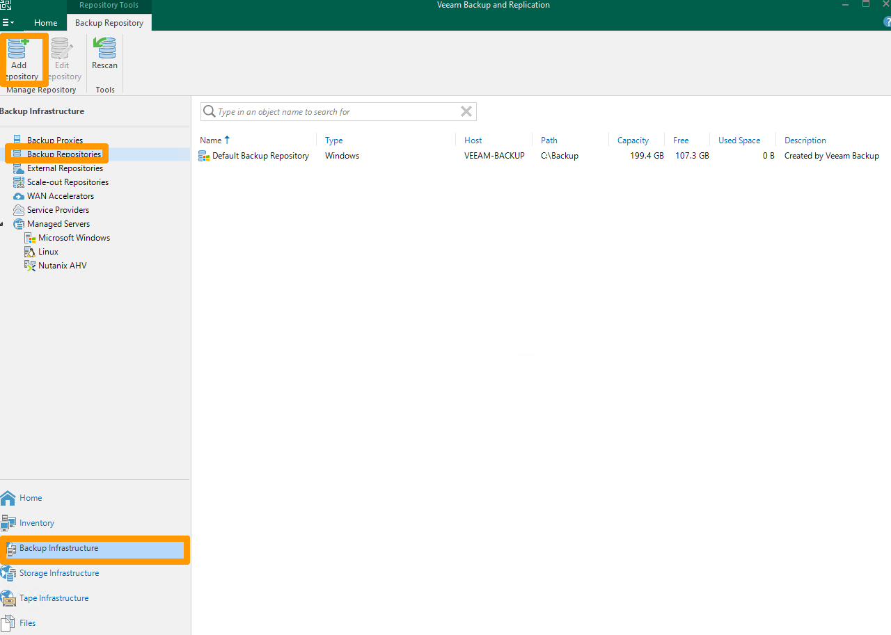{.thumbnail}

Choisissez `Network attached storage`{.action}. 

{.thumbnail}

Cliquez sur `SMB share`{.action}. 

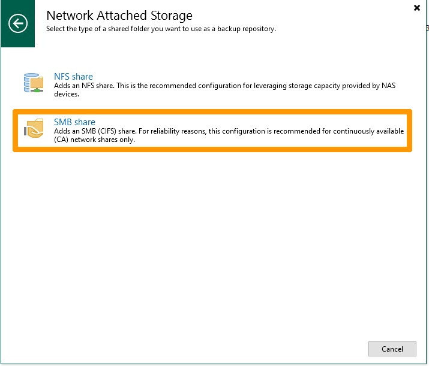{.thumbnail}

Saisissez le `nom du dépôt`{.action} dans la zone de saisie **Name** et cliquez sur `Next`{.action}. 

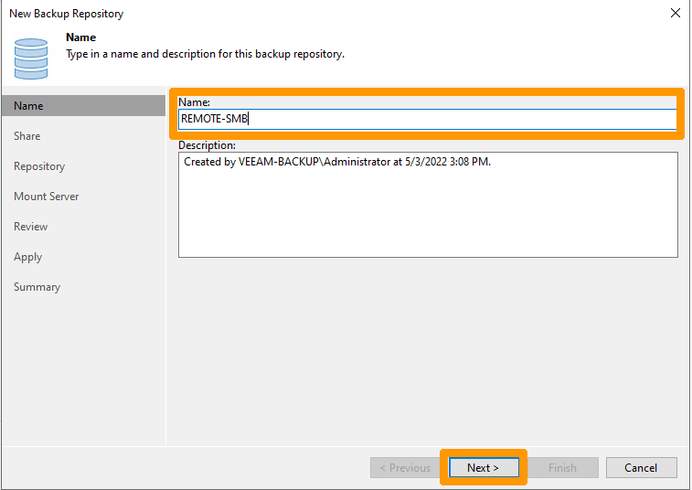{.thumbnail}

Ecrivez le `nom UNC`{.action} du partage dans **Shared folder** cochez la case `This share requires access credentials`{.action} et cliquez sur `Add`{.action}. 

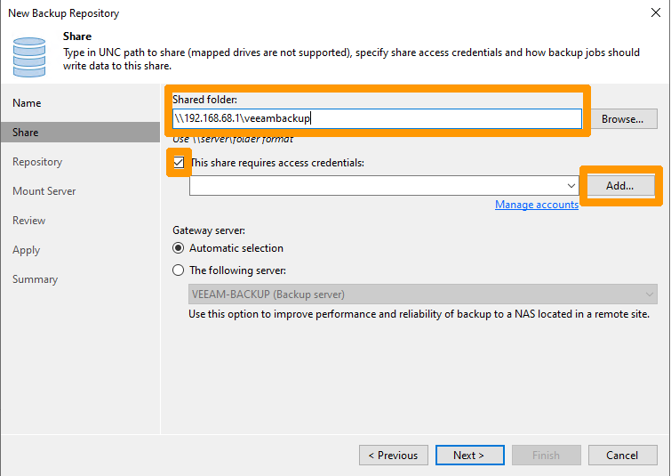{.thumbnail}

Saisissez ces informations :

- **Username** :  `nom d'utilisateur`{.action} 
- **Password** :  `mot de passe`{.action} 

Cliquez sur `OK`{.action}.

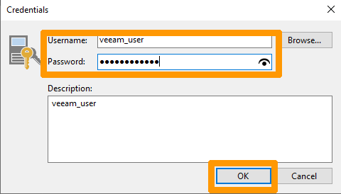{.thumbnail}

Vérifiez le nom de l'utilisateur et cliquez sur `Next`{.action}.

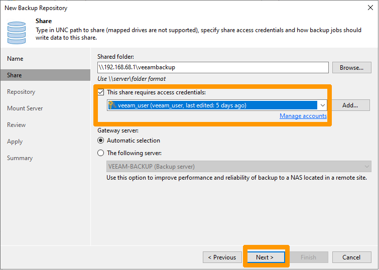{.thumbnail}

Cliquez sur `Next`{.action}.

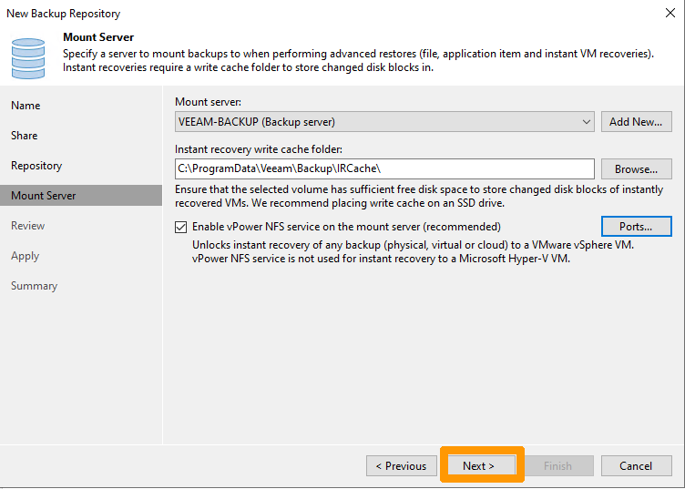{.thumbnail}

Cliquez sur `Apply`{.action}.

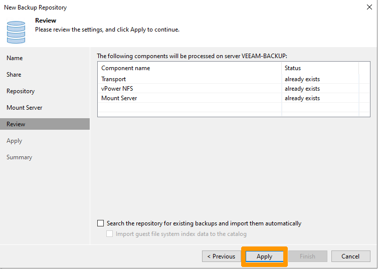{.thumbnail}

Cliquez sur `Next`{.action}.

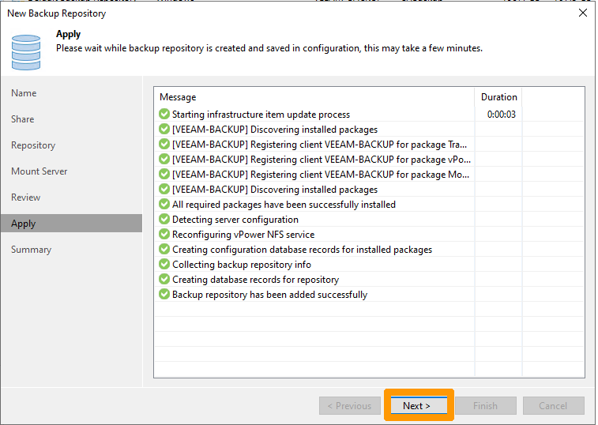{.thumbnail}

Cliquez sur `Finish`{.action}.

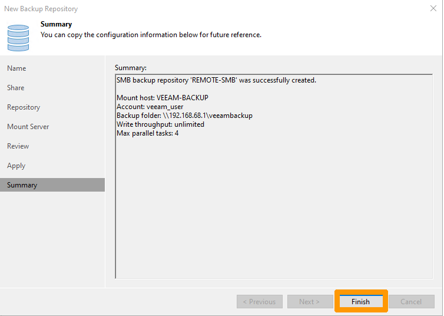{.thumbnail}

Cliquez sur `No`{.action}.

{.thumbnail}

Le nouveau dépôt apparait et est utilisable pour des sauvegardes.

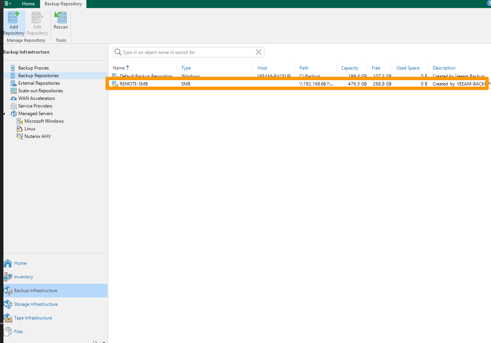{.thumbnail}

### Mise en place d'une sauvegarde

Nous allons créer une tâche de sauvegarde automatisée.

Dans **Veeam backup** cliquez en bas sur `No`{.action} , ensuite ouvrez le menu `Backup Job`{.action} et choisissez `Nutanix AHV`{.action}

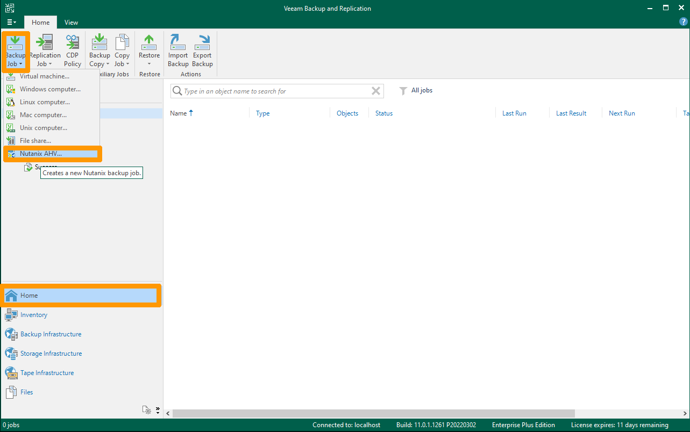{.thumbnail}

Saisissez un `nom`{.action} dans **Name**, cochez l'option `Backup job`{.action} ensuite cliquez sur `Next`{.action}.

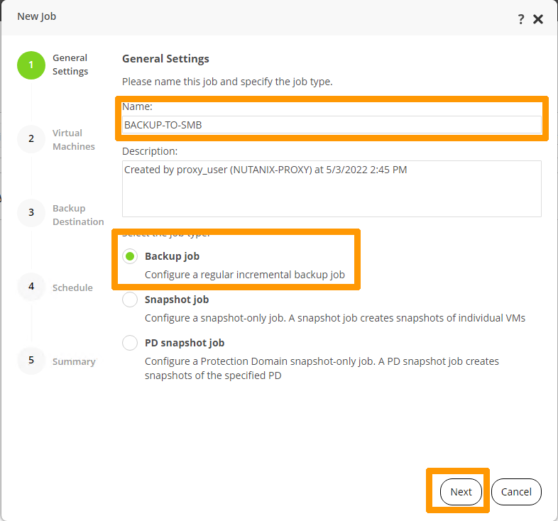{.thumbnail}

Cliquez sur le bouton `Add`{.action}.

{.thumbnail}

Sélectionnez les machines virtuelles que vous voulez sauvegarder en utilisant la `case à cocher`{.action} à gauche des machines virtuelles.

{.thumbnail}

Cliquez sur `Next`{.action}

{.thumbnail}

Sélectionnez le dépôt dans  `Backup repository`{.action} et cliquez sur `Next`{.action}

{.thumbnail}

Cochez la case `Run the job automatically`{.action}, choisissez `l'heure de sauvegarde`{.action} et cliquez sur `Next`{.action}

{.thumbnail}

Cliquez sur `Finish`{.action} pour enregistrer la tâche de sauvegarde.

{.thumbnail}

### Restauration d'un ordinateur virtuel

Pour tester le bon fonctionnement des sauvegardes nous allons exécuter une tâche de restauration.

Cliquez en bas à droite sur `Home`{.action}, dans l'option `Restore`{.action} prenez `Nutanix AHV`{.action}.

{.thumbnail}

Cliquez sur `Restore from AHV backup`{.action}.

{.thumbnail}

Cliquez sur `Entire VM restore`{.action}.

{.thumbnail}

Cliquez sur `Add`{.action}.

{.thumbnail}

Faites défiler et sélectionnez une `machine virtuelle`{.action} et cliquez sur `Add`{.action}.

{.thumbnail}

Cliquez sur `Next`{.action}.

{.thumbnail}

Choisissez l'option `restore to a new location or with different settings`{.action} et cliquez sur `Next`{.action}.

{.thumbnail}

Cliquez sur `Next`{.action}.

{.thumbnail}

Cliquez sur `Next`{.action}.

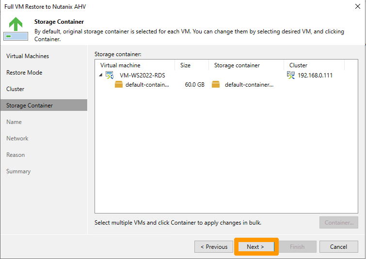{.thumbnail}

Renommez la VM dans `New name`{.action} et cliquez sur `Next`{.action}.

{.thumbnail}

Cliquez sur `Disconnect`{.action} pour isoler la machine virtuelle restaurée du réseau.

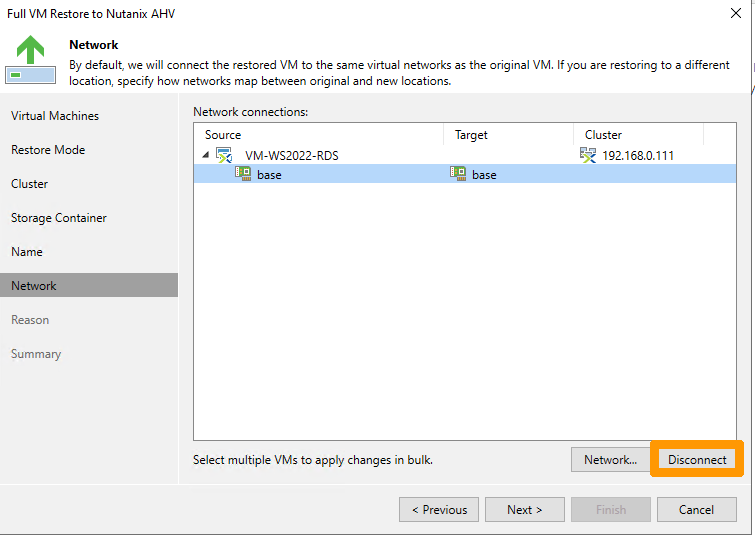{.thumbnail}

Cliquez sur `Next`{.action}.

{.thumbnail}

Cliquez sur `Next`{.action}.

{.thumbnail}

Cliquez sur `Finish`{.action}.

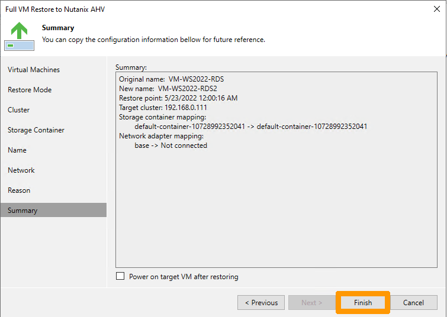{.thumbnail}

Un aperçu de l'état de la restauration se lance, il faut patienter quelques temps en fonction de la taille de la machine virtuelle.

{.thumbnail}


## Aller plus loin <a name="gofurther"></a>

[Documentation VEEAM concernant l'installation de VEEAM Backup pour Nutanix AHV](https://helpcenter.veeam.com/docs/van/userguide/installing.html?ver=30)

Échangez avec notre communauté d'utilisateurs sur <https://community.ovh.com/>.

