**Dernière mise à jour le 17/08/2022**

## Objectif

**Apprenez à installer, configurer et utiliser Time Navigator sur un cluster Nutanix avec une réplication du stockage sur un site distant**

> [!warning]
> OVHcloud vous met à disposition des services dont la configuration, la gestion et la responsabilité vous incombent. Il vous appartient donc de ce fait d’en assurer le bon fonctionnement.
>
> Ce guide a pour but de vous accompagner au mieux sur des tâches courantes. Néanmoins, nous vous recommandons de faire appel à un [prestataire spécialisé](https://partner.ovhcloud.com/fr/) si vous éprouvez des difficultés ou des doutes concernant l’administration, l’utilisation ou la mise en place d’un service sur un serveur.
>
> La licence Time Navigator n'est pas fournie par OVHcloud. Pour plus d'informations, contactez le service commercial Atempo ou d'OVHcloud.

## Prérequis

- Disposer d'un cluster Nutanix dans votre compte OVHcloud
- Être connecté à votre [espace client OVHcloud](https://www.ovh.com/auth/?action=gotomanager&from=https://www.ovh.com/fr/&ovhSubsidiary=fr).
- Être connecté sur le cluster via Prism Central.
- Avoir souscrit une offre Tina auprès de la société ATEMPO. 
- Disposer, sur votre cluster Nutanix, de 700 Go de Stockage, de 16 Go de Mémoire et de 8 Cœurs.
- De disposer d'un autre cluster Nutanix de avec 600 Go de stockage, de 8 Go de Mémoire et de 4 Cœurs.
- d'avoir un serveur DNS interne (Par exemple un serveur active diretory) et de pouvoir le configurer.

## Présentation

Le logiciel **Tina** est un logiciel modulaire composé de divers éléments que l'on peut installer sur diverses machines virtuelles ou physiques. Il permet la sauvegarde de machines virtuelles sous **Nutanix**.

## En pratique

Nous allons installer trois machines virtuelles sous AlmaLinux en version 8.6, une distribution Linux proche de RedHat (Dans le cas d'une exploitation en production il est judicieux d'utiliser une Redhat Enterprise Linux Server avec l'achat d'un support logiciel). 

Les trois machines virtuelles seront réparties comme ceci:

Deux sur un cluster Nutanix en France pour :
- Le serveur de sauvegarde avec sa console d'administration
- Le serveur de déduplication avec un paramètrage HSS (Hyper Stream Server) qui est pour l'instant le seul compatible avec Nutanix.
Un sur le serveur Nutanix au Canada pour :
- Le serveur de déduplication HSS pour recevoir une réplication des données du serveur HSS se trouvant en  France.

### Installation

IL faut installer trois machines virtuelles avec le système d'exploitation ALMALINUX (Distribution proche de Redhat Enterprise Linux Server) en version 8.6.

Vous pouvez télécharger les sources sur ce lien [Sources ALMALINUX](https://mirrors.almalinux.org/isos/x86_64/8.6.html) et vous aider de cette documentation pour ajouter les sources sur vos clusters Nutanix [Importer des images ISO](https://docs.ovh.com/fr/nutanix/image-import/)

Nous allons utiliser une serveur DNS interne avec comme adresse **192.168.0.200** et un nom de domaine ad-testing.lan, il faut rajouter trois entrée dns avec les noms de machines ainsi que leurs adresses. 

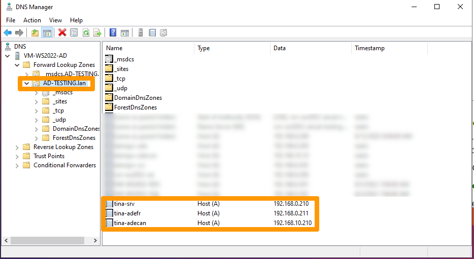{.thumbnail}

L'adresse IP interne de Prism Element est **192.168.0.111**

Le nom des machines virtuelles nécessaires à l'installation de Tina sont les suivantes :

- **tina-srv.ad-testing.lan** : Serveur Tina avec l'adresse IP `192.168.0.210`
- **tina-adefr.ad-testing.lan** : Serveur de déduplication en mode HSS avec l'adresse IP `192.168.0.211`
- **tina-adecan.ad-testion.lan** : Serveur de déduplication en mode HSS avec l'adresse IP `192.168.10.211` pour récevoir une réplication de la sauvegarde.

#### Création de la machine virtuelle TINA-SRV

Nous allons créer la machine virtuelle atempo-srv qui est le serveur de sauvegarde tina

Aidez-vous de ce guide pour créer une machine virtuelle sous Nutanix [Gestion des machines virtuelles](https://docs.ovh.com/fr/nutanix/virtual-machine-management/)

Choisissez ces paramètres:

- Nom de la machine virtuelle `atempo-srv`.
- Un disque de `60Go`.
- 4 `vCPU`
- 8Go de `mémoire vive`
- Un lecteur CDROM connecté au sources `d'ALMALINUX`.
- Une carte réseau sur le réseau de `base` qui est le réseau d'administration du cluster Nutanix.

{.thumbnail}

#### Création des machines virtuelles TINA ADE pour HSS

Ensuite nous allons créer deux machines virtuelles du même type une en France et l'autre au Canada en tant que dépot ADE au format HSS avec ces paramètres :

- Nom des machines virtuelle `atempo-adefr`. et `atempo-adecan`
- Un disque de `60Go`.
- Un deuxième disque de `500Go`
- 4 `vCPU`
- 8Go de `mémoire vive`
- Un lecteur CDROM connecté au sources `d'ALMALINUX`.
- Une carte réseau sur le réseau de `base` qui est le réseau d'administration du cluster Nutanix.

{.thumbnail}

#### Installation d'ALMALINUX sur les trois machines virtuelles créés

Nous allons ensuite installer les systèmes d'exploitations. 

Démarrez la machine virtuelles et lancez l'installation

Choisissez comme langue `English` et clavier `English (United States` et cliquez sur `Continue`{.action}

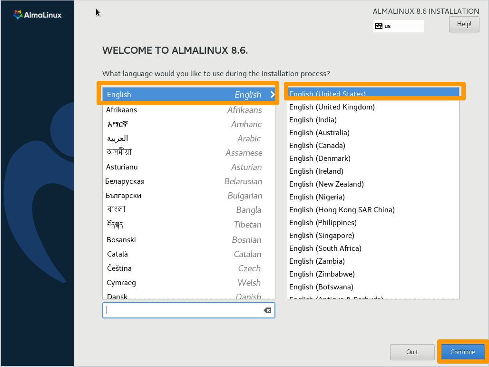{.thumbnail}

Cliquez sur `Network & Host Name`{.action}

{.thumbnail}

Cliquez sur `Configure`{.action}

{.thumbnail}

Positionnez-vous en haut sur l'onglet `IPv4 Settings`{.action}, choisissez la `Manual` cliquez sur `Add`{.action} , saisissez l'`adresse IP`{.action} , l'`adresse IP du DNS`{.action} ansi que le nom de domaine dans `Search domains`{.action}

> [!warning]
> Pour information les adresses IP sur le réseau privé sont : 
> 
> - tina-srv : 192.168.0.210.
>
> - tina-adefr : 192.168.0.211.
>
> - tina-adecan : 192.168.10.211.
>

Ensuite cliquez sur `Save`{.action}

{.thumbnail}

Cliquez sur l'`interrupteur`{.action} pour activer le réseau, saisissez le nom d'hôte dans `Host Name`{.action} ensuite cliquez sur `Apply`{.action} et cliquez sur `Done`{.action}

-> [!warning]
> A chaque installation choisissez le nom d'hôtes sont : 
> 
> tina-srv.ad-testing.lan pour le serveur tina.
>
> tina-adefr.ad-testing.lan pour le serveur de déduplication HSS en France.
>
> tina-adecan.ad-testing.lan pour le serveur dé déduplication HSS au Canada.
>

{.thumbnail}

Cliquez sur `Installation Destination`{.action}.

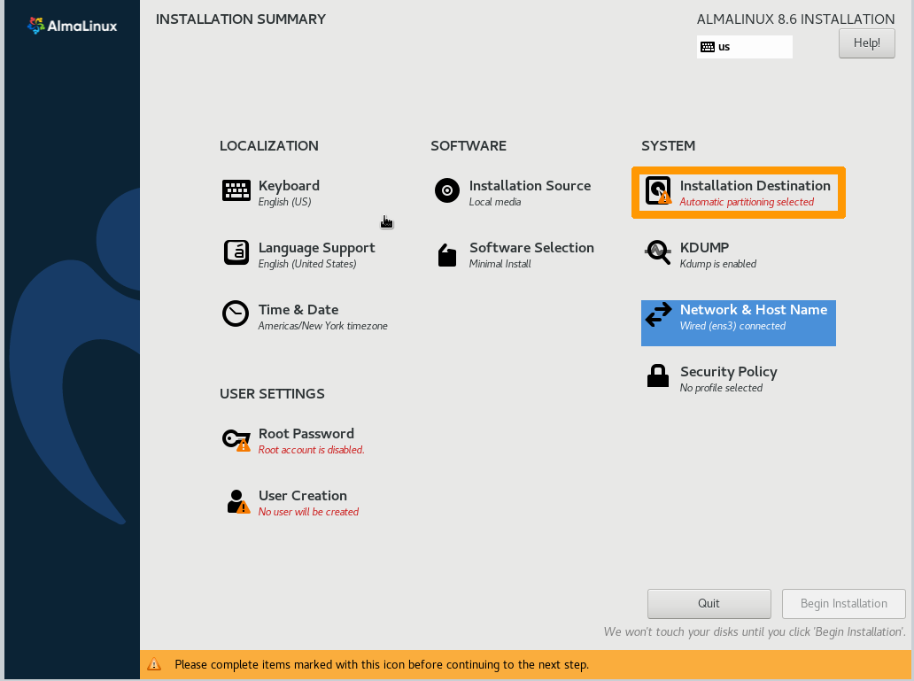{.thumbnail}

Sélectionnez le disque de `60 Go` et cliquez sur `Done`{.action}.

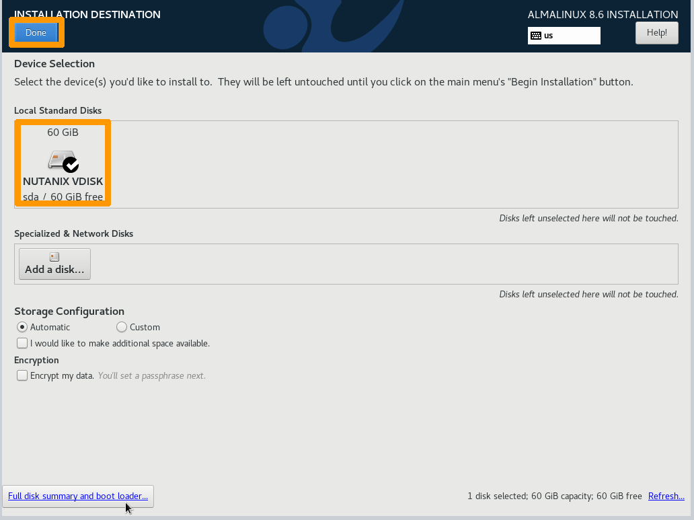{.thumbnail}

Cliquez sur `Installation Source`{.action}.

{.thumbnail}

Sélectionnez `On the network` et cliquez sur `Done`{.action}.

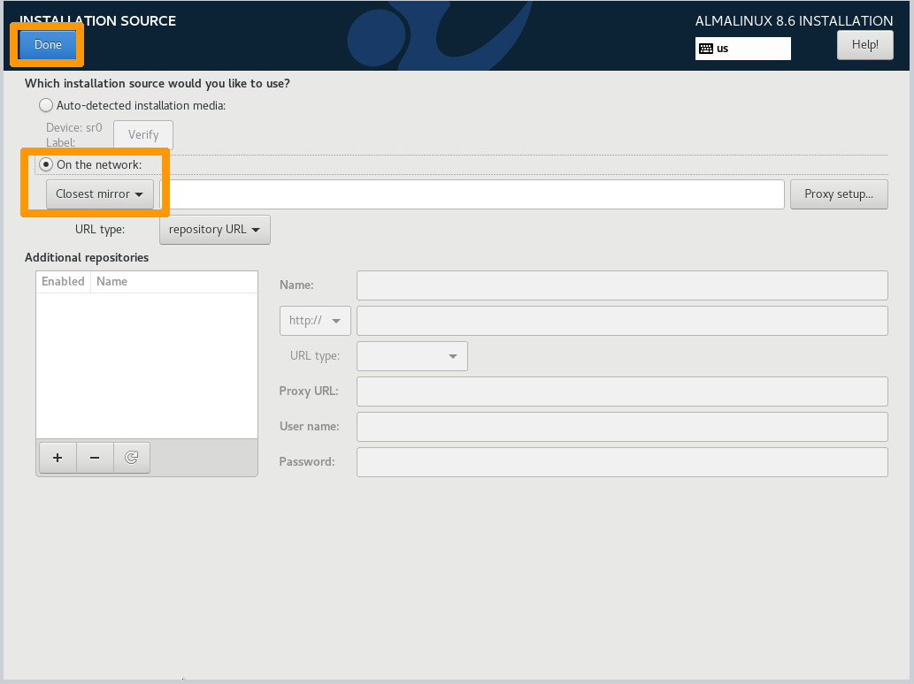{.thumbnail}

Cliquez sur `Software Selection`{.action}.

{.thumbnail}

Sélectionnez `Server with GUI` et cliquez sur `Done`{.action}.

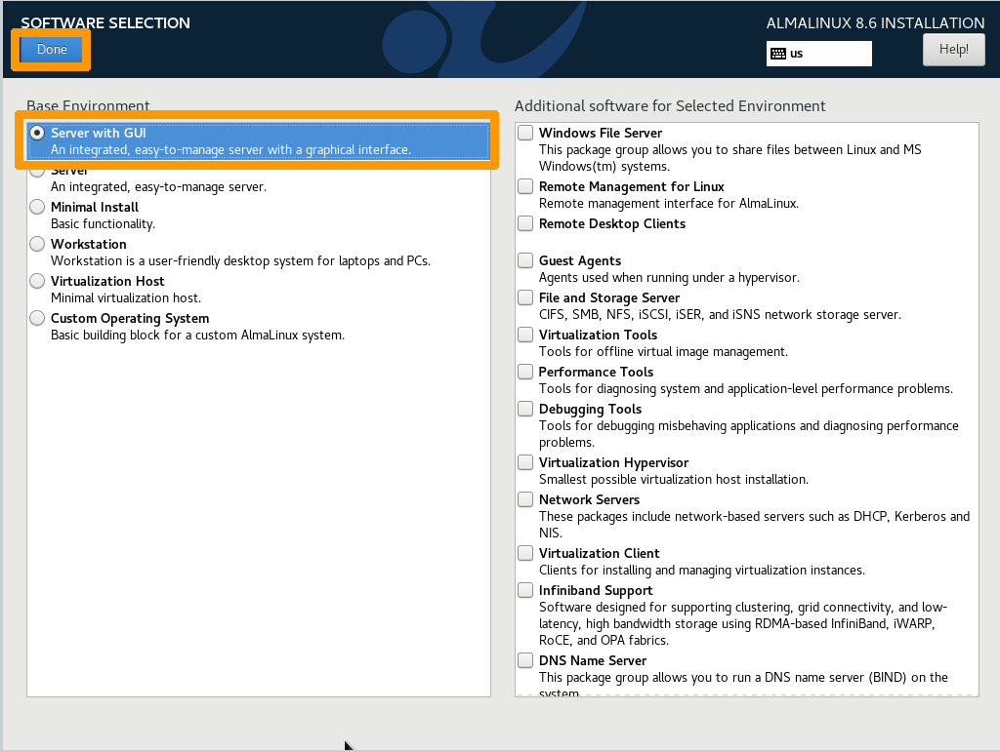{.thumbnail}

Cliquez sur `Root Password`{.action}.

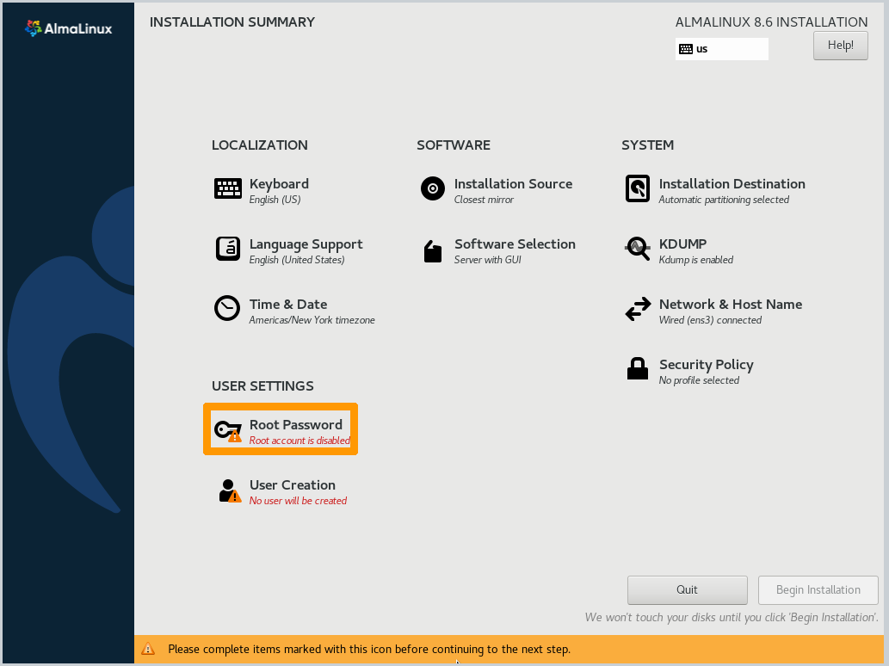{.thumbnail}

Saisissez et confirmer le `mot de passe` et cliquez sur `Done`{.action}.

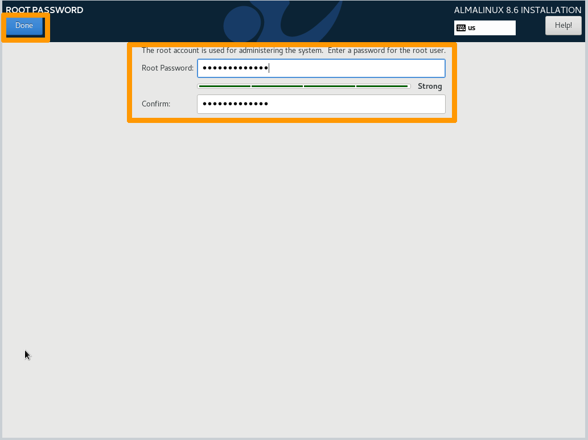{.thumbnail}

Cliquez sur `User Creation`{.action}.

{.thumbnail}

Choisissez ces options :

- **Full Name** : `admatempo`
- **User Name** : `admatempo`
- **Make this user administrator** : `cochez la case`
- **Require a password to use this account** : `cochez la case`
- **Password** : `Mot de passe de l'utilisateur`
- **Confirm password** : `Mot de passe de l'utilisateur confirmé`

Ensuite cliquez sur `Done`{.action}.

{.thumbnail}

Cliquez sur `Begin Installation`{.action}.

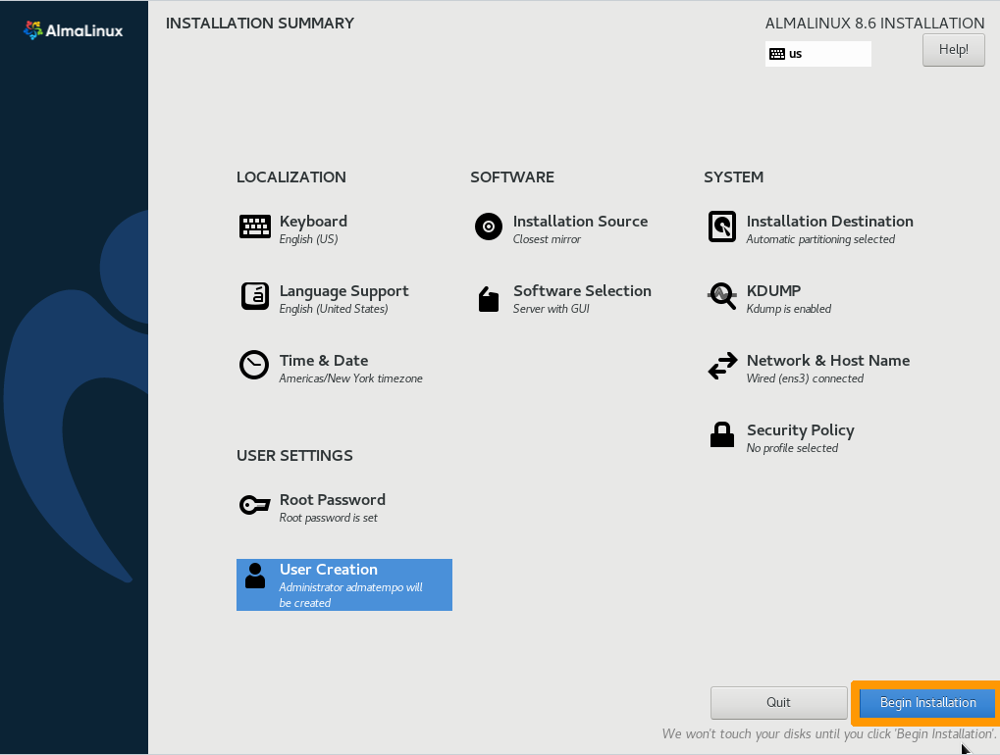{.thumbnail}

L'installation démarre

{.thumbnail}

Cliquez sur `Reboot System`{.action}.

{.thumbnail}

Cliquez sur `License Information`{.action}.

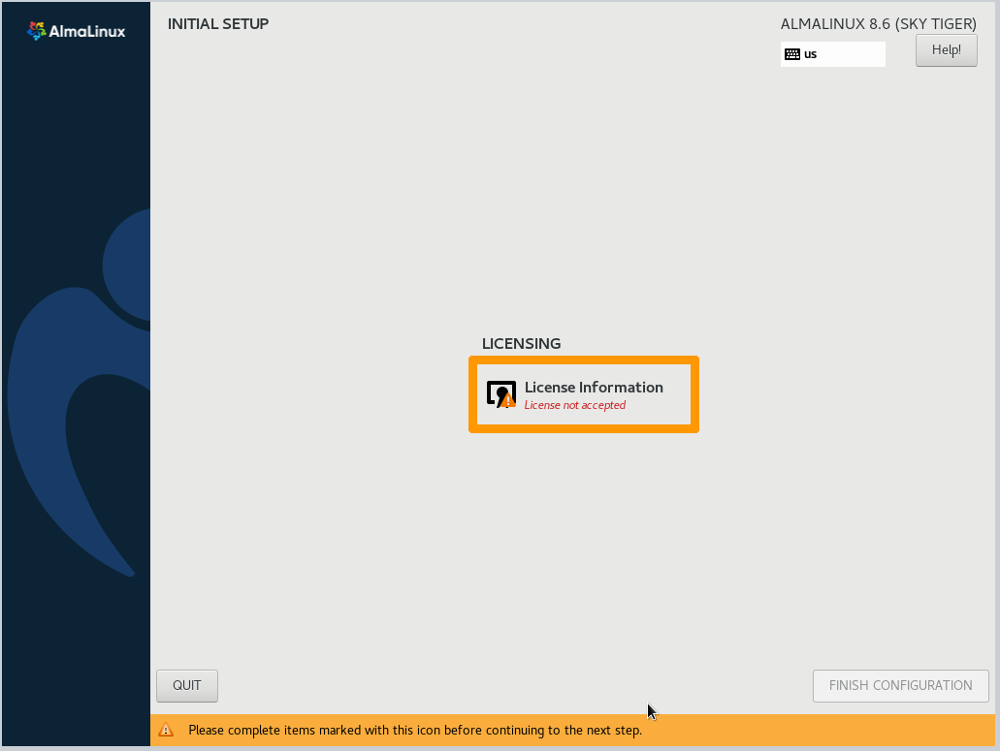{.thumbnail}

Cliquez sur `I accept the license agreement`{.action} et cliquez sur `Done`{.action}.

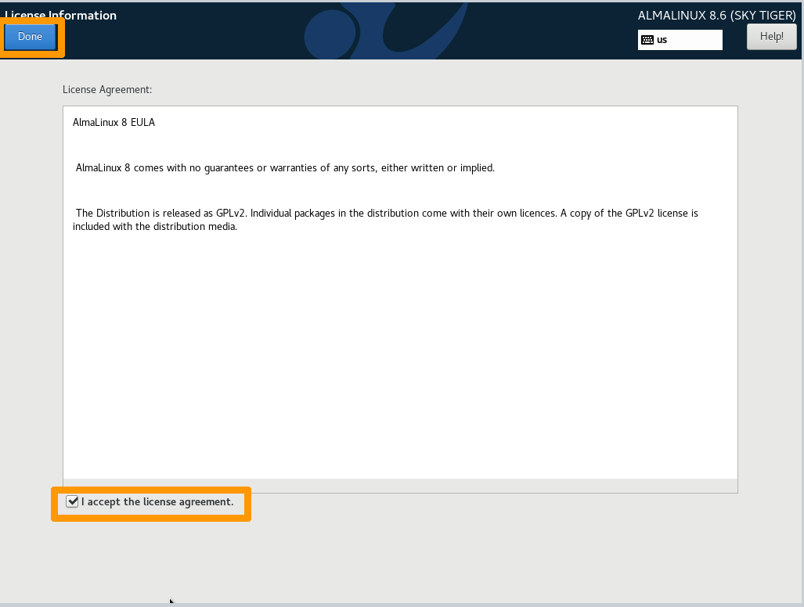{.thumbnail}

Cliquez sur `FINISH CONFIGURATION`{.action}

{.thumbnail}

L'installation est terminée

{.thumbnail}

#### Personalisation communes des trois machines virtuelles

Sur chacunes des machines virtuelles installés nous allons desactiver le pare-feu , IPv6 et selinux. Ensuite nous allons installer et configurer **Tigervnc** pour la prise de main à distance avec une interface graphique sous Linux

Connectez-vous en ssh sur chaque machine virtuelle.

```bash
ssh root@nommachinevirtuelle.ad-testing.lan
```

Désactivez selinux sur la machine virtuelle en modifiant le fichier **/etc/selinux/config** en remplaçant

```conf
SELINUX=enforcing
```

par 

```conf
SELINUX=disabled
```

Ensuite executez ces commandes :

```bash
## Arrêt et desactivation du parefeu
systemctl stop firewalld
systemctl disable firewalld
## Desactivation IPv6
echo "net.ipv6.conf.all.disable_ipv6 = 1" >> /etc/sysctl.conf
echo "net.ipv6.conf.default.disable_ipv6 = 1" >> /etc/sysctl.conf
sysctl -p
## Installation de tigervnc
dnf install tigervnc-server
## Choix du mot de passe pour vncserver
vncpasswd
mot de passe
confirmation mot de passe
## répondre non à la création d'un mot de passe pour l'affichage
n
## création d'un lien sympbolique sur une librairie afin de faire fonctionner le serveur de licences
ln  -s  /lib64/ld-linux-x86-64.so.2   /lib64/ld-lsb-x86-64.so.3
```

Modifiez le fichier **/etc/tigervnc/vncserver.users**

```conf
## Ajoutez cette ligne
:1=root
```

Créez le fichier **/root/.vnc/config**

```conf
session=gnome
securitytypes=vncauth,tlsvnc
geometry=1280x1024
```

Executez ces commandes

```bash
systemctl enable --now vncserver@:1
reboot
```

#### Personalisation des deux machines virtuelles de déduplication

IL faut configurer le disque supplémentaire dans le système d'exploitation linux sur les deux machines virtuelles de déduplication.

Executez ces commandes

```bash
# Création de la partition
parted -s /dev/sdb --script mklabel gpt mkpart primary xfs 0% 100%
# Création du système de fichier
mkfs.xfs /dev/sdb1
# Création du dossier /data
mkdir /data
# Récupération de l'UUID de la partition /dev/sdb1
blkid /dev/sdb1
```

A l'écran apparait ces informations :

```conf
/dev/sdb1: UUID="xxxxxxxx-xxxx-xxxx-xxxx-xxxxxxxxxxxx" BLOCK_SIZE="4096" TYPE="xfs" PARTLABEL="primary" 
PARTUUID="xxxxxxxx-xxxx-xxxx-xxxx-xxxxxxxxxxxx"
```
Copiez le contenu UUID="xxxxxxxx-xxxx-xxxx-xxxx-xxxxxxxxxxxx"

Ensuite modifier ce fichier **/etc/fstab**

```conf
# Ajout de cette ligne dans le fichier
UUID="xxxxxxxx-xxxx-xxxx-xxxx-xxxxxxxxxxxx" /data                    xfs     defaults        0 0
```

#### Installation du logiciel de déduplication sur tina-adefr et tina-adecan.

Le logiciel de déduplication **tina-ade** transforme votre serveur en dépot de stockage pour le serveur tina, nous allons installer deux dépots :

- L'un en France
- L'autre au Canada pour servir de réplica à celui de France.

Suivez ces instructions sur les machine virtuelles **tina-adefr** et **tina-ade**

Connectez-vous avec un client vnc sur le serveur `tina-adexx:5901`.

{.thumbnail}

Saisissez `le mot de passe` et cliquez sur `OK`{.action}.

{.thumbnail}

Au travers de la console lancer le programmme d'installation `ATL533-linux-x64.bin`{.action}.

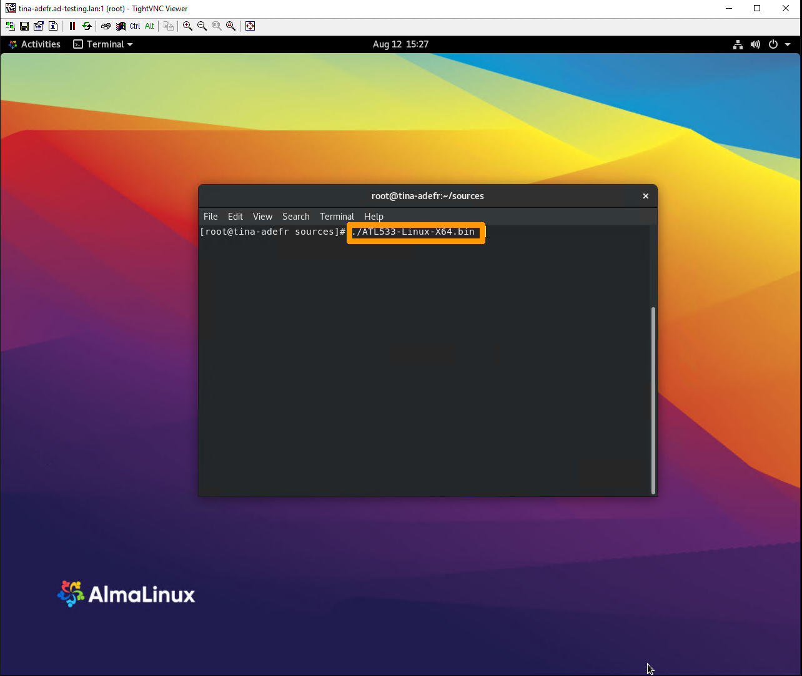{.thumbnail}

Laissez `English` et cliquez sur `OK`{.action}.

{.thumbnail}

Cliquez sur `Next`{.action}.

{.thumbnail}

Cochez la case `I accept the terms of the license Agreement`{.action} et cliquez sur `Next`{.action}.

{.thumbnail}

Laissez la case  `Atempo Lina`{.action} et cliquez sur `Next`{.action}.

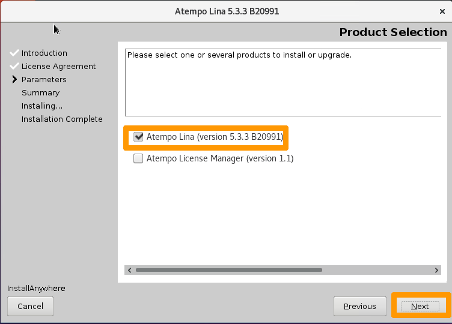{.thumbnail}

Selectionnnez `Do not install Atempo License Manager`{.action} et cliquez sur `Next`{.action}.

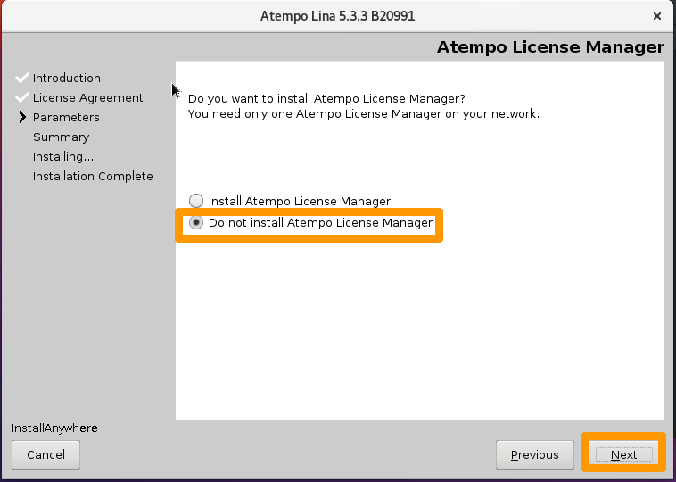{.thumbnail}

Cliquez sur `Next`{.action}.

{.thumbnail}

Cliquez sur `Install`{.action}.

{.thumbnail}

L'installation débute.

{.thumbnail}

Cliquez sur `Done`{.action}.

{.thumbnail}

## Configuration des deux serveurs de déduplications 

Maintenant que l'installation est terminée utilisez un navigateur WEB et allez sur l'adresse `https://tina-adexx:8181`. Le configurateur va se lancer.

Lors du choix de la `Database` sélectionnez le dossier `/home` et cliquez sur la `flêche`{.action} en bas.

{.thumbnail}

Sélectionnez le dossier `/data` pour le `storage` ensuite cliquez sur la `deuxième flêche`{.action} en bas.

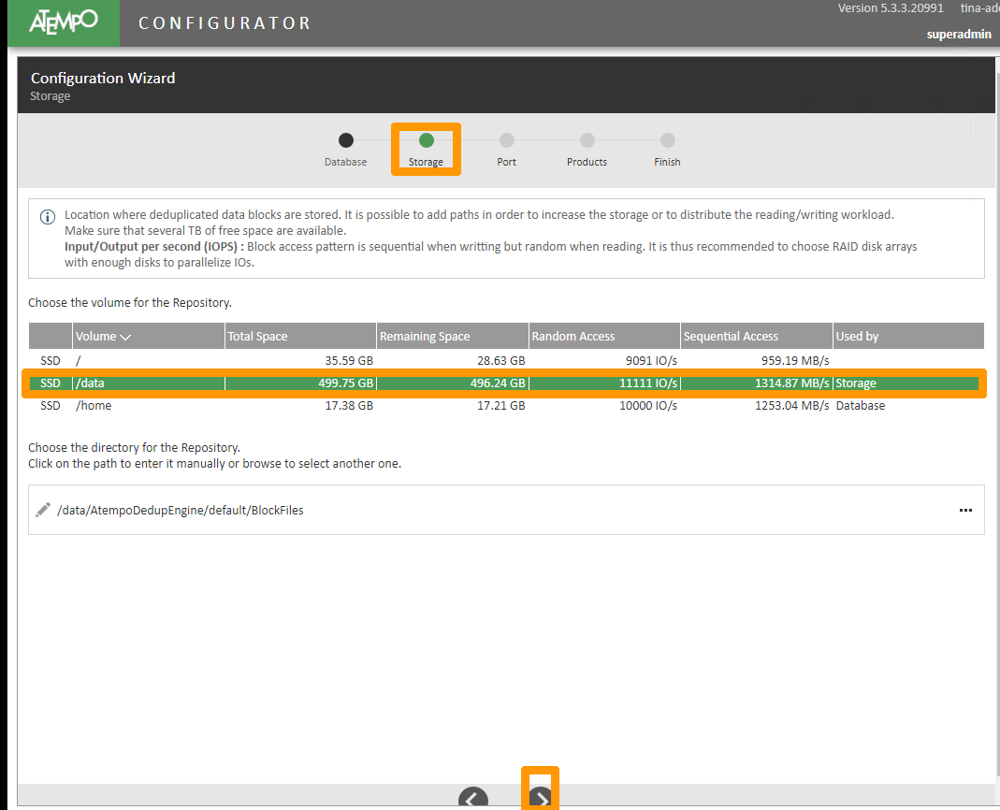{.thumbnail}

Laissez les options par défaut et cliquez sur la `deuxième flêche à droite`{.action} en bas.

{.thumbnail}

Choisissez ces options :

- **Activate HyperStream** sur `Yes`
- **Activate Lina** sur `No`
- **Activate HVDS** sur `No`

Ensuite cliquez sur la `deuxième flêche à droite`{.action} en bas.

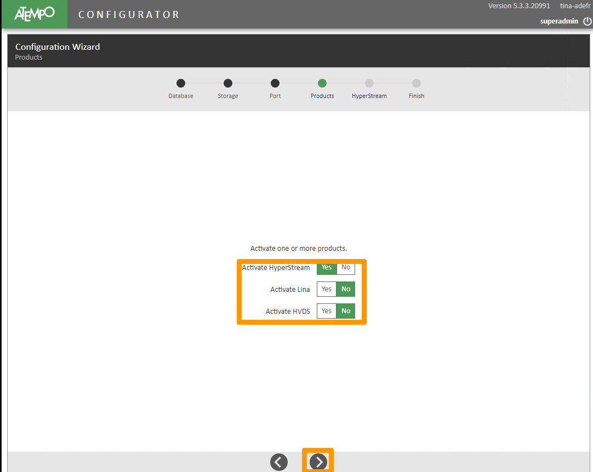{.thumbnail}

Pour la configuration d'`Hyperstream` sélectionnez le dossier `/home` et cliquez sur la `deuxième flêche`{.action} en bas.

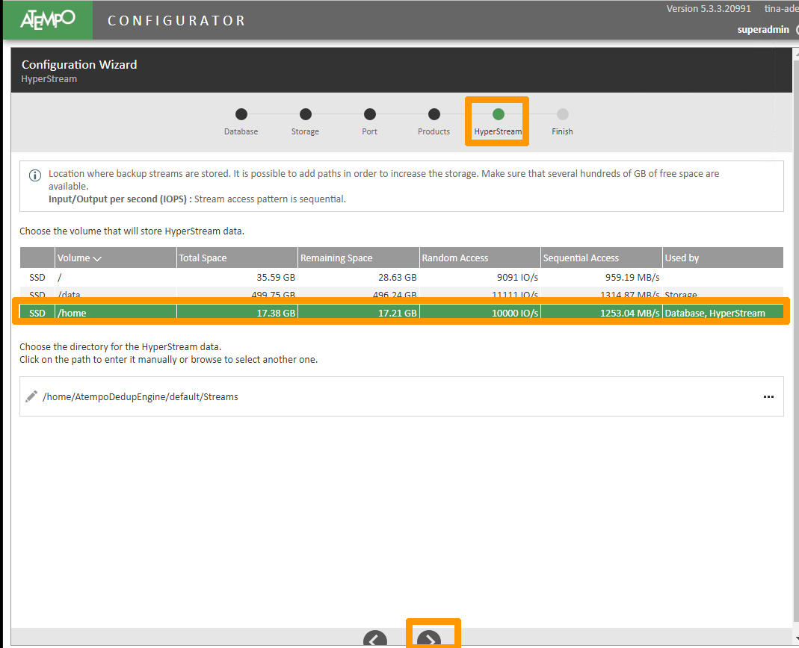{.thumbnail}

Pour finir l'installation laissez `Yes` à **Receive update notifications**. et cliquez sur le `signe de validation`{.thumbnail} en bas à droite.

{.thumbnail}

Cliquez sur `OK`{.action} pour redémarrer le programme avec les nouveaux paramètres.

{.thumbnail}

Maintenant que la configuration est terminée revenez sur l'interface d'administration avec l'adresse `https://tinaadexx:8181`. A partir de maintenant il faut s'authentier.

Saisissez le nom d'utilisateur `superadmin` et le mot de passe par défaut `superadmin` et cliquez sur `login`{.action}

{.thumbnail}

Cochez la case `Do not show again` et cliquez sur `Skip the presentation`{.action}.

{.thumbnail}

Nous allons changer le nom du serveur 

Cliquez sur l'onglet `Server`{.action}. et choisissez `Tenants`{.action}

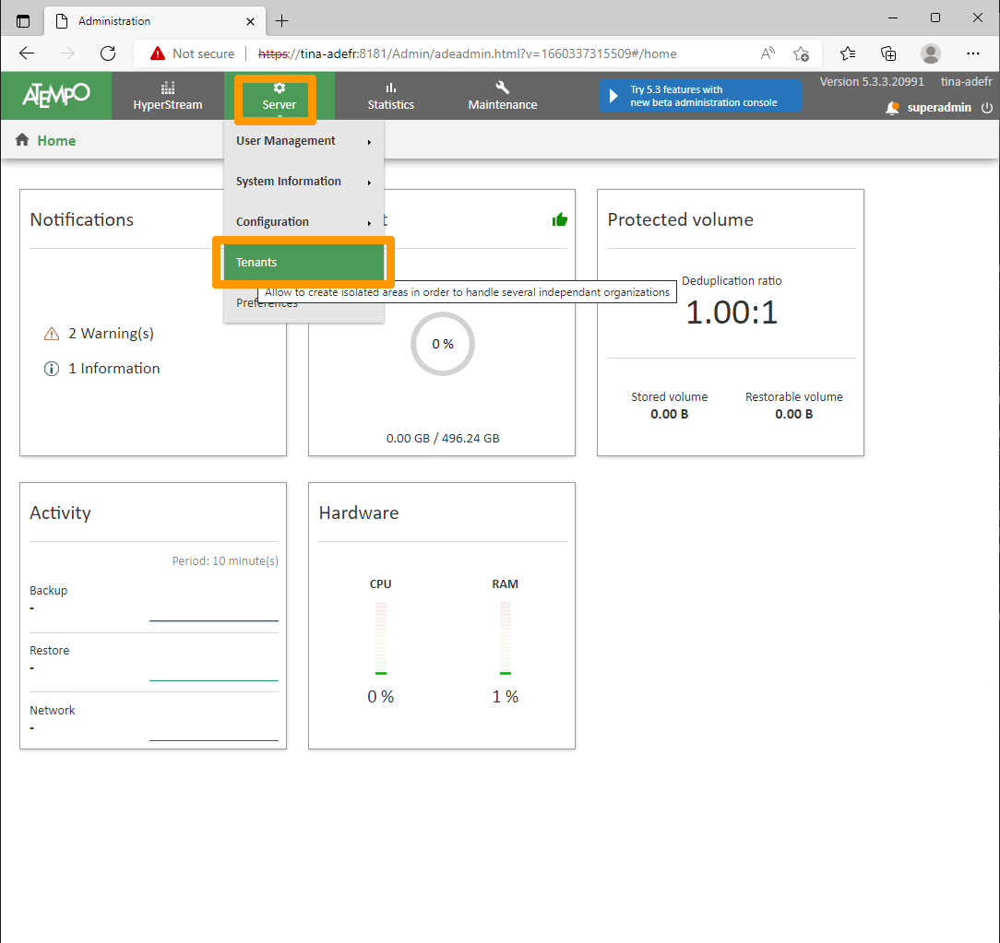{.thumbnail}

Se positionnez sur le `nom`{.action}  et cliquez sur le bouton `Modify`{.action}.

{.thumbnail}

Cliquez sur le `stylo`{.action} en haut à gauche 

{.thumbnail}

Saisissez le nom du serveur et cliquez sur le bouton de `validation`{.action}.

{.thumbnail}

Cliquez sur la `croix`{.action} pour fermer la fenêtre.

{.thumbnail}

Maintenant nous allons changer le mot de passe du compte **superadmin**.

Revenez sur l'onglet `Server`{.action}, prenez l'option `User Management` et choisissez `Advanced`{.action}

{.thumbnail}

Cliquez sur le bouton en forme de `stylo`{.action} à coté de **click to modify the password**.

{.thumbnail}

Saisissez et confirmez le mot de passe, ensuite cliquez sur le bouton de `validation`{.action} 

{.thumbnail}

Nous allons modifier le mot de passe du compte **admin**. Ce compte est utilisé sur le serveur **tina**.

Au travers de l'onglet l'onglet `Server`{.action}, prenez l'option `User Management` et choisissez `Users`{.action}.

{.thumbnail}

Sélectionnez l'utilisateur `admin` et cliquez sur `Modify`{.action}.

{.thumbnail}

Cliquez sur `click to modify the passsword`{.action}.

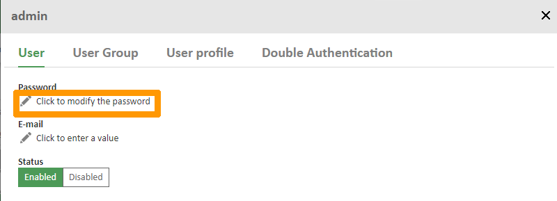{.thumbnail}

Saisissez et confirmez le mot de passe, ensuite cliquez sur le bouton de `validation`{.action}

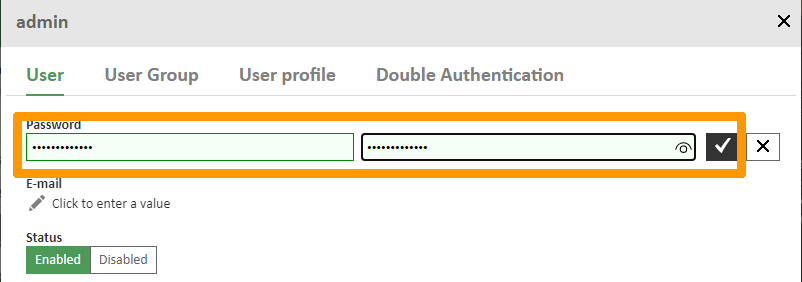{.thumbnail}

#### Mise en place de la réplication entre serveurs de déduplication.

Maintenant que les deux serveurs de déduplication sont installés nous allons configurer la réplication sur le serveur qui se trouve en france **tina-adefr**

Cliquez sur l'onglet `Server`{.action}, Choisissez `Replication`{.action} depuis le menu `Configuration`

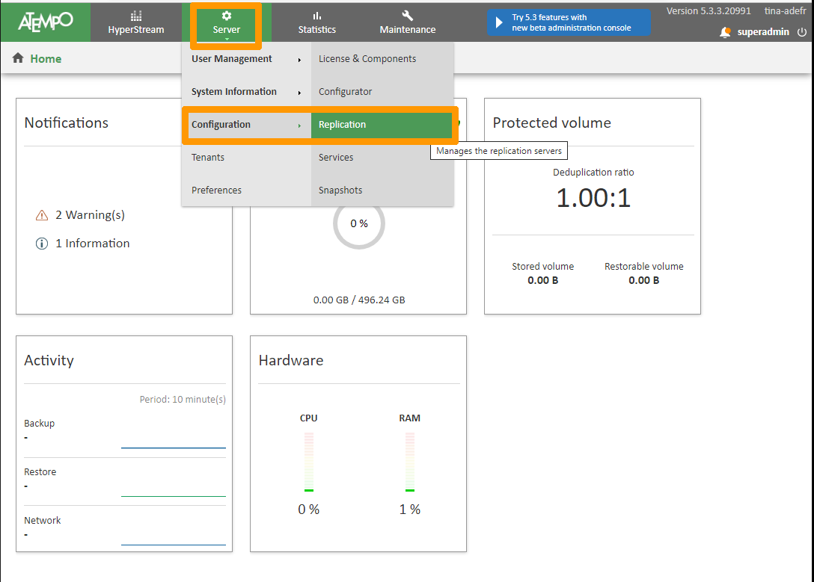{.thumbnail}

Cliquez sur le bouton `Add`{.action}

{.thumbnail}

Dans **Host : Port**: , choisissez ces options

- **Host** : `tina-adecan`
- **Port** : `8181`

Ensuite cliquez sur `Validate the creation`{.action}

{.thumbnail}

La réplication est active dès que des données seront stockées sur le serveur de déduplication en france elles seront répliquées au CANADA.

{.thumbnail}


#### Installation du logiciel tina sur tina-srv

A partir d'une machine virtuelle avec une interface graphique soit sous **windows** soit sous **linux** se trouvant sur le réseau privé ou se trouve les machines virtuelles **tina-srv**, **tina-adefr** et **tina-adecan** installez le logiciel [TightVNC](https://www.tightvnc.com/download.php).

Connectez-vous sur **tina-srv** avec le logiciel Tightvnc en utilisant cette adresse `tina-srv:5901`{.action}

{.thumbnail}

Saisissez le mot de passe de vnc et cliquez sur `OK`{.action}

{.thumbnail}

Lancer le terminal et executez le programme d'installation `Atempo-tina-4.7.0.6413-Server-Agent-Linux-X64`{.action}

{.thumbnail}

Laissez la langue en `English` et cliquez sur `OK`{.action}.

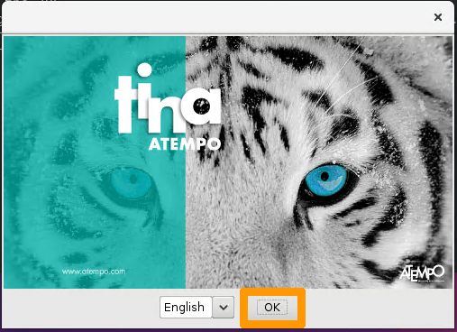{.thumbnail}

Cliquez sur `Next`{.action}.

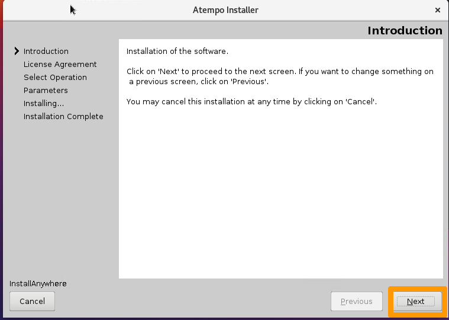{.thumbnail}

Cochez la `case`{.action} à coté de **I accept the terms of the License Agreement**, ensuite cliquez sur `Next`{.action}.

{.thumbnail}

Cochez les cases `Time Navigator`{.action} et `Atempo License Manager`{.action}, ensuite cliquez sur `Next`{.action}.

{.thumbnail}

cliquez sur `Next`{.action}.

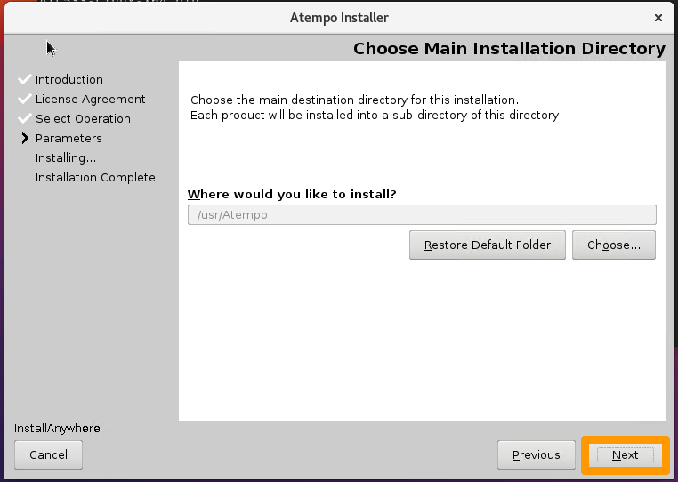{.thumbnail}

Sélectionnez `I do not have a license file yet`{.action} et cliquez sur `Next`{.action}.

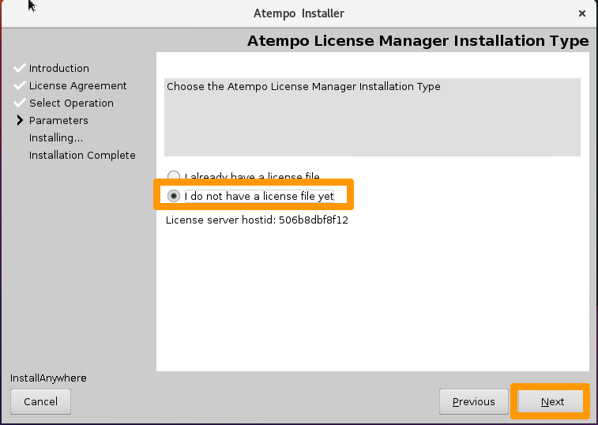{.thumbnail}

Choisissez l'option `TIme Navigator Server`{.action} et cliquez sur `Next`{.action}.

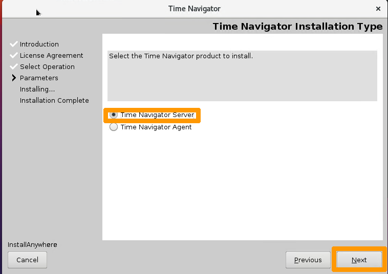{.thumbnail}

Cliquez sur `Next`{.action}.

{.thumbnail}

Prenez `Temporary License`{.action} et cliquez sur `Next`{.action}.

{.thumbnail}

Choisissez `Create a Catalog Now`{.action} et cliquez sur `Next`{.action}.

{.thumbnail}

Choisissez ces options :

- **Catalog Name** : `catalog` ;
- **Administrator User Name** : `admin` ;
- **Administrator User Password** :  `mot de passe du compte admin`
- **Confirm Administrator Password** : 'mot de passe du compte admin`

> [!warning]
>
> Notez ces informations de connexions, elles vous servirons pour vous authentifier sur le serveur **tina**
>
>

Ensuite cliquez sur `Next`{.action}.

{.thumbnail}

Séléctionnez l'option `Memory`{.action} ensuite cliquez sur `Next`{.action}.

{.thumbnail}

Gardez l'option de cache à `64MB`{.action} et cliquez sur `Next`{.action}.

{.thumbnail}

Cliquez sur `Next`{.action}.

{.thumbnail}

Choisissez le `nom du serveur smtp` dans **SMTP Server Name:** et cliquez sur `Next`{.action}.

{.thumbnail}

Cliquez sur `Install`{.action}.

{.thumbnail}

L'installation se lance.

{.thumbnail}

Cliquez sur `Done`{.action} pour valider la fin de l'installation.

{.thumbnail}


#### Configuration du serveur tina

Connectez-vous au serveur au travers d'un navigateur WEB sur l'adresse privé **https://tina-srv:22088**

Cliquez sur `Atempo Web Interfaces Administration`{.action}.

{.thumbnail}

Choisir ces options :

- **Username** : `admin`
- **Password** : `Mot de passe` 
- **Catalog** : `Nom du catalogue`

Et cliquez sur `Login`{.action}.

{.thumbnail}

Le tableau de bord apparait.

{.thumbnail}

##### Ajout de la destination de sauvegarde

Nous allons configurer le serveur **tina-ade** en tant que dépot de sauvegarde

Cliquez à gauche dans la barre verticale sur `Backup`{.action} ensuite cliquez sur `Add new storage`{.action}.

{.thumbnail}

Sélectionnez `Atempo deduplication (Hyperstreeam)` et cliquez sur `Next`{.action}.

{.thumbnail}

Saisissez ces informations : 

- **Enter a name for the storage** : `Nom qui apparaitra pour les sauvegardes`
- **Deduplication-server where data will be saved** : `nom FQDN du serveur de deduplication`
- **Username** : `Compte administrateur du serveur de déduplication`
- **Password** : `Mot de passe du compte administrateur`

et cliquez sur `CHECK SERVER CONNECTION`{.action}

{.thumbnail}

Modifiez les options de taille et de nombre de bandes comme ceci :

- **Number of drives** : `10`
- **Media size** : `1GB`
- **Compression algorithm** : `Brotli`

Ensuite faites défiler la fenêtre avec la `barre de défilement à droite`{.action}.

{.thumbnail}

Activez `Define a primary data retention pool`{.action} avec ces paramètres


- **Retention** : `Limited`
- **Data to be kept during** : `1 week(s)`
- **Storage pool name** : `1w_HSS`
- **Prefix or cartrige (label)** : `1w_HSS_`

Ensuite cliquez sur `FINISH`{.action}

{.thumbnail}

cliquez sur `OK`{.action}

{.thumbnail}

##### Ajout du cluster Nutanix en tant que source de sauvegarde

Pour pouvoir sauvegarder le serveur Nutanix il faut configurer un agent qui pourra se connecter au cluster Nutanix

Restez sur `Backup` à gauche et cliquez sur `Add new agent`{.action}.

{.thumbnail}

Selectionnez `Declare a new application`, choisissez dans la liste `Nutanix Virtualisation Agent` ensuite cliquez sur `NEXT`{.action}.

{.thumbnail}

Modifier **Status** en le passant en `Enabled`{.action} ensuite modifier ces paramètres

- **** : ``
- **Virtualisation server** : `Adresse IP locale de Prism Element`
- **Virtualization user** : `Utilisateur administrateur de Prism Element`
- **virtualization password** : `Mot passe du compte administrateur Prism Element`
- **Nutanix protocol** : `https`

Ensuite cliquez sur `FINISH`{.action}.

{.thumbnail}

Clique sur `FINISH`{.action}.

{.thumbnail}

##### Création d'un nouveau planning de sauvegarde

Restez à gauche dans `Backup` et cliquez sur `Backup schedules`{.action}.

{.thumbnail}

Cliquez sur `Add new schedule`{.action}.

{.thumbnail}

Choisissez ces options :

- **Backup every** : `1 Day`
- **Execution time** : `20:00`

Et cliquez sur `Save`{.action}.

{.thumbnail}

##### Configuration de l'agent pour automatiser la sauvegarde

Cliquez à gauche sur `Agents` et cliquez sur `Not configured`{.action} pour voir les agents non configurés


### Configuration d'une sauvegarde

### Restauration d'une sauvegarde

## Aller plus loin <a name="gofurther"></a>


Échangez avec notre communauté d'utilisateurs sur <https://community.ovh.com/>.

[Tina Compatibily GUIDE 2022](https://www.atempo.com/wp-content/uploads/2022/01/COMPATIBILITY-GUIDE_en_Tina_469_24-01-2022.pdf)

