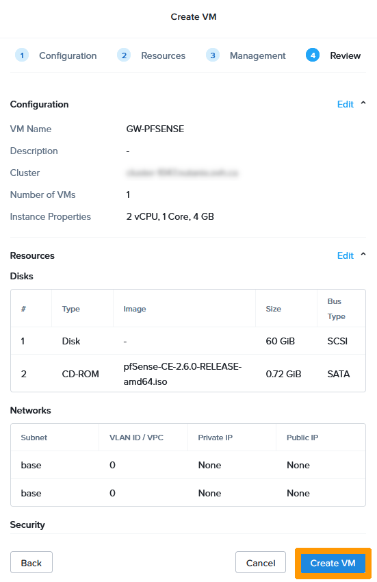
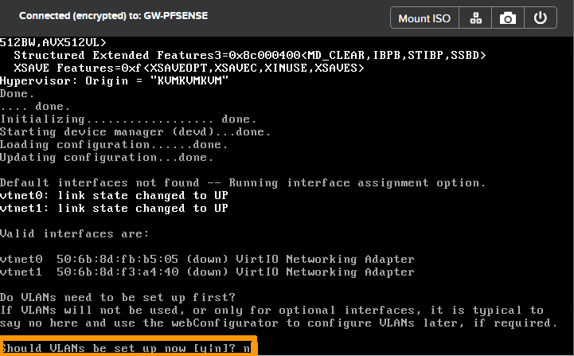
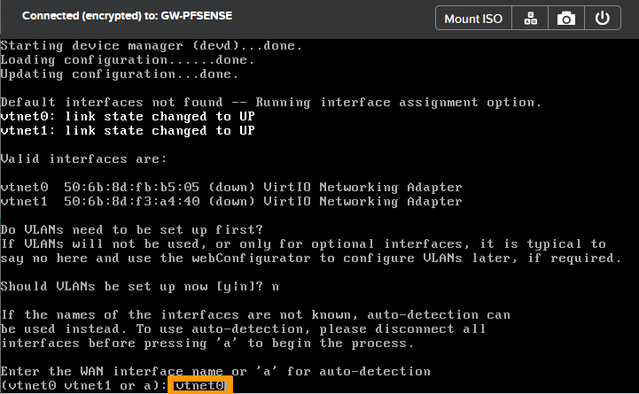
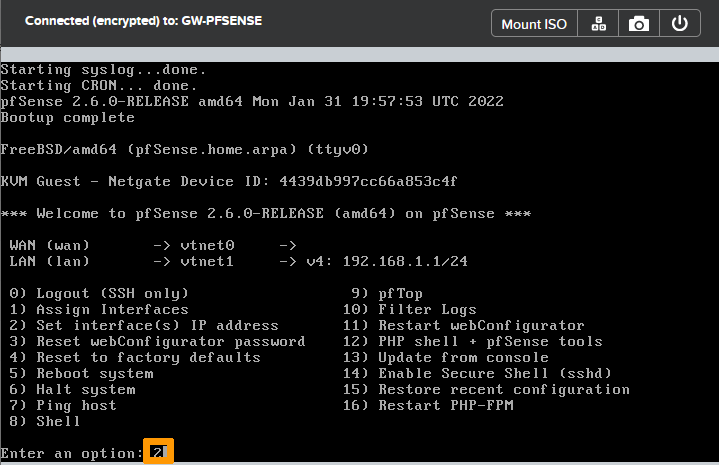
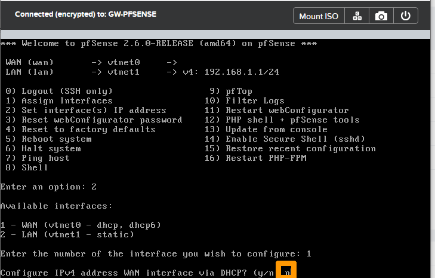
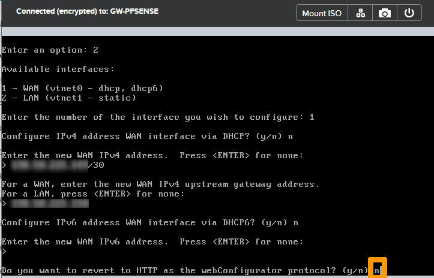
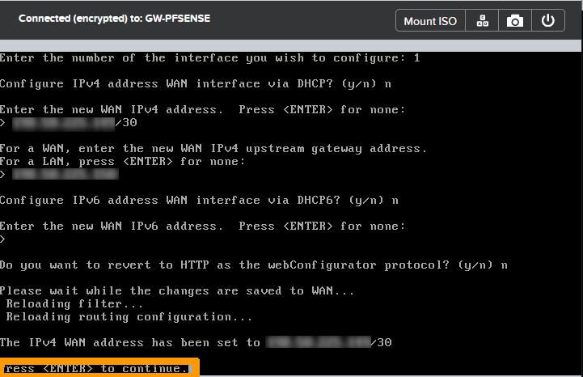

**Dernière mise à jour le 21/06/2022**

## Objectif

Interconnecter deux clusters Nutanix Fournis par OVHcloud au travers d'un VPN IPSEC créé en remplaçant les machines virtuelles servant à l'accès INTERNET.

> [!warning]
> OVHcloud vous met à disposition des services dont la configuration, la gestion et la responsabilité vous incombent. Il vous appartient donc de ce fait d’en assurer le bon fonctionnement.
>
> Ce guide a pour but de vous accompagner au mieux sur des tâches courantes. Néanmoins, nous vous recommandons de faire appel à un prestataire spécialisé si vous éprouvez des difficultés ou des doutes concernant l’administration, l’utilisation ou la mise en place d’un service sur un serveur.
>

## Prérequis

- Disposer de plusieurs clusters Nutanix avec ces deux options :
    + Plusieurs clusters Nutanix sur des sites physiquement différents chez OVHcloud
    + Un cluster qui ne se trouve pas chez OVHcloud et un cluster chez OVHcloud
- Être connecté à votre [espace client OVHcloud](https://www.ovh.com/auth/?action=gotomanager&from=https://www.ovh.com/fr/&ovhSubsidiary=fr)
- Être connecté sur vos cluster via Prism Central.
- Avoir les deux clusters sur deux sites distants physiquement.
- Posseder un plan IP différent par cluster.

## Présentation technique


Pour pouvoir établir un VPN IPSEC nous allons remplacer la passerellle sous Ubuntu  par une machine virtuelle sous **Pfsense** pour fournir deux accès l'accès Internet et au VPN **IPSEC** 


Les deux clusters se trouvent dans deux Datacenters differents d'OVHcloud l"un en **France** l'autre au **Canada** 

## En pratique


### Configuration de la passerelle au CANADA

Nous allons voir en détail l'installation d'une passerelle sur le site du CANADA.

### Téléchargment des sources PFSENSE

Téléchargez les sources de **Pfsense** sur ce lien [Téléchargement Pfsense](https://www.pfsense.org/download/)

Ensuite à l'aide de la documentation [Importez des images ISO](https://docs.ovh.com/fr/nutanix/image-import/) importez l'image **ISO** **Pfsense** dans vos deux clusters NUTANIX.

### Création de la machine virtuelle **GW-Pfsense**

Créez une machine virtuelle avec ces paramètres :

- **Nom** : gw-pfsense
- **Stockage1** : 60 Go HDD 
- **Stockage2** : Un lecteur de DVD connecté à l'image ISO de PFSENSE
- **RAM** : 4 Go 
- **CPU** : 2 vCPU
- **Réseau** : deux cartes réseaux sur le réseau de AHV: **Base**

Vous pouvez vous aider de cette documentation [Gestion des machines virtuelles](https://docs.ovh.com/fr/nutanix/virtual-machine-management/) pour créer une machine virtuelle.


{.thumbnail}

### Arrêt de la machine virtuelle **OVH-GATEWAY**

IL est necessaire d'arrêter la machine virtuelle **OVHgateway** pour éviter d'avoir des adresses IP en doublon.

Au travers de **Prism Central** cliquez en haut à gauche sur le `menu principal`{.action}.

{.thumbnail}

Cliquez sur `VMs`{.action}.

{.thumbnail}

Cliquez sur la machine virtuelle `OVHgateway`{.action}.

{.thumbnail}

Au travers du menu `More`, cliquez sur `Soft Shutdown`{.action}.

{.thumbnail}

### Récupération de l'adresse publique sur l'espace client d'OVHcloud

Avant de lancer l'installation de **PFSENSE** il est important de connaitre les informations concernant les paramètres réseaux de la passerelle d'OVHcloud.

Connectez-vous sur l'espace client d'OVHcloud positionnez vous dans la barre de menu sur `Hosted Private Cloud`{.action} cliquez sur votre cluster Nutanix et relevez l'adresse se trouvant dans `IPFO`

{.thumbnail}

l'adresse affichée est un pack de 4 adresses avec un masque à /30 ce qui donne la possibilité de n'avoir qu'un adresse réellement disponible qui est l'adresse du reseau +1 comme indiqué en dessous :  

```console
XX.XX.XX.N      Reserved: Network address
XX.XX.XX.N+1    First usable IP
XX.XX.XX.N+2    Reserved: Network gateway
XX.XX.XX.N+3    Reserved: Network broadcast
```

### Démarrage de la machine virtuelle **GW-pfsense**

Revenez dans la gestion des machines virtuelles dans **Prism Central** , cliquez sur `GW-Pfsense`{.action}.

{.thumbnail}

Au travers du menu `More` cliquez sur `Power On`{.action}.

{.thumbnail}

Cliquez sur `Launch console`{.action}.

{.thumbnail}

### Installation de **PFSENSE**

Positionnez vous `Accept` et appuyez sur la touche `Entree`{.action}.

{.thumbnail}

Choisissez `Install` positionnez vous sur `OK` avec la touche tabulation et appuyez sur la touche `Entree`{.action}.

{.thumbnail}

Laissez `Continue with default keymap` positionnez vous sur `select` avec la touche tabulation et appuyez sur la touche `Entree`{.action}.

{.thumbnail}

Laissez `Auto (ZFS)` positionnez vous sur `OK` avec la touche tabulation et appuyez sur la touche `Entree`{.action}.

{.thumbnail}

Positionnez vous sur `Select` avec la touche tabulation et appuyez sur la touche `Entree`{.action}.

{.thumbnail}

Gardez `stripe` positionnez vous sur `OK` avec la touche tabulation et appuyez sur la touche `Entree`{.action}.

{.thumbnail}

Sélectionnez avec la barre `Espace` NUTANIX VDISK ensuite allez sur `OK` avec la touche tabulation et appuyez sur la touche `Entree`{.action}.

{.thumbnail}

Positionnez vous sur `YES` avec la touche tabulation et appuyez sur la touche `Entree`{.action}.

{.thumbnail}

Choisissez  `NO` avec la touche tabulation et appuyez sur la touche `Entree`{.action}.

{.thumbnail}

Laissez  `Reboot` avec la touche tabulation et appuyez sur la touche `Entree`{.action}.

{.thumbnail}

### Ejection du CDROM PFSENSE de la machine virtuelle **GW-PFSENSE**

Revenez dans la gestion des machines virtuelles dans **Prism Central** arrêtez la machine virtuelle en cliquant sur `Soft Shutdown`{.action} dans le menu `More` de la machine virtuelle **GW-PFSENSE**

{.thumbnail}

Cliquez sur `Update`{.action}.

{.thumbnail}

Cliquez sur `Next`{.action}.

{.thumbnail}

Cliquez sur l'icone `Eject`{.action}. au niveau du CDROM

{.thumbnail}

Cliquez sur `Next`{.action}.

{.thumbnail}

CLiquez sur `Next`{.action}.

{.thumbnail}

CLiquez sur `Save`{.action}.

{.thumbnail}

Cliquez sur `Power On`{.action} dans le menu `More`

{.thumbnail}

Cliquez sur `Launch Console`{.action} pour continuer l'installation après le démarrage. 

{.thumbnail}

### Configuration des adresses IP de PFSENSE au travers de la console

Acceptez la licence en appuyant sur la touche `Entree`{.action}

{.thumbnail}

Saisissez  `n`{.action} et appuyez sur la touche `Entree`{.action} lorsque l'on demande si il faut des VLAN.

{.thumbnail}

Saisissez le nom de l'interface pour le wan  `vtnet0`{.action} et appuyez sur la touche `Entree`{.action}

{.thumbnail}

Choisissez le nom de l'interface pour le wan  `vtnet1`{.action} et appuyez sur la touche `Entree`{.action}

{.thumbnail}

Répondez `y`{.action} à la question si l'on veut valider les changement et appuyez sur la touche `Entree`{.action}

{.thumbnail}

Choisissez `Set interface(s) IP address` en saisissant `2` et en appuyant sur la touche `Entree`{.action}

{.thumbnail}

Séléctionnez l'interface **WAN** en saississant `1` et en appuyant sur la touche `Entree`{.action}

{.thumbnail}

Saisissez `n`{.action} et appuyez sur la touche `Entree`{.action} à la demande de la configuration par DHCP

{.thumbnail}

Saisissez la `première adresse`{.action} disponible de l'**IP FAILOVER** et appuyez sur `Entree`{.action} pour l'adresse publique.

Ensuite saisisez la `deuxième adresse`{.action} disponible de l'**IP FAILOVER** et appuyez sur `Entree`{.action} pour l'adresse de passerelle.

{.thumbnail}

Repondez `n`{.action} et appuyez sur la touche `Entree`{.action} lors de la configuration de l'IPV6 address WAN.

{.thumbnail}

A la demande **revert to HTTP as the webConfigurator protocol** Saisissez `n`{.action} et appuyez sur la touche `Entree`{.action}

{.thumbnail}

Appuyez sur `Entree`{.action} pour valider l'enregistrement de l'adresse IP WAN

{.thumbnail}

Saisissez `2` et appuyez sur la touche `Entree`{.action} pour configurer les adresses IP

{.thumbnail}

Prenez l'option `2` et appuyez sur la touche `Entree`{.action} pour modifier l'adresse IP du LAN

{.thumbnail}

Saisissez l'adresse IP privée suivi du masque du CANADA `192.168.10.254/24` et appuyez sur la touche `Entree`{.action}

{.thumbnail}

Ne mettez pas de passerelle et appuyez sur la touche `Entree`{.action}

{.thumbnail}

saisissez `n` et appuyez sur la touche `Entree`{.action} pour ne pas activer le serveur DHCP.

{.thumbnail}

Repondez  `n` et appuyez sur la touche `Entree`{.action} à la demande **revert to HTTP as the webConfigurator protocol**

{.thumbnail}

Il est possible maintenant d'administrer la passerelle en HTTPS sur le réseau privé

Appuyez sur la touche `Entree`{.action} pour terminer la configuration en ligne de commande.

{.thumbnail}


## Aller plus loin

Échangez avec notre communauté d'utilisateurs sur <https://community.ovh.com/>.
