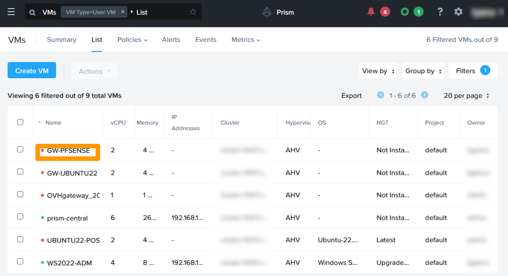

**Dernière mise à jour le 20/05/2022**

## Objectif

Interconnecter deux clusters Nutanix Fournis par OVHcloud au travers d'un VPN IPSEC créé en remplaçant les machines virtuelles servant à l'accès INTERNET.

> [!warning]
> OVHcloud vous met à disposition des services dont la configuration, la gestion et la responsabilité vous incombent. Il vous appartient donc de ce fait d’en assurer le bon fonctionnement.
>
> Ce guide a pour but de vous accompagner au mieux sur des tâches courantes. Néanmoins, nous vous recommandons de faire appel à un prestataire spécialisé si vous éprouvez des difficultés ou des doutes concernant l’administration, l’utilisation ou la mise en place d’un service sur un serveur.
>

## Prérequis

- Disposer de plusieurs clusters Nutanix avec ces deux options :
    + Plusieurs clusters Nutanix sur des sites physiquement différents chez OVHcloud
    + Un cluster qui ne se trouve pas chez OVHcloud et un cluster chez OVHcloud
- Être connecté à votre [espace client OVHcloud](https://www.ovh.com/auth/?action=gotomanager&from=https://www.ovh.com/fr/&ovhSubsidiary=fr)
- Être connecté sur vos cluster via Prism Central.
- Avoir les deux clusters sur deux sites distants physiquement.
- Posseder un plan IP différent par cluster.

## Présentation technique


Pour pouvoir établir un VPN IPSEC nous allons remplacer la Gateway sous Linux par une machine virtuelle sous **Pfsense** qui permet de fournir l'accès INTERNET et des accès VPN IPSEC au travers d'une interface d'administration **Web**.

Les deux clusters se trouvent dans deux Datacenters differents d'OVHcloud l"un en **France** l'autre au **Canada** 

## En pratique

Téléchargez les sources de **Pfsense** sur ce lien [Téléchargement Pfsense](https://www.pfsense.org/download/)

Ensuite à l'aide de la documentation [Importez des images ISO](https://docs.ovh.com/fr/nutanix/image-import/) importez l'image **ISO** **Pfsense** dans vos deux clusters NUTANIX

Créez une machine virtuelle avec ces paramètres :

- Un disque de 60 Go 
- Un lecteur de DVD connecté à l'image ISO de PFSENSE
- 4 Go de RAM
- 2 vCPU
- deux cartes réseaux sur le réseau de AHV: Base

Vous pouvez vous aider de cette documentation [Gestion des machines virtuelles](https://docs.ovh.com/fr/nutanix/virtual-machine-management/) pour créer une machine virtuelle.


{.thumbnail}

Tout d'abord il faut arrêter la passerelle existante c'est une machine virtuelle qui se nomme OVHgateway.

Au travers de **Prism Central** cliquez en haut à gauche sur le `menu principal`{.action}.

{.thumbnail}

Cliquez sur `VMs`{.action}.

{.thumbnail}

Cliquez sur la machine virtuelle `Ovhgateway`{.action}.

{.thumbnail}

Au travers du menu `More`, cliquez sur `Soft Shutdown`{.action}.

{.thumbnail}


Avant de lancer l'installation de **PFSENSE** il est important de connaitres les informations concernant les paramètres réseaux du cluster.

Connectez-vous sur l'espace client d'OVHcloud positionnez vous dans la barre de menu sur `Hosted Private Cloud`{.action} cliquez en dessous de `Nutanix`{.action} sur votre cluster Nutanix et relevez l'adresse se trouvant dans `IPFO`

{.thumbnail}

A partir des informations obtenues vous devrez utiliser la première adresse IP utilisable et la passerelle lors de l'installation de la carte sur le réseau public.

```console
XX.XX.XX.N      Reserved: Network address
XX.XX.XX.N+1    First usable IP
XX.XX.XX.N+2    Reserved: Network gateway
XX.XX.XX.N+3    Reserved: Network broadcast
```
l'adresse IP de la seconde carte sert de passerelle sur le réseau privé ou se trouvent les **CVM** et **Prism Central** ce sera dont une adresse privée comme dans cet exemple `192.168.10.254/24`

Revenez dans la gestion des machines virtuelles dans **Prism Central** , cliquez sur `GW-Pfsense`{.action}.

{.thumbnail}

Au travers du menu `More` cliquez sur `Power On`{.action}.

{.thumbnail}

Cliquez sur `Launch console`{.action}.

{.thumbnail}


## Aller plus loin

Échangez avec notre communauté d'utilisateurs sur <https://community.ovh.com/>.
