**Dernière mise à jour le 22/06/2022**

## Objectif

Interconnecter deux clusters Nutanix Fournis par OVHcloud au travers d'un VPN IPSEC en remplaçant les machines virtuelles **OVGgateway** servant à d'accès INTERNET par une passerelle sous **PFSense**.

> [!warning]
> OVHcloud vous met à disposition des services dont la configuration, la gestion et la responsabilité vous incombent. Il vous appartient donc de ce fait d’en assurer le bon fonctionnement.
>
> Ce guide a pour but de vous accompagner au mieux sur des tâches courantes. Néanmoins, nous vous recommandons de faire appel à un prestataire spécialisé si vous éprouvez des difficultés ou des doutes concernant l’administration, l’utilisation ou la mise en place d’un service sur un serveur.
>

## Prérequis

- Disposer de plusieurs clusters Nutanix chez OVHcloud :
- Être connecté à votre [espace client OVHcloud](https://www.ovh.com/auth/?action=gotomanager&from=https://www.ovh.com/fr/&ovhSubsidiary=fr)
- Être connecté sur vos clusters via Prism Central.
- Avoir les deux clusters sur deux sites distants physiquement.
- Utiliser un plan IP différent par cluster.

## En pratique

Nous allons interconnecter deux clusters Nutanix l'un se trouvant au CANADA et l'autre en FRANCE.

Le cluster du CANADA est sur le réseau privé en 192.168.10.0/24 et celui de la FRANCE sur le réseau privé en 192.168.0.0/24.

Nous allons remplacer la machine virtuelle **OVHgateway** par une machine virtuelle **GW-PFSENSE** sur chacun des clusters pour fournir l'accès INTERNET à chacun des clusters Nutanix et permettre l'établissement d'un tunnel IPSEC sécurisé entre ces deux clusters, ce qui permettra par la suite de faire des réplications inter-clusters.


### Configuration de la passerelle au CANADA

Voici les informations détaillées pour remplacer la passerelle par défaut **OVHgateway** par une passerelle sous **PFSense** sur le cluster se trouvant au **CANADA**

#### Téléchargement des sources pour l'installation de PFSENSE

Téléchargez l'image iso de l'installation de **Pfsense** à partir de ce lien [Téléchargement Pfsense](https://www.pfsense.org/download/).

Ensuite à l'aide de cette documentation [Importez des images ISO](https://docs.ovh.com/fr/nutanix/image-import/) importez l'image **ISO** **Pfsense** dans votre cluster NUTANIX.

#### Création de la machine virtuelle **gw-pfsense**

Créez une machine virtuelle avec ces paramètres :

- **Nom** : `gw-pfsense`
- **Stockage1** : `60 Go HDD` 
- **Stockage2** : `Un lecteur de DVD connecté à l'image ISO de PFSENSE`
- **RAM** : `4 Go` 
- **CPU** : `2 vCPU`
- **Réseau** : `deux cartes réseaux sur le réseau de AHV: **Base**`

Vous pouvez vous aider de ces informations sur ce lien [Gestion des machines virtuelles](https://docs.ovh.com/fr/nutanix/virtual-machine-management/) pour créer une machine virtuelle.

{.thumbnail}

#### Arrêt de la machine virtuelle **OVH-GATEWAY**

Pour éviter des adresses IP en double sur le réseau il faut tout d'abord arrêter la machine virtuelle **OVHgateway** 
Au travers de **Prism Central** cliquez en haut à gauche sur le `menu principal`{.action}.

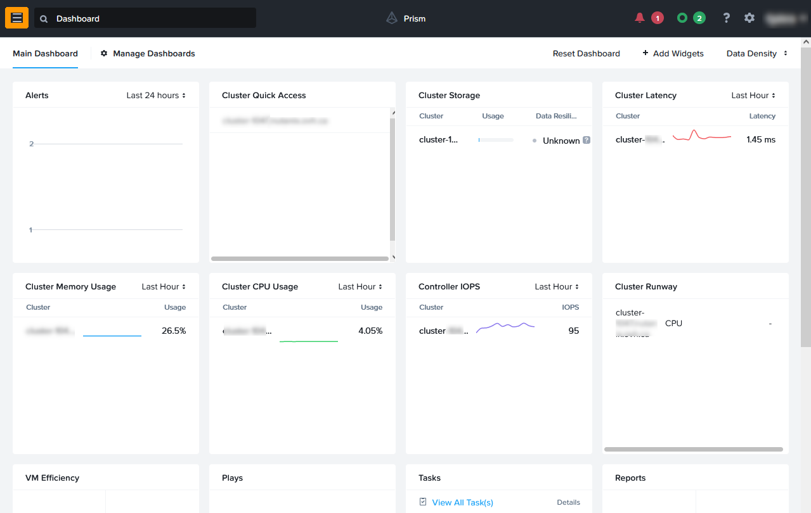{.thumbnail}

Cliquez sur `VMs`{.action}.

{.thumbnail}

Cliquez sur la machine virtuelle `OVHgateway`{.action}.

{.thumbnail}

A partir du menu `More` en haut, cliquez sur `Soft Shutdown`{.action}.

{.thumbnail}

#### Récupération de l'adresse publique sur l'espace client d'OVHcloud <a name="getipcustomerportal"></a>

Avant de lancer l'installation de **PFSENSE** il faut récupérez les informations concernant les paramètres réseaux de la passerelle d'OVHcloud.

Connectez-vous sur l'espace client d'OVHcloud allez dans l'onglet `Hosted Private Cloud`{.action} cliquez sur votre cluster Nutanix et relevez l'adresse se trouvant dans `IPFO`.

{.thumbnail}


L'adresse affichée est un pack de 4 adresses avec un masque à /30 ce qui ne permet que l'utilisation d'une adresse comme indiqué ci-dessous :

```console
XX.XX.XX.N      Adresse de réseau réservé
XX.XX.XX.N+1    Adresse IP utilisable qui doit être affectée à l'interface WAN
XX.XX.XX.N+2    Passerelle qui se trouve sur un équipement d'OVHcloud à utiliser en tant que passerelle sur l'interface WAN 
XX.XX.XX.N+3    Réseau de diffusion réservé
```

Par exemple si l'adresse affichée sur le site client est 123.123.123.4 il faut utiliser :

- **123.123.123.5** pour l'adresse de l'interface **WAN** 
- **123.123.123.6** pour la passerelle sur l'interface **WAN**.

#### Démarrage de la machine virtuelle **GW-pfsense**

Revenez dans la gestion des machines virtuelles sur **Prism Central**, cliquez sur `GW-Pfsense`{.action}.

{.thumbnail}

Au travers du menu `More` cliquez sur `Power On`{.action}.

{.thumbnail}

Cliquez sur `Launch console`{.action}.

{.thumbnail}

#### Installation de **PFSENSE**

Positionnez-vous sur `Accept` avec la touche `tabulation`{.action} et appuyez sur la touche `entrée`{.action}.

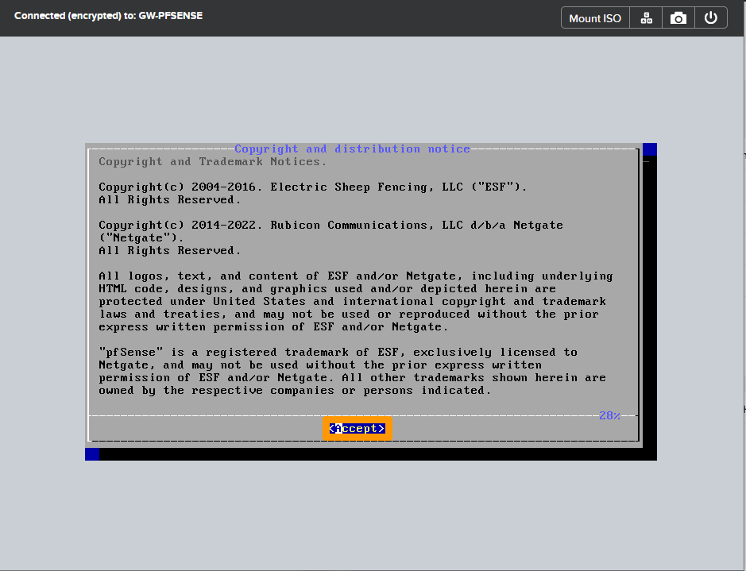{.thumbnail}

Choisissez `Install` positionnez-vous sur `OK` avec la touche `tabulation`{.action} et appuyez sur la touche `entrée`{.action}.

{.thumbnail}

Laissez `Continue with default keymap`, allez sur `select` avec la touche `tabulation`{.action} et appuyez sur la touche `entrée`{.action}.,

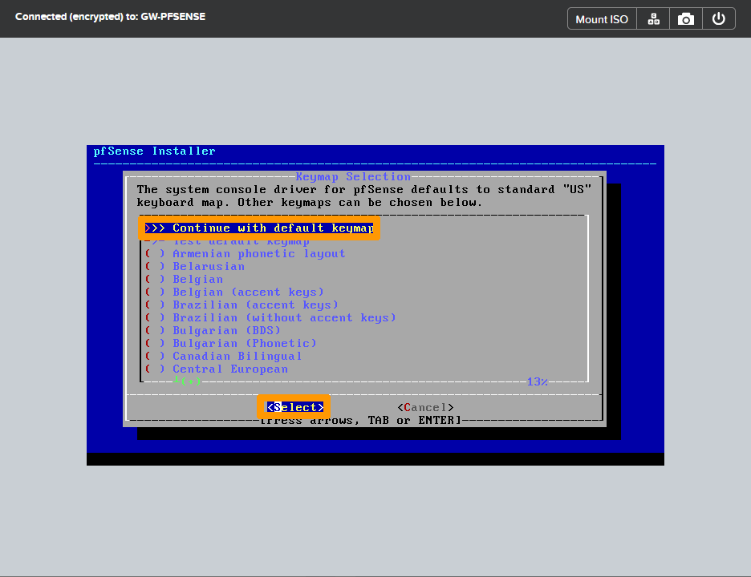{.thumbnail}

Laissez `Auto (ZFS)` allez sur `OK` avec la touche `tabulation`{.action} et tapez sur la touche `entrée`{.action}.

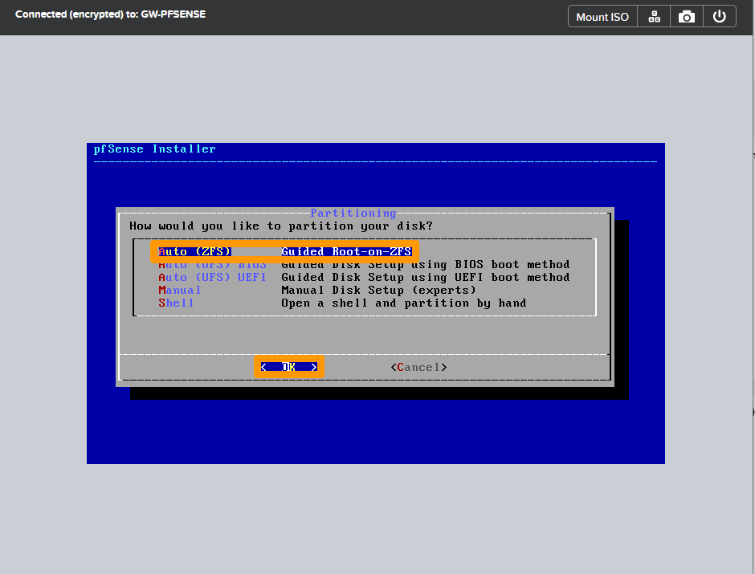{.thumbnail}

Positionnez-vous sur `Select` avec la touche `tabulation`{.action} et appuyez sur la touche `entrée`{.action}.

{.thumbnail}

Gardez `stripe` positionnez-vous sur `OK` avec la touche `tabulation`{.action} et appuyez sur la touche `entrée`{.action}.

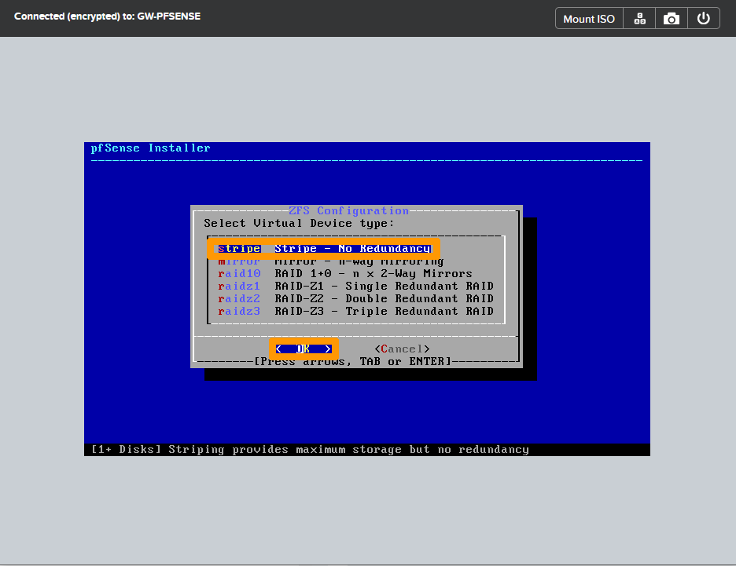{.thumbnail}

Sélectionnez avec la barre `Espace` NUTANIX VDISK ensuite allez sur `OK` avec la touche `tabulation`{.action} et appuyez sur la touche `entrée`{.action}.

{.thumbnail}

ALlez sur `YES` avec la touche `tabulation`{.action} et appuyez sur la touche `entrée`{.action}.

{.thumbnail}

Choisissez `NO` avec la touche `tabulation`{.action} et appuyez sur la touche `entrée`{.action}.

{.thumbnail}

Laissez `Reboot` et appuyez sur la touche `entrée`{.action}.

{.thumbnail}

#### Ejection du CDROM PFSENSE de la machine virtuelle **GW-PFSENSE**

Revenez dans la gestion des machines virtuelles dans **Prism Central** et arrêtez la machine virtuelle en cliquant sur `Soft Shutdown`{.action} dans le menu `More` de la machine virtuelle **GW-PFSENSE**.

{.thumbnail}

Cliquez sur `Update`{.action}.

{.thumbnail}

Cliquez sur `Next`{.action}.

{.thumbnail}

Cliquez sur l'icone `Eject`{.action}. au niveau du CDROM.

{.thumbnail}

Cliquez sur `Next`{.action}.

{.thumbnail}

CLiquez sur `Next`{.action}.

{.thumbnail}

CLiquez sur `Save`{.action}.

{.thumbnail}

Cliquez sur `Power On`{.action} dans le menu `More`.

{.thumbnail}

Cliquez sur `Launch Console`{.action} pour continuer l'installation après le démarrage. 

{.thumbnail}

#### Configuration des adresses IP de PFSENSE au travers de la console

Nous allons configurer les adresses IP de passerelle **PFSense** comme ceci:

- Interface WAN avec les informations de cette partie du guide [Récupération de l'adresse publique sur l'espace client d'OVHCLOUD](#getipcustomerportal) »

- Interface LAN: 192.168.10.254/24 qui correspond à la passerelle du réseau privé pour le cluster Nutanix et le masque de sous réseau 

Acceptez la licence en appuyant sur la touche `entrée`{.action}.

{.thumbnail}

Saisissez `n`{.action} et appuyez sur la touche `entrée`{.action} lorsque l'on demande si il faut des **VLAN**.

{.thumbnail}

Saisissez le nom de l'interface pour le **WAN** `vtnet0`{.action} et appuyez sur la touche `entrée`{.action}.

{.thumbnail}

Choisissez le nom de l'interface pour le **LAN** `vtnet1`{.action} et appuyez sur la touche `entrée`{.action}.

{.thumbnail}

Répondez `y`{.action} à la question si l'on veut valider les changements et appuyez sur la touche `entrée`{.action}.

{.thumbnail}

Choisissez `Set interface(s) IP address` en saisissant `2` et en appuyant sur la touche `entrée`{.action}.

{.thumbnail}

Sélectionnez l'interface **WAN** en saisissant `1` et en appuyant sur la touche `entrée`{.action}.

{.thumbnail}

Saisissez `n`{.action} et appuyez sur la touche `entrée`{.action} à la demande de la configuration de l'adresse par DHCP.

{.thumbnail}

Saisissez l'`Adresse publique avec le masque`{.action} et appuyez sur la touche `entrée`{.action} comme par exemple **123.123.123.4/30**.

Ensuite saisissez l'`adresse de la passerelle publique`{.action} et appuyer sur la touche `entrée`{.action} comme par exemple **123.123.123.5**.

{.thumbnail}

Répondez `n`{.action} et appuyez sur la touche `entrée`{.action} lors de la configuration de l'**IPv6 address WAN**.

{.thumbnail}

A la demande **revert to HTTP as the webConfigurator protocol** Saisissez `n`{.action} et appuyez sur la touche `entrée`{.action}.

{.thumbnail}

Appuyez sur `entrée`{.action} pour valider l'enregistrement de l'adresse IP du **WAN**.

{.thumbnail}

Saisissez `2` et appuyez sur la touche `entrée`{.action} pour configurer les adresses IP.

{.thumbnail}

Prenez l'option `2` et appuyez sur la touche `entrée`{.action} pour modifier l'adresse IP du LAN.

{.thumbnail}

Saisissez l'adresse IP privée suivi du masque `192.168.10.254/24` et appuyez sur la touche `entrée`{.action}.

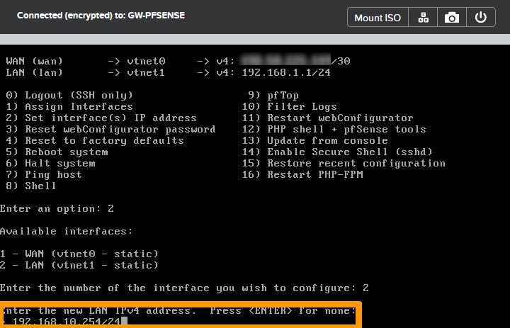{.thumbnail}

Appuyez sur la touche `entrée`{.action} pour ne pas mettre de passerelle sur l'interface **LAN**

{.thumbnail}

Saisissez `n` et appuyez sur la touche `entrée`{.action} pour ne pas activer le serveur DHCP.

{.thumbnail}

Répondez `n` et appuyez sur la touche `entrée`{.action} à la demande **revert to HTTP as the webConfigurator protocol**.

{.thumbnail}

Il est maintenant possible d'administrer la passerelle en HTTPS sur le réseau privé.

Appuyez sur la touche `entrée`{.action} pour terminer la configuration en ligne de commande.

{.thumbnail}

#### Configuration de certaines options au travers de l'interface WEB

Connectez-vous sur la console WEB de pfsense avec cette URL https://192.168.10.254 à partir d'une machine virtuelle se trouvant sur le réseau local **AHV : Base**.

Saisissez ces informations :

* **Compte utilisateur** : admin
* **Default password** : pfsense

Et cliquez sur `SIGN IN`{.action}.

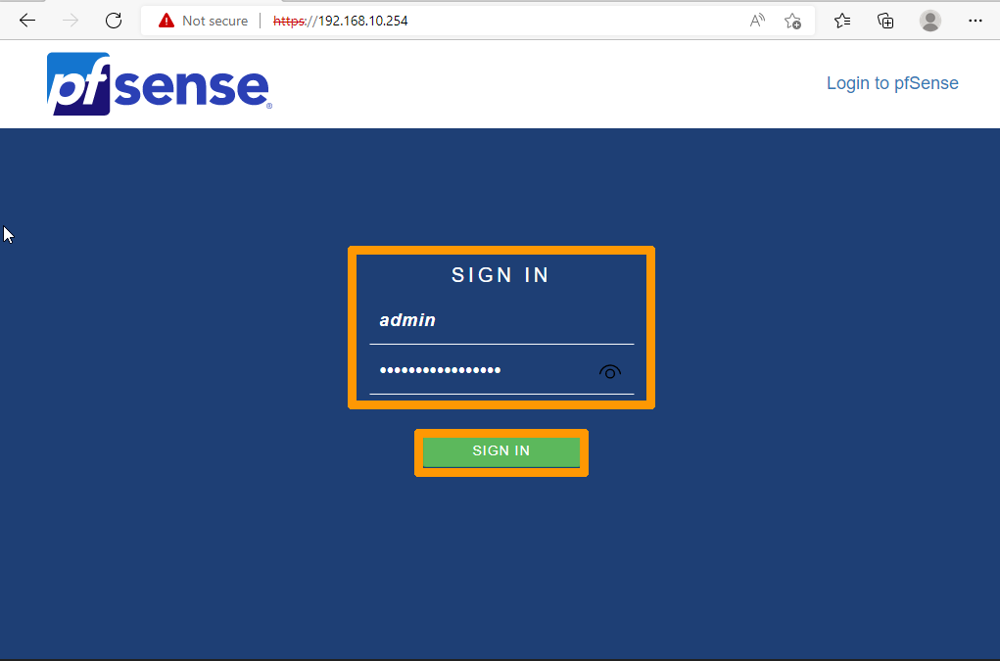{.thumbnail}

Cliquez sur `Accept`{.action} pour accepter la licence.

{.thumbnail}

Cliquez sur `Close`{.action} aux remerciements.

{.thumbnail}

##### Changement du mot de passe par défaut de **PFSENSE**

Au travers du menu `System`{.action} choisissez `User Manager`{.action}

{.thumbnail}

Cliquez sur l'icône en forme de `Stylo`{.action}.

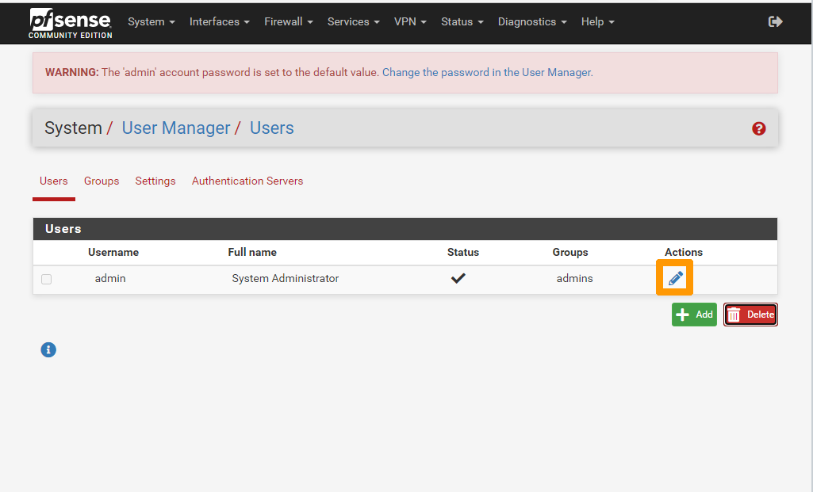{.thumbnail}

Saisissez le mot de passe deux fois à coté de `Password` pour le confirmez ensuite faites défiler la `barre de défilement`{.action} jusqu'en bas de la fenêtre.

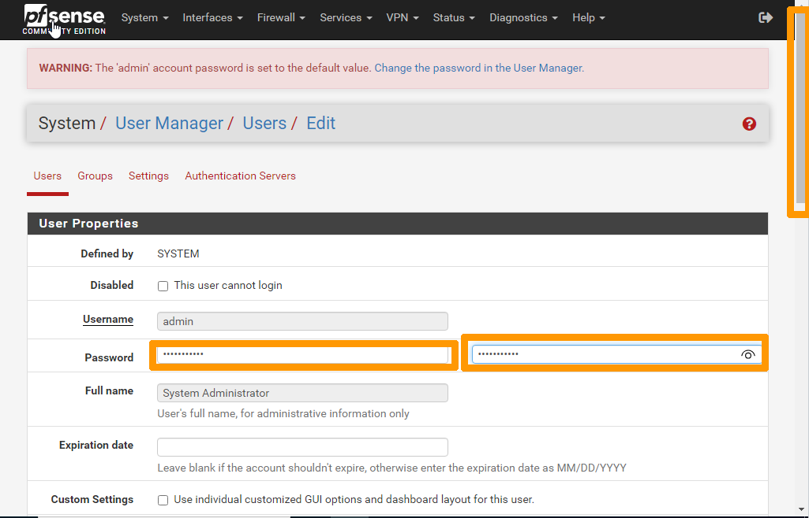{.thumbnail}

Cliquez sur `Save`{.action} pour valider les changements.

{.thumbnail}.

##### Ajout d'une règle pour autoriser l'administration à distance sur l'adresse publique au travers d'une autre adresse.

Allez dans le menu `Firewall`{.action} choisissez `Rules`{.action}.

{.thumbnail}

Vérifiez que vous êtes sur l'onglet `WAN` et cliquez sur le bouton `Add`{.action} en bas avec la flèche vers le haut pour créer une règle de pare-feu.

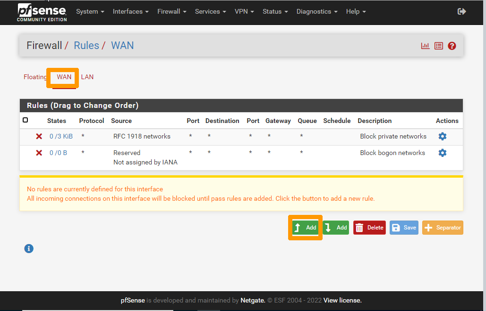{.thumbnail}

Choisissez ces options dans **Edit Firewall Rule**  :

* **Action** : `Pass`
* **Interface** : `WAN`
* **Address Family** : `IPv4`
* **Protocol** : `TCP`

Prenez comme **Source** `Single host or alias` et saisissez `l'adresse publique` autorisée à se connecter au pare-feu **Pfsense**.

Cliquez sur la `barre de défilement`{.action} pour aller en bas de la fenêtre.

{.thumbnail}

Ajoutez ces options dans **Destination** :

* **Destination** : `WAN address`
* **Destination Port Range From** : `HTTPS`
* **Destination Port Range To** : `HTTPS`

Cliquez sur `Save`{.action}.

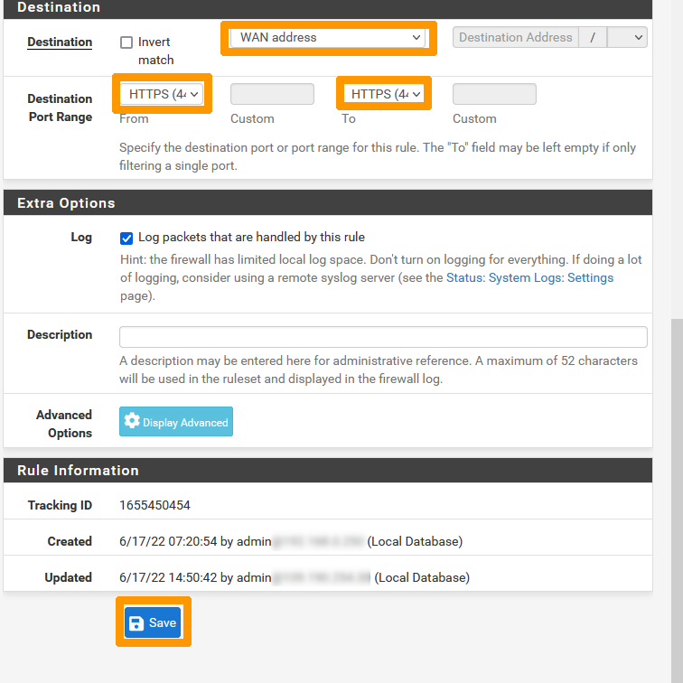{.thumbnail}

Cliquez sur `Apply Change`{.action} pour activer la règle.

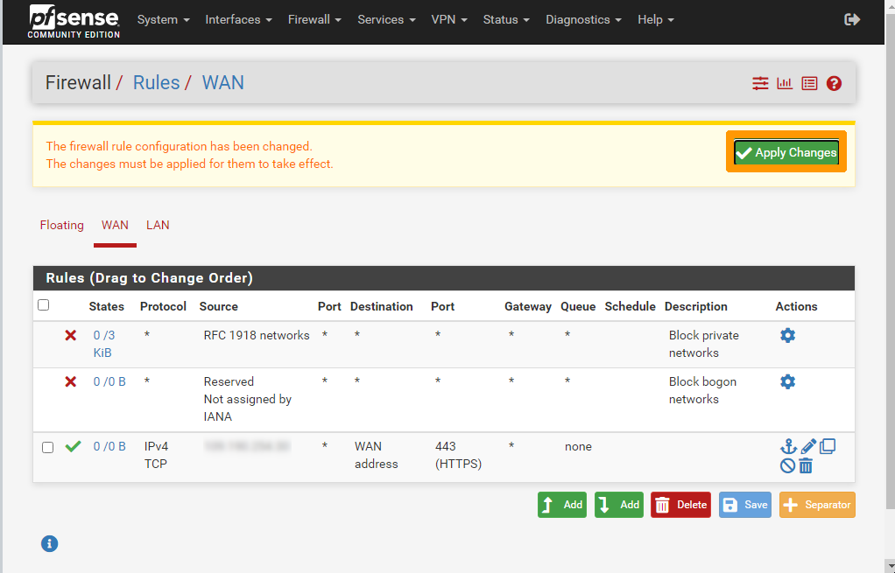{.thumbnail}

### Configuration de la passerelle en FRANCE

L'installation de la passerelle en **FRANCE** est identique à la passerelle du CANADA sauf pour ces paramètres :

* **Adresse privée en FRANCE** : 192.168.0.254 avec un masque en /24
* **Adresse publique** et **Adresse de passerelle publique** comme indiqué sur cette partie du guide [Récupération de l'adresse publique sur l'espace client d'OVHCLOUD](#getipcustomerportal) »


### Mise en place du VPN IPSEC

Maintenant que les deux passerelles ont été remplacées nous allons interconnecter les deux sites au travers d'un VPN IPSEC.

#### Configuration du site au CANADA

##### Mise en place du VPN IPSEC vers la France

Connectez-vous sur depuis un réseau autorisé sur l'adresse publique du CANADA en HTTPS avec cette URL https://adressepublique-pfsense-canada qui correspond à l'adresse fournies pour configurer l'interface **WAN** lors de l'installation de la passerelle.

Allez dans le menu `VPN`{.action} et choisissez `IPSec`{.action}.

{.thumbnail}

Cliquez sur `Add P1`{.action} pour créer la phase 1 du VPN IPSEC.

{.thumbnail}

Choisissez ces informations :

* **Description** : `VPN TO FRANCE`
* **Key Exchange version** : `IKEv2`
* **Internet Protocol** : `IPv4`
* **Interface**  : `WAN`
* **Remote Gateway** : `Adresse publique du PFSENSE distant en FRANCE`

Ensuite faites défilez la fenêtre à l'aide de la `barre de défilement`{.action}.

{.thumbnail}

Cliquez sur `Generate new Pre-Shared Key`{.action} pour générer une clé pré-partagée dans `Pre-Share Key`

> [!primary]
> 
> Notez ou copiez la clé, elle servira pour la configuration du VPN sur la passerelle en FRANCE.

Notez les informations contenues dans `Encryption Algorithm`

Ensuite faites défiler la fenêtre à l'aide de la `barre de défilement`{.action}.

{.thumbnail}

Cliquez sur `Save`{.action}.

{.thumbnail}

Cliquez sur `Apply Changes`{.action}.

{.thumbnail}

Cliquez sur `Show Phase 2 Entries`{.action}.

{.thumbnail}

Cliquez sur `Add P2`{.action} pour ajouter la phase 2 du VPN IPSEC.

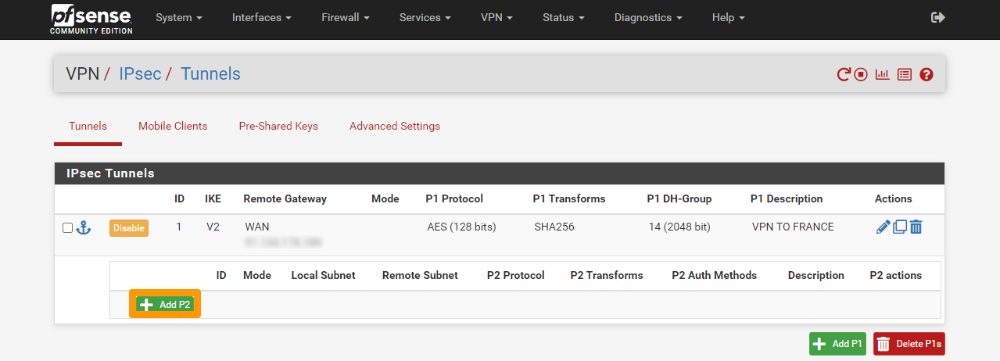{.thumbnail}

Effectuez la saisie de ces informations :

* **Description** : `TO LAN 192.168.0.0/24 FRANCE`
* **Local Network** : `LAN subnet`
* **Remote Network** : Type `Network`, Address `192.168.0.0/24`

Faites défilez la fenêtre avec la `barre de défilement`{.action}.

{.thumbnail}

Notez les paramètres de chiffrements et faites défilez la fenêtre à l'aide de la `barre de défilement`{.action}.

{.thumbnail}

Cliquez sur `Save`{.action}

{.thumbnail}

Cliquez sur `Apply Changes`{.action} pour finaliser la création du VPN IPSEC coté CANADA

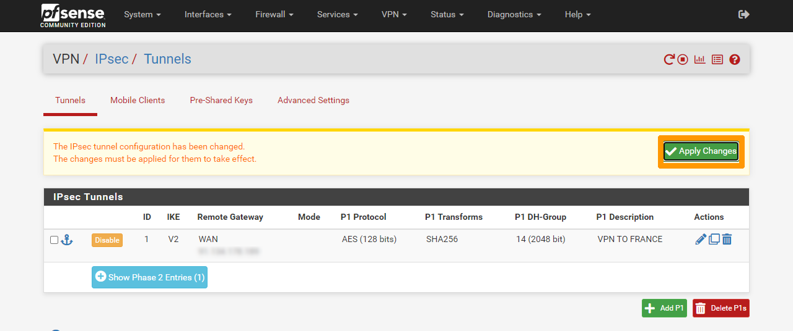{.thumbnail}

##### Ajout d'une règle de pare-feu pour autoriser le flux réseau au travers du VPN IPSEC entre le CANADA et la FRANCE

Cliquez sur `Rules`{.action} dans le menu `Firewall`

{.thumbnail}

Positionnez-vous sur l'onglet `IPsec`{.action} et cliquez en bas sur `Add`{.action} avec la flèche vers le haut.

{.thumbnail}

Modifiez ces options :

* **Source** : `LAN net`
* **Destination** : `Network` et `192.168.0.0/24` 

Ensuite cliquez sur `Save`{.action}.

{.thumbnail}

Cliquez à nouveau sur `Add`{.action} avec la flêche vers le haut pour rajouter une deuxième règle.

{.thumbnail}

Modifiez ces options : 

* **Source** : `Network` et `192.168.0.0/24` 
* **Destination** : `LAN net`

Et cliquez sur `Save`{.action} 

{.thumbnail}

Cliquez sur `Apply Changes`{.action}.

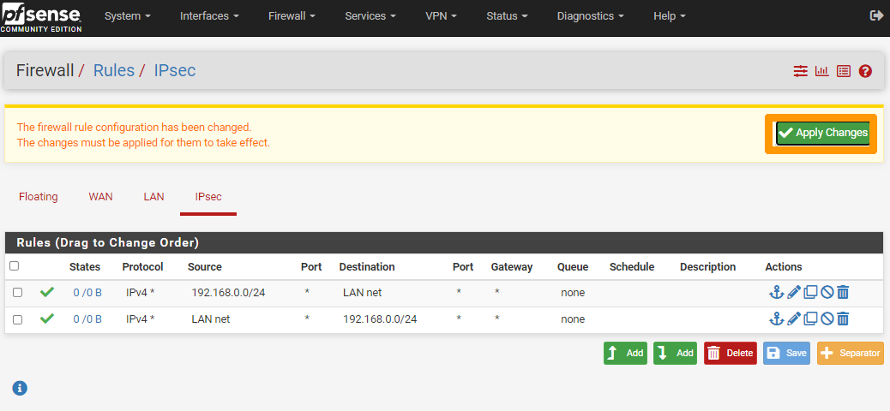{.thumbnail}

Le paramétrage coté CANADA est terminé.


#### Configuration du site en FRANCE

##### Mise en place du VPN IPSEC vers le CANADA

Connectez-vous sur l'adresse publique de la passerelle de la FRANCE en HTTPS comme ceci https://adressepublique-pfsense-france.

Allez dans le menu `VPN`{.action} et choisissez `IPSec`{.action}.

{.thumbnail}

Cliquez sur `Add P1`{.action} pour créer la phase 1 du VPN IPSEC.

{.thumbnail}

Choisissez ces informations :

* **Description** : `VPN TO CANADA`
* **Key Exchange version** : `IKEv2`
* **Internet Protocol** : `IPv4`
* **Interface**  : `WAN`
* **Remote Gateway** : `Adresse publique du PFSENSE distant au CANADA`

Ensuite faites défilez la fenêtre à l'aide de la `barre de défilement`{.action}.

{.thumbnail}

Collez dans **Pre-shared Key** la clé pré-partagée qui a été générée sur la passerelle se trouvant au CANADA.

Comparez et faites correspondre les paramètres dans `Encryption Algorithm` avec la passerelle du CANADA.

Ensuite faites défiler la fenêtre à l'aide de la `barre de défilement`{.action}.

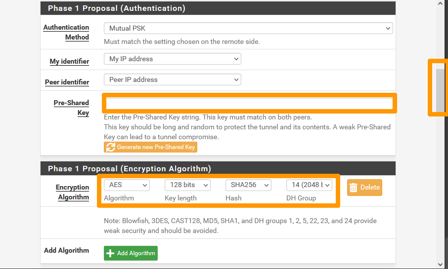{.thumbnail}

Cliquez sur `Save`{.action}.

{.thumbnail}

Cliquez sur `Apply Changes`{.action}.

{.thumbnail}

Cliquez sur `Show Phase 2 Entries`{.action}.

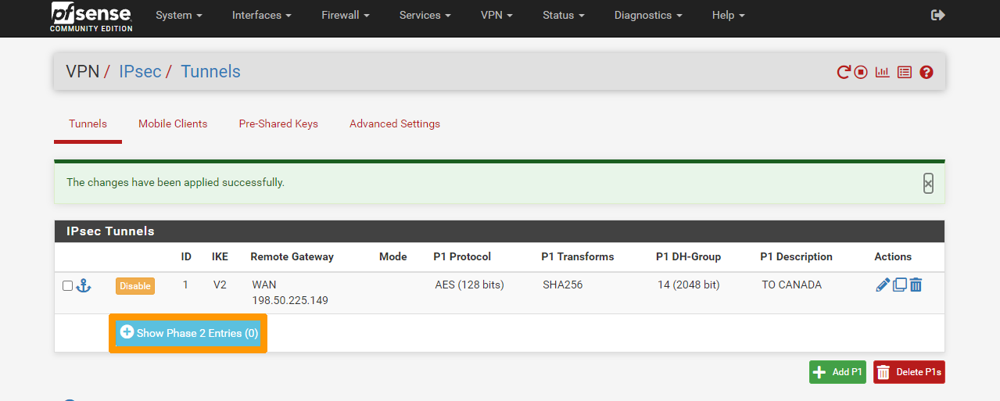{.thumbnail}

Cliquez sur `Add P2`{.action} pour ajouter la phase 2 du VPN IPSEC.

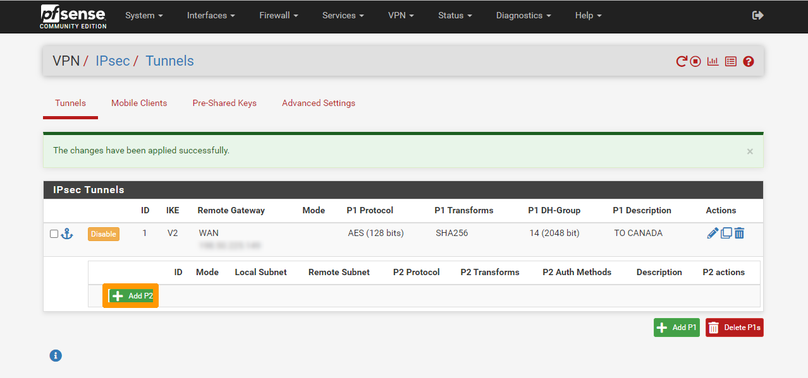{.thumbnail}

Effectuez la saisie de ces informations :

* **Description** : `TO LAN 192.168.10.0/24 CANADA`
* **Local Network** : `LAN subnet`
* **Remote Network** : Type `Network`, Address `192.168.10.0/24`

Faites défilez la fenêtre avec la `barre de défilement`{.action}.

{.thumbnail}

Vérifiez les paramètres de chiffrements et faites en sorte qu'ils soient identiques avec la passerelle du CANADA ensuite faites défilez la fenêtre à l'aide de la `barre de défilement`{.action}.

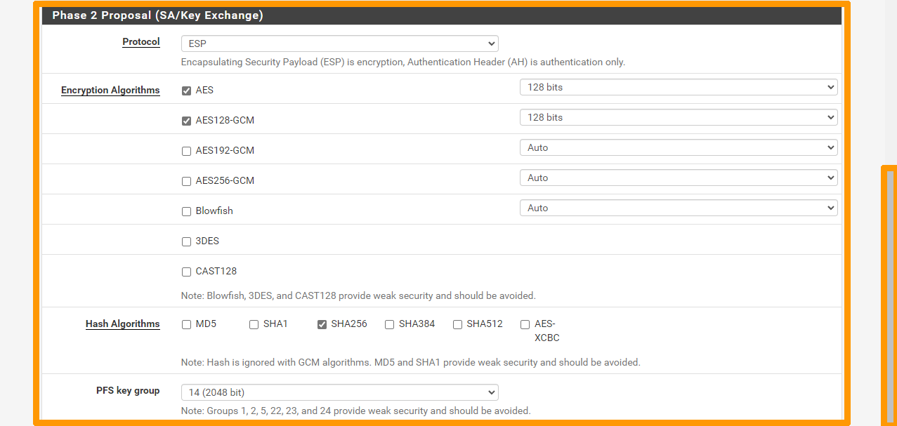{.thumbnail}

Cliquez sur `Save`{.action}.

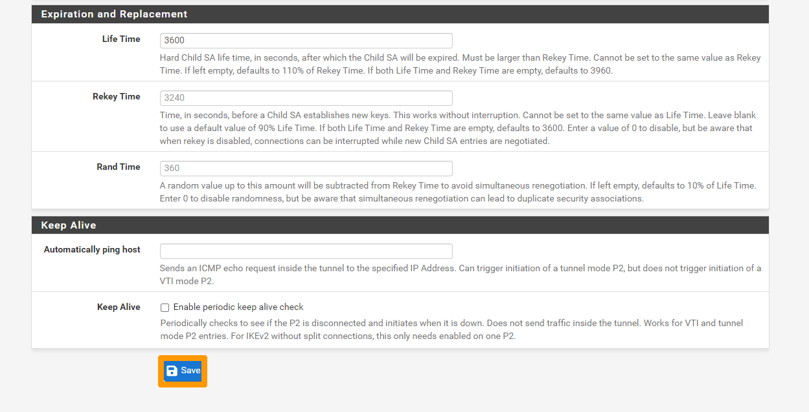{.thumbnail}

Cliquez sur `Apply Changes`{.action} pour finaliser la création du VPN IPSEC.

{.thumbnail}

##### Ajout d'une règle de pare-feu pour autoriser le flux réseau au travers du VPN IPSEC entre le CANADA et la FRANCE

Cliquez sur `Rules`{.action} dans le menu `Firewall`.

{.thumbnail}

Positionnez-vous sur l'onglet `IPsec`{.action} et cliquez en bas sur `Add`{.action} avec la flêche vers le haut.

{.thumbnail}

Modifiez ces options :

* **Source** : `LAN net`
* **Destination** : `Network` et `192.168.10.0/24` 

Ensuite cliquez sur `Save`{.action}.

{.thumbnail}

Cliquez à nouveau sur `Add`{.action} avec la flèche vers le haut pour rajouter une deuxième règle.

{.thumbnail}

Modifiez ces options : 

* **Source** : `Network` avec ce réseau `192.168.10.0/24` qui correspond au réseau privé du CANADA
* **Destination** : `LAN net`

Et cliquez sur `Save`{.action}.

{.thumbnail}

Cliquez sur `Apply Changes`{.action}. 

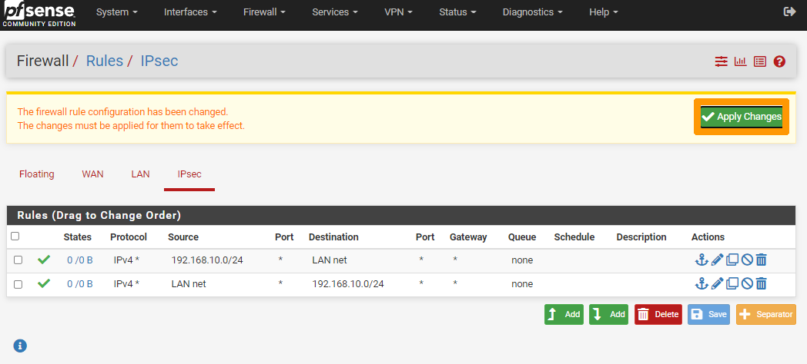{.thumbnail}

Le paramétrage du VPN est terminée sur les deux clusters, il est possible de mettre en place des réplications au travers du tunnel VPN sécurisé.


## Aller plus loin


Échangez avec notre communauté d'utilisateurs sur <https://community.ovh.com/>.
