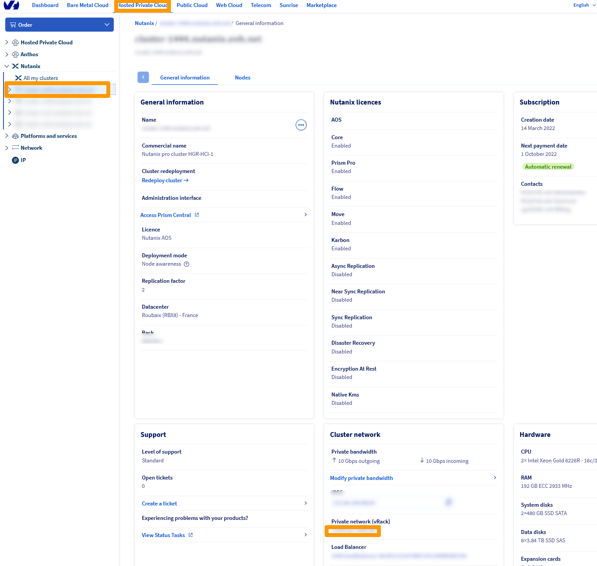
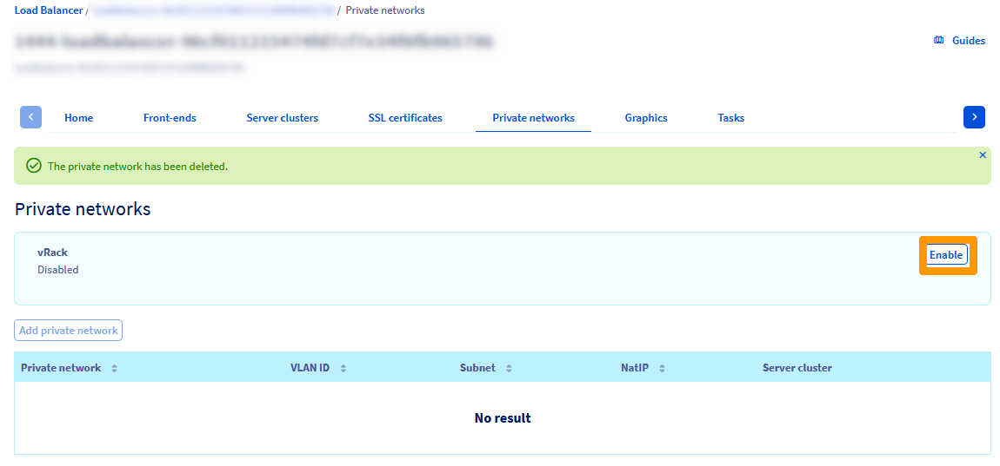
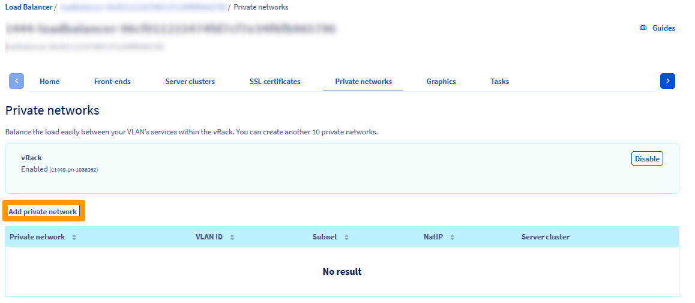

**Dernière mise à jour le 21/09/2022**

## Objectif

**Ce guide vous présente comment interconnecter deux clusters Nutanix Fournis par OVHcloud au travers d'un même vRack sur deux sites OVHcloud distants. Dans ce l'interconnexion sera faites entre les datacenters de Gravelines et ceux de Roubaix.** 

> [!warning]
> OVHcloud vous met à disposition des services dont la configuration, la gestion et la responsabilité vous incombent. Il vous appartient donc de ce fait d’en assurer le bon fonctionnement.
>
> Ce guide a pour but de vous accompagner au mieux sur des tâches courantes. Néanmoins, nous vous recommandons de faire appel à un prestataire spécialisé si vous éprouvez des difficultés ou des doutes concernant l’administration, l’utilisation ou la mise en place d’un service sur un serveur.
>

## Prérequis

- Disposer de deux clusters Nutanix fournis par OVHcloud, sur des sites différents avec une latence inférieurs à 5 milliseconde.
- Être connecté à votre [espace client OVHcloud](https://www.ovh.com/auth/?action=gotomanager&from=https://www.ovh.com/fr/&ovhSubsidiary=fr).
- Être connecté sur vos clusters via Prism Central.

## En pratique

Nous allons interconnecter deux clusters Nutanix sur deux sites distants l'un à Gravelines et l'autre à Roubaix au travers du même vRack. Pour plus d'informations concernant les vRack OHVcloud vous pouvez consulter cette présentation [vRack](https://www.ovh.com/fr/solutions/vrack/)

### Préparation des deux clusters avant l'interconnexion

Pour que les deux clusters puissent communiquer correctement il faut qu'ils soient sur le même adresse IP privé dans notre guide nous allons utiliser le plan IP `192.168.0.0/22` avec ces adresses :

 **Cluster1** à Gravelines

- Serveur 1 : adresse VM **CVM** `192.168.2.1`, adresse IP hyperviseur **AHV** `192.168.2.21`.
- Serveur 2 : adresse VM **CVM** `192.168.2.2`, adresse IP hyperviseur **AHV** `192.168.2.22`.
- Serveur 3 : adresse VM **CVM** `192.168.2.3`, adresse IP hyperviseur **AHV** `192.168.2.23`.
- Adresse virtuelle de **Prism Element** : `192.168.2.100`.
- Adresse IP  **Prism Central** :`192.168.2.101`.
- Etendue réservée pour le load balancer : `192.168.2.128 à 192.168.2.159`.
- Passerelle : `192.168.2.254`.
- Version du cluster : `6.1`.

**Cluster2** à Roubaix

- Serveur 1 : adresse VM **CVM** `192.168.1.1`, adresse IP hyperviseur **AHV** `192.168.1.21`.
- Serveur 2 : adresse VM **CVM** `192.168.1.2`, adresse IP hyperviseur **AHV** `192.168.1.22`.
- Serveur 3 : adresse VM **CVM** `192.168.1.3`, adresse IP hyperviseur **AHV** `192.168.1.23`.
- Adresse virtuelle de **Prism Element** : `192.168.1.100`.
- Adresse IP  **Prism Central** :`192.168.1.101`.
- Etendue réservée pour le load balancer : `192.168.1.128 à 192.168.1.159`.
- Passerelle : `192.168.2.254`.
- Version du cluster : `6.1`.

Aidez-vous de ce guide pour redéployer vos deux clusters [Redéploiment personnalisé de votre Cluster](https://docs.ovh.com/fr/nutanix/cluster-custom-redeployment/)

### Arret d'une des deux passerelles OVHgateway

Connectez-vous à **Prism Central** sur le cluster de Roubaix

la connexion Internet sortante est fournie par les machines virtuelles OVHGateway avec la même adresse IP sur les deux sites nous allons arrêter la machine virtuelle du **Cluster2** à Roubaix.

Au travers de **Prism Central** dans la gestion des machines virtuelles sélectionnez `OVHgateway`, ensuite choisissez `Guest Shutdown`{.action} dans le menu `Actions`{.action}.

{.thumbnail}

Les éléments du cluster ne pourront plus se connecter à Internet en sortie jusqu'a que la configuration des vRack aura été faite. L'accès à Prism Central est maintenu grace au **Load-Balancer**.

### Modification de la configuration des vRack

Cette opération consiste à supprimer l'affectation du vRack du deuxième site et d'ensuite d'affecter le vRack du premier site au deuxième site. Cette opération se fait à partir de l'espace client OVHcloud. 

Connectez-vous à votre [espace client OVHcloud](https://www.ovh.com/auth/?action=gotomanager&from=https://www.ovh.com/fr/&ovhSubsidiary=fr). 

A partir du menu `Hosted Private Cloud`{.action} choisissez le cluster du deuxième site dans la barre à gauche en dessous de `Nutanix` et notez le nom du vRack en dessous de **Private network vRack**.

{.thumbnail}

ALlez dans le menu `Bare Metal Cloud` sélectionnez cliquez sur `le vRack`{.action} en dessous de l'option **vRack** dans **Network**.

{.thumbnail}

Notez les de ces services dans **Your vRack**.
 - `Les serveurs physiques`.
 - `l'étendue d'adresses publique`.
 - `Le Load Balancer`.

 Seléctionnez `tous les service`{.action} de votre **vRack** et cliquez sur le bouton `Remove`{.action} au milieu pour les sortir du **vRack**. 

> [!warning]
> 
> Cette opération peux durer quelques minutes , veuillez patentez pendant cette période.
> 

Revenez dans le menu Hosted `Private Cloud`{.action} choisissez le cluster du premier site dans la barre à gauche en dessous de `Nutanix` et notez le nom du vRack en dessous de **Private network vRack**.

{.thumbnail}

Allez dans le menu `Bare Metal Cloud` sélectionnez le `le vRack`{.action} en dessous de l'option **vRack** dans **Network**.

{.thumbnail}

Sélectionnez `Les serveurs physiques` et `l'étendue d'adresses publique` du cluster du deuxième site et cliquez sur `Add`{.action}.

> [!Warning]
> 
> Cette opération peux durer quelques minutes , veuillez patentez pendant cette période. 
> 

> [!primary]
> 
> L'ajout de l'étendue **D'adresses publique** n'est pas obligatoire mais peux vous servir. 
> 

{.thumbnail}

Le **vRack** du premier site contient :

- Les serveurs physiques des deux clusters
- Les adresses IP publiques des deux clusters
- Le load balancer du premier site configuré sur Prism Central du Premier site

### Changement des informations concernant le load balancer

Nous allons reconfigurer le **Load Balancer** du second site pour qu'il fonctionne avec le **vRack du premier site.

Toujours dans le menu `Bare Metal Cloud` sélectionnez le `Load Balancer du second site`{.action} en dessous de l'option **Load Balancer**.

Positionnez vous sur `Private networks`{.action}, cliquez sur le bouton `...`{.action} à droite du **private network** existant.

{.thumbnail}

Cliquez sur `Delete`{.action}.

{.thumbnail}

Répondez `Delete`{.action} à la demande de confirmation.

{.thumbnail}

Cliquez sur à `Enable`{.action} à droite de **vRack**

{.thumbnail}

Choisissez `Existing` séléctionnez le vRack du premier site et cliquez sur `Enable`{.action}

{.thumbnail}

Cliquez sur `Add private network`{.action}

{.thumbnail}

Choisissez ces valeurs :

- **Name (optional)** : `Nom du réseau privé`.
- **VLAN ID** : `VLAN du réseau d'administration de Nutanix normalement le 1`.
- **Subnet** : `Sous réseau du réseau privé`.
- **NatIP** :  `Plage d'adresses utilisé par le Load Balancer`.
- **Name** : `Nom proposé`.

Ensuite cliquez sur `Add`{.action}

{.thumbnail}

Le load balancer est relié au **vRack** du premier site et l'accès à **Prism Central** du deuxième site est disponible.

## Aller plus loin

[Réplication asynchrone ou NearSync au travers de Prism Element](https://docs.ovh.com/fr/nutanix/prism-element-nutanix-replication/)

[Réplication avancée avec Leap](https://docs.ovh.com/fr/nutanix/leap-replication/)

Échangez avec notre communauté d'utilisateurs sur <https://community.ovh.com/>.
