**Dernière mise à jour le 16/06/2022**

## Objectif

**Cette page montre comment mettre en place une réplication entre cluster au travers de Prism Element**

> [!warning]
> OVHcloud vous met à disposition des services dont la configuration, la gestion et la responsabilité vous incombent. Il vous appartient donc de ce fait d’en assurer le bon fonctionnement.
>
> Ce guide a pour but de vous accompagner au mieux sur des tâches courantes. Néanmoins, nous vous recommandons de faire appel à un prestataire spécialisé si vous éprouvez des difficultés ou des doutes concernant l’administration, l’utilisation ou la mise en place d’un service sur un serveur.
>
> Certaines options comme l'utilisation de la compression ou de la déduplication nécessitent des licences particulières fournies par Nutanix au travers d'OVHcloud, nous vous invitons à vous renseigner auprès du service commercial OVHcloud pour plus d'informations.

## Prérequis

- Disposer de deux clusters Nutanix dans votre compte OVHcloud ou d'un cluster Nutanix chez OVHcloud et un autre dans votre infrastructure.
- Être connecté à votre [espace client OVHcloud](https://www.ovh.com/auth/?action=gotomanager&from=https://www.ovh.com/fr/&ovhSubsidiary=fr)
- Être connecté sur vos clusters via **Prism Central**.
- d'avoir mis en place une inter-connexion entre deux clusters au travers d'un VPN IPSEC par exemple.

## Présentation de la réplication synchrone et asynchrone

Il est possible au travers de **Prism Element** de faire des réplications entre clusters s'ils sont reliés ensemble.

Avec le pack **Nutanix Standard** d'OVHcloud il est possible faire une réplication asynchrone toutes les heures entre deux clusters.

Une réplication synchrone avec un délai de réplication compris entre 1 et 15 minutes est possible mais pour cela il faut choisir le pack **Nutanix Advanced** d'OVHcloud. 

## En pratique

Nous allons utiliser deux clusters Nutanix se trouvant dans les datacenter d'OVHcloud, l'un au CANADA et l'autre en FRANCE connectés via d'un VPN IPSEC sur deux plans d'adressages IP différents qui sont :

* ** `192.168.0.0/24` pour le cluster se trouvant dans un Datacenter en FRANCE
* ** `192.168.10.0/24` pour le cluster se trouvant dans un Datacenter au CANADA

### Configuration des sites distants

Connectez-vous au travers de **Prism Element** sur le cluster en France à partir de **Prism Central**, comme indiqué sur cette documentation [Hyper-convergence Nutanix](https://docs.ovh.com/fr/nutanix/nutanix-hci/)

Cliquez sur `Data Protection`{.action} depuis le menu `Home`.

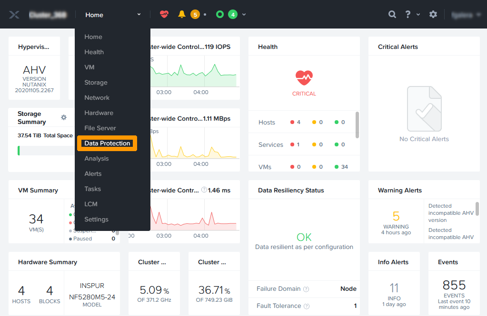{.thumbnail} 

Cliquez sur `Remote Site`{.action} à gauche de l'écran.

{.thumbnail}

Cliquez `+ Remote Site`{.action} à droite de l'écran et choisissez `Physical Cluster`{.action} pour rajouter un site distant.

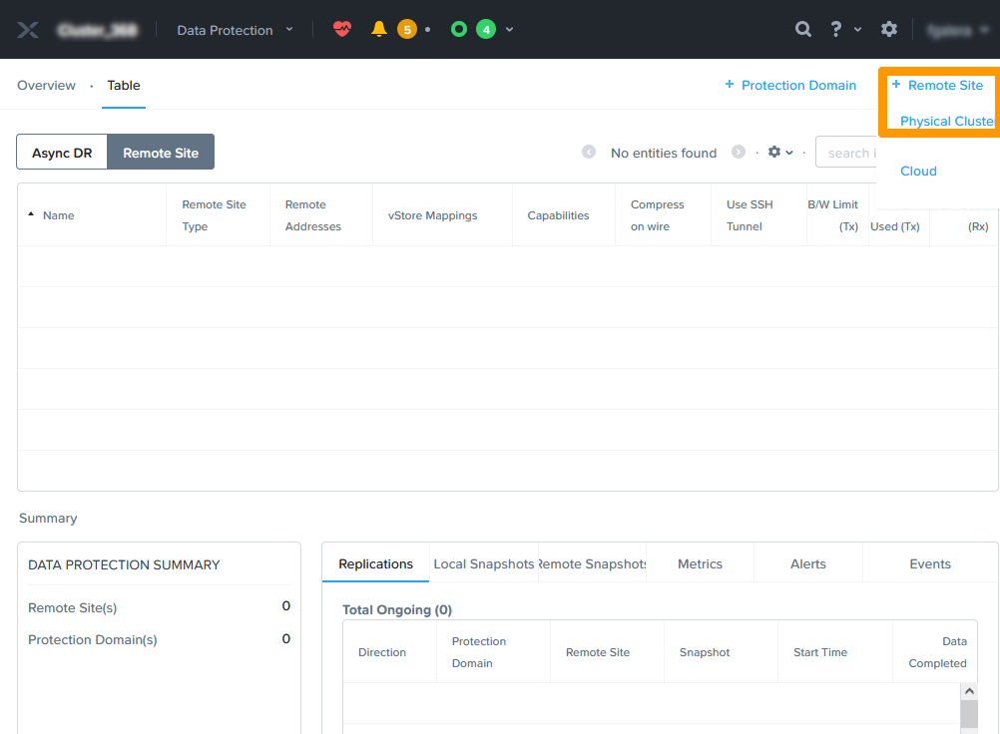{.thumbnail}

Nommez le site distant dans `REMOTE SITE NAME` , saisissez l'adresse IP de **Prism Element** du site distant en FRANCE dans `CLUSTER VIRTUAL IP` et cliquez sur `Add Site`{.action}.

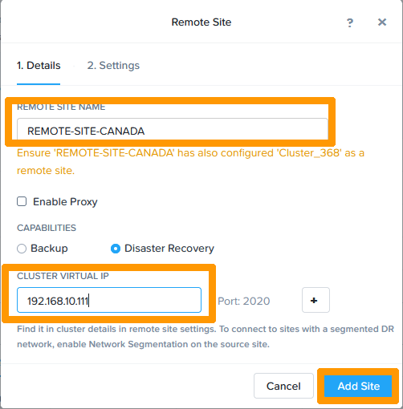{.thumbnail}

Faites défiler la fenêtre à l'aide de La `barre de défilement`{.action}.

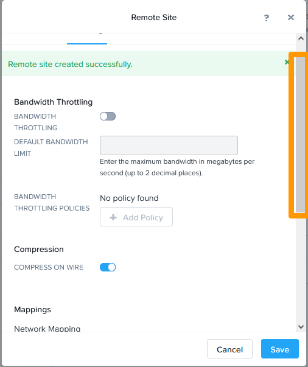{.thumbnail}

Dans la rubrique **Network Mapping** Sélectionnez `AHV: base` pour **Source Cluster** et **Destination Cluster** et cliquez sur le bouton `+`{.action}  

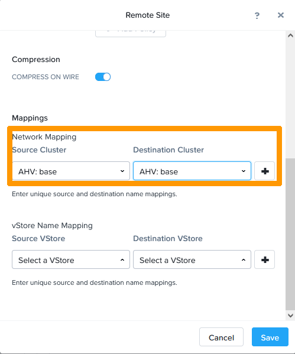{.thumbnail}

Si vous avez un autre VLAN Faites la même opération avec le nom du VLAN `AHV: VLAN50` en cliquant sur le bouton `+`{.action} pour valider l'association des réseaux sources et destinations.

{.thumbnail}

Choisissez `default-container...` dans Source **VStore** et **Destination VStore** et cliquez sur le bouton `+`{.action} pour la correspondance des stockages sources et destination. 

{.thumbnail}

Cliquez sur `Save`{.action}

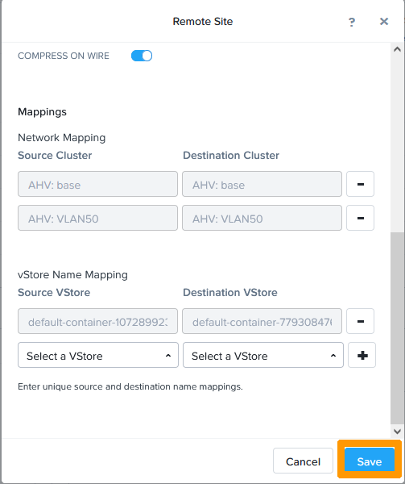{.thumbnail}

Le site distant apparait dans la liste des sites distants.

{.thumbnail}

Nous allons maintenant nous connecter sur l'interface **Prism Element** du site distant au CANADA et faire la même opération.

Au travers du menu Home cliquez sur `Data Protection`{.action}.

{.thumbnail} 

Cliquez sur `Remote Site`{.action} à gauche de l'écran.

{.thumbnail}

Cliquez `+ Remote Site`{.action} à droite de l'écran et choisissez `Physical Cluster`{.action} pour rajouter un site distant.

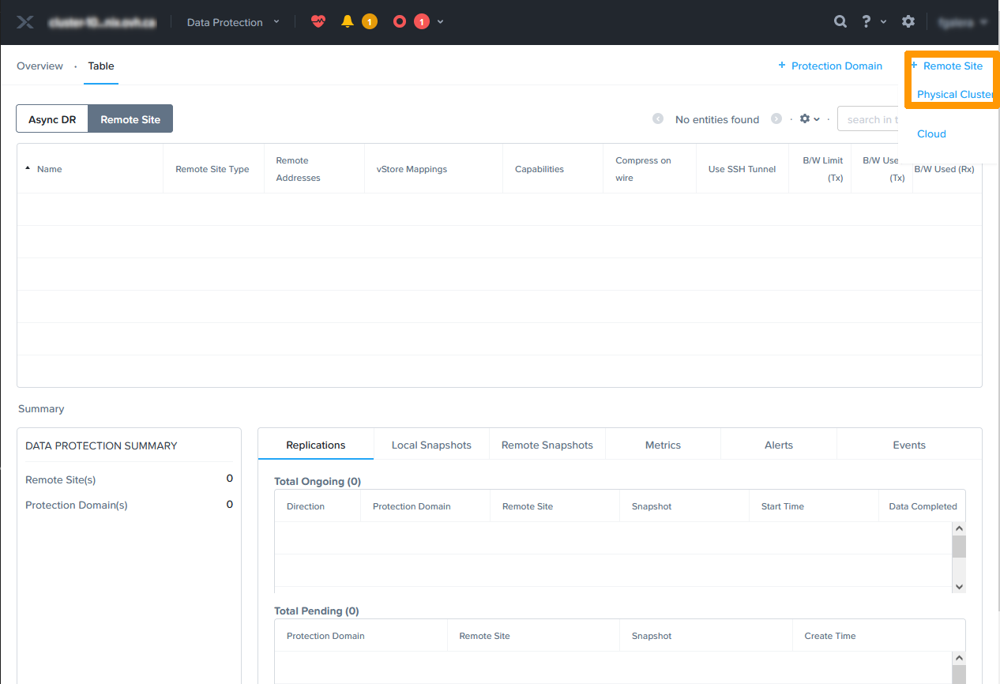{.thumbnail}

Nommez le site distant dans `REMOTE SITE NAME`, saisissez l'adresse IP de **Prism Element** du site distant au canada dans `CLUSTER VIRTUAL IP` et cliquez sur `Add Site`{.action}.

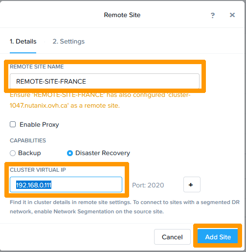{.thumbnail}

Faites défiler la fenêtre à l'aide de La `barre de défilement`{.action}.

{.thumbnail}

Dans **Network Mapping** Sélectionnez `AHV: base`pour **Source Cluster** et **Destination Cluster** et cliquez sur le bouton `+`{.action}  

{.thumbnail}

Si vous avez un autre VLAN Faites la même opération avec le nom du VLAN `AHV: VLAN50` en cliquant sur le bouton `+`{.action} pour valider l'association des réseaux source et destination.

{.thumbnail}

Choisissez `default-container...` dans Source **VStore** et **Destination VStore** et cliquez sur le bouton `+`{.action} pour la correspondance des stockages source et destination. 

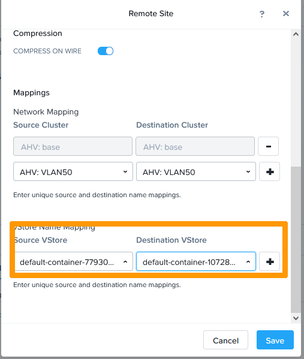{.thumbnail}

Cliquez sur `Save`{.action}.

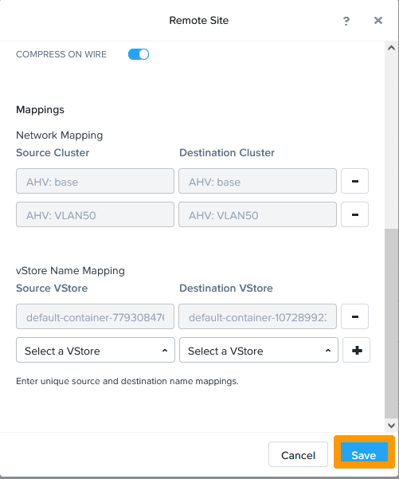{.thumbnail}

Le site distant apparait dans la liste des sites distants. 

{.thumbnail}

### Mise en place de la réplication entre site

Maintenant que les deux sites se connaissent nous allons mettre en place une réplication asynchrone de trois machines virtuelles se trouvant en France vers le site distant au Canada.

Revenez sur l'interface **Prism Element** du cluster se trouvant en France.

Choisissez dans le menu principal `Data Protection`{.action}

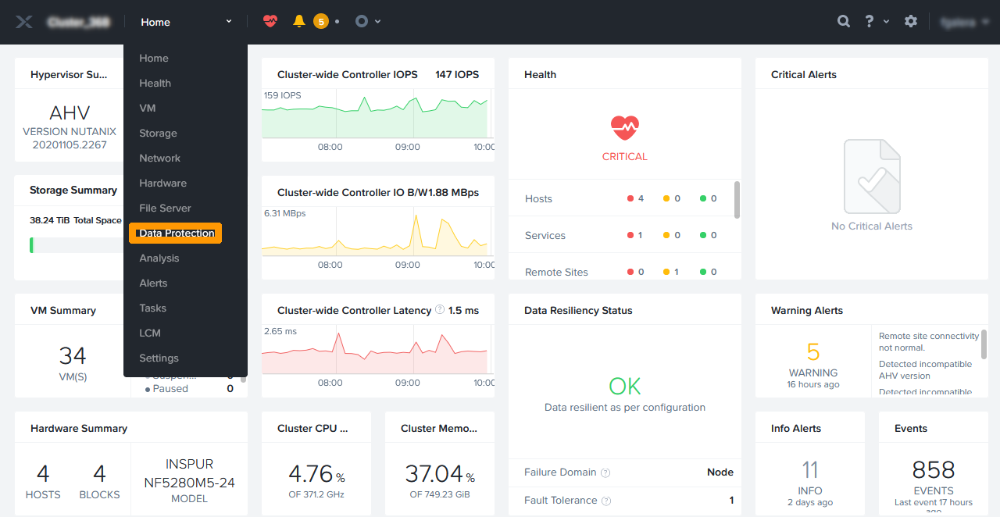{.thumbnail}

Au travers du tableau de bord **Data Protection** cliquez en haut à droite sur `+ Protection Domain`{.action}.

{.thumbnail}

Cliquez sur `Async DR`{.action}.

{.thumbnail}

Saisissez un `Nom` et cliquez sur `Create`{.action}.

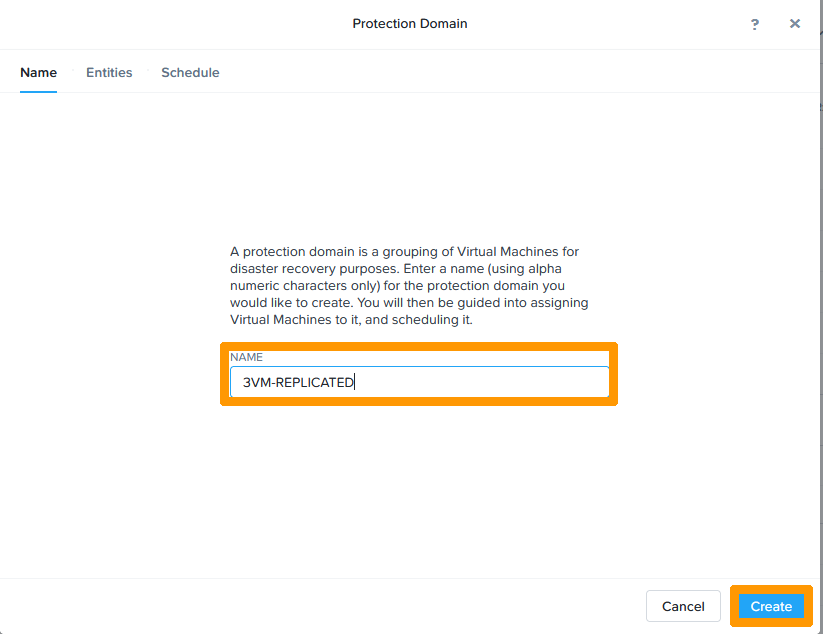{.thumbnail}

Sélectionnez `trois machines` virtuelles et cliquez sur `Protect Selected Entities`{.action}.

{.thumbnail}

Cliquez sur `Next`{.action}

{.thumbnail}

Cliquez sur `New Schedule`{.action} pour configurer la planification.

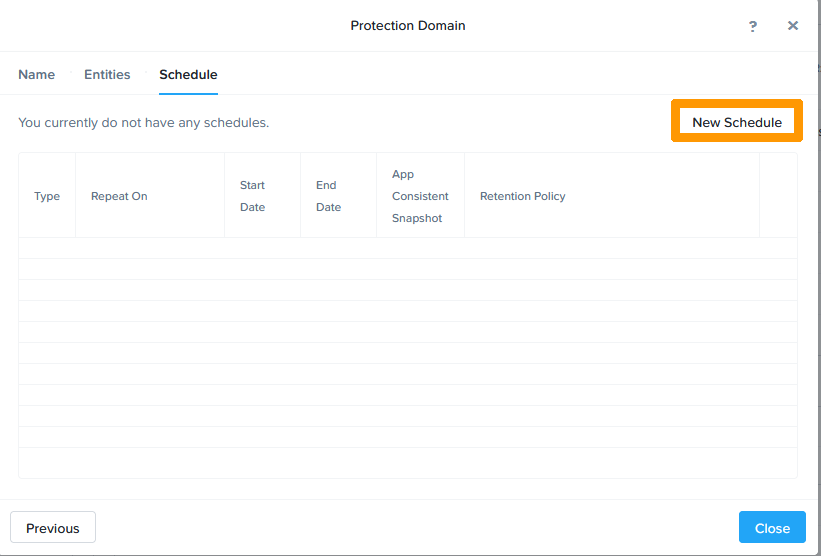{.thumbnail}

Choisissez dans ***Repeat every** `1 hour`, et prenez comme politique de rétention `2 snapshots` à la fois en local et sur le site distant, ensuite cliquez sur `Create Schedule`{.action}

{.thumbnail}

La tâche de réplication est créée pour fonctionner toutes les heures, ce sera une réplication asynchrone fournie avec la licence **Nutanix Standard** d'OVHcloud. 

Cliquez sur `Close`{.action} pour fermer la fenêtre.

> [!primary]
> 
> Il est possible de modifier la planification pour avoir un risque de perte de données réduite en cas de désastre mais la réplication va basculer du mode asynchrone au mode synchrone et il faudra alors changer la licence avec le pack **Nutanix Advanced**.

{.thumbnail}

Le domaine de protection est créé et apparait dans la liste des réplications.

{.thumbnail}

### Migration des machines virtuelles

La migration des machines virtuelles consiste à basculer les machines virtuelles d'un cluster à l'autre dans cet ordre :

* Arrêt des machines virtuelles sur le cluster source (Si elles sont allumées).
* Replication des données manquantes vers le cluster de destination.
* Suppression des machines virtuelles sur le cluster source.
* Désactivation de la réplication planifiée.
* Démarrage des machines virtuelles sur le cluster de destination.

Allez sur **Prism Element** où se trouve les machines virtuelles répliquées.

Au travers du tableau de bord **Data Protection** cliquez sur `Migrate`{.action}. 

{.thumbnail}

Sélectionnez le site distant, saisissez `MIGRATE` et cliquez sur `Migrate`{.action}

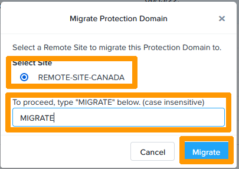{.thumbnail}

La migration est lancée elle sera terminée quand les machines virtuelles apparaitrons sur le site distant et ne seront plus sur le site d'origines.

{.thumbnail}

### Basculement des machine virtuelles en cas de désastre

Il est possible d'activer les machines virtuelles sur le site de destination même si le site source n'est pas ou plus disponible.

> [!warning]
> L'activation des machines virtuelles sur le site distant se fera avec les dernières données répliquées, dans le cas d'un réplication asynchrone il est possible d'avoir une perte de données au maximum d'une heure. C'est ce que l'on nomme le RPO (Recovery Point Objective).

Connectez-vous sur ce site distant avec **Prism Element** 

Allez sur le tableau de bord **Data Protection** 

Sélectionnez le site à activer et cliquez sur `Activate`{.action}. 

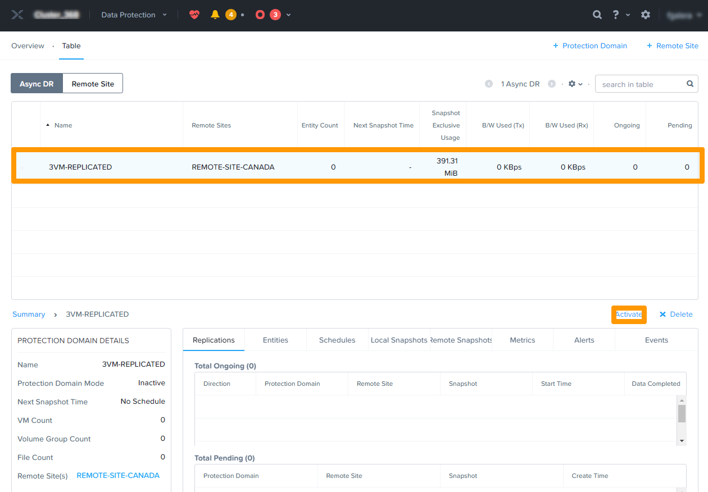{.thumbnail}

Cliquez sur `Yes`{.action}. 

{.thumbnail}

Les machines virtuelles apparaîtrons dans la console de **Prism Element** dans l'état de la dernière réplication, les données modifiées entre temps sur le cluster d'origine seront perdues. 

Les machines virtuelles activées sont éteintes, il est necessaire de faire un démarrage manuel.

## Aller plus loin

[Documentation Nutanix sur Data Protection and Disaster Recovery](https://portal.nutanix.com/page/documents/solutions/details?targetId=BP-2005-Data-Protection:top-backup-and-disaster-recovery-on-remote-sites.html)

Échangez avec notre communauté d'utilisateurs sur <https://community.ovh.com/>.
