**Dernière mise à jour le 11/07/2022**

## Objectif

Mettre en place Nutanix LEAP pour effectuer des réplications et des plans de reprises d'activités évolués avec **Prism Central**

## Présentation

Nutanix LEAP permet :

- de faire des réplication asynchrones, nearsync et synchrone. 
- de tester les réplications.
- d'automatiser la bascule sur un autre site suite à un évenement.
- Avec Leap il est possible de faire une réplication dans le cloud de Nutanix avec la solution Xi-Leap mais cette option n'est pas possible avec les pack de licence OVHcloud.

> [!warning]
> OVHcloud vous met à disposition des services dont la configuration, la gestion et la responsabilité vous incombent. Il vous appartient donc de ce fait d’en assurer le bon fonctionnement.
>
> Ce guide a pour but de vous accompagner au mieux sur des tâches courantes. Néanmoins, nous vous recommandons de faire appel à un prestataire spécialisé si vous éprouvez des difficultés ou des doutes concernant l’administration, l’utilisation ou la mise en place d’un service sur un serveur.
>

## Prérequis

- Disposer de deux clusters Nutanix dans votre compte OVHcloud.
- Être connecté à votre [espace client OVHcloud](https://www.ovh.com/auth/?action=gotomanager&from=https://www.ovh.com/fr/&ovhSubsidiary=fr).
- Être connecté à vos clusters via **Prism Central**.
- Avoir mis en place une interconnexion entre deux clusters, par exemple via un VPN IPsec. ou vRack si il faut une réplication synchrone.
- Nutanix Leap a besoin de plus de resources sur la ou les VM Prism central en fonction du mode
    + Single Mode : 4Go de RAM
    + Scale Mode avec 3 machines virtuelles **Prism Central** : 8 Go de RAM par machines virtuelles

## En pratique

Notre plan de reprise d'activité au travers de Nutanix Leap sera mis en place entre deux CLUSTER, l'un se trouvant au Canada et l'autre se trouvant en France. Les deux clusters sont réliés par un VPN voici le résumé de la configuration :

- Lan d'administration sur cluster en France 192.168.0.0/24
- Lan d'administration du cluster au Canada 192.168.10.0/24

- Lan commun au deux clusters contenant les machines virtuelles du plan de reprise d'activité 192.168.50.0/24

Toutes les opérations se feront au travers de **Prism Central**
 
### Mise en service de LEAP

#### Ajout d'une adresse IP en iSCSI sur chaque cluster 
Avant d'activer **LEAP** il est nécessaire de rajouter une addresse IP pour les connexions iSCSI sur chacun des clusters

Connectez-vous à **Prism Element** au travers de **Prism Central** du cluster en France, pour vous aider vous pouvez utiliser ce guide [Hyperconvergence Nutanix](https://docs.ovh.com/fr/nutanix/nutanix-hci/).

Au travers du tableau de bord de **Prism Element** en haut à gauche cliquez sur `Le nom du cluster`{.action}.

{.thumbnail}

Saisissez une `adresse IP du réseau d'administration non utilisée` dans **iSCSI Data Service IP**  et cliquez sur `Save`{.action}.

{.thumbnail}

Effectuez la même opération sur le cluster se trouvant au Canada

Dans le tableau de bord de **Prism Element** en haut à gauche cliquez sur `Le nom du cluster`{.action}.

{.thumbnail}

Saisissez une `adresse IP du réseau d'administration non utilisée` dans **iSCSI Data Service IP**  et cliquez sur `Save`{.action}.

{.thumbnail}

#### Activation de LEAP

Revenez sur l'interface **Prism Central** du cluster se trouvant en France

Au travers **Prism Central** allez dans le menu principal et sous la rubrique `Data Protection` cliquez sur `Recovery Plans`{.action}.

{.thumbnail}

Cliquez sur `Enable LEAP`{.action}.

{.thumbnail}

Si les `Prechecks` sont successful cliquez sur `Enable`{.action}.

{.thumbnail}

Allez maintenant sur l'interface **Prism Central** du Canada et faites la même opération

Cliquez sur `Recovery Plans`{.action}.

{.thumbnail}

Cliquez sur `Enable LEAP`{.action}.

{.thumbnail}

Si les `Prechecks` sont successful cliquez sur `Enable`{.action}.

{.thumbnail}

Nutanix Leap est activé sur les deux clusters , chaque cluster possède une *Availability Zone* il faut maintenant les connecter les deux clusters pour que chacun des deux clusters voient la *Availability Zone**.

### Connexion des deux clusters.

Restez sur **Prism Central** dans le cluster se trouvant au Canada.

Allez dans le menu principal, et sous la rubrique `Administration` cliquez sur `Availability Zones`{.action}.

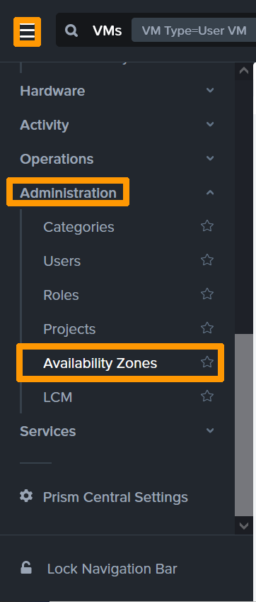{.thumbnail}

cliquez sur `Connect to Availability Zone`{.action}.

{.thumbnail}

Saisissez ces informations :

- **Availability Zone Type** : `Physical Location`
- **IP Address for Remote PC** : `Adresse IP Prism Central distant`
- **Username** : `Compte administrateur du Prism Central distant`
- **Password** : `Mot de passe du compte Prism Central distant`

Ensuite cliquez sur `Connect`{.action}.

{.thumbnail}

Le cluster distant apparait avec son adresse IP, ici celle de l'adresse de **Prism Central** en France.

{.thumbnail}

Connectez vous au cluster en France avec **Prism Central** sur la même rubrique  `Availability Zones` vous allez constatez que le cluster distant au Canada aussi apparait. Les deux sites sont connectés.

{.thumbnail}

### Mise en place d'une réplication du site au Canade vers la France.

> [!warning]
> Il est impossible d'avoir des machines virtuelles qui utilisent **Domain Protection** à partir de **Prism Element** si l'on veut utiliser **Nutanix Leap** , il faudra s'assurer que les machines virtuells ne fassent plus partie du **Domain Protection**.
>

#### Création d'un catégorie contenant les machines virtuelles à répliquer

Au travers du `menu principal` allez sur `Availability Zones`{.action} des options `administration`.

{.thumbnail}

Cliquez sur `New Category`{.action}

{.thumbnail}

Saisissez ces informations :

- **Name** : `replicated-vm`
- **values** : `from-canada`

Ensuite cliquez sur `Save`{.action}.

{.thumbnail}

Revenez dans le menu principal sélectionnez `VMs`{.action} dns la catégorie `Compute et Storage`

{.thumbnail}

Sélectionnez la machine virtuelle à répliquer avec la `case à cocher`{.action} à gauche de la machine virtuelle et cliquez sur `Actions`{.action} pour faire apparaitre un menu.

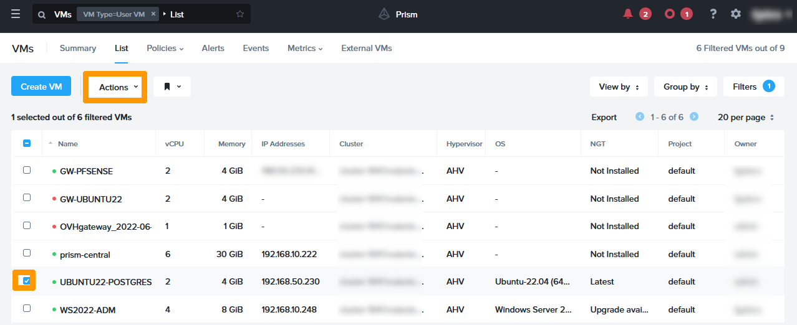{.thumbnail}

Au travers du menu cliquez sur `Manage Categories`{.action} 

{.thumbnail}

Sélectionnez la catégorie créé et cliquez sur le bouton `+`{.action} de couleur bleu.

{.thumbnail}

cliquez sur  `Save`{.action}

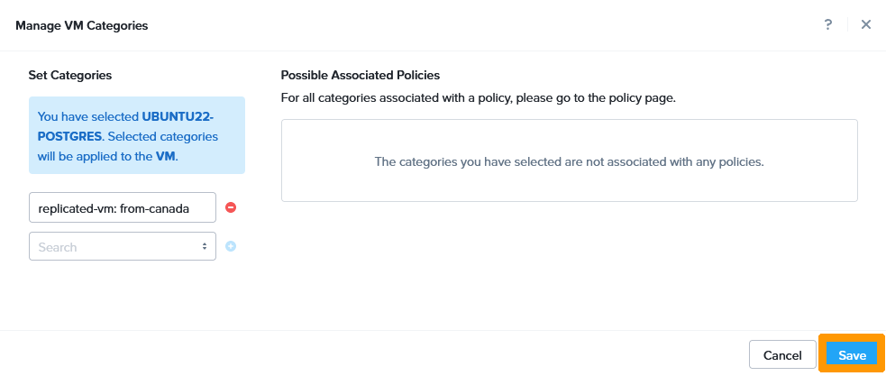{.thumbnail}

#### Création de la stratégie de protection

Un stratégie de protection est une connexion entre deux *Availability zones* avec un planning de réplication qui autorise tous les types de synchronisations:

- asynchrone toutes les heures
- nearsync entre 1 & 15 minutes
- synchrone avec un délai de 0 secondes (Ce mode necessite une latence de 5Ms entre les deux clusters)

Au travers du menu principal choisissez `Protection Policies`{.action} dans le sous menu `Data Protection`.

{.thumbnail}

Cliquez sur `Create Protection Policy`{.action} 

{.thumbnail}

- **Policy name** : `nom de la stratégie`
- **Location** : `Local AZ` pour choisir la zone contenant le cluster local
- **Cluster** : `Cluster contenant les machines virtuelles à répliquer`

Cliquez sur `Save`{.action}

{.thumbnail}

Dans recovery location choisissez ces options :

- **Location** : `PC_192.168.0.222` qui correspond à zone contenant le cluster distant
- **Cluster** : `Cluster de destination`

Cliquez sur `Save`{.action}.

{.thumbnail}

Cliquez sur `Add schedule`{.action}.

{.thumbnail}

Choisissez `Asynchronous dans`  **Protection Type**.

Modifiez ces options dans takes **Take Snapshot Every** par `Minutes : 15` pour faire une réplication *nearsync*.

Cochez la case `Take App-Consistent Snapshots` et cliquez sur `Save Schedule`{.action}.

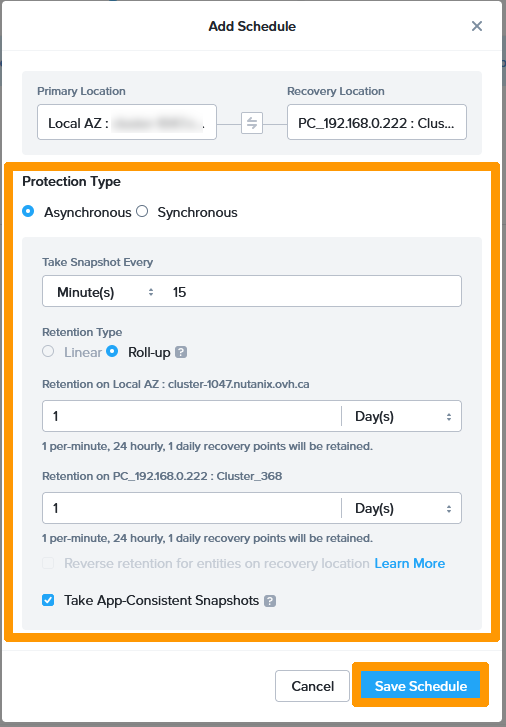{.thumbnail}

Cliquez sur `Next`{.action}.

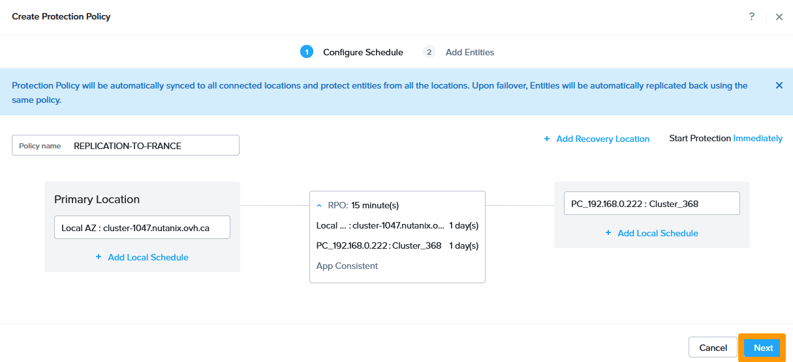{.thumbnail}

Cochez la `catégorie` et cliquez sur `Add`{.action}.

{.thumbnail}

cliquez sur `Create`{.action}.

{.thumbnail}

La stratégie de protection est activée et apparait dans le tableau de bord des **Protection Policies**

{.thumbnail}

### Activation d'un plan  de reprise d'activité.

Un plan de reprise d'activité peut être manuel ou automatique en fonction du type de réplication choisi , il peut être executé en mode programmé avec les deux clusters disponibles ou en mode de desastre si le cluster d'origine n'est pas disponible. Il est aussi possible de faire un test sur le cluster distant sur un réseau isolé.

Dans le menu principal choisissez `Recovery Plans`{.action} qui se trouve dans la rubrique `Data Protection`

{.thumbnail}

Cliquez sur `Create New Recovery Plan`{.action} 

{.thumbnail}

Saisisissez ces valeurs : 

- **Recovery Plan Name** : `nom du plan de restauration`
- **Primary Location** : `Local AZ` pour choisir la zone contenant le cluster local.
- **Recovery Location** : `Nom de la Zone distante` qui servira pour le plan de reprise.

Ensuite cliquez sur `Next`{.action} 

{.thumbnail}

Cliquez sur `Add Entities`{.action} 

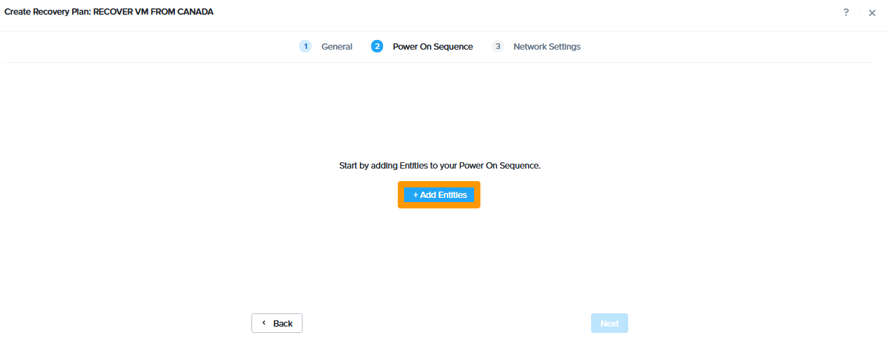{.thumbnail}

Cochez la `case`{.action} à coté des machines virtuelles qui font partie du plan de reprise.

Ensuite cliquez sur `Add`{.action} 

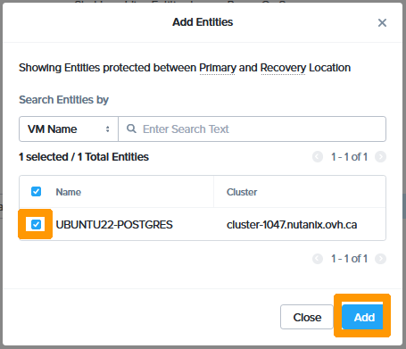{.thumbnail}

Cochez la `case`{.action} à coté des machines virtuelles qui doivent démarrer automatiquement lors de l'activation du plan de reprise.

Ensuite cliquez sur `Next`{.action} 

{.thumbnail}

Lors de la présentation du plan de reprise  cliquez sur `OK, Got it`{.action} 

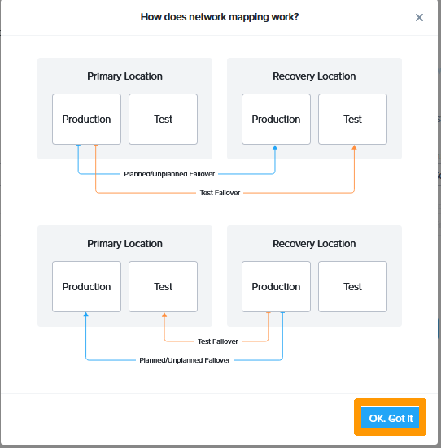{.thumbnail}

Sur le site primaire choisisissez ces options :

- **Production** : `VLAN de production`
- **Test Failback** : `VLAN de test` 

Sur le site de reprise choisisissez ces options :

- **Production** : `VLAN de production`
- **Test Failback** : `VLAN de test` 

Ensuite cliquez sur `Done`{.action}. 

{.thumbnail}

Le plan de reprise apparait dans la liste, il pourra être utilisé.

{.thumbnail}

### Activation programmée d'un site

Connectez-vous avec **Prism Central** sur le cluster en FRANCE pour basculer la machine virtuelle du CANADA vers la FRANCE.

ALlez dans le menu `Principal` choissisez `Recovery Plans`{.action} dans la rubrique `Data Protection`.

{.thumbnail}

    Sélectionnez le plan de reprise en utilisant la `case à cocher` à coté ensuite cliquez sur `Actions`{.action} pour faire apparaitre le menu.

{.thumbnail}

cliquez sur `Failover`{.action} 

{.thumbnail}

Dans Failover type sélectionnez `Planned Failover`{.action} et cliquez sur le bouton `Failover`{.action}

{.thumbnail}

Saisissez `Failover`{.action} et cliquez sur le bouton `Failover`{.action}

{.thumbnail}

La machine virtuelle se trouvant sur le cluster d'origine va être démarré , une dernière synchronisation des données va être faites, ensuite la machine virtuelle disparaitra du cluster d'origine pour apparaitre et démarrer sur le cluster de destinations.

Au travers du tableau de bord on peut voir dans **Last Failover Status** le résultat qui est `Succeeded` si tout c'est bien déroulé.

{.thumbnail}

### Inversion de la réplication 

Dans le cas d'un basculement programmée il faut pour revenir à la situation d'origine inverser la réplication.

Connectez-vous sur le cluster de destination en FRANCE au travers de **Prism Central**

Utilisez le `menu principal`, choisissez `Protection Policies`{.action} dans le sous-menu `Data Protection`.

{.thumbnail}

Cochez la `case`{.action} à gauche de la stratégie de protection et cliquez sur le boutons `Actions`{.action}.

{.thumbnail}

Cliquez sur le bouton `Update`{.action}.

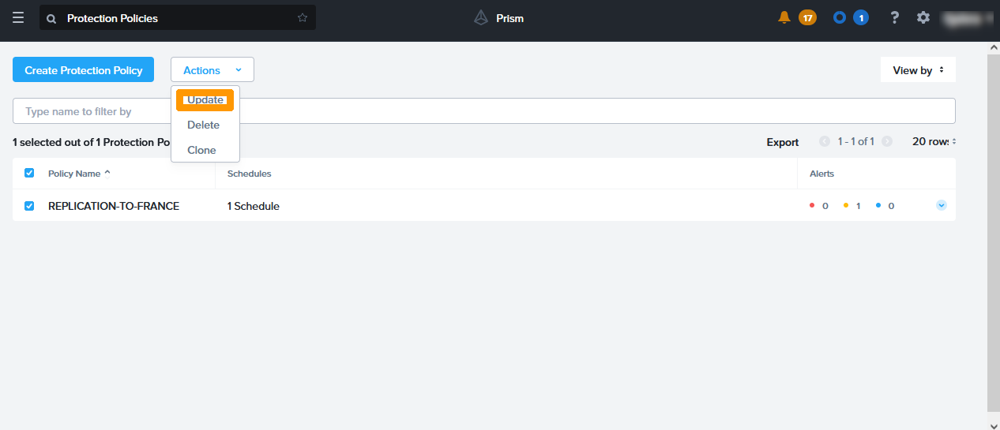{.thumbnail}

Positionnez-vous à gauche en dessous de `Primary Location ` jusqu'a qu'un choix apparaisse et cliquez sur `Edit`{.action}

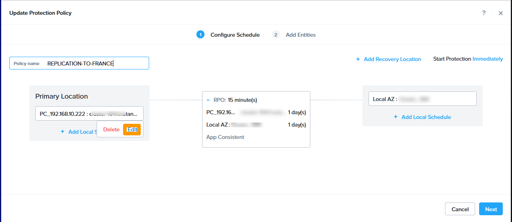{.thumbnail}

Modifier ces informations dans **Primary Location** :

- **Location** : `Local AZ`
- **cluster** : `cluster de la zone locale`

Ensuite cliquez sur `Save`{.action}

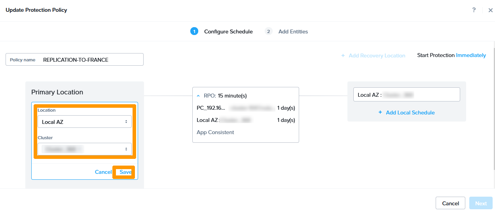{.thumbnail}

cliquez sur `Update Location`{.action}

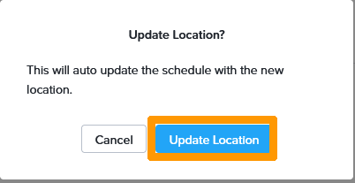{.thumbnail}

Positionnez-vous à droite en dessous de la destination jusqu'a qu'un choix apparaisse et cliquez sur `Edit`{.action}

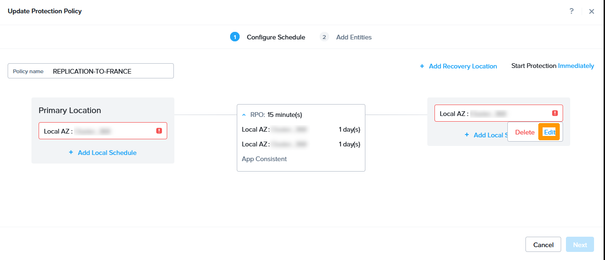{.thumbnail}

Modifier ces informations dans **Primary Location** :

- **Location** : `zone de destination`
- **cluster** : `cluster de la zone de destination`

Ensuite cliquez sur `Save`{.action}.

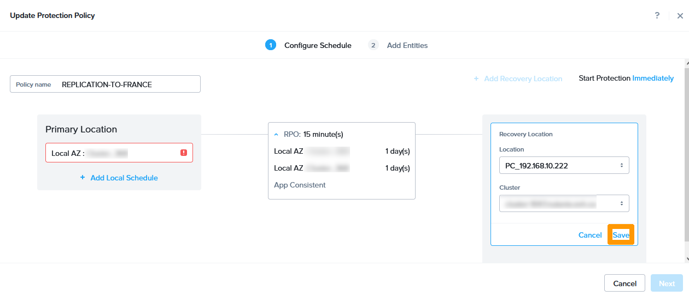{.thumbnail}

Cliquez sur `Update Location`{.action}.

{.thumbnail}

Cliquez sur `Next`{.action}. 

{.thumbnail}

Cliquez sur `Update`{.action} pour finaliser l'inversion.

{.thumbnail}

### Modification du plan de reprise 

De même que la réplication doit être inversée il faut aussi modifier le plan de reprise pour pouvoir basculer à nouveau vers le cluster d'origine au CANADA.

Allez dans le `menu principal` choisissez `Recovery Plans`{.action} dans le sous-menu `Data Protection`.

{.thumbnail}

Sélectionnez le plan de reprise d'activité à l'aide de la `case à cocher`{.action} à gauche et ensuite cliquez sur le bouton `Actions`{.action}.

{.thumbnail}

cliquez dans le menu sur `Update`{.action}.

{.thumbnail}

Remplacez dans **Primary Location** à gauche `le cluster distant` par `Local AZ`{.action}.

{.thumbnail}

Choisissez `La zone distante`{.action} dans **Recovery Location** à droite à la place de `Local AZ`.

{.thumbnail}

Maintenant que la source et la destination du plan de reprise sont modifiées, cliquez sur `Next`{.action}.

{.thumbnail}

Cliquez sur `Proceed`{.action}.

{.thumbnail}

Selectionnez  la `Machine virtuelle` qui doit démarrer lors du plan de reprise et cliquez sur `Next`{.action}.

{.thumbnail}

Sur le site primaire choisisissez ces options :

- **Production** : `VLAN de production`
- **Test Failback** : `VLAN de test` 

Sur le site de reprise choisisissez ces options :

- **Production** : `VLAN de production`
- **Test Failback** : `VLAN de test` 

Ensuite cliquez sur `Done`{.action}. 

{.thumbnail}

Le plan de reprise est modifié pour fonctionner du cluster en France vers le cluster au Canada. 

Si vous souhaitez revenir au fonctionnement d'origine il faudra refaire un failover , modifier le sens de la réplication et modirer le plan de reprise d'activité.

{.thumbnail}

### Activation du plan de reprise suite à un incident sur le cluster d'origine

Il est possible d'activer les machines virtuells sur le cluster de destination en cas de problème sur le cluster d'origine, dans ce cas l'activation se fera avec un risque de perte données dans le cas d'une réplication asynchrone ou nearsync, mais si l'on a une solution de réplication synchrone aucune perte ne sera à déplorer.

Dans notre cas la réplication se faisant toute les 15 minutes le risque de perte de données peut atteindre ce temps.

Connectez vous au cluster qui est le destinataire des replications avec  **Prism Central** 

Allez dans le `menu principal`, choisissez `Recovery Plan`{.action} dans le sous menu `Data Protection`.

{.thumbnail}

Sélectionnez le plan de reprise d'activité avec `la case à cocher`{.action} et cliquez sur `Actions`{.action} 

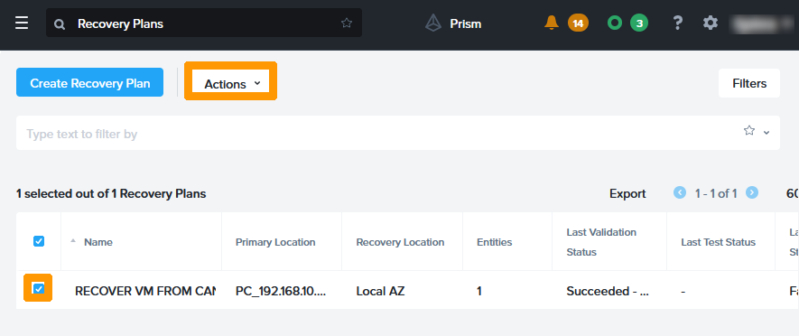{.thumbnail}

Choisissez dans le menu `Failover`{.action} 

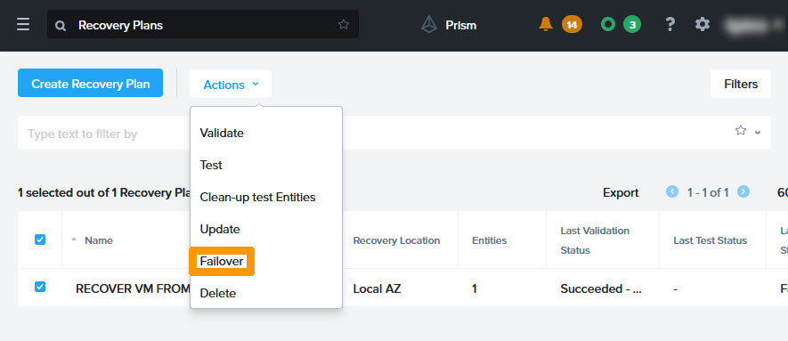{.thumbnail}

Cochez `Unplanned Failover`{.action} et cliquez sur `Failover`{.action}

{.thumbnail}

Saisissez `Failover` et cliquez sur `Failover`{.action}

{.thumbnail}

## Aller plus loin

[Documentation Nutanix LEAP](https://portal.nutanix.com/page/documents/details?targetId=Leap-Xi-Leap-Admin-Guide-v6_1:Leap-Xi-Leap-Admin-Guide-v6_1)

Échangez avec notre communauté d'utilisateurs sur <https://community.ovh.com/>.
