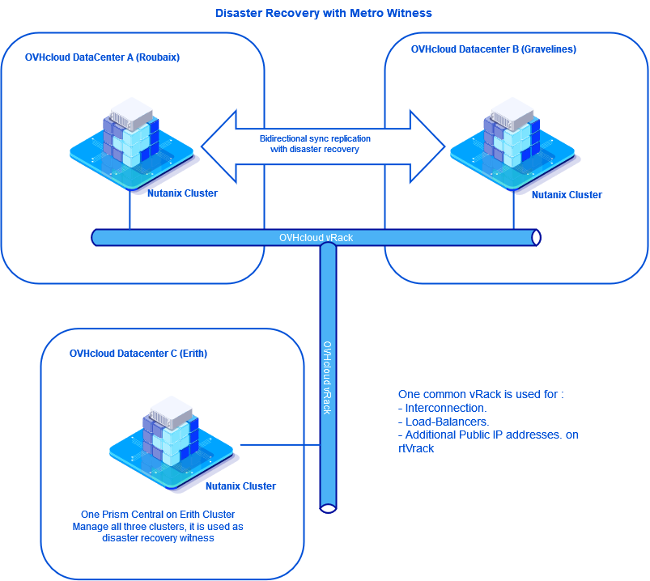
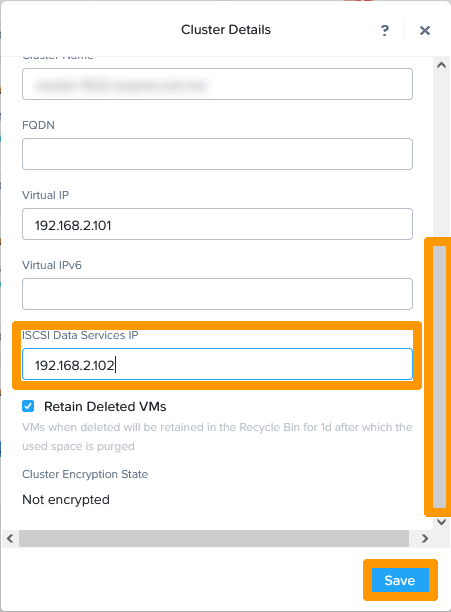
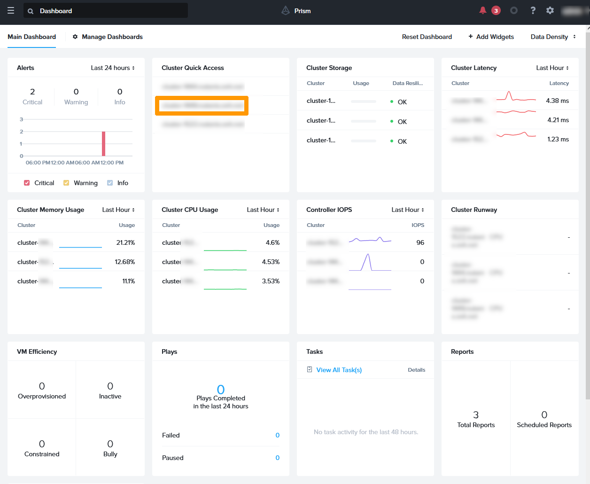
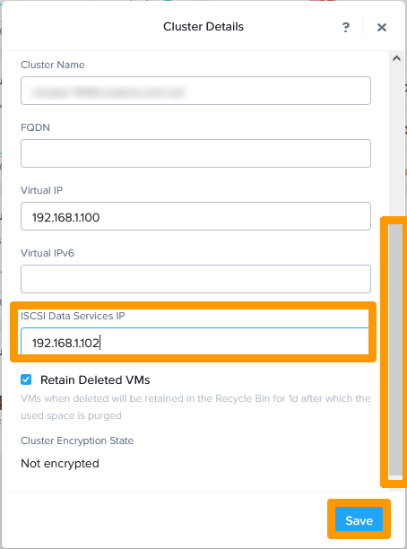
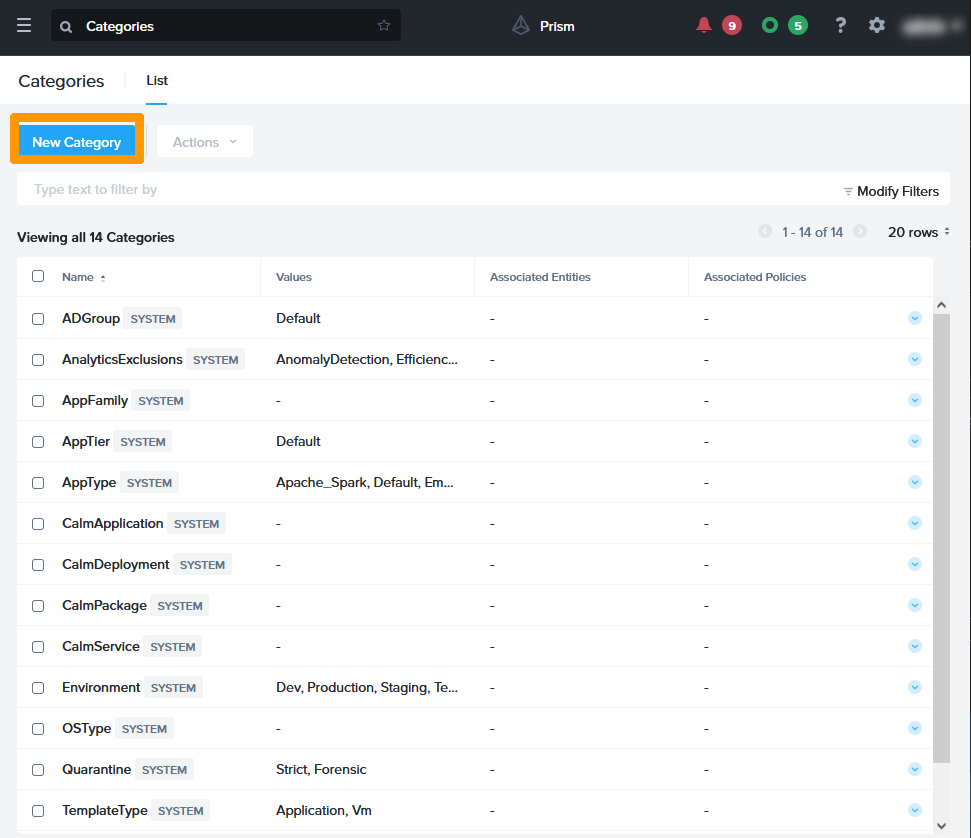
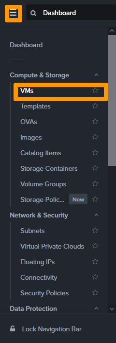
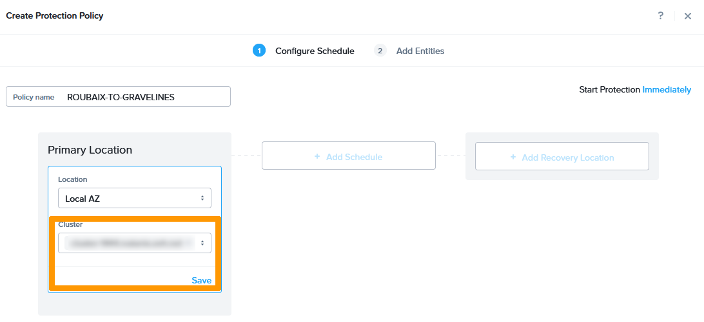
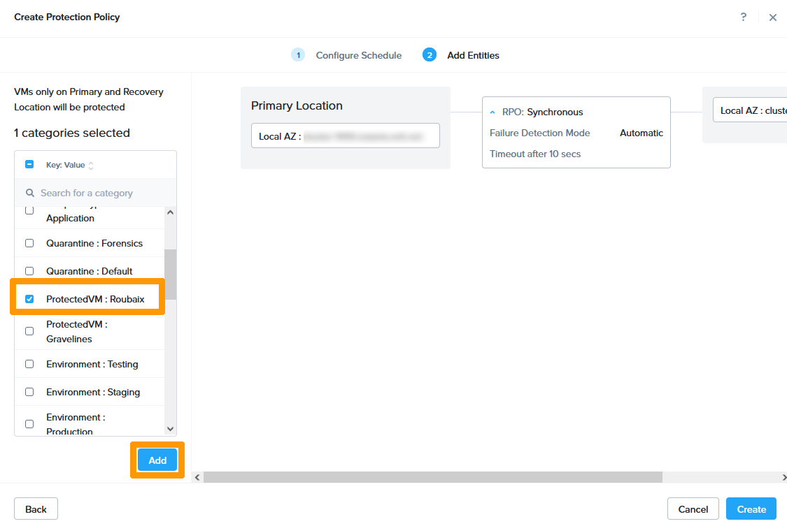

**Dernière mise à jour le 20/10/2022**

## Objectif

** Ce guide vous présente la Metro Availability qui permet un plan de reprise d'activité automatisé** 

> [!warning]
> OVHcloud vous met à disposition des services dont la configuration, la gestion et la responsabilité vous incombent. Il vous appartient donc de ce fait d’en assurer le bon fonctionnement.
>
> Ce guide a pour but de vous accompagner au mieux sur des tâches courantes. Néanmoins, nous vous recommandons de faire appel à un prestataire spécialisé si vous éprouvez des difficultés ou des doutes concernant l’administration, l’utilisation ou la mise en place d’un service sur un serveur.
>

## Prérequis

- Être connecté à votre [espace client OVHcloud](https://www.ovh.com/auth/?action=gotomanager&from=https://www.ovh.com/fr/&ovhSubsidiary=fr).
- Être connecté sur vos clusters via Prism Central.
- Avoir les deux clusters qui seront répliqués avec un latence de moins de 5ms.

## Présentation

Nous allons mettre en place un plan de reprise d'activité bi-directionnel entre deux clusters avec ce matériel :

- Un cluster Nutanix à ROUBAIX en France.
- Un cluster Nutanix à GRAVELINES en France.
- Un cluster Nutanix à ERITH en Angleterre uniquement pour héberger Prism Central.


Nous n'utiliserons qu'un seul vRack qui contiendra :

- Les clusters Nutanix.
- Les loadbalancers.
- Le serveur Standalone avec Prism Central.
- les adresses IP additionnelles sur le rtvRack.

Vous trouverez ci-dessous le schéma de cette configuration sur trois sites:



## En pratique

Nous allons étape par étape mettre en place ce P.R.A (Plan de reprise d'activité)

Le informations techniques utilisés par notre guide sont les suivantes :

- Cluster de ROUBAIX :
    + Serveur 1 : adresse VM **CVM** `192.168.0.1`, adresse IP hyperviseur **AHV** `192.168.0.21`.
    + Serveur 2 : adresse VM **CVM** `192.168.0.2`, adresse IP hyperviseur **AHV** `192.168.0.22`.
    + Serveur 3 : adresse VM **CVM** `192.168.0.3`, adresse IP hyperviseur **AHV** `192.168.0.23`.
    + Adresse virtuelle de **Prism Element** : `192.168.0.100`.
    + Adresse iScsi de **Prism Element** : `192.168.0.102`.
    + Adresse IP **Prism Central** :`192.168.0.101`.
    + Passerelle : `192.168.3.254`.
    + Masque : `255.255.252.0`
    + Version du cluster : `6.5`

- Cluster de GRAVELINES :
    + Serveur 1 : adresse VM **CVM** `192.168.1.1`, adresse IP hyperviseur **AHV** `192.168.1.21`.
    + Serveur 2 : adresse VM **CVM** `192.168.1.2`, adresse IP hyperviseur **AHV** `192.168.1.22`.
    + Serveur 3 : adresse VM **CVM** `192.168.1.3`, adresse IP hyperviseur **AHV** `192.168.1.23`.
    + Adresse virtuelle de **Prism Element** : `192.168.1.100`.
    + Adresse iScsi de **Prism Element** : `192.168.1.102`.
    + Adresse IP **Prism Central** :`192.168.1.101`.
    + Passerelle : `192.168.3.254`.
    + Masque : `255.255.252.0`
    + Version du cluster : `6.5`.

- Cluster de ERITH :
    + Serveur 1 : adresse VM **CVM** `192.168.2.1`, adresse IP hyperviseur **AHV** `192.168.2.21`.
    + Serveur 2 : adresse VM **CVM** `192.168.2.2`, adresse IP hyperviseur **AHV** `192.168.2.22`.
    + Serveur 3 : adresse VM **CVM** `192.168.2.3`, adresse IP hyperviseur **AHV** `192.168.2.23`.
    + Adresse virtuelle de **Prism Element** : `192.168.2.101`.
    + Adresse iScsi de **Prism Element** : `192.168.2.102`.   
    + Adresse IP **Prism Central** :`192.168.2.100`.
    + Passerelle : `192.168.3.254`.
    + Masque : `255.255.252.0`
    + Version du cluster : `6.5`.

une partie du  paramètrage sera faite à partir des interfaces WEB **Prism Central** & **Prism Element**, une autre à partir de l'espace client OVHcloud et d'autres en ligne de commande sur **Prism Central** ou **Prism Element**. En plus de ce guide vous pouvez vous appuyer sur ces guides [Hyperconvergence Nutanix](https://docs.ovh.com/fr/nutanix/nutanix-hci/) et [Outils avancées](https://docs.ovh.com/fr/nutanix/advanced-tools/) pour vous aider.


### Interconnexion des trois clusters

La première étape est de réaliser l'interconnexion des trois clusters sur le même vRack OVHcloud. 

Aidez-vous de ce guide pour interconnecter vos clusters [Interconnexion de clusters au travers du vRack](https://docs.ovh.com/fr/nutanix/nutanix-vrack-interconnection/).

Le guide explique la connexion entre deux clusters dans notre cas il faut connecter 3 serveurs suivez les instructions dans ce sens :

- Gravelines vers Roubaix
- Gravelines vers Erith

Lorsque vous aurez terminé la configuration vous verrez dans votre vRack ces éléments :

- 9 Dedicated servers (3 par cluster)
- 3 adresses IP publiques
- 3 Load Balancers


Vous pouvez vous connecter aux URL des machines virtuelles **Prism Central** depuis l'extérieur avec les URL d'origine de chaque cluster qui ont la forme **https://cluster-XXXX.nutanix.ovh.net:9440**

### Suppression des enregistrements **Prism Central** pour les cluster de Roubaix et Gravelines.

Pour pouvoir mettre en place une solution de plan de reprise d'activité avec **Metro Availability** il est est nécessaire de n'utiliser qu'une Machine virtuelle **Prism Central** commune aux 3 clusters. **Prism Central** sera sur le site d'ERITH qui ne contient pas de machines virtuelles concernées par le P.R.A.

Dans un premier temps il faut retirer **Prism Element** des clusters des machines virtuelles **Prism Central** de Roubaix et Gravelines.


#### Désactivation de **Prism Central** sur le cluster de Roubaix

Connectez-vous en SSH au cluster **Prism Element** de Roubaix.

```bash
ssh nutanix@adresse_ip_privee_prism_element_roubaix
Saisissez le mot de passe de Prism Element
```
Exécutez cette commande pour retirer Prism Element de la configuration de Prism Central:

```
ncli multicluster remove-from-multicluster external-ip-address-or-svm-ips=adresse_ip_privee_prism_central\
username=admin password=mdp_pe_roubaix force=true
```

Ce message apparait lors de la deconnexion à Prism Central.

```console
Cluster unregistration is currently in progress. This operation may take a while.
```

Saisissez cette commande :

```bash
ncli cluster info
```

Notez la valeur de **Cluster UUID** qui doit avoir cette forme **xxxxxxxx-xxxx-xxxx-xxxx-xxxxxxxxxxxx**.

Déconnectez-vous de **Prism Element** et connectez vous en SSH sur la machine virtuelle **Prism Central** de Roubaix.

```bash
ssh nutanix@adresse_ip_privee_prism_central
saisissez le mot de passe de Prism Central
```

Saisissez cette commande :

```bash
python /home/nutanix/bin/unregistration_cleanup.py cluster_uuid_prism_element_roubaix
```

#### Désactivation de **Prism Central** sur le cluster de Gravelines

Connectez-vous en SSH au cluster **Prism Element** de Gravelines.

```bash
ssh nutanix@adresse_ip_pe_gravelines
saisissez le mot de passe de Prism Element
```
Saisissez cette commande :

```bash
ncli multicluster remove-from-multicluster external-ip-address-or-svm-ips=adresse_ip_privee_prism_central_gravelines\
username=admin password=mdp_pe_gravelines force=true
```

Ce message apparait lors de la deconnexion à Prism Central.

```console
Cluster unregistration is currently in progress. This operation may take a while.
```

Saisissez cette commande

```bash
ncli cluster info
```

Notez la valeur de **Cluster UUID* qui doit avoir cette forme **xxxxxxxx-xxxx-xxxx-xxxx-xxxxxxxxxxxx**

Deconnectez-vous de **Prism Element** et connectez vous en SSH sur la machine virtuelle **Prism Central** de Gravelines

```bash
ssh nutanix@adresse_ip_privee_prism_central_gravelines
saisissez le mot de passe de Prism Central
python /home/nutanix/bin/unregistration_cleanup.py cluster_uuid_prism_element_gravelines
```
                                                
### Enregistrement des deux clusters au Prism Central se trouvant sur le site d'Erith

Connectez-vous en ssh sur **Prism Element** de Roubaix :

```bash
ssh nutanix@adresse_ip_privee_prism_element_roubaix
saisissez le mot de passe de Prism Element
```

Executer cette commande :

```bash
ncli multicluster register-to-prism-central username=admin password=passwod_admin\ external-ip-address-or-svm-ips=adresse_ip_privee_prism_central_erith
```

Ce message apparait :

```console
Cluster registration is currently in progress. This operation may take a while.
```

Patientez et saisissez cette commande

```bash
ncli multicluster get-cluster-state
```

Si le cluster est bien connecté à **Prism Central** d'Erith vous verrez appparaitre ces informations :

```console
Registered Cluster Count: 1

    Cluster Id                : xxxxxxxx-xxxx-xxxx-xxxx-xxxxxxxxxxxx
    Cluster Name              : Prism-Central-Erith-FQDN
    Is Multicluster           : true
    Controller VM IP Addre... : [adresse_ip_privee_prisme_central_Erith]
    External or Masqueradi... :
    Cluster FQDN              :
    Controller VM NAT IP A... :
    Marked for Removal        : false
    Remote Connection Exists  : true
```


Connectez-vous en ssh sur **Prism Element** de Gravelines :

```bash
ssh nutanix@adresse_ip_prism_element_gravelines
Saisissez le mot de passe de Prism Element de Gravelines
```

Executez cette commande :

```bash
ncli multicluster register-to-prism-central username=admin password=passwod_admin_erith external-ip-address-or-svm-ips=adresse_ip_privee_prism_central_erith
```

Ce message apparait :

```console
Cluster registration is currently in progress. This operation may take a while.
```

Patientez et saisissez cette commande

```bash
ncli multicluster get-cluster-state
```

Si le cluster est bien connecté au **Prism Central** d'Erith vous verrez appparaitre ces informations :

```console
Registered Cluster Count: 1

    Cluster Id                : xxxxxxxx-xxxx-xxxx-xxxx-xxxxxxxxxxxx
    Cluster Name              : Prism-Central-Erith-FQDN
    Is Multicluster           : true
    Controller VM IP Addre... : [adresse_ip_privee_prism_central_Erith]
    External or Masqueradi... :
    Cluster FQDN              :
    Controller VM NAT IP A... :
    Marked for Removal        : false
    Remote Connection Exists  : true
```

A partir d'un navigateur WEB connectez vous sur l'URL de Prism-Central à ERITH, vous verrez les trois clusters.


### Ajout des adresses IP pour les connexions iSCSI sur les trois clusters

A partir du tableau de bord **Prism Central** cliquez sur le lien vers le `cluster d'Erith`{.action}.


Sur le tableau de bord de **Prism Element** cliquez en haut à gauche sur le `nom du cluster`{.action}.


Faites défilez la fenêtre, ajouter une `adresse IP non utilisée`{.action} à **ISCSI Data Services IP** et cliquez sur  `Save`{.action}.



A partir du tableau de bord **Prism Central** cliquez sur le lien vers le `cluster de Gravelines`{.action}.



Sur le tableau de bord de **Prism Element** cliquez en haut à gauche sur le `nom du cluster  `{.action}.


Faites défilez la fenêtre, ajouter une `adresse IP non utilisée`{.action} à **ISCSI Data Services IP** et cliquez sur  `Save`{.action}.



A partir du tableau de bord **Prism Central** cliquez sur le lien vers le `cluster de Roubaix`{.action}.


Sur le tableau de bord de **Prism Element** cliquez en haut à gauche sur le `nom du cluster  `{.action}.


Faites défilez la fenêtre, ajouter une `adresse IP non utilisée`{.action} à **ISCSI Data Services IP** et cliquez sur  `Save`{.action}.


### Création de deux **Storage Containers** sur les clusters de Roubaix et de Gravelines

Nous allons créer deux **Storage Containers** portant le même nom à Roubaix et Gravelines. 
 
Depuis le menu principal de **Prism Elemetn** cliquez sur `Storage Containers`{.action} dans le sous-menu **Compute & Storage**.


Cliquez sur `Create Storage Container`{.action}.


Saisissez `UsedForDR` dans **Name**, Choisissez le `cluster de Roubaix` dans **Cluster** et cliquez sur `Create`{.action}.


Cliquez sur `Create Storage Container`{.action}.


Saisissez `UsedForDR` dans **Name**, Choisissez le `cluster de Gravelines` dans **Cluster** et cliquez sur `Create`{.action}.


Dans la liste des **Storages Containers** vous verrez deux **Storage Containers** portant le même Nom.


### Déplacement des machines virtuelles dans le **Storage Container**

Nous allons déplacer le stockage des machines virtuelles sur les **Storage Container** que nous avons créé.

Connectez-vous en SSH sur **Prism Element** du cluster de Roubaix :

```bash
ssh nutanix@adresse_ip_privee_Prism_element_roubaix
Saisissez le mot de passe du compte Nutanix de Prism Element
```

Executez cette commmande pour chaque VM que nous allons déplacer dans le **Storage Container** en remplaçant **nomvm** par le nom de la machine virtuelle (Dans notre Plan de reprise d'activité nous avons deux machines virtuelles à Roubaix une avec Windows et un autre sous Linux).

```bash
acli vm.update_container nomvm container=UsedForDR
Saisissez le mot de passe du compte Nutanix de Prism Element
```

Connectez-vous en SSH sur **Prism Element** du cluster de Gravelines :

```bash
ssh nutanix@adresse_ip_privee_Prism_element_gravelines
Saisissez le mot de passe du compte Nutanix de Prism Element
```

Executez cette commmande pour chaque VM que nous allons déplacer dans le **Storage Container** en remplaçant **nomvm** par le nom de la machine virtuelle (Dans notre Plan de reprise d'activité nous avons trois machines virtuelles à Gravelines une avec Windows et un autre sous Linux ainsi que la gateway qui donne accès à Internet). 

```bash
acli vm.update_container nomvm container=UsedForDR
Saisissez le mot de passe du compte Nutanix de Prism Element
```

### Création d'un catégorie qui servira lors de la mise en place du P.R.A

Nons allons créer une catégorie avec deux valeurs dans **Prism Central** pour affectuer les machines virtuelles concernées par la réplications.

Faites défiler le menu principal cliquez sur `Categories`{.action} dans le sous menu `Administration`.


Cliquez sur `New Category`{.action}.



Saisissez `Protected VM` dans **Name** ajouter ces valeurs `Roubaix` et `Gravelines` dans **Values** ensuite cliquez sur `Save`{.action}.


La catégorie apparait dans la liste et elle est prête à être utilisé.


### Ajout des machines virtuelles dans les catégories

Nous allons affecter deux machines virtuelles sur le cluster de Roubaix dans une catégorie et trois machines virtuelles sur le cluster de Gravelines dans une autre catégorie.

Au travers du menu principal de **Prism Central** cliquez sur `Vms`{.action} dans le sous menu **Compute & Storage**.



Sélectionnez à gauche `les deux machines virtuelles`{.action} de Roubaix, Ensuite au travers du menu **Actions** cliquez sur `Manage Categories`{.action}


Ajouter la catégorie `ProcectedVM: Roubaix`, ensuite cliquez sur `Save`{.action}


Sélectionnez à gauche `les trois machines virtuelles`{.action} de Gravelines, Ensuite au travers du menu **Actions** cliquez sur `Manage Categories`{.action}


Ajouter la catégorie `ProcectedVM: Gravelines`, ensuite cliquez sur `Save`{.action}


### Mise en place des réplications synchrones entre Roubaix et Gravelines

Nous allons mettre en place la réplication synchrone entre Roubaix et Gravelines.

#### Mise en place de réplication entre Roubaix et Gravelines

Au travers du menu principal de **Prism Central** cliquez sur `Protection Policies`{.action} dans le sous menu **Data Protection**


Cliquez sur `Create Protection Policy`{.action}


Saisissez `ROUBAIX-TO-GRAVELINES`{.action} dans **Policy name**, gardez **Local AZ** et cliquez sur `Select Cluster`{.action} dans **Primary Location**.


Choisissez le cluster de Roubaix et cliquez sur `Save`{.action}.



En haut à gauche à coté de Disaster Recovery cliquez sur `Enable`{.action}. 


Le système contrôle que tout est correct avant d'activer l'option **Disaster Recovery**


Cliquez sur `Enable`{.action} pour activer l'option **Disaster Recovery**. 


Cliquez à nouveau sur `Enable`{.action}. 


L'activation de l'option **Disaster Recovery** est en cours.

Garder **Local AZ**, sélectionnez le cluster dans **Recovery Location** et cliquez sur `Save`{.action}.


Cliquez sur `+ Add Schedule`{.action}.


Choisissez ces options  `Synchronous`{.action} pour **Protection Type** et  `Automatic`{.action} pour **Failure Detection Mode**, ensuite cliquez sur `Save Schedule`{.action}.


Cliquez sur `Next`{.action}.


Sélectionnez la catégorie `ProtectedVM : Roubaix`{.action} et cliquez sur `Add`{.action}.



Cliquez sur `Create`{.action}.


Les machines virtuelles de Roubaix sont à présent répliquées vers Gravelines, après une première réplication complête les données seront synhronisés en permanence de Roubaix vers Gravelines.


## Aller plus loin


[Interconnexion de clusters au travers du vRack](https://https://docs.ovh.com/fr/nutanix/nutanix-vrack-interconnection/)

[Plan de reprise d'activité sous Nutanix](https://docs.ovh.com/fr/nutanix/disaster-recovery-plan-overview/)

[Réplication asynchrone ou NearSync au travers de Prism Element](https://docs.ovh.com/fr/nutanix/prism-element-nutanix-replication/)

[Réplication avancée avec Leap](https://docs.ovh.com/fr/nutanix/leap-replication/)

[Présentation des vRack](https://www.ovh.com/fr/solutions/vrack/)

[AHV Metro (Witness Option)][https://portal.nutanix.com/page/documents/details?targetId=Leap-Xi-Leap-Admin-Guide-v2022_6:ecd-ecdr-witness-syncrep-pc-c.html]


Échangez avec notre communauté d'utilisateurs sur <https://community.ovh.com/>.


