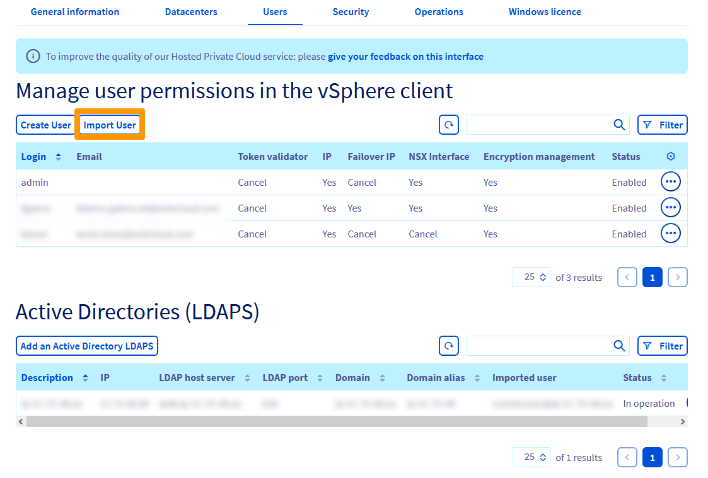
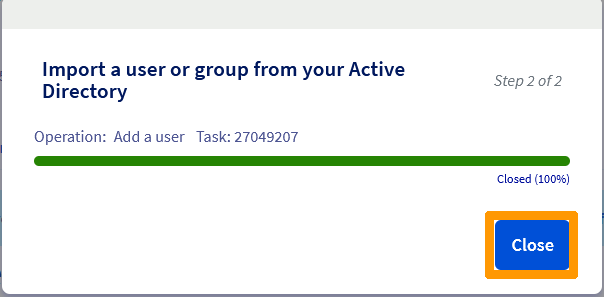
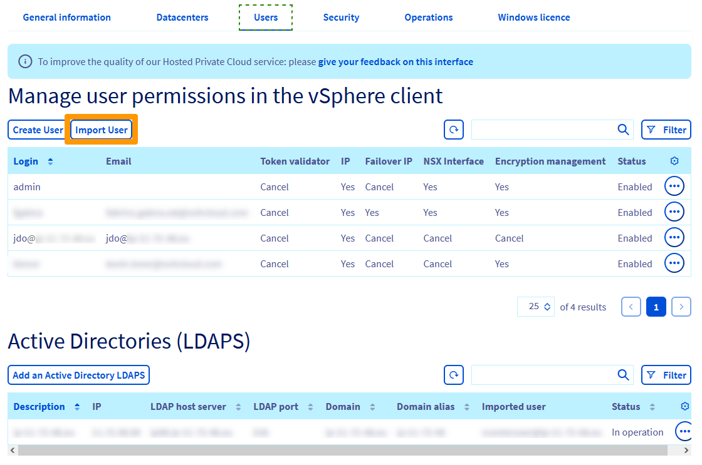

**Last updated 23th November 2022**

## Objective

This guide aims at explaining the details of implementing an Active Directory server as an authentication source on the OVHcloud Hosted Private Cloud.

**Discover how to use your Active Directory server as an authentication source for your vSphere users.**

## Requirements

- A [Hosted Private Cloud offer](https://www.ovhcloud.com/en-gb/enterprise/products/hosted-private-cloud/){.external}.
- An Active Directory service reachable from a public IP address and with a [valid SSL certificate on LDAPS service](https://docs.microsoft.com/en-us/troubleshoot/windows-server/identity/enable-ldap-over-ssl-3rd-certification-authority){.external}.
- A user access on the associated Active Directory with at least read-only access (for LDAPS connection).
- Access to the Hosted Private Cloud vSphere management interface.

## Instructions

### Retrieve needed information

vCenter to Active Directory connection is done using LDAPS protocol exposed by the Active Directory server.

Preparing configuration setup, you need to retrieve the following information:

- Active Directory domain name (FQDN).
- Active Directory domain alias (NetBIOS name).
- Active Directory public IP address.
- Active Directory LDAPS hostname. This is the name used inside the SSL certificate of the LDAPS service, it must resolve to the public IP address of the Active Directory server.
- LDAPS service port (636 by default)
- Base DN (Base Distinguished Name) for users. This is the DN from which users will be searched. For example: cn=Users,dc=example,dc=com
- Base DN (Base Distinguished Name) for groups. This is the DN from which groups will be searched. For example: cn=Groups,dc=example,dc=com
- Username and password of a domain user that will be used to connect to the LDAPS server. It must be at least a read-only user on the Active Directory server sections specified on the two "Base DN" fields above. Must be a pre-Windows 2000 username, in the UPN format (user@eample.com).

For more information, you can refer to the [VMware documentation](https://docs.vmware.com/en/VMware-vSphere/6.7/com.vmware.psc.doc/GUID-98B36135-CDC1-435C-8F27-5E0D0187FF7E.html){.external}.

In addition to the previous information, you will need to retrieve the SSL certificate fingerprint (SHA1 Fingerprint) of the Active Directory LDAPS service.

You can retrieve this information with the method of your choice.

- You can use this PowerShell command on the Active Directory server:

```shell
Get-ChildItem -Path Cert:\LocalMachine\MY | Select-Object -property FriendlyName, Subject, NotBefore, NotAfter, @{label='Thumbprint';'Expression'={$_.thumbprint -replace '(..(?!$))','$1:'}}
```

Here, it is the value on the right side of the colon sign:

```shell
> Thumbprint : XX:XX:XX:XX:XX:XX:XX:XX:XX:XX:XX:XX:XX:XX:XX:XX:XX:XX:XX:XX
```

- You can also use the following OpenSSL command (from a distant Linux/Unix/Mac machine):

```shell
openssl s_client -connect ad.example.com:636 < /dev/null 2>/dev/null | openssl x509 -fingerprint -noout -in /dev/stdin
```

Here, it is the value on the right side of the equal sign:

```shell
> SHA1 Fingerprint=BB:46:CA:6B:FC:92:4E:96:B4:BB:6E:44:7E:8F:AD:4C:C9:32:AB:AB
```

### Allow Active Directory access from the Hosted Private Cloud

Retrieve your Hosted Private Cloud IP address with the method of your choice.

You can use this command on the Active Directory server or any remote Windows machine:

```shell
nslookup fqdn-mypcc
```

Here, it is the value at the end of the last line:

```shell
> Address:  XXX.XXX.XXX.XXX
```

You can alternatively use the following command (from a remote Linux/Unix/Mac machine):

```shell
host fqdn-my-pcc
```

Here, it is the value at the end of the line:

```shell
> fqdn-my-pcc has address XXX.XXX.XXX.XXX
```

Use the retrieved IP address to allow your Hosted Private Cloud to access the Active Directory LDAPS server (by default on TCP port 636).

This operation can be done on your Active Directory server firewall or your company firewall.

Here is a firewall rule configuration example:

|Remote IP address (source)|Local IP address (destination)|Remote port (source)|Local port (destination)|Protocol|
|---|---|---|---|---|
|XXX.XXX.XXX.XXX|All addresses|All ports|636|TCP|

Adapt this configuration to your company and apply that rule on your firewall.

### Add your Active Directory server as an authentication source

From your OVHcloud Control Panel, go to the OVHcloud VMware cluster settings.

Go to the `Users`{.action} tab and click `Add LDAP Active Directory{.action} in the **Active Directories (LDAPs)** section.


Enter this information:

* **Active Directory domain name** : Active directory domain name.
* **Active Directory domain alias**: NETBIOS domain name.
* **Description (optional)** :  Active directory domain name.
* **Active Directory server IP address** : Public IP address to access your LDAPS server.
* **Active Directory LDAPS server host name** : The public FQDN name of your Active Directory server.
* **LDAPS service port*** : The port number of the LDAPS service.
* **SSL certificate thumbprint** : Thumbprint of the SSL certificate retrieved earlier.
* **Active Directory username** : Active directory username followed by @domain-activedirectory.
* **Active Directory user password** : Active Directory user password.
* **DN base for users** : The DN (LDAP syntax) of the folder containing users such as cn=Users,dc=example,dc=com for the domain example.com.
* **DN base for groups** : The DN of the folder containing the groups, such as cn=Users,dc=example,dc=com for the domain example.com.

Then click `Submit`{.action}.


A window will pop up to show progress, wait until you are one hundred percent and click `Close`{.action}.

> [!primary]
>
> If a parameter is not valid, the task will be cancelled before reaching 100%, in this case wait a few minutes for the cancellation to be complete before relaunching the configuration.
>


Your Active Directory domain is linked to your VMware cluster. You can now add users and groups from your Active Directory to connect to your VMware cluster.


### Authorise an Active Directory user to access your Hosted Private Cloud

Now that your VMware cluster is connected to your active directory, you can add users from that directory to connect to your VMware cluster.

Click `Import User`{.action}



Select your Active Directory, click 'Import User`{.action}, enter your UPN `username@nomdedomaineactivedirectory` and click `Next`{.action}.


A task status window appears, wait until you are one hundred percent and click `Close`{.action}.



A new user will appear in the Control Panel. You can use this user to log in to your VMware cluster.

> [!primary]
>
> By default, the user does not have any permission on your Hosted Private Cloud. They can connect to your Hosted Private Cloud, but will not have any access. You can adjust permissions from the OVHcloud Control Panel.
>


### Autoriser un groupe Active Directory à accéder à votre Hosted Private Cloud

You can authorise a group of users directly from your Active Directory server to access your Hosted Private Cloud through the OVHcloud Control Panel.

Cliquez sur `Importer un utilisateur`{.action}.



Select your Active Directory, click 'Import Group`{.action}, type the `name of your group' and click 'Next`{.action}.


A task status window appears, wait until you are one hundred percent and click 'Close`{.action}.Select your Active Directory, click 'Import Group`{.action}, type your group name and click 'Next`{.action}.


The group will appear in the list of users for your VMware cluster. Members of this group will be able to log in to your VMware cluster.

> [!primary]
>
> By default, group members do not have any permissions on your Hosted Private Cloud. They can connect to your Hosted Private Cloud, but will not have any access. You can adjust permissions from the OVHcloud Control Panel.
>


## Go further

Échangez avec notre communauté d’utilisateurs sur <https://community.ovh.com/>.
