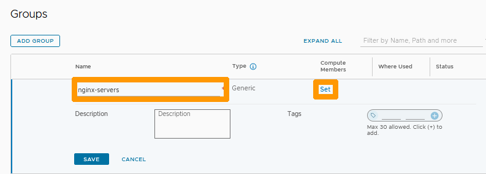
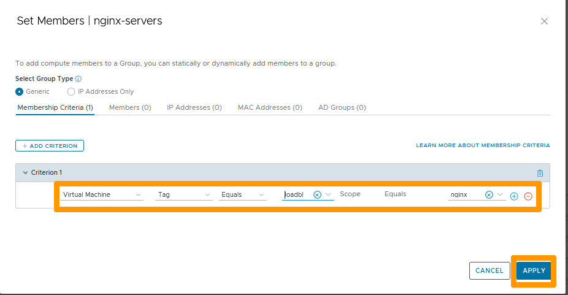
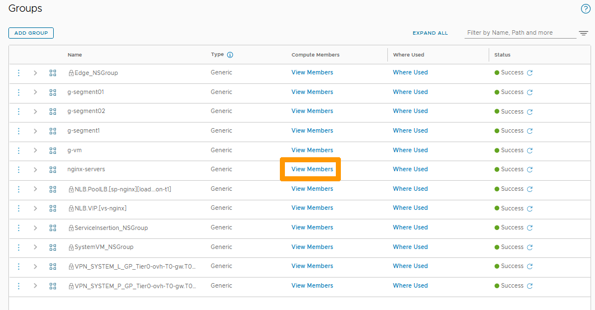
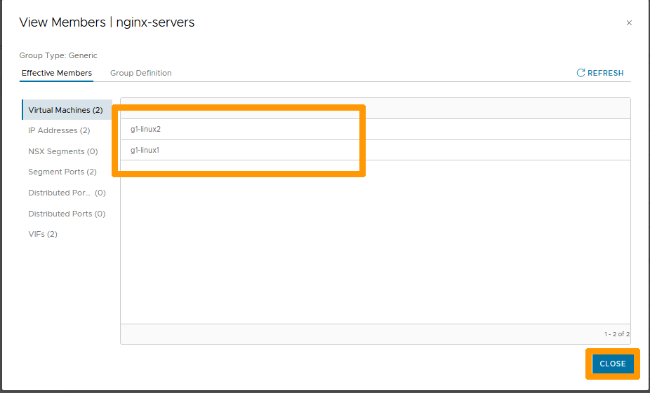
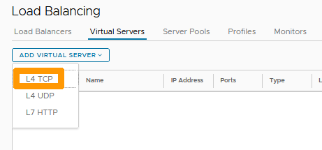

**Dernière mise à jour le 27/02/2023**

## Objectif

NSX permet l'équilibrage de charge (*Load Balancing*) sur une couche de niveau 4 (TCP ou UDP) ou de Niveau 7 (HTTP ou HTTPS).

**Découvrez comment mettre en place le Load Balancing dans NSX avec des serveurs web NGINX.**

> [!warning]
> OVHcloud vous met à disposition des services dont la configuration, la gestion et la responsabilité vous incombent. Il vous appartient donc de ce fait d’en assurer le bon fonctionnement.
>
> Ce guide a pour but de vous accompagner au mieux sur des tâches courantes. Néanmoins, nous vous recommandons de faire appel à un [prestataire spécialisé](https://partner.ovhcloud.com/fr/) si vous éprouvez des difficultés ou des doutes concernant l’administration, l’utilisation ou la mise en place d’un service sur un serveur.
>

## Prérequis

- Être contact administrateur de l'infrastructure [Hosted Private Cloud powered by VMware](https://www.ovhcloud.com/fr-ca/enterprise/products/hosted-private-cloud/), celui-ci recevant les identifiants de connexion.
- Avoir un identifiant utilisateur actif avec les droits spécifiques pour NSX (créé dans l'[espace client OVHcloud](https://ca.ovh.com/auth/?action=gotomanager&from=https://www.ovh.com/ca/fr/&ovhSubsidiary=qc))
- Avoir **NSX** déployé avec deux segments configurés dans votre configuration NSX. Vous pouvez vous aider de notre guide sur la [gestion des segments dans NSX](https://docs.ovh.com/ca/fr/private-cloud/nsx-segment-management).
- Avoir deux machines virtuelles avec le service NGINX activé en HTTP sur un segment.

## En pratique

Nous allons :

- activer le Load Balancing sur la passerelle **ovh-T1-gw** ;
- créer un pool de serveurs à partir de deux machines virtuelles qui utilisent un serveur web en HTTP actif sur le port 80 ;
- ajouter un serveur virtuel dans la configuration du Load Balancer qui contient notre pool de serveurs ;
- définir une règle de NAT pour faire une redirection vers le serveur virtuel.

### Création du marqueur (tag) sur les deux machines virtuelles.

Pour simplifier l'administration du Load Balancer, nous allons utiliser un marqueur (tag) sur les deux machines virtuelles du futur pool de serveurs.

Dans l'interface NSX, allez dans l'onglet `Inventory`{.action} et cliquez sur `Virtual Machines`{.action} à gauche.  

Cliquez ensuite sur les `trois points verticaux`{.action} à gauche de la première machine virtuelle et choisissez `Edit`{.action} dans le menu.

{.thumbnail}

Remplacez **Tag** par `loadbl`{.action} puis cliquez sur `Add Item(s) loadbl`{.action} en dessous.

{.thumbnail}

Remplacez **Scope** par `nginx`{.action}, puis cliquez sur `Add Item(s) nginx`{.action} en dessous.

{.thumbnail}

Cliquez sur le signe `+`{.action} à coté de votre marqueur pour le rajouter à votre machine virtuelle.

{.thumbnail}

Le marqueur apparaît, cliquez sur `SAVE`{.action}.

{.thumbnail}

Cliquez sur les `trois points verticaux`{.action} à gauche de la deuxième machine virtuelle et choisissez `Edit`{.action} dans le menu.

{.thumbnail}

Remplacez **Tag** par `load`{.action} et sélectionnez le marqueur `Tag: loadbl Scope: nginx`{.action} qui vient de s'afficher en dessous.

{.thumbnail}

Cliquez sur le signe `+`{.action} à coté de votre marqueur pour le rajouter à votre deuxième machine virtuelle.

{.thumbnail}

Cliquez sur `SAVE`{.action} pour ajouter le marqueur à votre machine virtuelle.

{.thumbnail}

Restez sur **Inventory**, cliquez sur `Tags`{.action} et cliquez sur le `numéro`{.action} à droite du marqueur créé.

{.thumbnail}

Vous pouvez voir vos deux machines virtuelles qui utilisent le même marqueur.

{.thumbnail}

### Ajout du groupe avec le marqueur créé

Choisissez à gauche `Groups`{.action} et cliquez sur `ADD GROUP`{.action}.

{.thumbnail}

Saisissez `nginx-server`{.action} en dessous de **Name** et cliquez sur `SET`{.action} sous **Compute Members**.

{.thumbnail}

Cliquez sur `+ ADD CRITERION`{.action}.

{.thumbnail}

Gardez **Virtual Machine Tag Equals** et sélectionnez votre marqueur `loadbl`{.action}, accompagné de son étendue `nginx`{.action} et cliquez sur `APPLY`{.action}.

{.thumbnail}

Cliquez sur `SAVE`{.action}.

{.thumbnail}

Cliquez sur `View Members`{.action} à droite du groupe.

{.thumbnail}

La liste des machines virtuelles est automatiquement rajoutée au groupe à partir du critère sur votre marqueur.

{.thumbnail}

### Activation du Load Balancer

Allez dans l'onglet `Networking`{.action} et cliquez sur `Load Balancing`{.action} dans la rubrique **Network Services** à gauche.  

Positionnez-vous ensuite sur l'onglet `Load Balancers`{.action} et cliquez sur `ADD LOAD BALANCER`{.action}.

{.thumbnail}

Saisissez `loadbalancer-on-t1`{.action} en dessous de **Name**, sélectionnez sur `ovh-T1-gw`{.action} sous **Attachment** et cliquez sur `SAVE`{.action}.

{.thumbnail}

Cliquez sur `NO`{.action}.

{.thumbnail}

Le Load balancer est créé et actif sur la passerelle **ovh-T1-gw**.

{.thumbnail}

### Création du pool de serveurs

Positionnez-vous sur l'onglet `Server Pools`{.action} et cliquez sur `ADD SERVER POOL`{.action}.

{.thumbnail}

Saisissez `sp-nginx`{.action} en dessous de **Name** et cliquez sur `Select Members`{.action} sous **Members/Group**.

{.thumbnail}

Cliquez sur `Select a group`{.action} et choisissez le groupe `nginx-servers`{.action} que vous avez créé, puis cliquez sur `APPLY`{.action}.

{.thumbnail}

Cliquez sur `SAVE`{.action} pour appliquer vos changements.

{.thumbnail}

Votre pool de serveur est créé avec vos deux machines virtuelles membres du groupe.

{.thumbnail}

### Création du serveur virtuel

Allez sur l'onglet `Virtual Servers`{.action} et cliquez sur `ADD VIRTUAL SERVER`{.action}.

{.thumbnail}

Sélectionnez `L4 TCP`{.action}.

{.thumbnail}

Renseignez les informations suivantes :

- **Name** : nom de votre virtual server `vs-nginx`.
- **IP Address**: adresse IP en frontal de votre serveur virtuel sur le même réseau que vos machines virtuelles NGINX `192.168.102.3`.
- **Port** : Port `80`.
- **Load Balancer**: votre load balancer `loadbalancer-on-t1`.
- **Server Pool**: votre pool de serveur `sp-nginx`.

Cliquez ensuite sur `SAVE`{.action}.

{.thumbnail}

Votre serveur virtuel est actif si vous vous connectez depuis une machine qui utilise un segment sur une passerelle de type **Tier-1 Gateways** avec cette URL `http://192.168.102.3`. Le Load Balancer se connectera à l'une des deux machines virtuelles configurées dans votre groupe.

### Ajout de la règle de NAT

Allez sur `NAT`{.action} dans la rubrique **Network Services** à gauche et cliquez sur `ADD NAT RULE`{.action}.

{.thumbnail}

Saisissez `to-lb-virtual-server`{.action} dans le champ **Name** de votre règle et renseignez les options suivantes :

- **Action** : `DNAT`{.action}.
- **Destination IP** : adresse IP virtuelle de votre T0, telle que `198.51.100.1`.
- **Translated IP** : adresse IP de votre serveur virtuel, telle que `192.168.102.103`.
- **Service PORT** : choisissez le port prédéfini `HTTP| 80`{.action}.

Cliquez ensuite sur `SAVE`{.action}.

{.thumbnail}

Votre règle est désormais active. Si vous cliquez sur `http://adresse-ip-virtuelle-t0`, vous serez connecté à votre serveur virtuel qui redirigera le flux sur l'un des serveurs de votre groupe.

{.thumbnail}

## Aller plus loin

[Premiers pas avec NSX](https://docs.ovh.com/ca/fr/private-cloud/nsx-first-steps/)

[Gestion des segments dans NSX](https://docs.ovh.com/ca/fr/private-cloud/nsx-segment-management/)

[Mise en place du NAT pour des redirections de ports dans NSX](https://docs.ovh.com/ca/fr/private-cloud/nsx-configure-nat-redirection)

[Documentation VMware sur les Load Balancers NSX](https://docs.vmware.com/fr/VMware-NSX-T-Data-Center/3.2/administration/GUID-D39660D9-278B-4D08-89DF-B42C5400FEB2.html)

Échangez avec notre communauté d'utilisateurs sur <https://community.ovh.com>.

