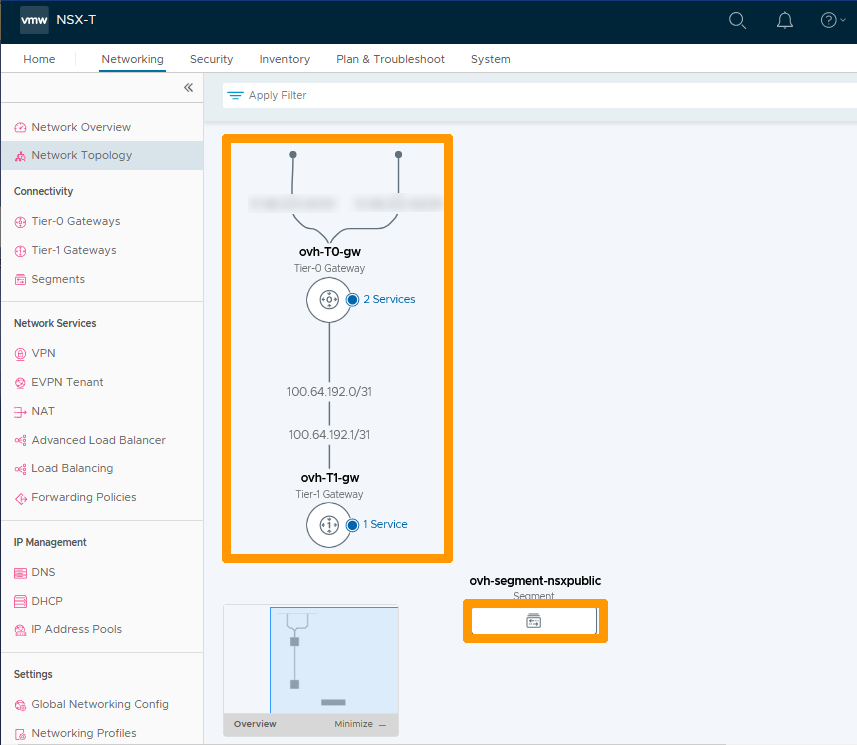
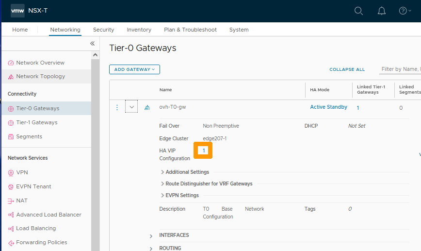

**Dernière mise à jour le 06/02/2023**

> [!warning]
> Les guides concernant NSX-T dans la solution VMware ne sont pas définitifs, ils seront modifiés lors de la sortie en version BETA et finalisés quand la version définitive sera prête. 
>

## Objectif

**Ce guide est une introduction à NSX-T dans un cluster Hosted Private Cloud by VMware**

> [!warning]
> OVHcloud vous met à disposition des services dont la configuration, la gestion et la responsabilité vous incombent. Il vous appartient donc de ce fait d’en assurer le bon fonctionnement.
>
> Ce guide a pour but de vous accompagner au mieux sur des tâches courantes. Néanmoins, nous vous recommandons de faire appel à un [prestataire spécialisé](https://partner.ovhcloud.com/fr/) si vous éprouvez des difficultés ou des doutes concernant l’administration, l’utilisation ou la mise en place d’un service sur un serveur.
>

## Présentation

NSX-T est une solution de gestion de réseau logicielle **Sofware Defined networking (SDN)** fournie par VMware. OVHcloud propose ce service en remplacement de NSX-V dans son offre Hosted Private Cloud Powered by VMware. Deux hôtes sont déployés avec sur chacun une machine virtuelle dédiée à NSX-T ce qui permet une redondance en cas de défaillance d'un des hôtes.

Lorsqu'un client souscrit à l'offre NSX-T et quelle est activée une pré-configuration est appliquée avec deux passerelles :

* **Tier-0 Gateway** : Pour les connexions entre le cluster et le réseau physique (VLAN et Internet), que l'on nomme trafic nord-sud.
* **Tier-1 Gateway** : Pour les communications entre segments virtuels (overlays) du cluster. Ce type de connexion s'appelle trafic est-ouest.

Les deux passerelles sont reliées entre elles afin d'autoriser les réseaux internes à communiquer à l'extérieur du cluster.

OVHcloud fourni un bloc de 8 adresses IP publiques, certaines sont réservées. L'adresse **HA VIP** est préconfigurée, elle est utilisée pour le SNAT par défaut sur les futurs segments internes.

## Prérequis

- Être contact administrateur du [Hosted Private Cloud infrastructure](https://www.ovhcloud.com/fr/enterprise/products/hosted-private-cloud/), celui-ci recevant les identifiants de connexion.
- Avoir un identifiant utilisateur actif avec les droits spécifiques pour NSX-T (créé dans l'[espace client OVHcloud](https://www.ovh.com/auth/?action=gotomanager&from=https://www.ovh.com/fr/&ovhSubsidiary=fr))

## En pratique

### Connexion à l'interface d'administration de NSX-T

La connexion à NSX-T se fait à partir de l'URL de votre cluster fourni par OVHcloud de la forme **https://pcc-xxxxx.ovh.xx**.

A partir de la page d'accueil de votre cluster cliquez sur l'icône `NSX NSX-T`{.action}.

{.thumbnail}

Saisissez vos informations d'identifications et cliquez sur `LOG IN`{.action}.

> [!warning]
> Pour s'authentifier sur l'interface NSX-T, il faut utiliser un compte fourni par OVHcloud suivi du nom FQDN de votre cluster comme **admin@pcc-xxxxx.ovh.xx**. 
>

{.thumbnail}

L'interface NSX-T s'affiche.

{.thumbnail}

### Affichage de la configuration par défaut

Nous allons voir la topologie du réseau configurée par défaut lors du déploiement du service **NSX-T**.

Au travers de l'interface **NSX-T** cliquez sur l'onglet `Networking`{.action}.

{.thumbnail}

Une vue de l'ensemble des éléments du réseau est affichée.

Cliquez à gauche sur `Network Topology`{.action}.

{.thumbnail}

Le schéma ci-dessous représente la topologie réseau avec ces informations :

- Les deux interfaces physiques qui permettent une redondance de l'accès Internet en cas de défaillance (Ces deux interfaces utilisent des adresses IP publiques qui ne sont pas utilisables pour la configuration client).
- La passerelle Nord-Sud (**ovh-t0-gw**) qui assure la liaison entre Le réseau physique (Internet et VLAN sur vRack) et les réseaux internes (Overlays) de votre cluster.
- La liaison entre les passerelles **ovh-t0-gw** et **ovh-t1-gw** qui se fait au travers d'adresses IP réservées à cet usage.
- La passerelle Est-Ouest (**ovh-t1-gw**) qui gère les communications entre les réseaux internes (segments de type overlay) du cluster.
- **ovh-segment-nsxpublic** qui est un segment réseau connecté au réseau public OVHcloud sur un VLAN, il contient le réseau des adresses publiques utilisables pour les configurations clients. Cliquez sur le `Rectangle`{.action} en dessous pour afficher ce segment. Vous trouverez plus d'informations concernant les segments dans ce guide [Gestion des segments dans NSX-T](https://docs.ovh.com/fr/private-cloud/nsx-t-segment-management)

{.thumbnail}

Ce segment contient deux informations :

* L'adresse IP publique virtuelle **HA VIP**.
* Le numéro VLAN utilisé sur votre réseau public de votre cluster vSphere.

Les connexions au travers de VLAN n'apparaissent pas dans la topologie réseau de NSX-T, vous pouvez voir le rajout sur le diagramme qui montre la connexion entre le segment ovh-segment-nspublic et la passerelle ovh-T0-gw au travers des deux interfaces par défaut.

{.thumbnail}

### Affichage de l'adresse IP virtuelle **HA VIP**

Nous allons voir comment afficher les adresses IP virtuelles attachées à la passerelle **ovh-t0-gw**.

Une seule adresse IP virtuelle est affectée lors de la livraison de NSX-T, elle sert pour le SNAT sur les segments attachés à la passerelle **ovh-t0-gw**.

> ![Primary]
> Pour l'instant il n'est pas possible de créer de nouvelles adresses IP virtuelles, mais cette fonctionnalité devrait être bientôt disponible.
> 

Restez sur l'onglet `Networking`{.action} et cliquez à gauche sur `Tier-0 Gateways`{.action} dans la catégorie **Connectivity**.

{.thumbnail}

Cliquez sur le bouton de déroulement `>`{.action} à gauche de **Name** pour afficher la configuration.

{.thumbnail}

Cliquez sur le `Numéro`{.action} à droite de **HA VIP Configuration**.

{.thumbnail}

Vous voyez l'adresse IP virtuelle publique qui est utilisable dans vos configurations **NSX-T**, cliquez sur `Close`{.action} pour fermer cette fenêtre.

{.thumbnail}

### Information sur la configuration par défaut du NAT

Une configuration SNAT par défaut est appliquée, ce qui permet l'accès Internet à partir de tous les réseaux connectés à la passerelle **ovh-T0-gw**, ceux qui sont reliés au travers de segment de type VLAN et ceux qui sont en overlay à partir de la passerelle **ovh-T1-gw**.

A partir de l'onglet `Networking`{.action} cliquez sur `NAT`{.action} pour afficher la configuration par défaut des règles de NAT.

La règle par défaut pour le **SNAT** montre que l'on utilise l'adresse IP virtuelle pour faire la translation pour tous les réseaux.

{.thumbnail}

Vous venez de voir la configuration par défaut. Vous pouvez consultez les autres guides OVHcloud concernant NSX-T pour créer des segments, gérer le DHCP, faire de la redirection de port en DNAT, du Load balancing, du VPN, etc...

## Aller plus loin

[Gestion des segments dans NSX-T](https://docs.ovh.com/fr/private-cloud/nsx-t-segment-management)

Échangez avec notre communauté d'utilisateurs sur <https://community.ovh.com>.
