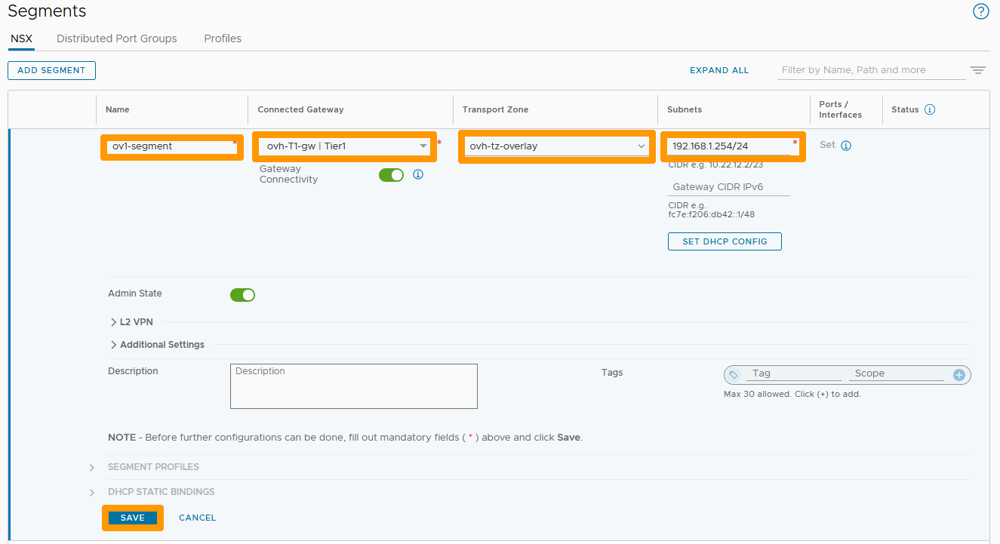

**Dernière mise à jour le 12/12/2022**

> [!warning]
> Les guides concernant NSX-T dans la solution VMware ne sont pas définitifs, ils seront modifiés lors de la sortie en version BETA et finalisés quand la version définitive sera prête. 
>

## Objectif

**Découvrir la création et l'utilisation des segment dans l'interface NSX-T et vCenter**

> [!warning]
> OVHcloud vous met à disposition des services dont la configuration, la gestion et la responsabilité vous incombent. Il vous appartient donc de ce fait d’en assurer le bon fonctionnement.
>
> Ce guide a pour but de vous accompagner au mieux sur des tâches courantes. Néanmoins, nous vous recommandons de faire appel à un prestataire spécialisé si vous éprouvez des difficultés ou des doutes concernant l’administration, l’utilisation ou la mise en place d’un service sur un serveur.
>

## Prérequis

- Être contact administrateur du [Hosted Private Cloud infrastructure](https://www.ovhcloud.com/fr/enterprise/products/hosted-private-cloud/), celui-ci recevant les identifiants de connexion.
- Avoir un identifiant utilisateur actif avec les droits spécifiques pour NSX-T (créé dans l'[espace client OVHcloud](https://www.ovh.com/auth/?action=gotomanager&from=https://www.ovh.com/fr/&ovhSubsidiary=fr))
- Être connecté à votre interface vCenter.
- Avoir **NSX-T** déployé.

## Présentation

Dans une solution NSX-T un segment est un domaine de niveau 2 virtuel (nommé précemment logical switch) il peut être de deux types :

- **VLAN-backed segments** : la communication entre les hôtes et les VM doit se faire au travers de VLANs et d'un switch de niveau 2.
- **Overlay-backed segments** : la connexion se fait à l'aide d'une surcouche logicielle entre les hotes et les VM.

Les segments sont liés à des zones de transports qui sont prédéfinies par OVHcloud. 

Les segments peuvent être reliés à **ovh-T1-gw** dans ce cas il faut créer un réseau avec une passerelle afin de permettre un trafic sortant au dela de ce segment, soit avec un autre segment soit avec l'extérieur du cluster.

## En pratiques

### Création d'un segment dans l'interface NSX-T.

Nous allons créer un segment *Overlay-backed segment* relié à **Tier-1 Gateway** dans un sous réseau en 192.168.1.0/24. La passerelle aura l'adresse 192.168.1.254.

A partir de l'interface NSX-T allez dans l'onglet `Networking`{.action}.

Cliquez à gauche sur `Segments`{.action}.

Cliquez à droite sur `ADD SEGMENT`{.action}.

Choisissez ces informations :

* **Name** : Nom de votre segment.
* **Connected Gateway** : gateway prédefinie ovh-T1-gw | Tier1.
* **Transport Zone** : zone prédéfinie ovh-tz-overlay.
* **Subnet** : Adresse la passerelle sur segment avec l'étendue comme 192.168.1.254/24.

Ensuite cliquez à droite sur `SAVE`{.action}.

Cliquez sur `NO`{.action}.

Le nouveau segment apparait dans la liste.

Toujours dans l'onglet `Networking` cliquez à gauche sur `Network Topology`{.action} pour voir le nouveau segment et son emplacement dans le réseau. 

### Connexion d'une machine virtuelle à ce segment.

Allez dans l'interface vCenter de votre cluster Hosted Private Cloud.

Faites un clic droit sur la `machine virtuelle`{.action} et cliquez sur `Modifier les paramètres`{.action}.

Allez dans la barre de défilement à droite de votre adaptateur réseau et choisissez `Parcourir`{.action}.

Sélectionnez le `réseau`{.action} qui porte le nom de votre segment. et cliquez sur `OK`{.action}.

Cliquez sur `OK`{.action}.

Maintenant que votre machine virtuelle est connectée au segment revenez sur l'interface NSX-T.

Allez dans l'onglet `Networking`{.action} choisissez `Network Topology`{.action}.

La machine virtuelle associée au réseau apparait dans la topologie du réseau.

Aidez-vous de la première partie du guide pour créer un deuxième segment nommé ov2-segment avec ces paramètres **192.168.2.254/24** afin d'avoir deux segments :

* **ov1-segment** sur le sous-réseau **192.168.1.0/24**
* **ov2-segment** dans le sous réseau **192.168.2.0/24**

Ensuite à partir de la console **vCenter**, mettez deux machines virtuelles sur le premier segment et deux autres sur le deuxième segment.

Revenez sur l'interface NSX-T dans `Network Topology`{.action} pour faire apparaitre la nouvelle configuration réseau.

Les deux segments sont reliés à la passerelle **ovh-T1-gw**, le routage entre les deux sous-réseaux est activé sans aucunes restrictions réseaux par défaut.

## Aller plus loin

Échangez avec notre communauté d'utilisateurs sur <https://community.ovh.com>.

