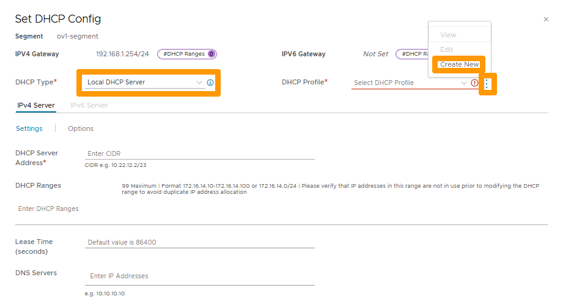
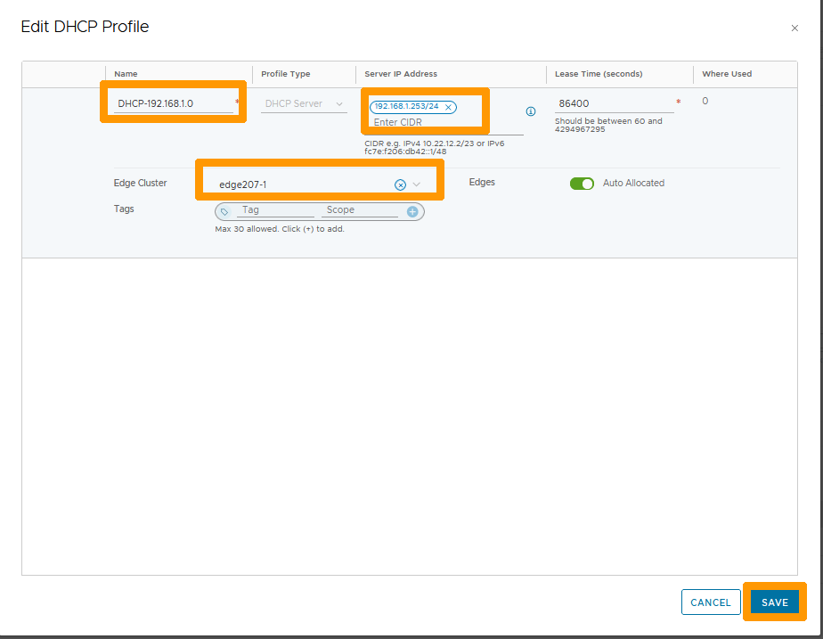

**Last updated 03rd February 2023**

> [!warning]
> Guides for **NSX-T** in the VMware solution are not final, they will be modified when the BETA version is released and finalised when the final version is ready.
>

## Objectif

**How to Configure a DHCP Server in a Segment**

> [!warning]
> OVHcloud provides services for which you are responsible, with regard to their configuration and management. It is therefore your responsibility to ensure that they work properly.
>
> This guide is designed to assist you as much as possible with common tasks. Nevertheless, we recommend contacting a specialist provider if you experience any difficulties or doubts when it comes to managing, using or setting up a service on a server.
>

## Prérequis

- Being an administrative contact of your [Hosted Private Cloud infrastructure](https://www.ovhcloud.com/en-gb/enterprise/products/hosted-private-cloud/) to receive login credentials
- A user account with access to the [OVHcloud Control Panel](https://www.ovh.com/auth/?action=gotomanager&from=https://www.ovh.co.uk/&ovhSubsidiary=GB)
- You need to have **NSX-T** deployed with a segment configured in your NSX-T configuration. Use this guide [Segment management in NSX-T](https://docs.ovh.com/en/us/private-cloud/nsx-t-segment-management).

## Instructions

We will configure a DHCP server on a segment connected to **OVH-T1-gw**. This segment is configured with a gateway in **192.168.1.254/24**.

From the NSX-T interface go to the `Networking`{.action} tab and click on `Segments`{.action} on the left.

{.thumbnail}

Click the specified configuration icon with `three vertical dots`{.action} to the left of your segment and choose `Edit`{.action}.

{.thumbnail}

Click `Set DHCP CONFIG`{.action}.

{.thumbnail}

Select `Local DHCP Server`{.action} on the left in **DHCP Type**. Then click the configuration icon with `three vertical dots`{.action} to the right of **DHCP Profile** and choose `Create New`{.action}.

{.thumbnail}

Choose this information :

* **Name** : Name of your DHCP server.
* **Server IP Address** : The IP address of your DHCP server, which must not be the same as your gateway IP address in this form 192.168.1.253/24.
* **Edge Cluster** : Select your cluster edge.

And click `Save`{.action}.

{.thumbnail}

Enter these values:

* **DHCP Server Address**: DHCP server address 192.168.1.253/24 (This must be the same address as in the DHCP profile).
* **DHCP Range**: Scope of your DHCP server with the beginning and ending address separated by a dash 192.168.1.10-192.168.1.200.
* **DNS Server**: OVHcloud DNS Server 213.186.33.99.

Then click `APPLY`{.action}.

{.thumbnail}

Virtual machines on this segment can now be configured with DHCP.

## Go further 

[Getting started with NSX-T](https://docs.ovh.com/us/en/private-cloud/nsx-t-first-steps/)

[Segment management in NSX-T](https://docs.ovh.com/us/en/nsx-t-segment-management/)

Join our community of users on <https://community.ovh.com/en/>.

