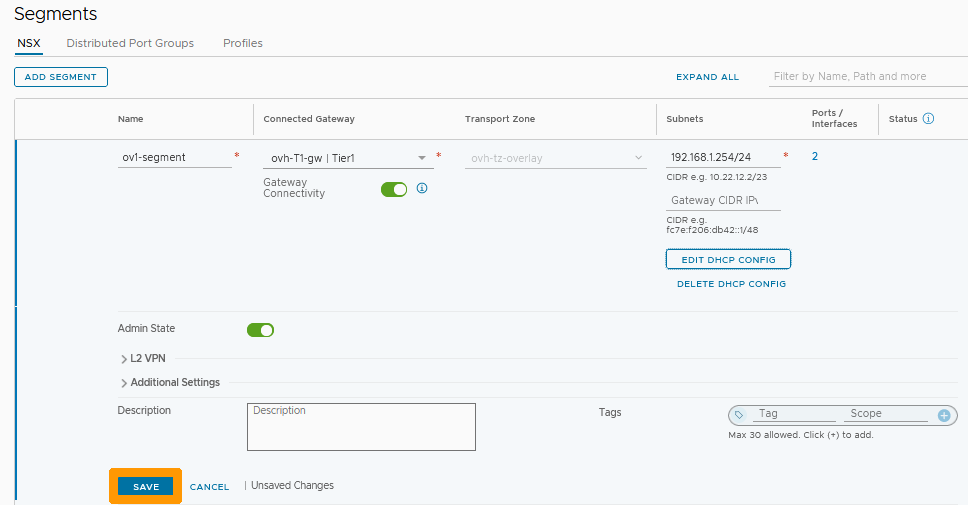

**Last updated 08th February 2023**

> [!warning]
> Guides for **NSX-T** in the VMware solution are not final, they will be modified when the BETA version is released and finalised when the final version is ready.
>

## Objectif

**How to Configure a DNS Redirector**

> [!warning]
> OVHcloud provides services for which you are responsible, with regard to their configuration and management. It is therefore your responsibility to ensure that they work properly.
>
> This guide is designed to assist you as much as possible with common tasks. However, we recommend contacting a [specialist provider](https://partner.ovhcloud.com/en-gb/) if you experience any difficulties or doubts when it comes to managing, using or setting up a service on a server.
>

## Requirements

- Being an administrative contact of your [Hosted Private Cloud infrastructure](https://www.ovhcloud.com/en-gb/enterprise/products/hosted-private-cloud/) to receive login credentials
- A user account with access to the [OVHcloud Control Panel](https://www.ovh.com/auth/?action=gotomanager&from=https://www.ovh.co.uk/&ovhSubsidiary=GB)
- You need to have **NSX-T** deployed with a segment configured in your NSX-T configuration. Use this guide [Segment management in NSX-T](https://docs.ovh.com/en/us/private-cloud/nsx-t-segment-management).

## Overview

You can use a DNS forwarder in NSX-T that centralises all DNS queries and redirects them to external DNS servers, which reduces network traffic. You can attach the DNS forwarder to the north-south gateway (ovh-t0-gw) or the east-west gateway (ovh-t1-gw), depending on your needs.

## Instructions

We will create a DNS redirector and attach it to the north-south gateway (ovh-t0-gw), it will be usable on all segments of NSX-T.

### DNS forwarder configuration

Through the NSX-T interface go to the `Networking`{.action} tab and click on `DNS`{.action} on the left in the **IP Management** section. Then click `ADD DNS SERVICE`{.action}.

{.thumbnail}

Enter this information :

* **Name** : Your service name is dns-forwarder. `dns-forwarder`.
* **Tier-0/Tier-1 Gateway** : Your North-South gateway `ovh-T0-gw`.
* **DNS Service IP** : Private IP address not used in your segments like `192.168.200.1`.

Next, click the `Vertical Hover Points`{.action} below **Default DNS Zone**.

{.thumbnail}

Click `Add New Default Zone`{.action}.

{.thumbnail}

Fill in these values :

* **Name** : The name of the zone, such as `cdns.ovh.net`.
* **DNS Servers** : OVHcloud DNS server `213.186.33.99`.

Then click `SAVE`{.action}.

{.thumbnail}

Click `SAVE`{.action}.

{.thumbnail}

Your DNS forwarder is active and usable on all your overlay or VLAN segments connected to your north-south gateway (ovh-t0-gw).

{.thumbnail}

### Editing the DHCP server to use a DNS forwarder

If you have configured DHCP servers in NSX-T as described in this guide [Configuring DHCP](https://docs.ovh.com/gb/en/nsx-t-dhcp-configuration), you have the option to modify the configuration to use the DNS forwarder in your DHCP configurations.

We will see how to modify the DNS server on the DHCP configuration of one of your segments.

Stay on the `Networking`{.action} tab and click `Segments`{.action} on the left in the **Connectivity** section. 

Then click on the `vertical suspension points`{.action} next to your segment and choose `Edit`{.action} from the menu.

{.thumbnail}

Click `EDIT DHCP CONFIG`{.action}.

{.thumbnail}

Click the `X`{.action} to the right of the existing DNS in the **DNS Servers** option to remove it from the configuration.

{.thumbnail}

Add your DNS redirector IP address in **DNS Servers** as `192.168.200.1`{.action} and click `APPLY`{.action}.

{.thumbnail}

Click `SAVE`{.action}.

{.thumbnail}

Click `CLOSE EDITING`{.action}.

{.thumbnail}

The DHCP server is configured to use the NSX-T Redirector.

## Go further 

[Getting started with NSX-T](https://docs.ovh.com/gb/en/private-cloud/nsx-t-first-steps/)

[Segment management in NSX-T](https://docs.ovh.com/gb/en/nsx-t-segment-management/)

[DHCP Configuration](https://docs.ovh.com/gb/en/nsx-t-dhcp-configuration)

[VMware NSX-T 3.2 and DNS information](https://docs.vmware.com/en/VMware-NSX-T-Data-Center/3.2/administration/GUID-A0172881-BB25-4992-A499-14F9BE3BE7F2.html)

Join our community of users on <https://community.ovh.com/en/>.

