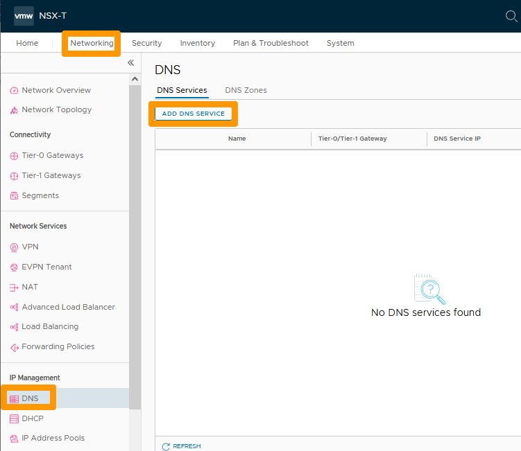
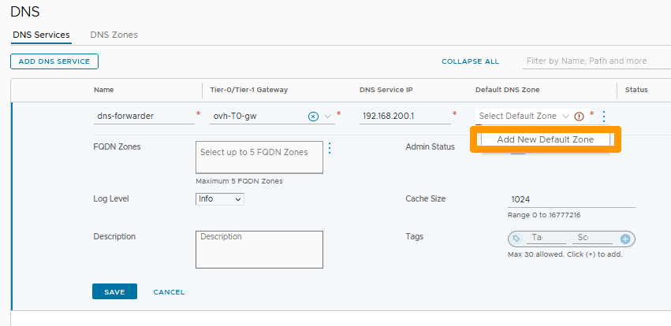
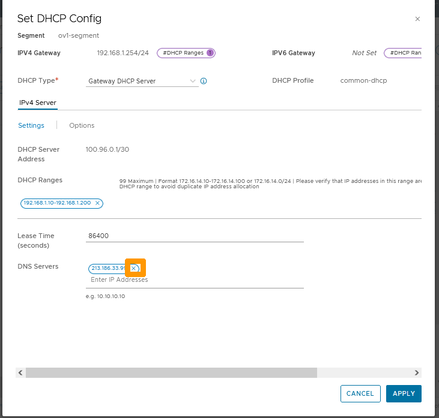
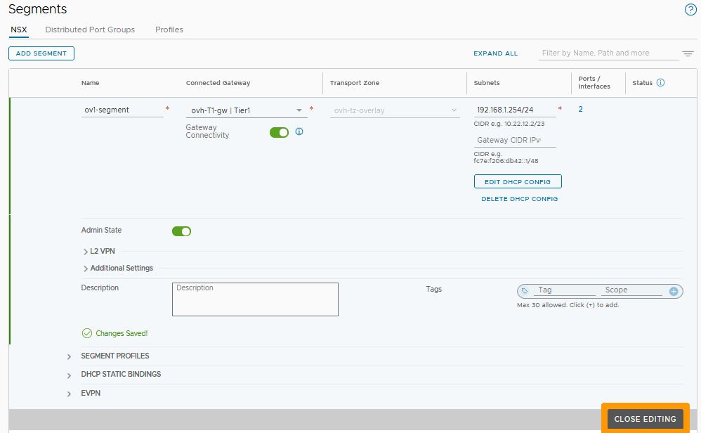

**Last updated 08th February 2023**

> [!warning]
> Guides for **NSX-T** in the VMware solution are not final, they will be modified when the BETA version is released and finalised when the final version is ready.
>

## Objectif

**How to Configure a DNS Redirector**

> [!warning]
> OVHcloud provides services for which you are responsible, with regard to their configuration and management. It is therefore your responsibility to ensure that they work properly.
>
> This guide is designed to assist you as much as possible with common tasks. However, we recommend contacting a [specialist provider](https://partner.ovhcloud.com/en-gb/) if you experience any difficulties or doubts when it comes to managing, using or setting up a service on a server.
>

## Requirements

- Being an administrative contact of your [Hosted Private Cloud infrastructure](https://www.ovhcloud.com/en-gb/enterprise/products/hosted-private-cloud/) to receive login credentials
- A user account with access to the [OVHcloud Control Panel](https://www.ovh.com/auth/?action=gotomanager&from=https://www.ovh.co.uk/&ovhSubsidiary=GB)
- You need to have **NSX-T** deployed with a segment configured in your NSX-T configuration. Use this guide [Segment management in NSX-T](https://docs.ovh.com/en/us/private-cloud/nsx-t-segment-management).

## Overview

You can use a DNS forwarder in NSX-T that centralises all DNS queries and redirects them to external DNS servers, which reduces network traffic. You can attach the DNS forwarder to the north-south gateway (ovh-t0-gw) or the east-west gateway (ovh-t1-gw), depending on your needs.

## Instructions

Nous allons créer un redirecteur DNS et l'attacher à la passerelle nord-sud (ovh-t0-gw), il sera utilisable sur l'ensemble des segments de NSX-T.

### Configuration du redirecteur DNS

Au travers de l'interface NSX-T allez dans l'onglet `Networking`{.action} et cliquez sur `DNS`{.action} à gauche dans la rubrique **IP Management**. Ensuite cliquez sur `ADD DNS SERVICE`{.action}.

{.thumbnail}

Renseignez ces informations :

* **Name** : Nom de votre service comme `dns-forwarder`.
* **Tier-0/Tier-1 Gateway** : Choisissez la passerelle Nord-Sud `ovh-T0-gw`.
* **DNS Service IP** : Saisissez une adresse IP privée non utilisé dans vos segments comme `192.168.200.1`.

Ensuite cliquez sur les `Points de suspensions verticaux`{.action} en dessous de **Default DNS Zone**.

{.thumbnail}

Cliquez sur `Add New Default Zone`{.action}.

{.thumbnail}

Remplissez ces valeurs :

* **Name** : Nom de la zone comme `cdns.ovh.net`.
* **DNS Servers** : Serveur DNS OVHcloud `213.186.33.99`.

Ensuite cliquez sur `SAVE`{.action}.

{.thumbnail}

Cliquez sur `SAVE`{.action}.

{.thumbnail}

Votre redirecteur DNS est actif et utilisable sur tous vos segments en Overlay ou VLAN connectés à votre passerelle nord-sud (ovh-t0-gw).

{.thumbnail}

### Modification du serveur DHCP pour utiliser un redirecteur DNS

Si vous avez configuré des serveurs DHCP dans NSX-T comme indiqué dans ce guide [Configuration du DHCP](https://docs.ovh.com/fr/nsx-t-dhcp-configuration), vous avez la possibilité de modifier la configuration pour utiliser le redirecteur DNS dans vos configuration DHCP.

Nous allons voir comment modifier le serveur DNS sur la configuration DHCP d'un de vos segments.

Restez sur l'onglet `Networking`{.action} et cliquez sur `Segments`{.action} à gauche dans la rubrique **Connectivity**. 

Ensuite cliquez sur les `points de suspensions verticaux`{.action} à coté de votre segment et choisissez dans le menu `Edit`{.action}.

{.thumbnail}

Cliquez sur `EDIT DHCP CONFIG`{.action}.

{.thumbnail}

Cliquez sur la `croix`{.action} à droite du DNS existant dans l'option **DNS Servers** pour l'enlever de la configuration.

{.thumbnail}

Ajouter dans **DNS Servers** l'adresse IP de votre redirecteur DNS comme `192.168.200.1`{.action} et cliquez sur `APPLY`{.action}.

{.thumbnail}

Cliquez sur `SAVE`{.action}.

{.thumbnail}

Cliquez sur `CLOSE EDITING`{.action}.

{.thumbnail}

Le serveur DHCP est configuré pour utiliser le redirecteur de NSX-T.

## Go further 

[Getting started with NSX-T](https://docs.ovh.com/us/en/private-cloud/nsx-t-first-steps/)

[Segment management in NSX-T](https://docs.ovh.com/us/en/nsx-t-segment-management/)

[DHCP Configuration](https://docs.ovh.com/fr/nsx-t-dhcp-configuration)

[VMware NSX-T 3.2 and DNS information](https://docs.vmware.com/en/VMware-NSX-T-Data-Center/3.2/administration/GUID-A0172881-BB25-4992-A499-14F9BE3BE7F2.html)

Join our community of users on <https://community.ovh.com/en/>.

