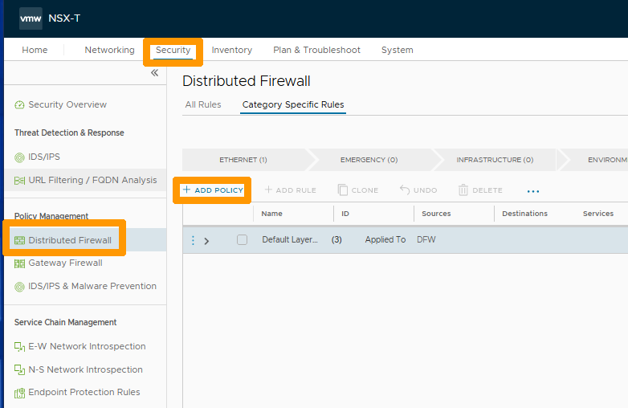
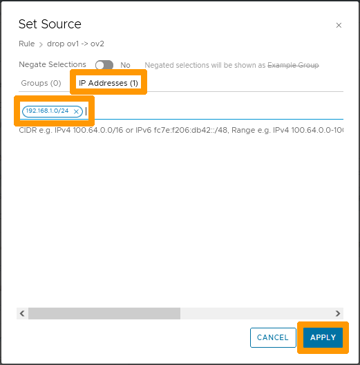
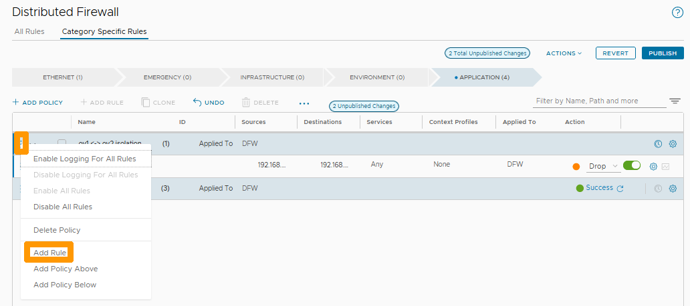
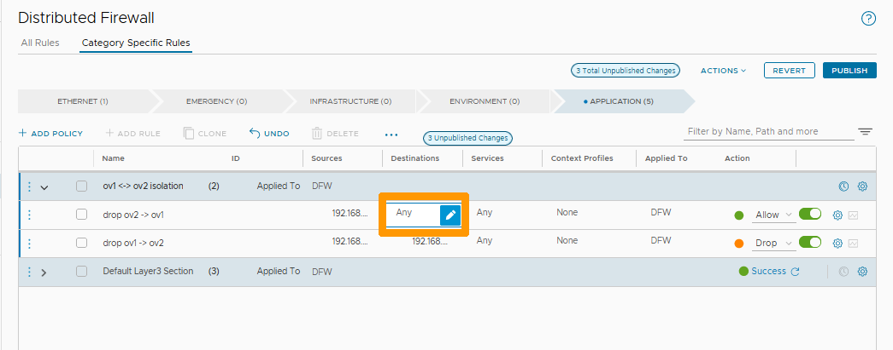
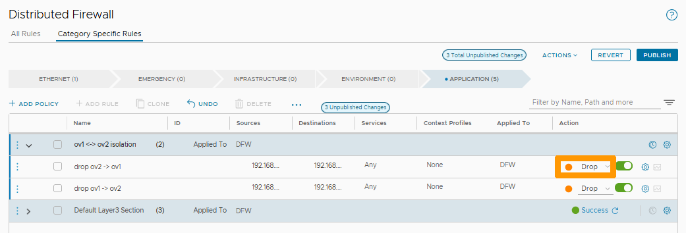
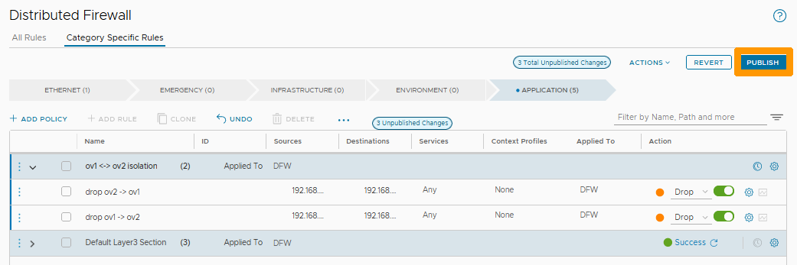

**Dernière mise à jour le 30/01/2023**

> [!warning]
> Les guides concernant NSX-T dans la solution Hosted Private Cloud Powered by VMware ne sont pas définitifs, ils seront modifiés lors de la sortie en version BETA et finalisés quand la version définitive sera prête. 
>

## Objectif

**Comment faire pour isoler les segments entre eux**

> [!warning]
> OVHcloud vous met à disposition des services dont la configuration, la gestion et la responsabilité vous incombent. Il vous appartient donc de ce fait d’en assurer le bon fonctionnement.
>
> Ce guide a pour but de vous accompagner au mieux sur des tâches courantes. Néanmoins, nous vous recommandons de faire appel à un prestataire spécialisé si vous éprouvez des difficultés ou des doutes concernant l’administration, l’utilisation ou la mise en place d’un service sur un serveur.
>

## Prérequis

- Être contact administrateur du [Hosted Private Cloud infrastructure](https://www.ovhcloud.com/fr/enterprise/products/hosted-private-cloud/), celui-ci recevant les identifiants de connexion.
- Avoir un identifiant utilisateur actif avec les droits spécifiques pour NSX-T (créé dans l'[espace client OVHcloud](https://www.ovh.com/auth/?action=gotomanager&from=https://www.ovh.com/fr/&ovhSubsidiary=fr))
- Avoir **NSX-T** déployé avec deux segment configurés dans votre configuration NSX-T, vous pouvez vous aider de ce guide [Gestion des segments dans NSX-T](https://docs.ovh.com/fr/private-cloud/nsx-t-segment-management).

## En pratique

Le réseau entre segment derrière la **ovh-T1-gw** n'est pas isolé, chaque segment communiquent entre eux sans restriction. 

Nous allons créer une règle qui isole ces deux segments entre eux à partir de leurs sous-réseaux :

- ov1-segment : 192.168.1.0/24.
- ov2-segment : 192.168.2.0/24.

Au travers de l'interface **NSX-T** sélectionnez l'onglet `Security`{.action} cliquez sur `Distributed Firewall`{.action} dans la barre de menu verticale à gauche et cliquez sur `+ ADD POLICY`{.action}.

{.thumbnail}

Positionnez-vous sur l'onglet `Category Specific Rules`{.action} et cliquez sur `ADD POLICY`{.action}.

{.thumbnail}

Dans la colonne **Name** saisissez `ov1 <-> ov2 isolation`{.action}.

{.thumbnail}

à gauche de votre stratégie cliquez sur les `trois petits points verticaux`{.action} et choisissez `Add Rule`{.action} dans le menu.

{.thumbnail}

Saisissez `drop ov1 -> ov2`{.action} dans la colonne **Name**.

{.thumbnail}

Cliquez sur le `stylo`{.action} dans la colonne **Sources**.

{.thumbnail}

Choisissez `IP Addresses`{.action}, saisissez `192.168.1.0/24`{.action} qui est le sous-réseau du segment ov1-segment et cliquez sur `APPLY`{.action} 

{.thumbnail}

Cliquez sur le `stylo`{.action} dans la colonne **Destinations**.

{.thumbnail}

Choisissez `IP Addresses`{.action}, saisissez `192.168.2.0/24`{.action} qui est le sous-réseau du segment ov2-segment et cliquez sur `APPLY`{.action} 

{.thumbnail}

Sélectionnez `Drop`{.action} dans la colonne **Action**

{.thumbnail}

Cliquez sur les `trois petits points verticaux`{.action} à gauche de votre stratégie et choisissez `Add Rule`{.action} dans le menu.

{.thumbnail}

Saisissez `drop ov2 -> ov1`{.action} dans la colonne **Name**.

{.thumbnail}

Cliquez sur le `stylo`{.action} dans la colonne **Sources**.

{.thumbnail}

Choisissez `IP Addresses`{.action}, saisissez `192.168.2.0/24`{.action} qui est le sous-réseau du segment ov2-segment et cliquez sur `APPLY`{.action} 

{.thumbnail}

Cliquez sur le `stylo`{.action} dans la colonne **Destinations**.

{.thumbnail}

Choisissez `IP Addresses`{.action}, saisissez `192.168.1.0/24`{.action} qui est le sous-réseau du segment ov1-segment et cliquez sur `APPLY`{.action} 

{.thumbnail}

Sélectionnez `Drop`{.action} dans la colonne **Action**.

{.thumbnail}

Cliquez sur `PUBLISH`{.action} pour activer la règle.

{.thumbnail}

Dans la colonne **Action** un rond vert avec *Success* indique que la règle est active. la communication entre les deux segments ne sera plus possible.

{.thumbnail}

## Aller plus loin

[Premiers pas avec NSX-T](https://docs.ovh.com/fr/private-cloud/nsx-t-first-steps/)

[Gestion des segment dans NSX-T](https://docs.ovh.com/fr/nsx-t-segment-management/)

Échangez avec notre communauté d'utilisateurs sur <https://community.ovh.com>.

