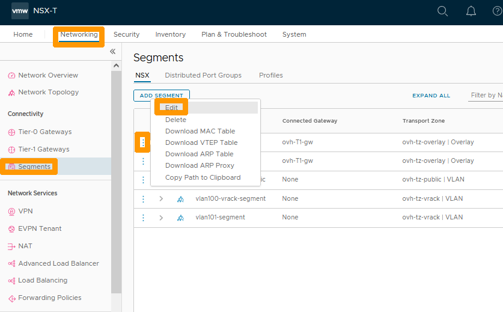
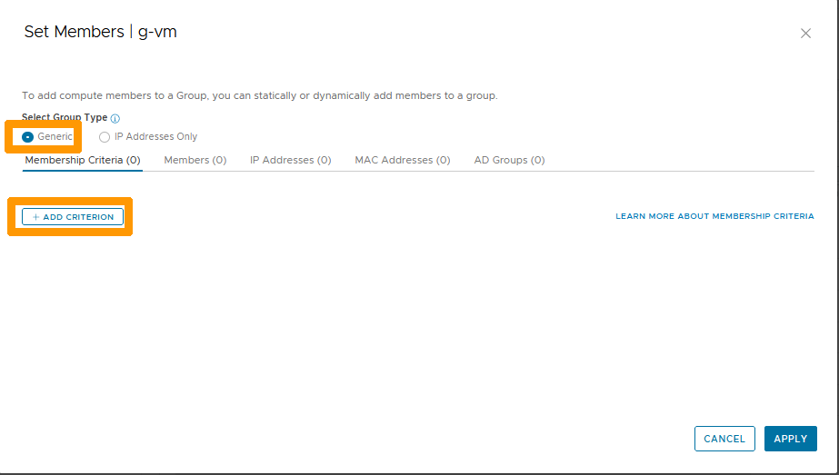
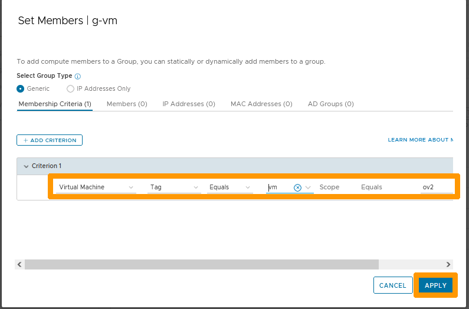
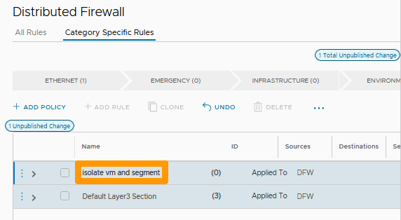
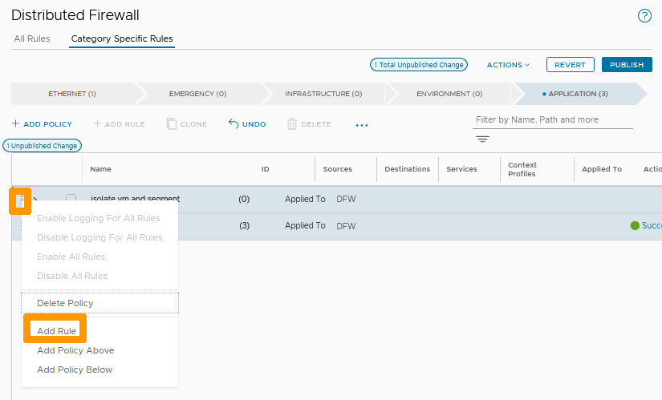
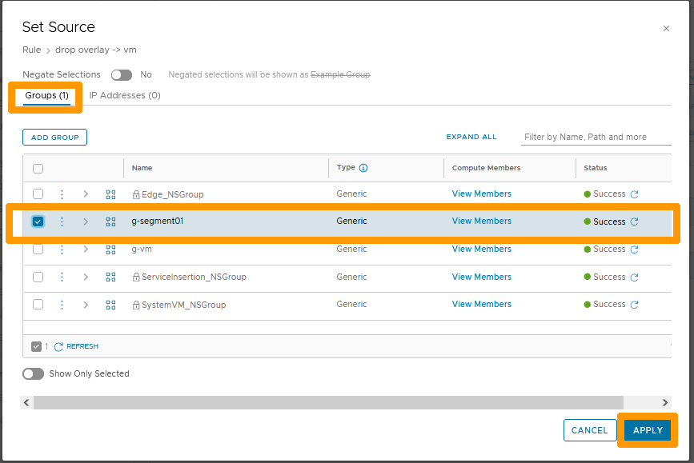
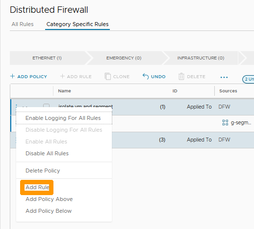

**Last updated 13th February 2023**

> [!warning]
> Guides for **NSX-T** in the VMware solution are not final, they will be modified when the BETA version is released and finalised when the final version is ready.
>

## Objectif

**How to administer distributed firewall**

> [!warning]
> OVHcloud provides services for which you are responsible, with regard to their configuration and management. It is therefore your responsibility to ensure that they work properly.
>
> This guide is designed to assist you as much as possible with common tasks. However, we recommend contacting a [specialist provider](https://partner.ovhcloud.com/en-gb/) if you experience any difficulties or doubts when it comes to managing, using or setting up a service on a server.
>

## Requirements

- Being an administrative contact of your [Hosted Private Cloud infrastructure](https://www.ovhcloud.com/en-gb/enterprise/products/hosted-private-cloud/) to receive login credentials
- A user account with access to the [OVHcloud Control Panel](https://www.ovh.com/auth/?action=gotomanager&from=https://www.ovh.co.uk/&ovhSubsidiary=GB)
- Having **NSX-T** deployed with two segments configured in your NSX-T configuration, you can use this guide [Segment management in NSX-T](https://docs.ovh.com/gb/en/private-cloud/nsx-t-segment-management).

## Overview

The distributed firewall feature in NSX-T allows filtering with all elements in your VMware cluster that are on Overlay or VLAN segments. It should be used normally on east-west (ovh-T0-gw) connections, but it also works with elements of the VMware cluster that are connected on the north-south gateway (ovh-T1-gw). The filter type is available between :

- All members in one segment and all other members in another segment.
- Some VMs in a segment and other VMs in the same or another segment.
- Some segments to virtual machines and vice versa.

To simplify the administration of NSX-T, it is possible to place tags on your elements (segments, virtual machines, roles, etc..) and create groups that contain the objects associated with the tags or IP address ranges (this solution should not be preferred).

## Instructions

We will create and tag within a virtual machine and segment, add groups that will contain these tags, and set up a blocking policy between two groups through distributed firewall.

### Creating tags

In the NSX-T interface go to the `Networking`{.action} tab and click. `Segments`{.action} on the left in **Connectivity**.
Then click on the `three vertical ellipsis`{.action} to the left of the segment you want to tag and choose `Edit`{.action} from the menu.

{.thumbnail}

to the right of **Tags** type `ovsegment`{.action} instead of tag and click `Add Item(s) ovsegment`{.action} below the input box.

{.thumbnail}

Type `ov1`{.action} instead of **Scope** and click `Add Item(s) ov1`{.action} below the input box.

{.thumbnail}

Click the `+' sign {.action} to the left of your tag.

{.thumbnail}

The tag created is displayed in the bottom right of **Tags**, you can create more depending on your needs.

Click `SAVE`{.action}.

{.thumbnail}

Click `CLOSE EDITING`{.action} to complete the markup for your segment.

{.thumbnail}

Go to the `Inventory`{.action} tab and click `Virtual Machines`{.action} on the left in the inventory to view the list of virtual machines.

Then click on the `three vertical ellipsis`{.action} to the left of your virtual machine that you want to tag and choose `Edit`{.action} from the menu.

{.thumbnail}

Type `vm`{.action} instead of **Tag** and click `Add Item(s) vm`{.action} below the input box.

{.thumbnail}

Type `ov2`{.action} instead of **Scope** and click `Add Item(s) ov2`{.action} below the input box.

{.thumbnail}

Click the `+' sign {.action} to the left of your tag.

{.thumbnail}

The tag is created, click `SAVE`{.action} to save your changes.

{.thumbnail}

Stay in the inventory and click `Tags`{.action} on the left to see the list of tags.

{.thumbnail}

### Add groups that contain tags

In the inventory, go to `Groups`{.action} on the left and click `ADD GROUP`{.action} to create a group.
{.thumbnail}

Type `g-segment01`{.action} below the **Name** column and click `Set`{.action} under the **Compute Members** column.

{.thumbnail}

Leave `Generic`{.action} selected and click `+ ADD CRITERION`{.action}.

{.thumbnail}

Choose these settings :

* **Type** : `NSX Segment`.
* **Tags** : Equals `ovsegment`.
* **Scope**: Equals `ov1`.

And click on `APPLY`{.action}.

{.thumbnail}

Click `SAVE`{.action}.

{.thumbnail}

The group is created by clicking on `View Members`{.action} in the row of your group to display the member list.

{.thumbnail}

Click `IP Addresses`{.action} to view the IP addresses that are used on your segment and have been automatically added to your group.

{.thumbnail}

Click `NSX Segments`{.action} to display the member segment of this group automatically added from the criteria. You can click on `CLOSE`{.action} to close this window.

{.thumbnail}

Click `ADD GROUP`{.action} to create a second group.

{.thumbnail}

Type `g-vm`{.action} below the **Name** column and click `Set`{.action} under the **Compute Members** column.

{.thumbnail}

Leave `Generic`{.action} selected and click `+ ADD CRITERION`{.action}.

{.thumbnail}

Choose these settings :

* **Type** : `Virtual Machine`.
* **Tags** : Equals `vm`.
* **Scope**: Equals `ov2`.

And click on `APPLY`{.action}.

{.thumbnail}

Click `SAVE`{.action}.

{.thumbnail}

Click `View Members`{.action} in the row of your group to view the members.

{.thumbnail}

In the **Virtual Machines** section you can see the tagged virtual machine that has been automatically added.

Click `CLOSE`{.action} to close this window.

{.thumbnail}

### Setting up a distributed firewall rule

We will now create a blocking distributed firewall rule between the two groups created.

Go to the `Security`{.action} tab, select `Distributed Firewall`{.action} and click `+ ADD POLICY`{.action}.

{.thumbnail}

Name your strategy `Isolate vm and segment`{.action}.

{.thumbnail}

Click on the `vertical suspend points`{.action} to the left of your policy and choose `Add Rule`{.action} from the menu.

{.thumbnail}

Click the `Pen`{.action} icon to the right of **Any** in the **Sources** column.

{.thumbnail}

Stay on the `groups`{.action} tab, check group `g-segment01`{.action} and click `APPLY`{.action}

{.thumbnail}

Click the `Pen`{.action} icon to the right of **Any** in the **Destinations** column.

{.thumbnail}

Select the group `g-vm`{.action} and click `APPLY`{.action}.

{.thumbnail}

Choose `Drop`{.action} to remove packages on this rule and click the `vertical drop points`{.action} to the left of your policy.

{.thumbnail}

Click `Add Rule`{.action} in the menu.

{.thumbnail}

Click the `Pen`{.action} icon to the right of **Any** in the **Sources** column.

{.thumbnail}

Select the group `g-vm`{.action} and click `APPLY`{.action}.

{.thumbnail}

Click the `Pen`{.action} icon to the right of **Any** in the **Destinations** column.

{.thumbnail}

Select the group `g-segment01`{.action} and click `APPLY`{.action}.

{.thumbnail}

Choose `Drop`{.action} to remove packages from this rule and click `publish`{.action} to validate the creation of the policy and its two associated rules.

{.thumbnail}

Your rule is active, the traffic between the virtual machine member of the g-vm group and the segment member of the g-segment group is no longer possible.

{.thumbnail}

## Go further 

[Getting started with NSX-T](https://docs.ovh.com/gb/en/private-cloud/nsx-t-first-steps/)

[Segment management](https://docs.ovh.com/gb/en/nsx-t-segment-management/)

[VMware Firewall documentation distributed in NSX-T](https://docs.vmware.com/en/VMware-NSX-T-Data-Center/3.2/administration/GUID-41CC06DF-1CD4-4233-B43E-492A9A3AD5F6.html)

Join our community of users on <https://community.ovh.com/en/>.

