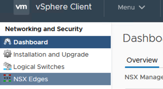
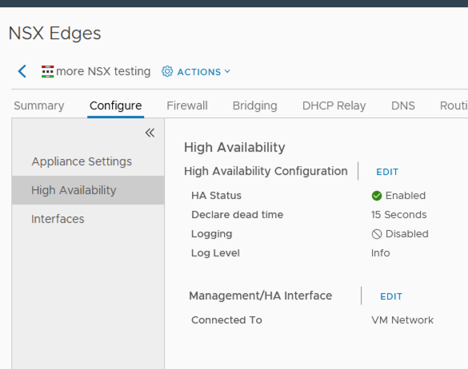
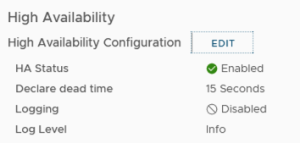
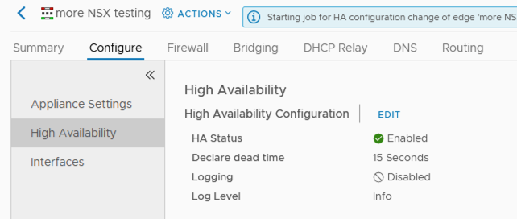

**Dernière mise à jour le 14/09/2022**

## Objectif

Cet article a pour but de vous guider dans le processus de désactivation et d'activation du HA (*High Availability*) sur vos NSX Edge après une mise à jour. Après une mise à niveau, l'accès haute disponibilité sera désactivé et devra être réactivé.

> [!primary]
>
> Quelle que soit la méthode utilisée, assurez-vous que le HA que vous désactivez est bien le NSX Edge HA et non le cluster HA.

## Prérequis

- Avoir un identifiant utilisateur actif avec les droits spécifiques pour NSX (créé dans l'[espace client OVHcloud](https://www.ovh.com/auth/?action=gotomanager&from=https://www.ovh.com/fr/&ovhSubsidiary=fr)).
- Avoir déployé une [NSX Edge Services Gateway](https://docs.ovh.com/fr/private-cloud/comment-deployer-une-nsx-edge-gateway/)

## En pratique

### Activation/Désactivation de HA via vSphere

Pour commencer, connectez-vous à votre environnement vSphere. Cliquez sur `Menu`{.action} à gauche de l'écran et sélectionnez `Mise en réseau et sécurité`{.action} dans le menu déroulant.


Cliquez ensuite sur `Dispositifs NSX Edge`{.action} dans la colonne de gauche.



Sélectionnez ensuite la Edge sur laquelle vous souhaitez désactiver le HA. Veuillez noter que si vous avez plusieurs Edge, cette option doit être désactivée pour l'ensemble d'entre eux.


Cliquez sur l'onglet `Configurer`{.action} en haut de la page. Sélectionnez ensuite **Haute disponibilité** dans la colonne de gauche.



Sélectionnez `Modifier`{.action} à côté de « Configuration de haute disponibilité ».



Cliquez sur le curseur à côté de « Activer » pour désactiver le HA.


Pour confirmer la désactivation du HA, cliquez sur l'onglet `Configurer`{.action} et sélectionnez `Haute disponibilité`{.action} dans la colonne de gauche.


Pour activer HA une fois la mise à jour terminée, sélectionnez à nouveau `Modifier`{.action} à côté de « Configuration de haute disponibilité » et cliquez sur le curseur à côté de « État HA » pour le repasser à activé.


Pour confirmer que HA est activé, cliquez sur l'onglet `Configurer`{.action} et sélectionnez `Haute disponibilité`{.action} dans la colonne de gauche.



Nous verrons ensuite comment effectuer cette même manipulation via l’API de VMware.

### Activation/Désactivation de la haute disponibilité via l'API

> [!primary]
>
> Les URL GET/PUT ont la valeur `pcc-147-x-x-x`. Veillez à mettre à jour ces valeurs pour qu'elles soient celles de votre PCC.

Pour commencer, téléchargez [Postman](https://www.postman.com/product/rest-client/) ou un autre client API REST pris en charge et installez l'application ou intégrez-la dans votre navigateur. Définissez l'authentification de base avec votre nom d'utilisateur et votre mot de passe.

Vous pouvez vous assurer que l’utilisateur a accès à NSX depuis [votre espace client OVHcloud](https://www.ovh.com/auth/?action=gotomanager&from=https://www.ovh.com/fr/&ovhSubsidiary=fr). Il s'agit du même nom d'utilisateur et du même mot de passe que ceux utilisés pour votre connexion au client web.

Ajouter un en-tête Content-Type application/xml.<br>
Pour plus d'informations, consultez la page 14 du document suivant : [[https://docs.vmware.com/en/VMware-NSX-Data-Center-for-vSphere/6.4/nsx\_64\_api.pdf](https://docs.vmware.com/en/VMware-NSX-Data-Center-for-vSphere/6.4/nsx_64_api.pdf)

Pour une liste complète des utilisations de Edge, utilisez l'appel **GET** suivant : 

- [https://nsx.pcc-147-x-x-x.ovh.us/api/4.0/edges](https://nsx.pcc-147-x-x-14.ovh.us/api/4.0/edges).<br>
Reportez-vous à la page 346 du document suivant : [https://docs.vmware.com/en/VMware-NSX-Data-Center-for-vSphere/6.4/nsx\_64\_api.pdf](https://docs.vmware.com/en/VMware-NSX-Data-Center-for-vSphere/6.4/nsx_64_api.pdf)

Le résultat sera similaire à celui ci-dessous :

```bash
<?xml version="1.0" encoding="UTF-8"?>
 <pagedEdgeList>
  <edgePage>
   <pagingInfo>
    <pageSize>256</pageSize>
    <startIndex>0</startIndex> 
    <totalCount>8</totalCount> 
    <sortOrderAscending>true</sortOrderAscending>
    <sortBy>id</sortBy>
   </pagingInfo>
   <edgeSummary>
    <objectId>edge-1</objectId>
    <objectTypeName>Edge</objectTypeName>
    <vsmUuid>42342BAA-1BE4-9C10-FB40-AEBBCDE3CDEE</vsmUuid>
    <nodeId>dd409b86-6a10-41f3-a32e-544d06dfdfff</nodeId>
    <revision>278</revision>
    <type>
     <typeName>Edge</typeName>
    </type>
    <name>Lab_Edge</name>
```

À partir du résultat ci-dessus, vous devez trouver le Edge <objectId> qui correspond au nom du Edge. Si vous avez plus d'un Edge, vous devrez trouver tous les ID des Edges en fonction du nom de chaque Edge. Dans l'exemple ci-dessus, l'ID du Edge est edge-1.

Pour vérifier l'état du HA, utilisez cet appel **GET** :

- [https://nsx.pcc-147-x-x-x.ovh.us/api/4.0/edges/edge-1/highavailability/config](https://nsx.pcc-147-x-x-14.ovh.us/api/4.0/edges/edge-1/highavailability/config).<br>
Veuillez vous référer à la page 458 du document suivant : [https://docs.vmware.com/en/VMware-NSX-Data-Center-for-vSphere/6.4/nsx\_64\_api.pdf](https://docs.vmware.com/en/VMware-NSX-Data-Center-for-vSphere/6.4/nsx_64_api.pdf)

```bash
<?xml version="1.0" encoding="UTF-8"?>
<highAvailability>
<version>34</version>
<enabled>false</enabled>
<declareDeadTime>15</declareDeadTime>
<logging>
<enable>false</enable>
<logLevel>info</logLevel>
</logging>
<security>
<enabled>false</enabled>
</security>
</highAvailability>
```

D'après le résultat ci-dessus, le HA est `false` ce qui signifie qu'il est désactivé. S'il est activé, la sortie sera indiquée comme `true`.
Voici un exemple de résultat pour un HA activé :

```bash
<?xml version="1.0" encoding="UTF-8"?>
<highAvailability>
<version>35</version>
<enabled>true</enabled>
<declareDeadTime>6</declareDeadTime>
<logging>
<enable>false</enable>
<logLevel>info</logLevel>
</logging>
<security>
<enabled>false</enabled>
</security>
</highAvailability>
```

Pour désactiver le HA, il faut exécuter l'appel **DELETE** suivant :

- [https://nsx.pcc-147-x-x-x.ovh.us/api/4.0/edges/edge-1/highavailability/config](https://nsx.pcc-147-x-x-14.ovh.us/api/4.0/edges/edge-1/highavailability/config).<br>
Assurez-vous que la commande DELETE pointe sur le bon Edge. Répétez les mêmes étapes pour chaque Edge dont vous devez désactiver le HA. La suppression de la configuration n'entraîne pas la suppression du Edge, mais uniquement de la configuration HA. C'est pourquoi il est crucial de faire pointer l'API DELETE vers la bonne URL.

Pour activer le HA, exécutez l'appel **PUT** suivant :

- [https://nsx.pcc-147-x-x-x.ovh.us/api/4.0/edges/edge-1/highavailability/config](https://nsx.pcc-147-x-x-14.ovh.us/api/4.0/edges/edge-1/highavailability/config).<br>
Avant de cliquer sur « Send », veuillez ajouter la configuration ci-dessous au body de Postman. Sans le body ci-dessous, l'appel PUT ne parviendra pas à activer le HA.

```bash
<highAvailability>
<declareDeadTime>6</declareDeadTime>
<enabled>true</enabled>
</highAvailability>
```

Une fois l'appel PUT exécuté, vous pouvez utiliser l'appel **GET** suivant :

- [https://nsx.pcc-147-x-x-x.ovh.us/api/4.0/edges/edge-1/highavailability/config](https://nsx.pcc-147-x-x-14.ovh.us/api/4.0/edges/edge-1/highavailability/config) pour valider l'activation du HA.

```bash
<?xml version="1.0" encoding="UTF-8"?>
<highAvailability>
  <version>35</version>
  <enabled>true</enabled> 
  <declareDeadTime>6</declareDeadTime>
  <logging>
    <enable>false</enable>
    <logLevel>info</logLevel>
  </logging>
  <security>
    <enabled>false</enabled>
  </security>
</highAvailability>
```

## Aller plus loin

Échangez avec notre communauté d'utilisateurs sur <https://community.ovh.com/>.
