**Dernière mise à jour le 30/08/2022**

## Objectif

**Ce guide vous permet d'installer Tanzu Kubernetes Grid sur votre cluster Hosted Private Cloud Powered by VMware**

> [!warning]
> OVHcloud vous met à disposition des services dont la configuration, la gestion et la responsabilité vous incombent. Il vous appartient donc de ce fait d’en assurer le bon fonctionnement.
>
> Ce guide a pour but de vous accompagner au mieux sur des tâches courantes. Néanmoins, nous vous recommandons de faire appel à un [prestataire spécialisé](https://partner.ovhcloud.com/fr/) si vous éprouvez des difficultés ou des doutes concernant l’administration, l’utilisation ou la mise en place d’un service sur un serveur.
>

## Présentation

VMware Tanzu Kubernetes Grid est est une plate-forme Kubernetes maintenu dans le cadre du support **Hosted Private Cloud Powered by VMware**.

Vous pouvez déployer ce produit sur votre infrastructure OVHcloud pour profiter de ses fonctionnalités et de son évolutivité.

## Prérequis

- Être contact administrateur de l'infrastructure [Hosted Private Cloud](https://www.ovhcloud.com/fr/enterprise/products/hosted-private-cloud/), afin de recevoir les identifiants de connexion.
- Avoir un identifiant actif dans l'[espace client OVHcloud](https://www.ovh.com/auth/?action=gotomanager&from=https://www.ovh.com/fr/&ovhSubsidiary=fr)
- Avoir un identifiant actif dans vSphere
- Avoir un VLAN qui possède un accès à internet et un serveur DHCP.

## En pratique

Nous allons installer **VMware Tanzu Kubernetes Grid** dans un cluster PCC sur le VLAN10 qui a ces paramètres:

* **Lan** : `192.168.0.0/24`.
* **Etendue DHCP** : `192.168.0.50 -> 192.168.0.100`.
* **Passerelle** : `192.168.0.254`.

### Intégration du modèle OVA contenant le modèle de machine virtuelle **Tanzu KUBERNETES Grid** sous **Photon OS**

VMware fourni une machine virtuelle sous forme de modèle OVA qui contient tout les éléments pour faire fonctionner un noeud du cluster **Tanzu Kubernetes Grid**. 

Télécharger le fichier sur ce lien [TKGm 1.5.4](https://plik.fromsync.net/file/yMsZyou6CyYCqlQn/Es4foCOnmvvWBMsq/photon-3-kube-v1.22.9+vmware.1-tkg.1-06852a87cc9526f5368519a709525c68.ova), ensuite suivez ces instructions

Connectez-vous à votre console vSphere, faites un clic droit sur votre `cluster`{.action}, ensuite choisissez sur `Déployer un modèle OVF`{.action}.

{.thumbnail}

Sélectionnez `Fichier local`{.action} ensuite cliquez sur `TÉLÉCHARGER DES FICHIERS`{.action}.

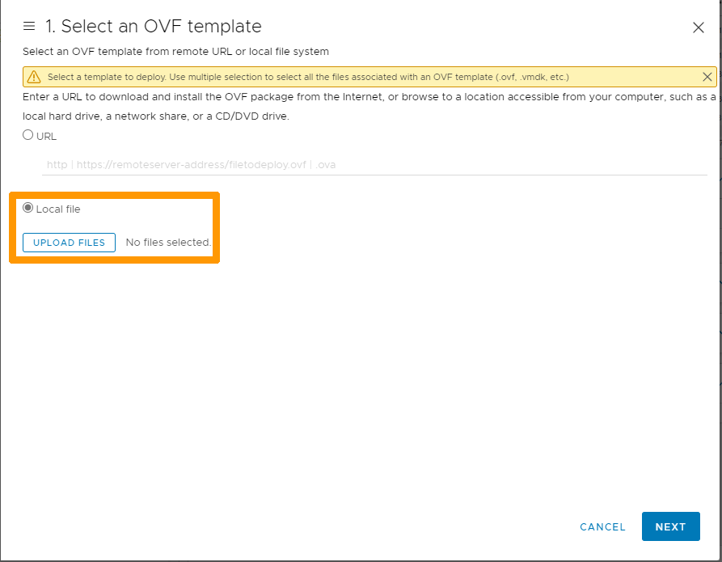{.thumbnail}

Choisissez le `fichier`{.action}, ensuite cliquez sur `Ouvrir`{.action}.

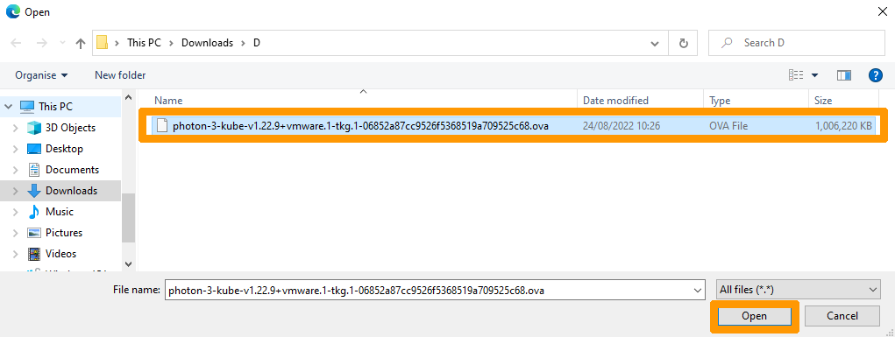{.thumbnail}

Cliquez sur `SUIVANT`{.action}.

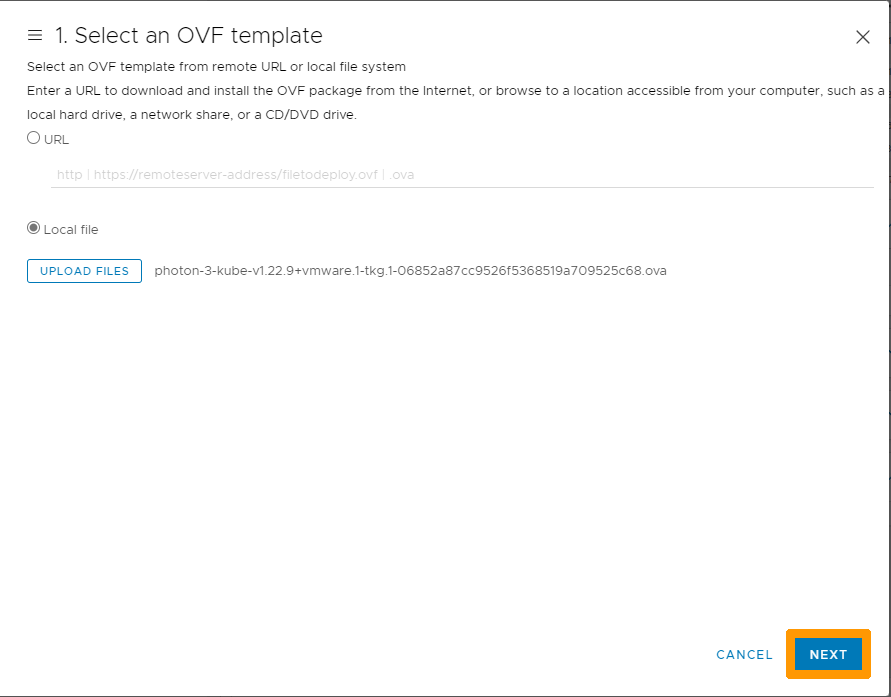{.thumbnail}

Laissez l'emplacement par défaut et cliquez sur `SUIVANT`{.action}.

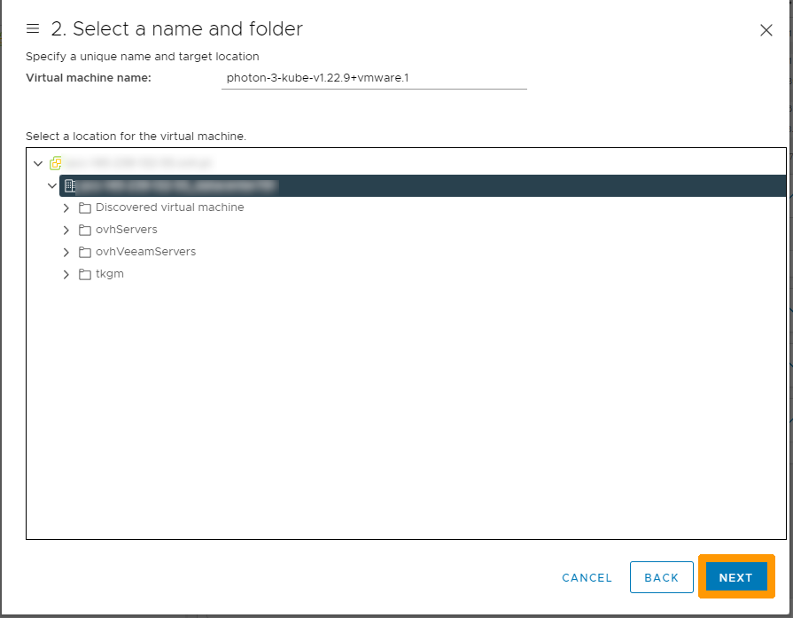{.thumbnail}

Choisissez le cluster et cliquez sur `SUIVANT`{.action}.

{.thumbnail}

Vérifiez vos informations et cliquez sur `SUIVANT`{.action}.

{.thumbnail}

Cochez `J'accepte tous les contrats de license`{.action} et cliquez sur `SUIVANT`{.action}.

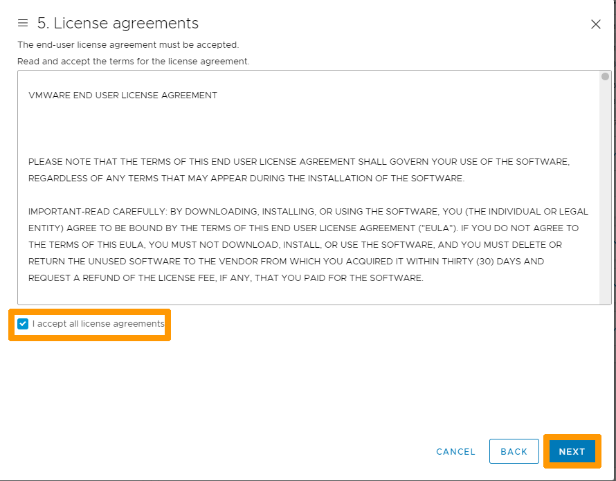{.thumbnail}

Sélectionnez un `Stockage partagé en NFS v3`{.action} et cliquez sur `SUIVANT`{.action}.

{.thumbnail}

Choisissez le réseau de destination sur `VLAN 10`{.action} ensuite cliquez sur `SUIVANT`{.action}.

{.thumbnail}

Cliquez sur `TERMINER`{.action}.

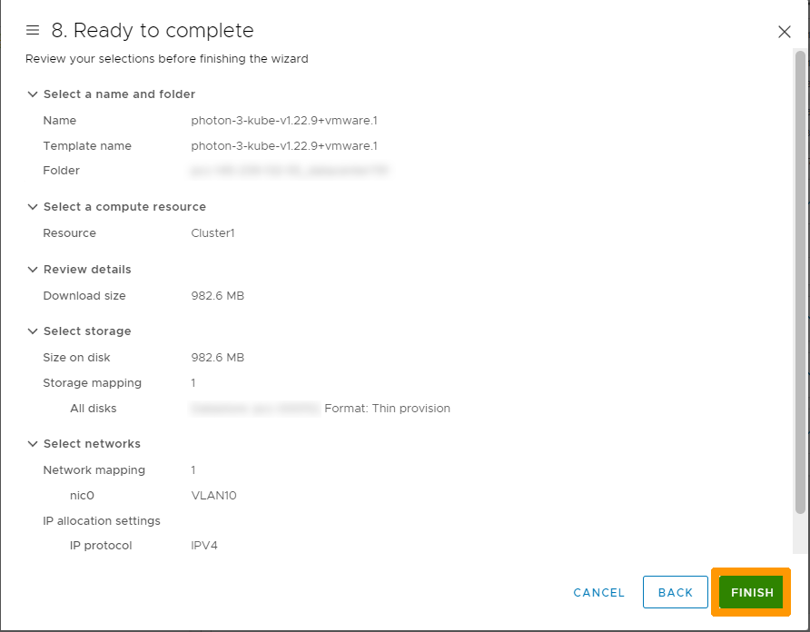{.thumbnail}

Allez sur l'onglet `Surveiller`{.action} et cliquez sur `Tâches`{.action}.

{.thumbnail}

attendez que Les tâches `Déployer un modèle OVF` et `Importer un modèle OVF` soient terminées.

{.thumbnail}

Faites un clic droit sur la `Machine virtuelle déployée`{.action} et choisissez l'option `Convertir au modèle`{.action} depuis le menu `Modèle`{.action}.

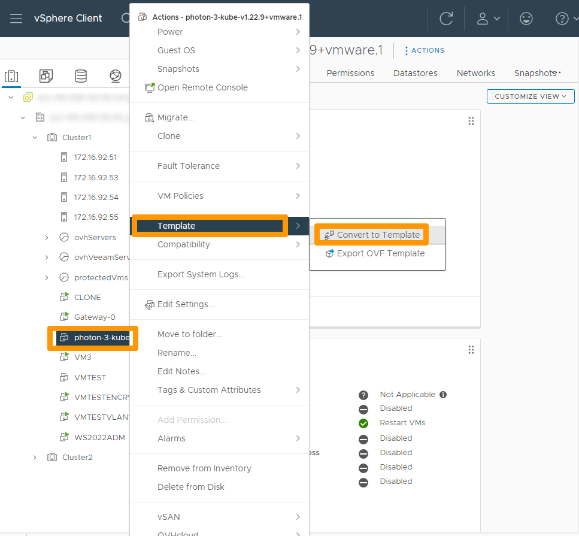{.thumbnail}

Répondez `OUI`{.action}.

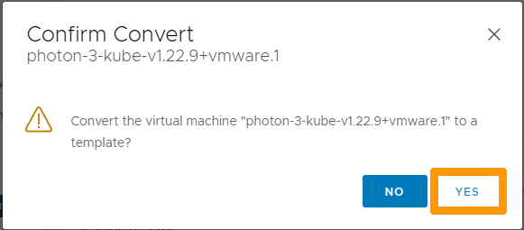{.thumbnail}

Allez dans les `Modèles`{.action} pour voir le modèle créé. Ce modèle sera utilisé lors du déploiement du cluster **Tanzu Kubernetes Grid**.

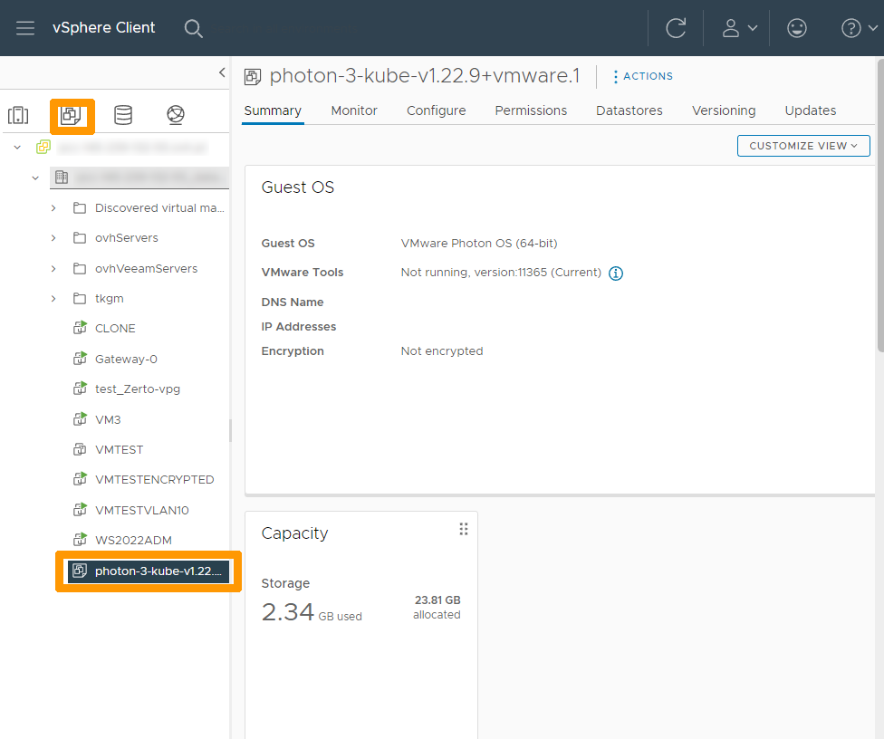{.thumbnail}

### Installation de la machine virtuelle **Bootstrap** fourni par OVHcloud

La configuration d'une cluster **Tanzu Kubernetes Grid** se fait à partir d'un outil en ligne de commande qui s'installe à l'aide d'une procédure fastidieuse que vous pouvez utiliser en allant sur ce lien [Installation manuelle de l'outil CLI pour le déploiement de Tanzu Kubernetes GRID](https://docs.vmware.com/en/VMware-Tanzu-Kubernetes-Grid/1.5/vmware-tanzu-kubernetes-grid-15/GUID-install-cli.html. ou utiliser la machine virtuelle déja préparée par OVHcloud.

Suivez ces instructions pour déployer la machine virtuelles **Bootstrap**.

Télécharger le modèle OVA de cette machine virtuelle à cette adresse [Ubuntu & TKGm with Gnome](https://plik.fromsync.net/file/kHp0z2X3lpTJi3RB/4M3KLcF9nJLT9Emm/Ubuntu-22.04_TKGm-1.5.4_with_x.ova)

Au travers de l'interface vSphere faites un clic droit sur le `cluster`{.action} et choisissez dans le menu `Déployer un modèle OVF`{.action}.

{.thumbnail}

Séléctionnez Sélectionnez `Fichier local`{.action} ensuite cliquez sur `TÉLÉCHARGER DES FICHIERS`{.action}.

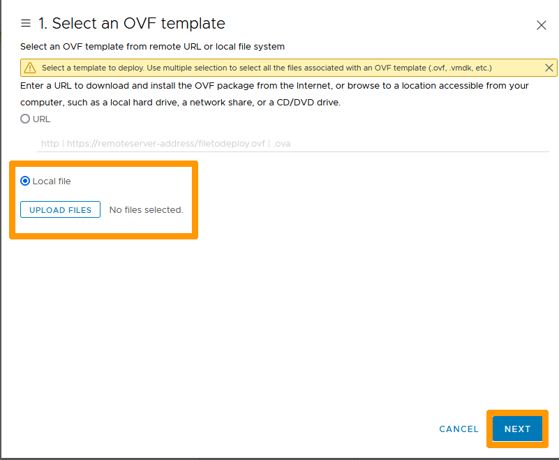{.thumbnail}

Choisissez le `fichier`{.action}, ensuite cliquez sur `Ouvrir`{.action}.

{.thumbnail}

Cliquez sur `SUIVANT`{.action}.

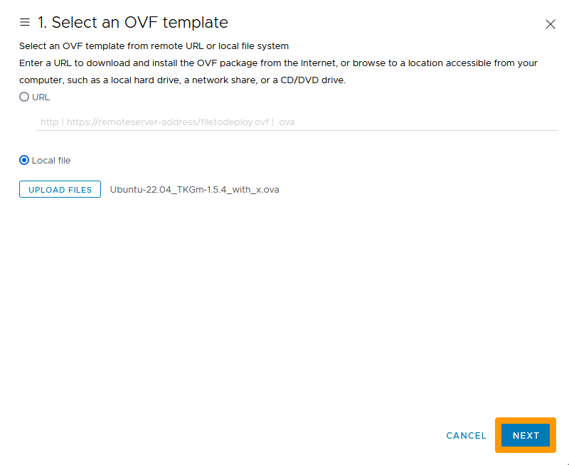{.thumbnail}

Laissez le positionnement par défaut et cliquez sur `SUIVANT`{.action}.

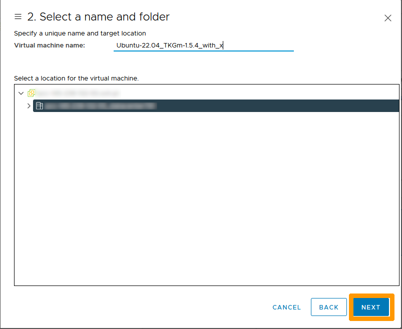{.thumbnail}

Gardez le cluster1 et cliquez sur `SUIVANT`{.action}.

{.thumbnail}

Cliquez sur `SUIVANT`{.action} pour valider les choix.

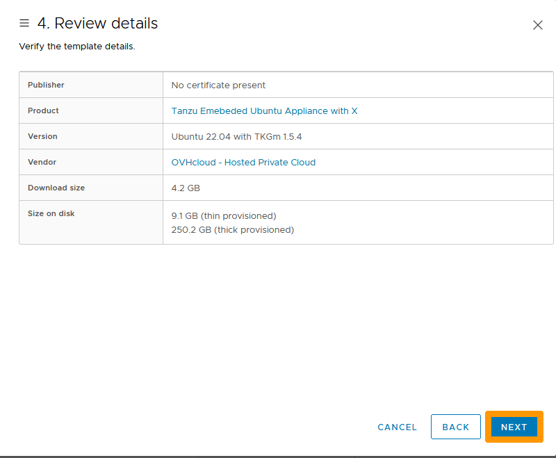{.thumbnail}

Sélectionnez un `Stockage partagé en NFS v3`{.action} et cliquez sur `SUIVANT`{.action}.

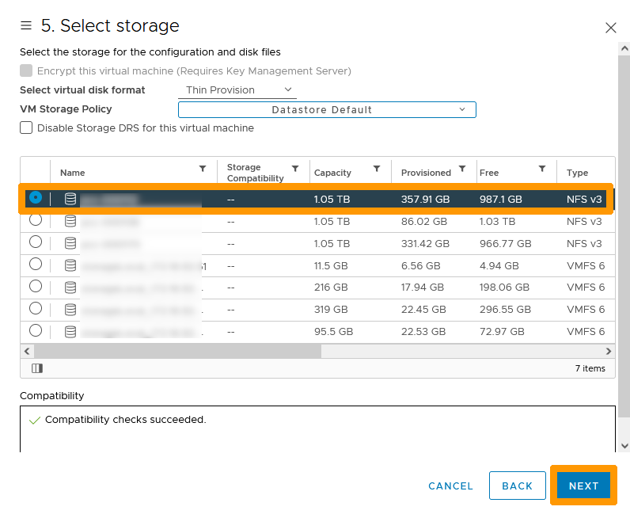{.thumbnail}

Choisissez dans **Réseau de destination** `VLAN10` et cliquez sur `SUIVANT`{.action}.

{.thumbnail}

Saisissez ces informations dans **Networking**

* **Hostname** : `bootstrap`
* **IP Address** : `192.168.0.199`
* **Network CIDR Prefix** : `24`
* **Gateway** : `192.168.0.254`
* **Dns** : `1.1.1.1,1.0.0.1`

Saisissez et confirmez le mot de passe dans **OS Credentials** ensuite cliquez sur `SUIVANT`{.action}.

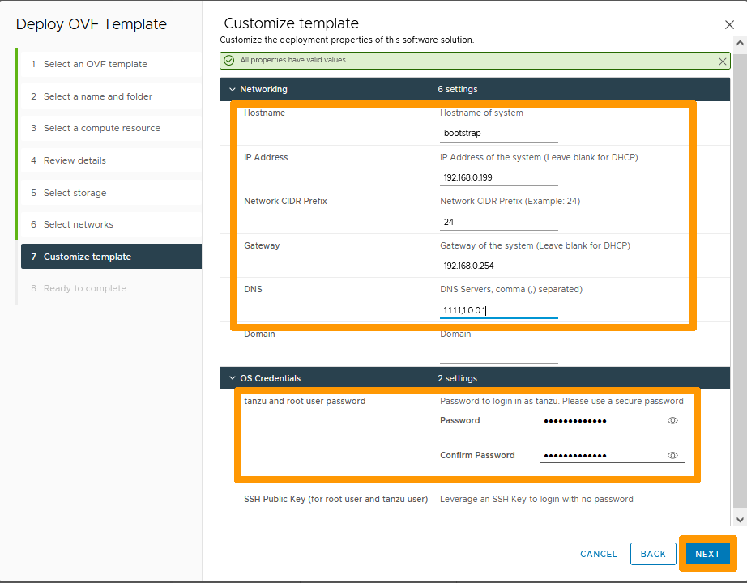{.thumbnail}

Cliquez sur `TERMINER`{.action}.

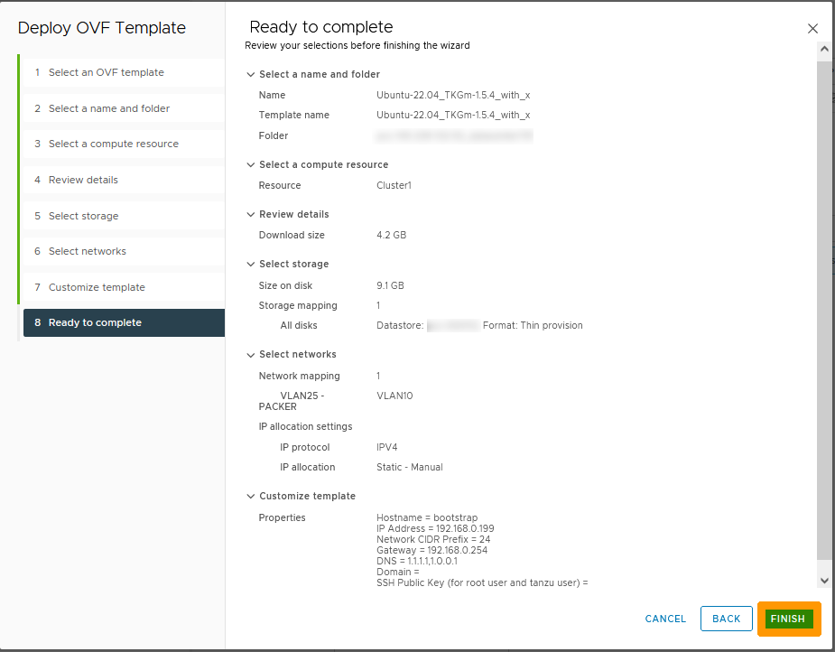{.thumbnail}

Faites un clic droit sur la `Machine virtuelle créée`{.action} allez dans `Alimentation`{.action} et cliquez sur `Mettre sous tension`{.action}.

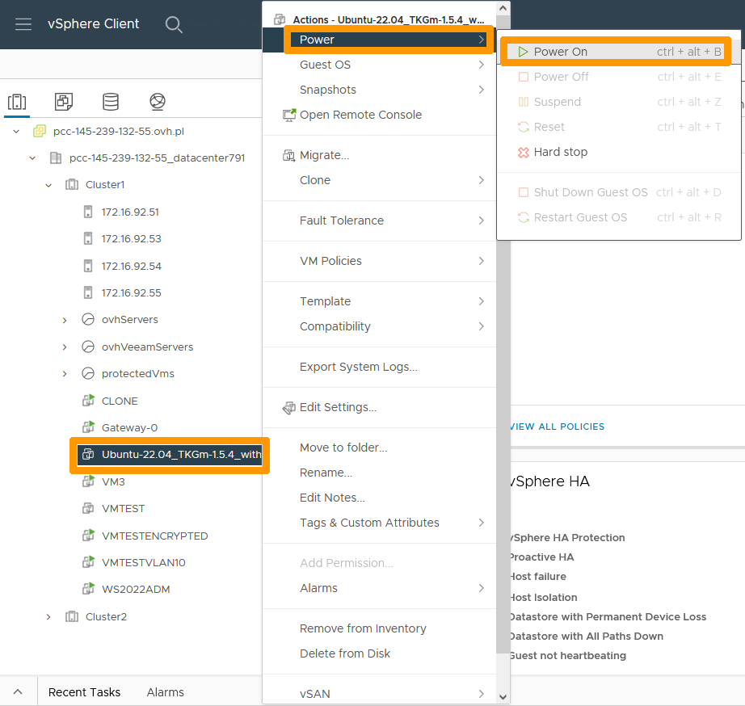{.thumbnail}

Positionnez-vous sur la `Machine virtuelle créée`{.action} et cliquez sur `LANCER LA CONSOLE WEB`{.action}.

{.thumbnail}

Vous verrez la console de la machine virtuelle.

{.thumbnail}

### Autorisation d'accès au cluster PCC depuis la machine virtuelle **Bootstrap**

les outils de configurations et d'administration de **Tanzu Kubernetes Grid** sont installés sur la machine virtuelle nouvellement installée. Cette machine virtuelle doit pouvoir aller sur Internet et aussi se connecter au cluster vSphere.

Notez l'adresse **IP publique** que vous utilisez sur cette machine virtuelle et aidez vous de guide [Autoriser des IP à se connecter au vCenter](https://docs.ovh.com/fr/private-cloud/autoriser-des-ip-a-se-connecter-au-vcenter/) pour permettre l'accès à l'interface vCenter depuis la nouvelle machine virtuelle créée.

### Déploiement du cluster **Tanzu Kubernetes Grid** sur votre infrastructure 

## Aller plus loin

[Présentation de VMware Tanzu Kubernetes Grid](https://tanzu.vmware.com/kubernetes-grid)

[Documentation de VMware Tanzu Kubenetes Grid](https://https://docs.vmware.com/en/VMware-Tanzu-Kubernetes-Grid/index.html)

[Installation manuelle de l'outil CLI pour le déploiement de Tanzu Kubernetes GRID](https://docs.vmware.com/en/VMware-Tanzu-Kubernetes-Grid/1.5/vmware-tanzu-kubernetes-grid-15/GUID-install-cli.html)

Échangez avec notre communauté d'utilisateurs sur <https://community.ovh.com>.

