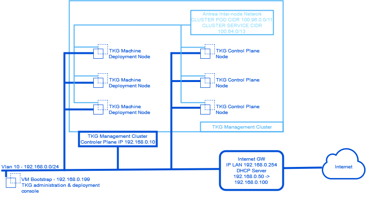

**Dernière mise à jour le 19/09/2022**

## Objectif

**Ce guide vous présente Tanzu Kubernetes Grid et vous indique les possibilités d'intégration dans votre solution Hosted Private Cloud Powered by VMware**

> [!warning]
> OVHcloud vous met à disposition des services dont la configuration, la gestion et la responsabilité vous incombent. Il vous appartient donc de ce fait d’en assurer le bon fonctionnement.
>
> Ce guide a pour but de vous accompagner au mieux sur des tâches courantes. Néanmoins, nous vous recommandons de faire appel à un [prestataire spécialisé](https://partner.ovhcloud.com/fr/) si vous éprouvez des difficultés ou des doutes concernant l’administration, l’utilisation ou la mise en place d’un service sur un serveur.
>

## Prérequis

- Être contact administrateur de l'infrastructure [Hosted Private Cloud](https://www.ovhcloud.com/fr/enterprise/products/hosted-private-cloud/), afin de recevoir les identifiants de connexion.
- Avoir un identifiant actif dans l'[espace client OVHcloud](https://www.ovh.com/auth/?action=gotomanager&from=https://www.ovh.com/fr/&ovhSubsidiary=fr)
- Avoir un identifiant actif dans vSphere.

## Présentation pas à pas de la solution Tanzu Kubernetes Grid

VMware Tanzu Kubernetes Grid est une plate-forme Kubernetes fournie par **VMware** et maintenue dans le cadre du support **Hosted Private Cloud Powered by VMware**.

Vous pouvez déployer ce produit sur votre infrastructure OVHcloud pour profiter de ses fonctionnalités et de son évolutivité.

Tanzu Kubernetes Grid permet de déployer et d'administrer des clusters Kubernetes au sein de VMware. L'outil d'administration des clusters s'appuie lui même sur Kubernetes. 

### Installation initiale de Tanzu Kubernetes Grid

Consultez cette documentation pour installer Tanzu Kubernetes Grid [Installer Tanzu Kubernetes Grid](https://docs.ovh.com/fr/nutanix/tanzu-tkgm-installation).

Comme indiqué dans la documentation d'installation vous aurez 7 nouvelles machines virtuelles sur votre cluster VMware qui constituerons le cluster Kubernetes et la machine virtuelle dédié à l'administration de **Tanzu Kubernetes Grid**.

{.thumbnail}

Le cluster d'administration de Tanzu Kubernetes Grid ne doit pas être utilisé à autre chose que l'administration des autres clusters Kubernetes.

### Déploiement d'un cluster de Workload et installation d'une application

Pour pouvoir déployer une application il faut créer des clusters de Workload dédiés aux application, ces clusters sont independants entre eux ce qui permet d'avoir plusieurs versions de Kubernetes installées sur votre infrastructure VMware.

Consultez ce guide [Administrer Tanzu Kubernete Grid](https://docs.ovh.com/fr/nutanix/tanzu-tkgm-installation). tous les clusters de WorkLoad sont independants l'un de l'autre ce qui permet d'avoir des versions différentes de Kubernetes sur chacun des clusters de Workload.

Pour chaque nouveaux clusters Kubernetes de Workdload six nouvelles machines virtuelles sont rajoutées sur l'infrastructure VMware. 

{.thumbnail}

à l'intérieur d'un cluster de WorkLoad il est possible d'installer une suite logicielle contenant plusieurs applications qui communiquement entre elles sur le réseau interne au cluster. il est possibe d'ajouter un package à kubernetes comme par exemple **kube-vib** pour avoir la possibilité de publier une application sur le réseau local du cluster VMware.

{.thumbnail}

## Aller plus loin

[Installation d'un cluster TKG](https://docs.ovh.com/fr/private-cloud/tanzu-tkgm-installation)

[Administrer un cluster TKG](https://docs.ovh.com/fr/private-cloud/tanzu-tkgm-management)

[Présentation de VMware Tanzu Kubernetes Grid](https://tanzu.vmware.com/kubernetes-grid)

[Documentation de VMware Tanzu Kubenetes Grid](https://https://docs.vmware.com/en/VMware-Tanzu-Kubernetes-Grid/index.html)

[Installation manuelle de l'outil CLI pour le déploiement de Tanzu Kubernetes GRID](https://docs.vmware.com/en/VMware-Tanzu-Kubernetes-Grid/1.5/vmware-tanzu-kubernetes-grid-15/GUID-install-cli.html)

Échangez avec notre communauté d'utilisateurs sur <https://community.ovh.com>.

